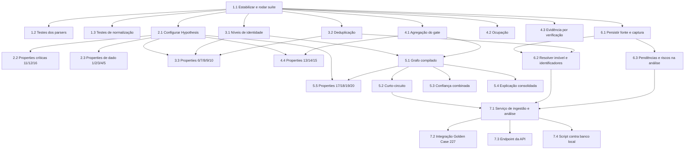

# Implementation Plan

## Overview

Plano de implementação da fatia de entrada do pipeline: captura, normalização,
identidade, deduplicação, gate de validade jurídica e orquestração.

Contexto importante: os módulos `capture/`, `pipeline/identity.py`,
`pipeline/legal_gate.py` e `orchestration/graph.py` já existem no repositório mas
**nunca foram executados nem testados**. O plano começa pagando essa dívida de
verificação antes de adicionar qualquer funcionalidade nova.

A ordem prioriza as invariantes que sustentam a tese do produto ("desconto não
compensa nulidade") e só depois amplia cobertura e persistência.

## Task Dependency Graph



Caminho crítico: **1.1 → 2.1 → 2.2** (invariantes do gate e da decisão), seguido de
**5.1 → 5.2 → 7.1 → 7.2**.

Ondas de execução paralela:

```json
{
  "waves": [
    {
      "wave": 1,
      "tasks": ["1.1"]
    },
    {
      "wave": 2,
      "tasks": ["1.2", "1.3", "2.1", "3.1", "3.2", "4.1", "4.2", "4.3", "6.1"]
    },
    {
      "wave": 3,
      "tasks": ["2.2", "2.3", "3.3", "4.4", "5.1", "6.2", "6.3"]
    },
    {
      "wave": 4,
      "tasks": ["5.2", "5.3", "5.4", "5.5"]
    },
    {
      "wave": 5,
      "tasks": ["7.1"]
    },
    {
      "wave": 6,
      "tasks": ["7.2", "7.3", "7.4"]
    }
  ]
}
```

## Tasks

- [ ] 1. Estabilizar e verificar o código existente do pipeline
- [ ] 1.1 Executar a suíte completa e corrigir falhas de import e integração
  - Rodar `python -m pytest -q` e registrar o estado real
  - Corrigir erros de import em `capture/`, `pipeline/` e `orchestration/graph.py`
  - Garantir que `radar.orchestration.graph` importa sem exigir LangGraph instalado
  - Confirmar que os 18 testes pré-existentes continuam passando
  - _Requirements: 8.1_

- [ ] 1.2 Cobrir os parsers pt-BR com testes unitários
  - Testar `parse_money`, `parse_area`, `parse_percent`, `parse_datetime`, `parse_int`
  - Testar `parse_occupancy` com "Desocupado", "Ocupado", vazio e `None`
  - Testar que entrada ilegível retorna `None` e nunca `0.0`
  - _Requirements: 2.2, 2.3, 2.4_

- [ ] 1.3 Cobrir a normalização da CAIXA com o payload real do item 227
  - Validar extração de matrícula, lance mínimo, área, quartos, comissão e data/hora
  - Validar que campos ausentes resultam em `None` e aparecem em `missing_fields()`
  - Validar estabilidade do `fingerprint` sob reordenação das chaves do payload
  - _Requirements: 1.2, 2.1, 2.5_

- [ ] 2. Configurar teste por propriedade e cobrir as invariantes críticas
- [ ] 2.1 Adicionar Hypothesis ao projeto
  - Incluir `hypothesis` nas dependências de desenvolvimento em `pyproject.toml`
  - Criar `tests/properties/` com estratégias reutilizáveis para payloads e ofertas
  - _Requirements: 2.2_

- [ ] 2.2 Implementar as propriedades críticas do gate e da decisão
  - Property 11: existindo `IRREGULAR`, o status é sempre `BLOCK`
  - Property 12: verificação não informada nunca produz `OK`
  - Property 16: `legal_status == "BLOCK"` implica decisão `BLOCK` para qualquer
    combinação de desconto, margem, liquidez, yield e score
  - _Requirements: 5.3, 5.4, 5.6_

- [ ] 2.3 Implementar as propriedades de integridade de dado
  - Property 1: `fingerprint` invariante à permutação de chaves
  - Property 2: chave ausente no payload resulta em campo `None`
  - Property 3: `parse_percent` retorna valor em `[0, 1]` ou `None`
  - Property 4: `parse_money` retorna `None` para entrada ilegível
  - Property 5: texto com termo de vacância sempre resulta em `False`
  - _Requirements: 1.2, 2.2, 2.3, 2.4_

- [ ] 3. Fechar identidade e deduplicação
- [ ] 3.1 Testar a classificação de níveis I0–I4
  - Casos: matrícula + comarca (I4), matrícula isolada (I3), id da fonte + endereço
    (I3), endereço + área (I2), apenas endereço (I1), nada (I0)
  - Validar que os identificadores retornados trazem confiança individual
  - Validar pendência registrada quando não há matrícula
  - _Requirements: 3.1, 3.2, 3.3, 3.4, 3.6_

- [ ] 3.2 Testar deduplicação por força de evidência
  - Matrículas iguais ⇒ `True`; distintas ⇒ `False`
  - Mesmo identificador da fonte ⇒ `True`
  - Endereço igual com área compatível ⇒ `True`; área divergente ⇒ `None`
  - Evidências insuficientes ⇒ `None`
  - _Requirements: 4.1, 4.2, 4.3, 4.5_

- [ ] 3.3 Implementar as propriedades de identidade e deduplicação
  - Property 6: identidade é monotônica ao acrescentar identificadores
  - Property 7: `is_same_property` é simétrica
  - Property 8: alterar apenas preço nunca altera o veredito
  - Property 9: matrículas distintas sempre separam imóveis
  - Property 10: confiança cresce estritamente com o nível
  - _Requirements: 3.1, 4.1, 4.4_

- [ ] 4. Fechar o gate de validade jurídica
- [ ] 4.1 Testar a agregação de status do gate
  - Todas `CONFIRMED` ⇒ `OK`
  - Alguma `UNKNOWN` ⇒ `PENDENTE` com pendência explicando que ausência não é
    regularidade
  - Alguma `IRREGULAR` ⇒ `BLOCK` com risco jurídico de severidade crítica
  - Entrada vazia (nada informado) ⇒ `PENDENTE`, nunca `OK`
  - _Requirements: 5.2, 5.3, 5.4, 5.5, 5.7_

- [ ] 4.2 Testar ocupação como risco de posse
  - Ocupado ⇒ risco `posse` severidade alta, `legal_status` inalterado
  - Desconhecido ⇒ pendência não bloqueante
  - Desocupado ⇒ nenhum risco de posse
  - _Requirements: 6.1, 6.2, 6.3_

- [ ] 4.3 Testar emissão de evidência por verificação
  - Uma `Evidence` por item do catálogo, inclusive quando `UNKNOWN`
  - Cada evidência traz `rule_refs`, autor, data de extração e estado
  - Validar que `UNKNOWN` não é promovido a `CONFIRMED`
  - _Requirements: 7.1, 7.2, 7.3_

- [ ] 4.4 Implementar as propriedades do gate
  - Property 13: número de evidências igual ao número de verificações
  - Property 14: ocupação nunca altera `legal_status`
  - Property 15: `OK` se e somente se todas são `CONFIRMED` ou `NOT_APPLICABLE`
  - _Requirements: 5.5, 6.1, 7.1_

- [ ] 5. Fechar a orquestração do pipeline
- [ ] 5.1 Testar o grafo LangGraph compilado
  - Validar que `build_graph()` compila com todos os nós e arestas
  - Validar a ordem: normalizar → identidade → validade_juridica → economia →
    decisao → explicacao
  - Validar que `_run_sequential` produz o mesmo resultado do grafo
  - _Requirements: 8.1, 8.4_

- [ ] 5.2 Testar o curto-circuito de roteamento
  - Gate `BLOCK` ⇒ desvia para decisão sem executar economia
  - Identidade abaixo de I2 ⇒ desvia para decisão
  - Gate `OK` com identidade suficiente ⇒ executa economia
  - _Requirements: 3.5, 8.2, 8.3_

- [ ] 5.3 Testar o cálculo de confiança combinada
  - `OK` ⇒ identidade + 10 com teto em 100
  - `PENDENTE` ⇒ identidade × 0,7
  - `BLOCK` ⇒ identidade × 0,5
  - Validar que pendência jurídica derruba a confiança abaixo do mínimo para BUY
  - _Requirements: 5.4, 8.5_

- [ ] 5.4 Testar a explicação consolidada
  - Deve conter decisão, veredito Jabes, camada decisória, nível de identidade,
    razões do gate e desconto líquido quando disponível
  - _Requirements: 8.5_

- [ ] 5.5 Implementar as propriedades de orquestração e economia
  - Property 17: `CostBreakdown.total >= preco`
  - Property 18: `net_discount(tco, v) == 1 - tco/v` para `v > 0`
  - Property 19: decide sempre a camada de menor índice entre as eliminatórias
  - Property 20: curto-circuito impede execução da economia
  - _Requirements: 8.1, 8.2, 8.3, 8.5_

- [ ] 6. Persistir captura, fonte e identidade
- [ ] 6.1 Implementar persistência de fonte e captura
  - Adicionar `save_source` e `save_capture` em `db/repository.py`
  - Tornar `save_capture` idempotente por `(source_id, fingerprint)`
  - Gravar o payload bruto em `captures.raw` sem alteração
  - _Requirements: 1.1, 1.3, 1.4_

- [ ] 6.2 Implementar resolução de imóvel e identificadores
  - Adicionar `resolve_or_create_property` usando `is_same_property` para reaproveitar
    imóvel existente
  - Gravar `property_identifiers` com tipo, valor e confiança
  - Evitar duplicação de identificador pela constraint única
  - _Requirements: 3.4, 4.1, 4.2_

- [ ] 6.3 Estender a persistência da análise com pendências e riscos
  - Gravar `pendings` e `risks` vinculados à versão da análise
  - Gravar `legal_status` em `analyses`
  - Confirmar que nova análise cria nova versão sem sobrescrever a anterior
  - _Requirements: 9.1, 9.2, 9.3, 9.4_

- [ ] 7. Integrar o pipeline ponta a ponta
- [ ] 7.1 Implementar o serviço de ingestão e análise
  - Criar função que recebe `RawCapture`, executa o pipeline e persiste o snapshot
  - Reaproveitar `run_analysis` e `repository.save_analysis`
  - Retornar contrato da análise com decisão, evidências, pendências e riscos
  - _Requirements: 8.1, 9.1, 9.3_

- [ ] 7.2 Criar teste de integração com o Golden Case do item 227
  - Gate `OK` e economia insuficiente ⇒ `DO_NOT_BUY` na camada `ECONOMICS`
  - Validar TCO de R$ 228.066,90 e desconto líquido de 24%
  - Gate `BLOCK` com desconto excelente ⇒ `BLOCK` na camada `LEGAL_VALIDITY`
  - Gate `PENDENTE` com economia boa ⇒ `MONITOR`
  - _Requirements: 5.6, 8.2, 8.5_

- [ ] 7.3 Expor o pipeline completo na API
  - Adicionar endpoint que recebe payload cru e retorna a análise completa
  - Incluir decisão, camada decisória, pendências, riscos e explicação na resposta
  - Testar o endpoint com o payload do item 227
  - _Requirements: 8.5, 9.3_

- [ ] 7.4 Criar script de validação contra o banco local
  - Script que ingere o item 227, persiste e lê de volta a análise gravada
  - Validar versionamento criando duas análises da mesma oportunidade
  - Incluir limpeza dos dados de teste
  - _Requirements: 9.1, 9.2, 9.5_

## Notes

- **Dívida de verificação primeiro.** A tarefa 1.1 é pré-requisito de tudo porque o
  código atual nunca rodou. Qualquer estimativa antes dela é especulação.
- **Banco já provisionado.** Postgres 16 + pgvector 0.8.6 rodando em Docker/WSL, com
  as 24 tabelas aplicadas. As tarefas do grupo 6 estendem o repositório existente, não
  criam schema.
- **Testes sem infraestrutura.** Os grupos 1 a 5 devem rodar sem banco e sem rede. Só
  a tarefa 7.4 depende do Postgres local.
- **Propriedades 11, 12 e 16 são as mais importantes** do plano: são a tradução
  executável da regra central do produto. Se alguma falhar, a implementação está
  errada independentemente do resto passar.
- **Coleta automatizada fora de escopo.** Nenhuma tarefa implementa scraping da CAIXA
  ou consulta a cartório/tribunal; os resultados jurídicos entram como dado.
- **Valuation e score não estão aqui.** `market_value` é entrada nesta fatia; o
  cálculo de valor de mercado, Opportunity Score e Investor Fit ficam para a próxima
  spec.
