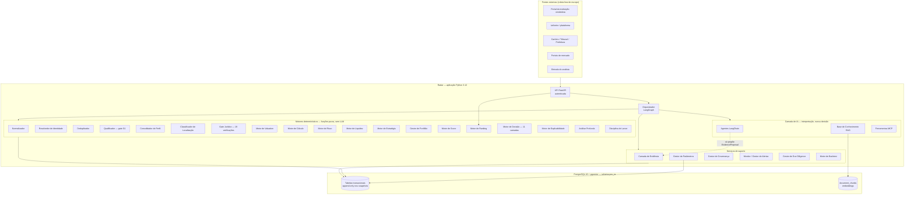
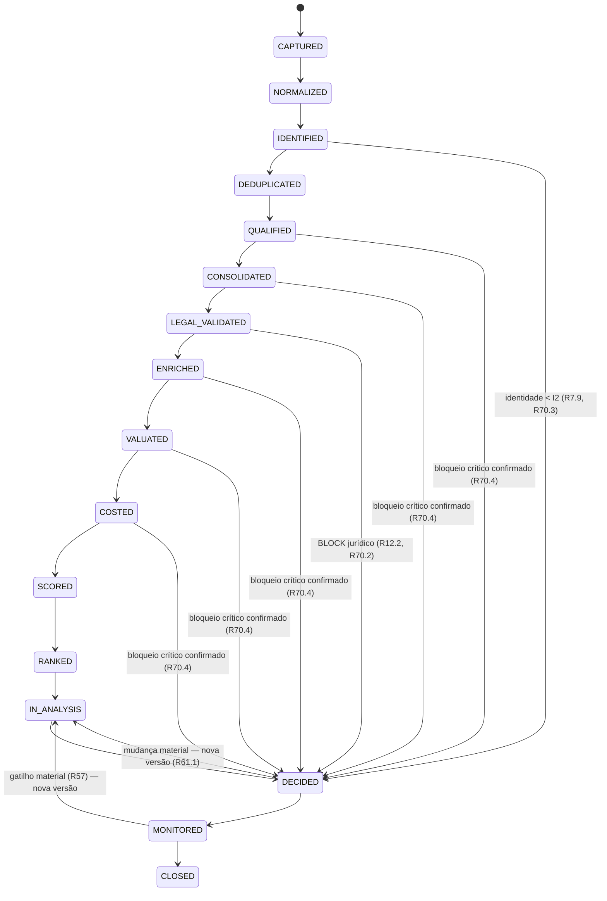
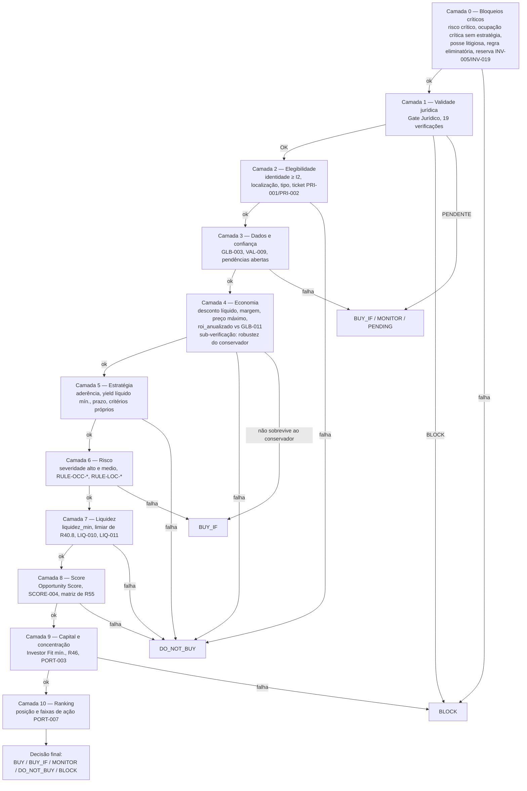

# Design Document

Radar Imobiliário — Projeto Técnico da Especificação Completa

## Overview

Este documento projeta a implementação dos **83 requisitos** de
`.kiro/specs/radar-imobiliario-especificacao-completa/requirements.md`. Ele não reenuncia
regras de negócio: para cada decisão de projeto, referencia o requisito que a origina e
explica **como** a regra passa a ser executável, determinística e auditável.

O `requirements.md` é o único artefato normativo de negócio do produto. Este design é o
único artefato normativo de **engenharia**: ele absorve o modelo físico de dados, que
antes vivia em documento separado, e **não referencia nenhum arquivo externo à spec**.
Onde cita código (`src/radar/**`, `db/schema.sql`), cita o artefato a alterar, nunca uma
fonte de verdade.

O produto já existe em fatia vertical: captura da CAIXA, normalização, identidade, gate
jurídico parcial, motor de cálculo, motor de decisão, persistência e API. O diagnóstico
técnico do documento de requisitos (`D.1` a `D.11`) verificou seis defeitos numéricos, oito
defeitos do motor de decisão, vinte e duas lacunas de capacidade, quinze divergências entre
documentação e esquema, onze achados de integridade de banco e oito achados de configuração.
Este design tem, portanto, três objetivos simultâneos:

1. **Corrigir** os defeitos verificados — em especial `D.1.1` (preço máximo que não satisfaz
   a própria definição), `D.1.2` (TCO incompleto e, na versão anterior deste design, com
   dupla contagem dos custos de saída), `D.1.3` (parser que multiplica decimais por 100),
   `D.1.5` (faixas com lacuna para valores não inteiros), `D.2.5` e `D.2.7` (ausência de
   informação jurídica convertida em liberação).
2. **Completar** as capacidades ausentes: valuation, liquidez, risco, cenários, score,
   Investor Fit, ranking, análise profunda, portfólio, monitoramento, alertas, governança de
   parâmetros, exceções, disciplina de lance, backtest e esteira de conhecimento.
3. **Tornar os princípios invioláveis executáveis** — `SAFE-001` a `SAFE-017` deixam de ser
   texto e passam a ser tipos fechados, invariantes verificadas por propriedade e restrições
   declarativas no banco.

### Correções que este design implementa

A tabela é o contrato entre o diagnóstico do requirements e este projeto. Cada linha tem
componente responsável e propriedade que a detecta.

| Defeito | Correção de projeto | Componente | Propriedade |
|---------|---------------------|------------|-------------|
| `D.1.1` preço máximo não satisfaz a definição | Forma fechada de `R28.2` **com ITBI** no coeficiente proporcional; verificação inversa como pré-condição de aceite | Motor de Cálculo | `P7.1`, `P7.11` |
| `D.1.2` TCO incompleto | `CostBreakdown` de **13** componentes; custos de saída e IR **fora** do TCO por `R26.1.1`; custo de oportunidade fora por `R26.1.2` | Motor de Cálculo | `P6.1`, `P6.2` |
| `D.1.3` `parse_money` corrompe decimal com ponto | Contrato novo de parsing sem heurística de magnitude; ambiguidade resulta em `UNKNOWN` | Normalizador | `P2.10`, `P2.12` |
| `D.1.4` `parse_percent` erra alíquota fracionária | Unidade obrigatória na entrada | Normalizador | `P2.11` |
| `D.1.5` faixas com lacuna | `classify_by_band` único, por limite inferior e `>=` em ordem decrescente | Motor de Score | `P10.14`, `P10.15`, `P9.1`, `P11.15` |
| `D.1.6` desconto líquido igual à margem | Desconto líquido contra o valor **base**; margem de segurança contra o valor **conservador** | Motor de Cálculo | `P6.5` |
| `D.2.1` camada de score nunca avaliada | Camadas 8, 9 e 10 com conteúdo | Motor de Decisão | `P11.3`, `P11.16` |
| `D.2.2` `has_critical_block` literal `False` | Camada 0 alimentada pelo Motor de Risco; nenhuma regra no grafo | Orquestrador, Motor de Risco | `P8.6` |
| `D.2.3` dois limiares de liquidez | Camada 7 própria, limiar resolvido pelo Gestor de Parâmetros | Motor de Decisão | `P9.4` |
| `D.2.4` rótulo de camada divergente | Camada determinante é a de menor índice entre as eliminatórias, e o rótulo corresponde à verificação executada | Motor de Decisão | `P11.3`, `P11.16` |
| `D.2.5` defaults inseguros | `DecisionInput` **sem nenhum default**; fronteira da API assume `PENDENTE` e `False` | Motor de Decisão, API | `P11.5` |
| `D.2.6` heurística de confiança no grafo | Confiança consolidada derivada de `CONF-001` a `CONF-005`, versionada | Motor de Score | `P10.15` |
| `D.2.7` `legal_status` como string livre | Enum `LegalStatus` validado na fronteira, com falha explícita | Fronteira de tipos | `P10.16` |
| `D.2.8` semântica de evidência invertida | Confiança expressa qualidade da prova; `NOT_APPLICABLE` distinto de `UNKNOWN` | Gate Jurídico | `P4.5` |
| `D.5` gate incompleto | De 7 para **19** verificações declarativas; `RULE-OCC-*` e `RULE-LOC-*` movidas para a camada 6 | Gate Jurídico, Motor de Risco | `P4.6`, `P4.7` |
| `D.6.3` fases não atingidas | Nós de deduplicação, qualificação e consolidação no grafo | Orquestrador | `P12.1` |
| `D.6.4` precedência com contagens divergentes | `DecisionLayer` de 9 para **11** valores | Motor de Decisão | `P11.16` |
| `D.6.5` estratégia confundida com perfil de ativo | `Strategy` com 6 valores; `AssetProfile` com 9 | Modelo de domínio | `P10.18` |
| `D.6.11` normalizador fixo em CAIXA | Despacho por tipo de fonte, com falha explícita | Normalizador | — (`REG-030`) |
| `D.9.1` a `D.9.11` integridade de banco | Seção **Modelo físico** deste design | Modelo de dados | `P13.2`, `P13.3` |
| `D.10.1` a `D.10.8` configuração e exposição | Seção **Error Handling** | Configuração, API | — (`REG-029`) |

### Princípios de projeto derivados dos princípios invioláveis

| Princípio de negócio | Consequência de projeto |
|----------------------|-------------------------|
| `SAFE-001`, `SAFE-002` — nada supera um `BLOCK` | A decisão é uma função pura com curto-circuito por camada; nenhuma camada posterior recebe poder de escrita sobre o resultado de uma anterior. |
| `SAFE-003`, `SAFE-017` — ausência de evidência não é regularidade, e é distinta de evidência de ausência | Nenhum campo de domínio tem default permissivo. `CheckOutcome` separa `UNKNOWN` de `IRREGULAR` e de `NOT_APPLICABLE`; o par evicção não verificada (`PENDENTE`) × evicção comprovadamente ausente (`BLOCK`) é representável. |
| `SAFE-004` — `UNKNOWN` permanece `UNKNOWN` | Não existe caminho de promoção automática: `transition_fact` exige identificador de evidência de suporte. |
| `SAFE-005` — custo desconhecido nunca é zero | Componentes de custo são `Informed[Decimal]`; `UNKNOWN` propaga contingência e marca o preço máximo como provisório. `CUS-005`, `CUS-006`, `CUS-014`, `CUS-015` e `REN-005` não têm default numérico. |
| `SAFE-006`, `SAFE-007` — o texto do ato registral prevalece | A consolidação registra ato, data e **texto integral**; a extração do texto é evidência com localização documental, distinta da detecção do evento. |
| `SAFE-009` — nenhum componente automatizado cria evidência | Agentes produzem `EvidenceProposal`; a promoção exige ato humano registrado ou regra determinística declarada. |
| `SAFE-010`, `SAFE-011` — contradições preservadas, histórico é hipótese | Evidência e análise são append-only; `Hypothesis` e `Evidence` são tipos distintos sem conversão implícita. |
| `SAFE-012` — avaliação da fonte é informativa | Campo próprio, sem nenhum caminho de atribuição a `market_value`. |
| `SAFE-013` — ocupação é risco, não nulidade | Ocupação sai do gate jurídico e vai para a camada 6, exceto os dois casos de `BLOCK` da camada 0 (`R18.2.1`, `R18.2.2`). |
| `SAFE-014` — processo judicial não é `BLOCK` automático | O impacto é classificado em quatro níveis e só `material_impeditivo` sem mitigação produz `BLOCK`. |
| `SAFE-015` — antiviés temporal | O acesso a dados no backtest passa por um filtro de corte pela data da decisão. |
| `SAFE-016` — yield bruto não é yield líquido | O piso decisório `REN-009` incide sobre o líquido; `REN-002` é informativo. |

### Decisões estruturais e seus motivos

**Motores determinísticos como funções puras.** Todo cálculo e toda decisão são funções de
dados de entrada para dados de saída, sem I/O e sem dependência de modelo de linguagem
(`R27.17`, `R71.1`, `R71.2`). O motivo é direto: determinismo e reprodutibilidade são
requisitos de auditoria (`R61.4`), e função pura é a única forma de garanti-los por
construção — além de ser o que torna as propriedades de correção executáveis a 100+
iterações sem custo.

**Banco como fonte única de parâmetros.** Hoje `domain/parameters.py` e o seed de
`strategies` repetem os mesmos valores sem garantia de convergência (`D.4.12`, `D.7.1`).
Passa a existir um `Gestor_de_Parametros` que resolve pela hierarquia de escopo com vigência
temporal (`R62.10`, `R62.11`); as constantes Python permanecem apenas como valores de
arranque que **geram** o seed, com teste comparando as três representações.

**O escopo mais específico prevalece.** A hierarquia `Global → Investidor → Estratégia →
Localização → Tipo → Oportunidade → Exceção` resolve conflitos pelo escopo mais específico,
**exceto** quando o menos específico impõe bloqueio crítico ou restrição legal ou documental
(`R54.10`, `R54.10.1`). A versão anterior deste design dizia o contrário, seguindo uma
formulação de `R54.10` que foi corrigida no requirements.

**Tipos fechados na fronteira.** `legal_status` é `str` em quatro módulos e qualquer valor
inesperado segue como se fosse `OK` (`D.2.7`). Passa a ser enum `LegalStatus` validado na
fronteira, com falha explícita. O mesmo tratamento se aplica a resultado de verificação,
estado de captura, estado de imóvel, nível de identidade, classe de localização, categoria e
severidade de risco, prioridade de pendência, qualidade de evidência e tipo de regra.

**Valor com estado de informação.** Nenhum número circula sozinho no domínio econômico e
documental: circula como `Informed[T]` (valor, estado, fonte, data, confiança, qualidade da
evidência). É o que permite cumprir `R3.2`, `R26.7`, `R26.10`, `R10.2`, `R65.1.3` e `R66.11`
sem depender de disciplina do chamador.

**Imutabilidade garantida, não documentada.** O snapshot da análise passa a ser um tipo
congelado na fronteira de persistência, e o banco recebe gatilhos que rejeitam `UPDATE` e
`DELETE` em `analyses`, `evidences`, `decisions`, `analysis_events` e `captures` (`D.9.8`).

**Orquestração é só orquestração.** O grafo sequencia nós, propaga estado compartilhado e
registra fase e traço (`R70.1`, `R70.5`, `R70.6`, `R70.9`). Nenhuma regra vive nele — hoje
`graph.py` contém heurística de confiança não versionada (`D.2.6`) e `has_critical_block=False`
literal (`D.2.2`), ambos removidos do grafo e movidos para os motores.

**Enriquecimento não depende do score.** A profundidade de investigação deriva do **potencial
preliminar** em cinco faixas qualitativas e da posição no ranking (`R5.2`, `R5.7`). A versão
anterior derivava do Opportunity Score, o que criava dependência circular: o score depende do
valuation, que depende do enriquecimento.

**Checklists e regras são dados.** São 234 itens de checklist (136 + 27 + 71) e 55 regras
canônicas. Declará-los como dados enumeráveis em tempo de execução é o que torna a
propriedade de cobertura total (`P16.1`) escrevível.

### Escopo do design

Incluído: os 83 requisitos, os Anexos A a F (checklists, verificações complementares,
disciplina de lance, matriz canônica de 55 regras, 35 testes de regressão e Golden Cases), as
correções de `D.1` a `D.10` e o **modelo físico de dados completo**, que este documento passa
a normatizar conforme a lista de integridade de `D.9`.

Fora de escopo, conforme a seção *Fora de Escopo Declarado* do requirements: coleta
automatizada da fonte (varredura de portais, download de editais) e consulta automática a
cartório, tribunais, prefeituras e concessionárias. Os resultados dessas verificações são
**entradas** com contrato definido, produzidas por documento ou registro do analista.

### Defeito de contagem registrado

`R72.2` enuncia "exatamente um dos **doze** tipos" e enumera **quinze** nomes. A enumeração é
a verdade: `KnowledgeSegmentType` tem **15** valores neste design. O numeral "doze" de `R72.2`
é defeito de redação a corrigir no requirements, e fica registrado aqui para que a divergência
não seja reintroduzida como se fosse decisão de projeto.

---

## Architecture

### Visão de contêineres



Duas fronteiras são normativas neste diagrama. A primeira: os agentes de IA têm seta
pontilhada para a camada de evidência porque **propõem** extrações que só se tornam evidência
por ato humano registrado ou por regra determinística explicitamente declarada — nenhum
agente cria evidência nem promove `UNKNOWN` para `CONFIRMED` (`R71.5`, `R71.6`, `R83.2`,
`R83.3`, `R20.4`). A segunda: os motores determinísticos não têm nenhuma seta para a camada de
IA, o que materializa `R71.1` e `R71.2` em topologia e é verificável por teste estático de
dependências.

### Pipeline e curto-circuitos — 16 fases



A ordem de `R70.1` tem **vinte etapas**; as **dezesseis** fases de `PipelinePhase` são os
marcos persistidos. O traço executado é registrado em `analysis_events` e é o objeto das
propriedades de orquestração: ele é sempre subsequência da ordem canônica, e o curto-circuito
é verificado pela **ausência** das fases posteriores no traço, não por inspeção de código.

Três fases hoje não existem em execução (`D.6.3`): `DEDUPLICATED`, `QUALIFIED` e
`CONSOLIDATED`. O grafo não tem nó de deduplicação, nem de qualificação, nem de consolidação
de perfil. Passa a ter os três, e `R70.1.1` proíbe executar a validade jurídica antes de
`QUALIFIED` e `CONSOLIDATED`.

### Camadas de decisão — 11 camadas, numeradas 0 a 10



Três pontos são normativos e mudam em relação à versão anterior deste design.

**Onze camadas, não nove.** `R53.1` fixa a ordem: 0 bloqueios críticos; 1 validade jurídica;
2 elegibilidade; 3 dados e confiança; 4 economia; 5 estratégia; 6 risco; 7 liquidez; 8 score;
9 capital e concentração; 10 ranking. O enum `DecisionLayer` passa de nove para **onze**
valores (`D.6.4`). A ordem também muda de lugar duas camadas: a validade jurídica é a camada
**1**, subordinada aos bloqueios críticos da camada 0, e a robustez de cenário deixa de ser
camada própria para virar **sub-verificação da camada 4** (`R53.1.6`).

**A decisão final é a saída, não uma camada.** `R53.1.1` é explícito: a decisão é o resultado
da avaliação das onze camadas. A versão anterior deste design tinha uma "camada 8 — ação
final", que era a decisão se passando por camada e inflava a contagem sem acrescentar
verificação.

**A camada determinante é a de menor índice entre as eliminatórias** (`R53.3`). Quando três
camadas falham, a reportada é a primeira. Hoje o rótulo de camada diverge da verificação
executada em dois pontos (`D.2.4`), o que quebra a auditabilidade exigida por `MC-116`.

### Mapa de sistemas para módulos

Os nomes da coluna esquerda são os do glossário do requirements e são usados nos critérios de
aceitação. Esta tabela é o contrato de rastreabilidade entre requisito e código.

| Sistema (glossário) | Módulo | Situação |
|---------------------|--------|----------|
| Capturador | `radar/capture/capture_service.py` | novo (persistência ausente, `D.9.2`) |
| Normalizador | `radar/capture/normalizers/{base,caixa}.py`, `radar/capture/parsing.py` | corrigir `D.1.3`, `D.1.4`, `D.6.11` |
| Resolvedor_de_Identidade | `radar/pipeline/identity.py` | ampliar (chave conceitual, `R8`) |
| Deduplicador | `radar/pipeline/dedup.py` | novo |
| Qualificador (gate `G1`) | `radar/pipeline/qualification.py` | novo |
| Consolidador_de_Perfil | `radar/pipeline/profile.py` | novo |
| Classificador_de_Localizacao | `radar/pipeline/location.py` | novo |
| Gate_Juridico | `radar/pipeline/legal_gate.py`, `radar/rules/legal/*.py` | ampliar de 7 para 19 verificações (`D.5`) |
| Camada_de_Evidencia | `radar/evidence/store.py`, `radar/evidence/proposals.py` | novo |
| Motor_de_Valuation | `radar/engines/valuation.py`, `radar/engines/comparables.py` | novo |
| Motor_de_Calculo | `radar/engines/calculation.py` | corrigir `D.1.1`, `D.1.2`, `D.1.6`; ampliar |
| Motor_de_Risco | `radar/engines/risk.py` | novo |
| Motor_de_Liquidez | `radar/engines/liquidity.py` | novo |
| Motor_de_Estrategia | `radar/engines/strategy.py` | novo |
| Gestor_de_Portfolio | `radar/engines/portfolio.py` | novo |
| Motor_de_Score | `radar/engines/scoring.py`, `radar/engines/bands.py` | novo |
| Motor_de_Ranking | `radar/engines/ranking.py` | novo |
| Motor_de_Decisao | `radar/engines/decision.py` | 11 camadas; corrigir `D.2.1` a `D.2.5` |
| Motor_de_Explicabilidade | `radar/engines/explain.py` | extrair de `analysis_service._explain` |
| Análise Profunda (`R76`) | `radar/engines/deep_analysis.py` | novo |
| Disciplina de lance (`R82`, Anexo C) | `radar/engines/bidding.py` | novo |
| Gestor_de_Due_Diligence | `radar/dd/manager.py`, `radar/dd/catalog.py` | novo |
| Monitor, Gestor_de_Alertas | `radar/monitoring/{monitor,alerts}.py` | novo |
| Gestor_de_Governanca | `radar/governance/{audit,versions,exceptions,quality}.py` | novo |
| Gestor_de_Parametros | `radar/governance/parameters.py` | novo |
| Base_de_Conhecimento | `radar/knowledge/{ingest,retrieve}.py` | novo |
| Motor_de_Backtest | `radar/backtest/engine.py` | novo |
| Orquestrador | `radar/orchestration/graph.py` | ampliar; remover regra do grafo |
| Interface_do_Investidor | `radar/api/**`, `radar/presentation/**` | ampliar |

---

## Components and Interfaces

Convenção das assinaturas: `Informed[T]` é o valor com estado de informação (definido em
*Data Models*); `Unknown` é o sentinela explícito; nenhum parâmetro de domínio tem default
permissivo. Todas as funções desta seção são puras, salvo as marcadas com `# I/O`.

### 1. Capturador (`R1`, `R2`)

```python
def fingerprint(payload: Mapping[str, Any]) -> str:
    """SHA-256 sobre serialização canônica: chaves ordenadas, separadores fixos,
    unicode normalizado em NFC. Invariante à ordem das chaves (R2.2)."""

class CaptureService:                                               # I/O
    def record(self, source_id: UUID, payload: Mapping[str, Any],
               captured_at: datetime, external_ref: str | None) -> CaptureRecord:
        """Idempotente por (source_id, fingerprint) (R2.3). Nunca sobrescreve (R2.4).
        Preserva preço e status exatamente como informados, além das versões
        normalizadas (R2.7), e as referências a imagens e documentos com data de
        observação (R2.6)."""

    def supersede(self, capture_id: UUID, reason: str, actor: str) -> CaptureRecord:
        """Correção posterior cria nova captura e move a anterior para Superseded
        (R2.5). A anterior permanece consultável."""

class SourceRegistry:                                               # I/O
    def register(self, source: SourceDefinition) -> UUID:
        """Fonte como entidade própria com tipo, nome, URL, abrangência, periodicidade,
        campos disponíveis, confiabilidade 0-100, situação e data da última captura
        (R1.1). Oito tipos aceitos (R1.3). Entrada manual do analista marca a
        informação como interpretação e registra o autor (R1.4)."""

    def reliability(self, source_id: UUID,
                    data_category: str) -> SourceReliabilityClass:
        """Confiabilidade por categoria de dado nas classes A, B, C, D, E, U (R1.5)."""

    def deactivate(self, source_id: UUID) -> None:
        """Preserva as capturas já registradas e interrompe novas capturas (R1.6)."""
```

A idempotência existe hoje no schema (`UNIQUE (source_id, hash)`) e não existe em execução:
nenhum código insere em `captures` e `RawCapture.fingerprint` é calculado e descartado
(`D.9.2`). `record` usa `INSERT ... ON CONFLICT (source_id, hash) DO NOTHING RETURNING`,
seguido de leitura, de modo que a idempotência é do banco e não da aplicação.

### 2. Normalizador (`R3`, `R74.9`, `R74.10`)

O parser numérico é reescrito. O defeito `D.1.3` não é de expressão regular: é de contrato. A
função atual decide se o ponto é separador de milhar por heurística e sempre remove pontos,
transformando `"47.76"` em `4776.0`. O contrato novo:

```python
class NumberFormat(StrEnum):
    PT_BR = "pt_br"        # 1.234,56
    PLAIN = "plain"        # 1234.56
    AUTO  = "auto"         # decide por evidência estrutural, nunca por magnitude

def parse_decimal(raw: str, fmt: NumberFormat = NumberFormat.AUTO) -> Informed[Decimal]:
    """Regras de AUTO, aplicadas em ordem:
    1. Há vírgula → vírgula é decimal, pontos são milhar.
    2. Há um único ponto seguido de 1 ou 2 dígitos até o fim → ponto é decimal (R3.4.1).
    3. Há um único ponto seguido de exatamente 3 dígitos e o grupo à esquerda tem
       1 a 3 dígitos → ambíguo → UNKNOWN (R3.4.4). Nunca escolher por magnitude.
    4. Há múltiplos pontos → pontos são milhar.
    Retorna Informed[Decimal] com estado OBSERVED, ou UNKNOWN sem valor. Nunca zero."""

class PercentUnit(StrEnum):
    FRACTION = "fraction"   # 0.025
    PERCENT  = "percent"    # 2.5

def parse_percent(raw: str | Decimal, unit: PercentUnit) -> Informed[Decimal]:
    """A unidade é obrigatória no contrato (R3.4.2). Sem heurística de magnitude:
    parse_percent(1, PERCENT) == 0.01 e parse_percent("2,5%", PERCENT) == 0.025
    (R3.4.3). O sufixo '%' no texto, quando presente, deve concordar com `unit`;
    discordância é erro de entrada, não normalização silenciosa."""

def parse_datetime_br(raw: str) -> Informed[datetime]:
    """Formatos `15/09/2026` e `15/09/2026 10:00` (R3.4)."""
```

`Decimal` substitui `float` em todo o caminho monetário. O motivo é o arredondamento: com
`float`, `parse(format(v)) == v` falha para valores legítimos em BRL e a propriedade de
round-trip ficaria com tolerância arbitrária.

```python
class Normalizer(Protocol):
    source_type: str
    def normalize(self, capture: CaptureRecord) -> NormalizedListing: ...

NORMALIZERS: dict[str, Normalizer]

def normalize(capture: CaptureRecord) -> NormalizedListing:
    """Despacha por capture.source_type. Fonte sem normalizador registrado é erro
    explícito (R1.1, REG-030). Hoje `node_normalize` chama normalize_caixa
    incondicionalmente (D.6.11). Extrai identificação, localização, características
    físicas, dados do certame, condições comerciais e ocupação (R3.1); preserva o valor
    original de cada campo (R3.3); registra o tipo de área (R3.5); mapeia tipo e status
    para a taxonomia do Radar preservando o texto original (R3.6, R3.7)."""
```

A distinção ocupado/desocupado deixa de usar `in`: passa por tokenização e por um léxico
ordenado em que os termos de vacância têm precedência sobre os de ocupação, porque
`"desocupado"` contém `"ocupado"` (`R3.8`).

Dois campos novos exigidos pelo dicionário: `banheiros` na caracterização física (`R74.9`) e
`complemento` no endereço, distinto de logradouro, número e unidade (`R74.10`).

### 3. Gate de dados e Qualificador (`R4`, `R5`)

```python
class DataGate(IntEnum):
    G0 = 0; G1 = 1; G2 = 2; G3 = 3; G4 = 4; G5 = 5; G6 = 6; G7 = 7

@dataclass(frozen=True)
class GateEvaluation:
    first_unsatisfied: DataGate | None
    missing: tuple[MissingField, ...]      # campo, impacto, dimensão afetada

def evaluate_data_gates(state: AnalysisState) -> GateEvaluation:
    """Avalia G0 a G7 em ordem (R4.1 a R4.8). Retorna o primeiro gate não satisfeito e
    exatamente qual informação falta (R4.9). Classifica o impacto de cada ausência em
    baixo, medio, alto ou critico e reduz a confiança da dimensão correspondente
    (R4.10)."""

class PreliminaryPotential(StrEnum):
    DESCARTAVEL = "descartavel"; BAIXO = "baixo"; MEDIO = "medio"
    ALTO = "alto"; EXCEPCIONAL = "excepcional"

def preliminary_potential(listing: NormalizedListing,
                          params: ScopeParameters) -> PreliminaryPotential:
    """Exatamente uma faixa qualitativa, derivada do desconto sobre o valor de
    referência da fonte, do enquadramento no escopo de localização e tipo, e do
    enquadramento no ticket — **sem depender de score** (R5.2, R5.7)."""

def enrichment_depth(potential: PreliminaryPotential,
                     rank_position: int | None) -> range:
    """Níveis 0 a 8 de R5.1. descartavel|baixo → 0..2 (R5.3); medio → 0..4 (R5.4);
    alto|excepcional → 0..6 (R5.5); Top 3 do ranking → inclui o nível 7 (R5.6)."""
```

O gate `G1` materializa-se na fase `QUALIFIED`, que hoje não existe em execução. A dependência
do enriquecimento é o potencial preliminar, não o Opportunity Score: derivar do score criava
ciclo, porque o score depende do valuation, que depende do enriquecimento.

### 4. Resolvedor de Identidade e Deduplicador (`R7`, `R8`, `R9`)

```python
class IdentityLevel(IntEnum):
    I0 = 0; I1 = 1; I2 = 2; I3 = 3; I4 = 4

class SignalStrength(StrEnum):
    DECISIVA = "decisiva"; MUITO_FORTE = "muito_forte"; FORTE = "forte"
    MEDIA = "media"; FRACA = "fraca"; BAIXA = "baixa"

@dataclass(frozen=True)
class IdentitySignal:
    kind: Literal["matricula_com_contexto", "matricula", "id_oficial_fonte",
                  "endereco_completo_com_unidade", "condominio_bloco_unidade_area",
                  "endereco_com_caracteristicas", "imagem_semelhante",
                  "similaridade_titulo"]
    value: str
    strength: SignalStrength
    confidence: int          # 0-100

SIGNAL_STRENGTH: Mapping[str, SignalStrength]   # ordem decrescente de R7.6
FORBIDDEN_FOR_IDENTITY = frozenset({"preco", "avaliacao_fonte", "desconto"})   # R7.7

def resolve_identity(listing: NormalizedListing) -> IdentityResult:
    """Total: retorna exatamente um IdentityLevel (R7.1). Monotônica na força dos
    sinais (R7.2 a R7.6). Documentação registral com contexto de comarca ou cartório
    → I4 (R7.2); matrícula sem contexto, ou id oficial com endereço completo com
    unidade, ou endereço completo com unidade → no máximo I3 (R7.3); endereço completo
    com área compatível sem unidade → no máximo I2 (R7.4); endereço parcial ou apenas
    id da fonte → I1 (R7.5). `imagem_semelhante` é sinal complementar de força media,
    nunca isolado (R7.1.1 do critério 7.1). Registra cada identificador com confiança
    (R7.8)."""

def conceptual_key(listing: NormalizedListing) -> ConceptualKey:
    """Primeira combinação disponível na ordem de R8.2: matrícula; id oficial da fonte;
    município+logradouro+número+unidade; condomínio+bloco+unidade. Sem identificador
    forte, usa endereço+área+quartos+vagas e marca o resultado como provável (R8.3).
    Endereço conhecido com unidade desconhecida → no máximo I2 e pendência de
    identificação da unidade (R8.4)."""

class MatchVerdict(StrEnum):
    SAME = "same"; DIFFERENT = "different"; UNDETERMINED = "undetermined"

COMPLEMENTARY_SIGNALS: Mapping[str, SignalStrength]   # R9.5.1

def is_same_property(a: NormalizedListing, b: NormalizedListing,
                     area_tolerance: Decimal) -> MatchResult:
    """Matrícula é decisiva (R9.1). Simétrica e reflexiva. Nunca adivinha: evidência
    insuficiente retorna UNDETERMINED (R9.6). Unidades distintas do mesmo condomínio
    retornam DIFFERENT (R9.11). Preço, avaliação e desconto são sinais inválidos
    (R9.5). Elevar UNDETERMINED a provável exige pelo menos dois sinais complementares
    de peso `medio`; sinais `fraco` nunca elevam o veredito (R9.5.2)."""

class PropertyLinker:                                               # I/O
    def link(self, capture_id: UUID, property_id: UUID,
             verdict: MatchResult) -> PropertyLink:
        """Fusão definitiva apenas com evidência decisiva ou muito forte (R9.8).
        Correspondência provável grava vínculo reversível e solicita validação (R9.7).
        Registra sinais coincidentes, divergentes, fontes comparadas, confiança e se
        houve validação manual (R9.10). Idempotente por (capture_id, property_id)."""

    def unlink(self, link_id: UUID, reason: str, actor: str) -> None:
        """Preserva o histórico da associação anterior e o motivo (R9.9)."""

    def rematch_republished(self, listing: NormalizedListing) -> MatchResult:
        """Oferta encerrada e republicada tenta associar-se ao imóvel histórico antes
        de criar um novo (R9.12)."""
```

`MatchVerdict` de três valores substitui o booleano. É a diferença entre "não é o mesmo imóvel"
e "não sei", e sem ela `R9.6` não é representável. `IdentityResult.is_reliable` hoje exige
`>= I3` e não é consumida em nenhum ponto, enquanto a orquestração usa `>= I2` (`D.6.1`). O
limiar de elegibilidade é `I2` (`R53.1.4`) e passa a existir em um único lugar:
`IdentityResult.meets_eligibility_threshold`.

### 5. Consolidador de Perfil, Divergências e Classificador de Localização (`R6`, `R10`, `R11`, `R74.1`, `R74.4` a `R74.6`)

```python
class ProfileGroup(StrEnum):            # R10.8 — nove grupos
    IDENTIFICACAO = "identificacao"; LOCALIZACAO = "localizacao"; FISICO = "fisico"
    CONDOMINIAL = "condominial"; OCUPACIONAL = "ocupacional"; QUALIDADE = "qualidade"
    OFERTA = "oferta"; DOCUMENTAL = "documental"; CONSOLIDACAO = "consolidacao"

def consolidate_profile(property_id: UUID,
                        listings: Sequence[NormalizedListing],
                        source_reliability: Mapping[UUID, Mapping[str, str]],
                        current: PropertyProfile | None,
                        ) -> tuple[PropertyProfile, ProfileVersion,
                                   list[Divergence], list[PriceObservation]]:
    """Cada campo do perfil recebe exatamente um estado de informação (R10.2) e registra
    a fonte que o sustentou (R10.4); inferência marca INFERRED e registra a premissa
    (R10.5). Versiona o perfil com numeração crescente, data, autor, campos alterados e
    motivo, sem sobrescrita (R10.6, R74.4). Emite observações do histórico de preços com
    valor, moeda, data, fonte, tipo de preço e variação (R10.7, R74.5). Organiza os nove
    grupos de R10.8, incluindo Condominial (R10.9), Ocupacional (R10.10) e Qualidade
    (R10.11). Divergências são preservadas com origem e data, nunca resolvidas
    silenciosamente (R6.1, R6.6)."""

def classify_divergence(a: FieldObservation, b: FieldObservation,
                        params: DivergenceParameters) -> Divergence:
    """Divergência de valor de mercado acima de VAL-010 é material, gera pendência e
    reduz a confiança da dimensão (R6.2). Ocupação divergente entre fontes gera
    pendência crítica (R6.3). Status divergente adota o mais recente como vigente,
    preserva o anterior e emite evento de mudança (R6.5). Divergência entre fonte
    oficial e anúncio registra o critério de priorização aplicado (R6.7).
    Matrícula divergente mantém registros separados e é conflito de identidade,
    tratado pelo Deduplicador (R6.4)."""

class LocationClass(StrEnum):
    A = "A"; B = "B"; C = "C"; D = "D"; E = "E"

def classify_location(profile: PropertyProfile,
                      params: LocationParameters) -> LocationResult:
    """Exatamente uma classe A a E (R11.1), derivada exclusivamente de LOC-001 a
    LOC-013 vigentes, sem nome de bairro embutido no produto (R11.2). Avalia segurança,
    serviços, comércio, transporte, acesso, infraestrutura, perfil de demanda, faixa de
    preço predominante e liquidez regional como dimensões independentes (R11.6). O
    perfil socioeconômico é dimensão informativa e é mantido separado de liquidez, risco
    e qualidade (R11.7, LOC-011). Um único indicador desfavorável reduz a dimensão
    correspondente e mantém a oportunidade elegível (R11.8)."""
```

**Localização é entidade própria** (`R74.1`), com endereço, região, classe, perfil de demanda,
liquidez regional e faixa de preço predominante. Hoje não existe, e sem ela a classificação é
recalculada a cada análise sem histórico.

`Divergence` é entidade nova (`R74.6`): hoje não há onde registrar "fonte A diz X, fonte B diz
Y, dimensão afetada, materialidade, impacto na decisão" (`D.4.13`), e a divergência de data
entre portal e edital do Golden Case `F.1` é exatamente esse caso — a mesma entidade sustenta
`R82.9` na disciplina de lance.

### 6. Gate Jurídico — 19 verificações (`R12` a `R20`; Anexos A, B, D)

O gate atual tem sete verificações; `R12.9` exige **dezenove**: treze `RULE-JUR-001` a
`RULE-JUR-013`, quatro `RULE-ED-001` a `RULE-ED-004` e duas `RULE-ID-001` e `RULE-ID-002`. A
família `RULE-REG-001` a `RULE-REG-004`, citada em versões anteriores como se integrasse o
gate, **não existe em nenhuma fonte** e é removida; as verificações registrais estão em
`RULE-ID-002`, `RULE-JUR-012`, `RULE-JUR-013` e `RULE-ED-004`. `RULE-OCC-001`, `RULE-OCC-002`,
`RULE-LOC-001` e `RULE-LOC-002` **saem do gate** e passam à camada 6 de risco (`R12.10`).

**Crosswalk do gate.** `GATE-JUR-001` a `GATE-JUR-006` são os seis itens do enunciado de
origem; o gate é executado pelas regras canônicas.

| Item de origem | Objeto | Regras canônicas | Camada |
|----------------|--------|------------------|--------|
| `GATE-JUR-001` | Consolidação da propriedade | `RULE-JUR-002`, `RULE-JUR-013` | 1 |
| `GATE-JUR-002` | Constituição em mora e notificação | `RULE-JUR-003`, `RULE-JUR-004` | 1 |
| `GATE-JUR-003` | Intimações relativas aos leilões | `RULE-JUR-005` | 1 |
| `GATE-JUR-004` | Edital, cronologia e coerência | `RULE-ED-001`, `RULE-JUR-006` | 1 |
| `GATE-JUR-005` | Processos judiciais | `RULE-JUR-007` | 1 |
| `GATE-JUR-006` | Ocupação e locação | `RULE-OCC-001`, `RULE-OCC-002`, `RULE-LOC-001`, `RULE-LOC-002` | **6 — risco, não gate** |

As dezenove verificações são declaradas como dados, não como código imperativo:

```python
class CheckOutcome(StrEnum):
    CONFIRMED = "CONFIRMED"             # verificado e regular
    IRREGULAR = "IRREGULAR"             # irregularidade material comprovada
    UNKNOWN = "UNKNOWN"                 # sem evidência
    NOT_APPLICABLE = "NOT_APPLICABLE"   # distinto de UNKNOWN (D.2.8, REG-025)
    IN_TREATMENT = "IN_TREATMENT"       # averbação em tratamento (R13.13, REG-003)

class P0Result(StrEnum):
    REGULAR_COMPROVADO = "REGULAR_COMPROVADO"
    PENDENTE = "PENDENTE"
    RISCO_JURIDICO = "RISCO_JURIDICO"
    BLOCK = "BLOCK"
    INCONCLUSIVO = "INCONCLUSIVO"

class LegalStatus(StrEnum):
    OK = "OK"; PENDENTE = "PENDENTE"; BLOCK = "BLOCK"

P0_TO_LEGAL_STATUS: Mapping[P0Result, LegalStatus]      # total, conforme R12.6

@dataclass(frozen=True)
class LegalCheckSpec:
    rule_code: str                  # RULE-JUR-001..013, RULE-ED-001..004, RULE-ID-001..002
    checklist_ids: tuple[str, ...]  # MC-*, B-*
    mandatory: bool
    on_unknown: P0Result            # PENDENTE por padrão; nunca REGULAR_COMPROVADO
    on_irregular: P0Result          # BLOCK ou RISCO_JURIDICO
    evidence_required: tuple[str, ...]
    min_evidence_quality: EvidenceQuality   # forte|boa para regra jurídica crítica (R65.1.2)

LEGAL_CHECKS: Mapping[str, LegalCheckSpec]      # exatamente 19 entradas (R12.9)

def evaluate_legal_gate(checks: Mapping[str, CheckResult],
                        specs: Mapping[str, LegalCheckSpec],
                        as_of: date) -> LegalGateResult:
    """Agregação determinística e confluente: a ordem de avaliação não altera o
    resultado (R12.1, R12.5). Precedência: qualquer IRREGULAR → BLOCK; senão qualquer
    obrigatória UNKNOWN → PENDENTE; senão RISCO_JURIDICO se houver sinal; senão
    REGULAR_COMPROVADO. Emite exatamente uma evidência por verificação avaliada,
    inclusive UNKNOWN com confiança 0 (R20.7). Registra, para cada uma das 19, o
    resultado, a evidência, a localização documental, a regra de origem e a qualidade
    da evidência (R12.11, R65.1.3)."""
```

Três correções pontuais em relação à implementação atual:

- A confiança da evidência deixa de ser `95.0 if CONFIRMED else 0.0`. Uma irregularidade
  comprovada é a evidência mais decisiva que o gate produz e passa a ser registrada com estado
  `CONFIRMED` e confiança alta (`D.2.8`). A confiança expressa a qualidade da prova, não a
  conveniência do resultado.
- `NOT_APPLICABLE` deixa de ser mapeado para `UNKNOWN`, o que permite distinguir cobertura
  completa de lacuna (`R20.4`, `REG-025`) e torna a propriedade de cobertura do Anexo A
  verificável.
- `blocks_buy` passa a ser consumido: a orquestração faz curto-circuito em `BLOCK` (`R12.2`) e
  o motor de decisão impede `BUY` em `PENDENTE` (`R12.8`). Hoje `PENDENTE` atravessa o pipeline
  sem que `blocks_buy` tenha efeito em nenhum ponto (`D.5`).

**Verificações registrais e de titularidade (`R13`).**

```python
class NegativeAuctionRecordState(StrEnum):      # R13.13 — quatro estados
    AVERBADO = "averbado"; EM_TRATAMENTO = "em_tratamento"
    NAO_SE_APLICA = "nao_se_aplica"; DESCONHECIDO = "desconhecido"

def check_registry(matricula: MatriculaEvidence | Unknown,
                   offer: NormalizedListing,
                   as_of: date) -> Sequence[CheckResult]:
    """RULE-ID-002 e RULE-JUR-012/013. Matrícula ausente → PENDENTE com pendência de
    certidão (R13.2). Certidão válida até mudança registral ou evidência nova, com
    revalidação obrigatória antes da compra (R13.3); revalidação não realizada impede
    BUY e registra pendência crítica (R13.3.2). Conflito material de titularidade →
    BLOCK (R13.4). Consolidação registra ato, data e texto integral (R13.6) e, quando o
    texto existe, extrai as declarações sobre intimação e purgação como evidência com
    localização exata (R13.8). Consolidação comprovada comprova o ato na data e mantém
    UNKNOWN os fatos posteriores (R13.9, SAFE-006). Gravame histórico baixado é
    distinguido de gravame atual (R13.10). Penhora, indisponibilidade ou arresto vigente
    que impeça a transferência → BLOCK (R13.11). Averbação `em_tratamento` é pendência
    registral com custo e prazo no TCO, sem BLOCK por esta situação (R13.12). Vaga com
    matrícula autônoma e abrangência indeterminada → PENDENTE (R13.14)."""
```

**Mora, intimações, edital e cronologia (`R14`, `R15`).** A cronologia
mora → consolidação → leilão (`R15.4`, `MC-032`) é verificada como ordenação de datas
conhecidas; data ausente produz `PENDENTE`, nunca coerência presumida. A exigibilidade de cada
intimação é avaliada conforme a modalidade e o caso concreto, sem presumir exigência nem
dispensa (`R14.10`, `SAFE-008`).

```python
class EvictionOutcome(StrEnum):
    CLAUSULA_CONFIRMADA = "clausula_confirmada"
    CLAUSULA_AUSENTE_COMPROVADA = "clausula_ausente_comprovada"   # BLOCK (R15.9)
    NAO_VERIFICADA = "nao_verificada"                             # PENDENTE (R15.9.1)

def check_eviction(edital: EditalEvidence | Unknown) -> EvictionResult:
    """Extrai a cláusula de responsabilidade por evicção e registra item e página
    (R15.8). Edital obtido e comprovadamente sem cláusula → BLOCK e lance impedido
    (R15.9). Edital não obtido ou cláusula não verificada → PENDENTE, BUY impedido e
    lance impedido (R15.9.1). Os dois casos são distinguíveis no registro e na
    explicação (R15.9.2). Limitações e ressalvas são registradas uma a uma e elevam
    risco e contingência (R15.10). Avalia E01 a E09 do Anexo C.2."""

def check_portal_edital_divergence(portal: OfferSnapshot,
                                   edital: EditalEvidence) -> Sequence[Divergence]:
    """Divergência de data, horário, plataforma, leiloeiro ou valor mínimo → PENDENTE,
    com as duas informações e suas origens registradas (R15.7). É o caso do Golden Case
    F.1 e aciona hard stop de lance (RL-02, RL-10, REG-014)."""
```

**Processos judiciais (`R16`) e sinais de investigação (`R17`).**

```python
class ProcessImpact(StrEnum):
    NENHUM = "nenhum"; POTENCIAL = "potencial"
    MATERIAL_MITIGAVEL = "material_mitigavel"
    MATERIAL_IMPEDITIVO = "material_impeditivo"

def classify_process(p: JudicialProcess) -> ProcessCheckResult:
    """Classifica o impacto sobre a validade do procedimento (R16.3).
    material_impeditivo sem mitigação comprovada → BLOCK (R16.4); potencial e
    material_mitigavel → RISCO_JURIDICO com condição de mitigação (R16.5). A existência
    isolada de processo nunca produz BLOCK (R16.6, SAFE-014). Liminar que atinge o
    leilão → BLOCK até resolução ou mitigação (R16.8)."""

def legal_signals(ctx: LegalContext) -> Sequence[CheckResult]:
    """RULE-JUR-009 a RULE-JUR-011. Quitação ≥ 0,80 registra sinal e risco alto, sem
    BLOCK isolado (R17.1). Bem residencial em garantia de dívida de terceiro →
    PENDENTE ou BLOCK conforme a evidência (R17.2). Segundo leilão abaixo de 0,50 da
    avaliação emite alerta, exige validação da modalidade e reduz a confiança jurídica,
    sem BLOCK isolado (R17.3). Constrição sobre os direitos do devedor fiduciante →
    BLOCK quando impeditiva (R17.4). Cada sinal é evidência com proveniência, estado e
    localização documental (R17.5)."""
```

**Ocupação e locação — camada 6, com dois casos de camada 0 (`R18`, `R19`).**

```python
class OccupancyState(StrEnum):              # R18.1 — sete estados
    DESOCUPADO_CONFIRMADO = "desocupado_confirmado"
    LIVRE_NAO_CONFIRMADO = "livre_nao_confirmado"
    OCUPADO_PELO_DEVEDOR = "ocupado_pelo_devedor"
    OCUPADO_POR_TERCEIRO = "ocupado_por_terceiro"
    OCUPADO_POR_INQUILINO = "ocupado_por_inquilino"
    POSSE_LITIGIOSA = "posse_litigiosa"
    DESCONHECIDO = "desconhecido"

def assess_occupancy(state: OccupancyState, impact: Impact,
                     has_vacancy_strategy: bool,
                     litigation_evidence: bool) -> OccupancyAssessment:
    """Ocupado → risco de posse de severidade alto, e a ocupação nunca é tratada como
    nulidade do procedimento (R18.2, SAFE-013). Impacto crítico sem estratégia de
    desocupação → severidade critico e BLOCK pela camada 0 (R18.2.1). posse_litigiosa
    com evidência de litígio → severidade critico e BLOCK pela camada 0 (R18.2.2).
    livre_nao_confirmado reduz a confiança da dimensão e registra pendência de
    confirmação, sem tratar o imóvel como desocupado comprovado (R18.2.3).
    desconhecido registra pendência de prioridade **alta** — nunca critica —, contingência
    de desocupação, redução de confiança, e permite a continuidade da análise
    (R18.3, R18.3.1). Desocupado comprovado não registra risco de posse (R18.4).
    Risco de posse é categoria distinta do risco de nulidade em todo registro (R18.8)."""
```

### 7. Camada de Evidência e fronteira da IA (`R20`, `R71`, `R83`)

```python
class EvidenceQuality(StrEnum):             # R65.1.1 — cinco níveis
    FORTE = "forte"        # documento oficial ou registral com localização exata
    BOA = "boa"            # documento oficial sem localização exata, ou terceiro verificável
    MODERADA = "moderada"  # fonte identificada sem documento
    FRACA = "fraca"        # estimativa, inferência ou fonte não verificável
    AUSENTE = "ausente"    # sem evidência

@dataclass(frozen=True)
class EvidenceProposal:
    """Único artefato que um agente de linguagem produz (R83.2). Não é evidência."""
    fact: str
    document_id: UUID
    location: str                  # item, página, número de averbação
    extraction_confidence: int      # 0-100
    produced_by: str                # agente, modelo, versão de prompt

class EvidenceStore(Protocol):                                      # I/O
    def append(self, e: EvidenceRecord) -> UUID:
        """Rejeita evidência sem fonte identificada (R20.3). Append-only: nunca
        atualiza nem remove (R20.5, R20.6). Grava regra, fonte, documento, localização
        exata, fato, valor, estado, confiança, qualidade, autor, data de observação e
        data de extração (R20.1, R65.1.3)."""

    def promote(self, proposal: EvidenceProposal,
                by: HumanAct | DeterministicRule) -> UUID:
        """Promoção de proposta a evidência somente por ato humano registrado OU por
        regra determinística explicitamente declarada (R83.3). Não existe terceiro
        caminho."""

    def transition_fact(self, analysis_id: UUID, key: str,
                        to_state: EvidenceState,
                        supporting_evidence_id: UUID | None) -> FactRecord:
        """UNKNOWN → CONFIRMED exige supporting_evidence_id de evidência recém
        registrada; caso contrário levanta EvidencePromotionError (R20.4, SAFE-009)."""

    def facts(self, analysis_id: UUID) -> Sequence[FactRecord]:
        """Fatos com evidências contraditórias vêm marcados como conflitantes, com
        todas as evidências preservadas (R20.5, SAFE-010)."""

MANDATORY_HUMAN_CHECKPOINTS: frozenset[str] = frozenset({      # R83.5 — sete pontos
    "promover_evidencia_juridica_para_confirmed",
    "aceitar_risco_severidade_alto",
    "criar_excecao",
    "aprovar_mudanca_nivel_alto_ou_critico",
    "confirmar_divergencia_documental",
    "liberar_lance",
    "registrar_decisao_de_compra",
})

def validate_human_checkpoint_config(cfg: SupervisionConfig) -> None:
    """Rejeita configuração que remova qualquer um dos sete pontos mínimos (R83.6).
    Pontos adicionais são permitidos (R70.7)."""

def record_human_intervention(point: str, actor: str, role: str,
                              target: UUID, justification: str) -> UUID:   # I/O
    """R83.7. Append-only na trilha de auditoria."""
```

É assim que `R71.5` a `R71.7` e `R83.1` a `R83.7` saem do texto: não há API pela qual um agente
escreva `CONFIRMED` sem prova, e `MANDATORY_HUMAN_CHECKPOINTS` é um conjunto congelado cuja
remoção é rejeitada por validação, não por convenção.

### 8. Motor de Valuation e Comparáveis (`R21` a `R25`)

```python
class ComparableClass(StrEnum):
    A = "A"; B = "B"; C = "C"; D = "D"; E = "E"; U = "U"

class AreaKind(StrEnum):
    PRIVATIVA = "privativa"; COMUM = "comum"; TOTAL = "total"
    TERRENO = "terreno"; UNKNOWN = "UNKNOWN"

class ValuationMethod(StrEnum):
    COMPARATIVO = "comparativo"; PRECO_M2_AJUSTADO = "preco_m2_ajustado"
    MESMO_CONDOMINIO = "mesmo_condominio"; CAPITALIZACAO_RENDA = "capitalizacao_renda"
    RESIDUAL_POTENCIAL = "residual_potencial"; ANALOGIA = "analogia"; HIBRIDO = "hibrido"

def select_comparables(target: PropertyProfile, pool: Sequence[Comparable],
                       params: ValuationParameters) -> ComparableSelection:
    """Prioriza na ordem de R21.1: transações realizadas; ofertas muito semelhantes e
    recentes no mesmo condomínio; mesma microárea; mesmo bairro; regiões próximas.
    Restringe a VAL-003 e VAL-004, salvo exceção registrada (R21.4). Distingue preço
    anunciado de transacionado em todo registro e cálculo (R21.5); apenas anunciados
    reduzem a confiança (R21.6). Exclui erro evidente e segmento incompatível com
    motivo (R21.7). Identifica outliers por CMP-012 (±1,5 × IQR do preço/m²) e registra,
    para cada, a decisão de excluir ou ajustar com justificativa (R21.8); outlier
    repetido registra hipótese de submercado distinto como pendência (R21.9). Idade do
    anúncio acima de CMP-011 exclui; entre metade e CMP-011 aplica a penalidade CMP-013
    (R21.10.2)."""

def apply_adjustments(target: PropertyProfile, c: Comparable,
                      params: ValuationParameters) -> AdjustedComparable:
    """Ajustes explícitos e registrados para área, quartos, vagas, padrão construtivo,
    estado de conservação, andar, posição, condomínio, localização e data (R21.10). O
    ajuste por estado de conservação é obrigatório (CMP-008, R21.10.1): estado
    desconhecido de qualquer lado registra pendência e reduz a confiança."""

def price_per_m2(price: Decimal, area: Informed[Decimal],
                 kind: AreaKind) -> Informed[Decimal]:
    """Só compara áreas do mesmo tipo (R21.11). Tipo UNKNOWN em qualquer dos lados
    resulta em pendência e redução de confiança, nunca em comparação (R21.12)."""

def valuation_confidence(selection: ComparableSelection) -> Informed[int]:
    """Faixas de R22.1 a R22.4.1, contínuas e sem lacuna: classe A|B ≥ VAL-011 → 90-100;
    A..C ≥ VAL-011 → 75-89; A..C ≥ VAL-001 e < VAL-011, ou VAL-011 com qualidade
    predominante D → 60-74; aproveitáveis < VAL-001 e > 1 → amplia a faixa de valor e
    40-59; exatamente um aproveitável → 0-39. Monotônica não decrescente na quantidade e
    na qualidade, considerando também atualidade, semelhança e dispersão (R22.7)."""

def valuate(target: PropertyProfile, selection: ComparableSelection,
            method: ValuationMethod, params: ValuationParameters) -> Valuation:
    """Emite conservador, base, otimista e venda_rapida, cada um com confiança e método
    (R23.1, R23.4, R24.8). base = mediana da amostra ajustada (R23.2);
    conservador = base × (1 − VAL-008) (R23.2.1);
    venda_rapida = conservador × (1 − VAL-007) (R23.3).
    O conservador é a referência dos testes de robustez e o base é a referência da
    decisão principal (R23.5); o otimista nunca é referência única (R23.6).
    Amostra sem comparável aproveitável → INCONCLUSIVO com pendência de mercado
    (R22.5). Método por tipo de ativo conforme R24.2 a R24.5; terreno não exige yield
    de aluguel (R24.6); classificação socioeconômica do público é informativa e não é
    proxy de risco nem de qualidade (R24.7)."""
```

A avaliação da fonte permanece em campo próprio e nunca alimenta `market_value` (`R23.7`,
`SAFE-012`). Quando ela supera o valor otimista da amostra, gera evidência de divergência e
pendência (`R23.8`, `REG-009`, Golden Case `F.4`).

Gatilhos de revaluation (`R25`) ficam no Monitor: novo comparável de classe `A` a `C` dentro
do raio e da janela; frescor de valuation excedido; aluguel variando `MON-005` ou mais;
informação física relevante alterada. Mudança de estratégia ativa recalcula o **preço máximo**
sem necessariamente recalcular o valor de mercado (`R25.5`).

### 9. Motor de Cálculo — TCO e métricas econômicas (`R26`, `R27`)

O `CostBreakdown` tem **treze** componentes, exatamente os de `R26.1`:

```python
@dataclass(frozen=True)
class CostBreakdown:
    """Treze componentes de R26.1. Cada um é Informed[Decimal]: UNKNOWN nunca é zero
    (R26.10, SAFE-005) e cada um permanece individualmente consultável (R26.11)."""
    preco: Informed[Decimal]                     # CUS-001
    comissao_leiloeiro: Informed[Decimal]        # CUS-002 — preço × pct (R26.2)
    itbi_e_tributos_aquisicao: Informed[Decimal] # CUS-003 — preço × alíquota (R26.3)
    registro_documentacao: Informed[Decimal]     # CUS-004
    condominio_debitos: Informed[Decimal]        # CUS-005 — sem default
    tributos_debitos: Informed[Decimal]          # CUS-006 — sem default
    regularizacao: Informed[Decimal]             # CUS-009
    reforma: Informed[Decimal]                   # CUS-007
    desocupacao: Informed[Decimal]               # CUS-008
    reserva_imprevistos: Informed[Decimal]       # CUS-011 — aquisição × pct (R26.5)
    custo_juridico_esperado: Informed[Decimal]   # CUS-014 × CUS-015 (R26.4)
    carrying: Informed[Decimal]                  # CUS-016 × prazo (R26.6)
    custo_financeiro: Informed[Decimal]          # CUS-010

    def total(self) -> Informed[Decimal]:
        """Soma exata dos treze (R26.1). O estado do total é o pior estado entre os
        componentes: um UNKNOWN de impacto alto contamina o total (R26.7, R26.8)."""
```

**O que o `CostBreakdown` não contém, e por quê.** Não contém `custo_saida_corretagem` nem
`ir_ganho_capital`. `R26.1.1` os atribui exclusivamente à perna de venda, calculada por
`R27.9` e `R27.10`. A versão anterior deste design os incluía no TCO, o que produzia dois
defeitos simultâneos: **dupla contagem**, porque `lucro_liquido = venda_liquida − TCO` já
subtrai a corretagem dentro de `venda_liquida`; e **circularidade do IR**, porque
`base_de_ir = máx(0; V − corretagem − outros − TCO)` depende do TCO, e um TCO que contivesse
o IR dependeria da própria base. Retirá-los resolve os dois de uma vez e é o que torna a
propriedade inversa do preço máximo (`P7.1`) algebricamente fechada.

Também não contém o **custo de oportunidade do capital**. Ele é um dos seis itens de
`CUS-016`, mas `R26.1.2` o exclui do TCO decisório: o retorno exigido já é cobrado pelo
limiar `GLB-011` em `R33.9`. Somá-lo dentro do custo *e* exigi-lo como limiar cobraria o mesmo
retorno duas vezes. O componente permanece calculado e permanece usado — só não no TCO:

```python
@dataclass(frozen=True)
class CarryingModel:
    """R30.2. Seis parcelas mensais."""
    condominio: Informed[Decimal]
    tributos_e_taxas: Informed[Decimal]
    manutencao: Informed[Decimal]
    seguro: Informed[Decimal]
    custo_financeiro: Informed[Decimal]
    custo_oportunidade_capital: Informed[Decimal]   # GLB-007 (R30.3)

    def mensal_decisorio(self) -> Informed[Decimal]:
        """Cinco primeiras parcelas. Entra no TCO por R26.6 e R26.1.2."""

    def mensal_pleno(self) -> Informed[Decimal]:
        """Seis parcelas. Usado apenas em R30.2 e R30.3 — custo do tempo e
        eficiência de capital."""
```

As métricas de `R27` são funções puras sobre `Informed[Decimal]`:

```python
def net_discount(tco: Decimal, market_base: Decimal) -> Decimal:
    """1 − TCO ÷ valor de mercado **provável** (R27.3). Base: o valor `base` da faixa
    (R23.5), nunca o preço de venda de referência. Foi esse o erro de F.1 na versão
    anterior: 23,98% calculado sobre 300.000 em lugar de 290.000."""

def safety_margin_pct(tco: Decimal, market_base: Decimal) -> Decimal:
    """(V − TCO) ÷ V (R27.5). Numericamente idêntico a net_discount com as mesmas
    entradas — é isso que P6.5 fixa. A distinção de D.1.6 é de **referência**, não de
    fórmula: o desconto líquido decisório usa o valor base, e o teste de robustez usa o
    valor conservador. Usar a mesma referência nos dois lugares é que era o defeito."""

def rent_net(gross: Informed[Decimal], recurring: RecurringCosts) -> Informed[Decimal]:
    """R27.7, com piso em zero: máx(0; aluguel − condomínio não recuperável − IPTU não
    recuperável − manutenção − **seguro e taxas** − vacância − inadimplência − IR).
    Seguro e taxas e inadimplência (REN-005) fazem parte da subtração; inadimplência
    UNKNOWN gera contingência e pendência e marca o resultado como provisório por cima."""

def rent_tax_base(gross: Informed[Decimal],
                  recurring: RecurringCosts) -> Informed[Decimal]:
    """R27.7.1: máx(0; aluguel − condomínio − IPTU − manutenção − seguro e taxas).
    A base **não** deduz vacância nem inadimplência. Em F.1: 1.265,00, enquanto o
    aluguel líquido é 1.170,00 — os R$ 95,00 de vacância separam os dois."""

def rent_income_tax(base: Informed[Decimal],
                    ren_012: Informed[Decimal]) -> Informed[Decimal]:
    """base × REN-012. REN-012 é [PENDENTE-DECISÃO]: o imposto sai como UNKNOWN, não
    como zero comprovado, e o yield líquido é rotulado provisório (R27.7.2)."""

def net_yield_monthly(rent: Informed[Decimal],
                      tco: Decimal) -> ProvisionalMetric[Decimal]:
    """R27.8. `ProvisionalMetric` carrega o motivo da provisoriedade — aqui, REN-012
    pendente e REN-005 desconhecida — porque o piso decisório REN-009 incide sobre esta
    métrica (SAFE-016) e decidir sobre número provisório exige que a provisoriedade
    viaje junto com o número."""

def break_even_exit(tco: Decimal, sale_cost_pct: Decimal) -> Decimal:
    """R27.14: preço de venda que zera o lucro líquido. Com ganho nulo a base de IR é
    zero, logo TCO ÷ (1 − c_v). Em F.1: 236.125,246785 ÷ 0,94 = 251.197,07."""
```

Duas guardas de entrada são pré-condições, não validações opcionais: valor de mercado menor
ou igual a zero rejeita todas as métricas dependentes com erro de dado de entrada (`R27.16`),
e prazo menor ou igual a zero rejeita `roi_anualizado` (`R30.3.2`). Nenhuma das duas retorna
um número de conveniência.

### 10. Preço máximo e teto decisório (`R28`)

Este é o defeito `D.1.1`: a implementação anterior calculava um teto que, usado como preço,
não reproduzia o ROI alvo. A correção é derivar a forma fechada da própria definição.

**Derivação.** Seja `P` o preço, `V` o preço de venda de referência, `c_v = CUS-012`,
`t = CUS-013`, `c_c = CUS-002`, `c_itbi = CUS-003`, `F` os custos fixos de aquisição e
preparação, e `r` o ROI alvo.

```
(1)  TCO           = P·(1 + c_c + c_itbi) + F
(2)  venda_liquida = V(1−c_v) − t·(V(1−c_v) − TCO)          [R27.9, R27.10, ganho > 0]
(3)  lucro         = venda_liquida − TCO
                   = V(1−c_v) − t·V(1−c_v) + t·TCO − TCO
                   = V(1−c_v)(1−t) − TCO(1−t)
(4)  ROI = lucro ÷ TCO = r
     ⟹ V(1−c_v)(1−t) − TCO(1−t) = r·TCO
     ⟹ V(1−c_v)(1−t) = TCO·(1 + r − t)
     ⟹ TCO = V(1−c_v)(1−t) ÷ (1 + r − t)
(5)  substituindo (1):
     P·(1 + c_c + c_itbi) = V(1−c_v)(1−t) ÷ (1 + r − t) − F
     ⟹ P = [V(1−c_v)(1−t) − F(1 + r − t)] ÷ [(1 + c_c + c_itbi)(1 + r − t)]
```

O passo (4) exige `1 + r − t > 0`, e o passo (2) exige ganho de capital positivo. As duas são
pré-condições declaradas, não suposições implícitas.

```python
@dataclass(frozen=True)
class MaxPriceInputs:
    sale_reference: Decimal      # V
    sale_commission_pct: Decimal # c_v = CUS-012
    capital_gain_tax: Decimal    # t  = CUS-013
    fixed_costs: Decimal         # F
    auction_fee_pct: Decimal     # c_c = CUS-002
    transfer_tax_pct: Decimal    # c_itbi = CUS-003
    target_roi: Decimal          # r

def max_price_by_target_roi(i: MaxPriceInputs) -> Decimal:
    """R28.2 com o ITBI no coeficiente proporcional (R28.2.1). Pré-condição
    1 + r − t > 0; violação levanta PreconditionError, nunca retorna valor.
    Para as entradas de F.1 — V=300.000, c_v=0,06, t=0,15, F=23.000, c_c=0,05,
    c_itbi=0,02, r=0,25 — o resultado é R$ 182.158,03:
        239.700 − 25.300 = 214.400 ; 1,07 × 1,10 = 1,177
        214.400 ÷ 1,177 = 182.158,0289
    A inversa de R28.3 fecha em 0,250000 com erro < 1e-6 (verificada em F.1.5).
    O valor de R$ 185.627,71 da versão anterior omitia o ITBI, embora o ITBI seja
    proporcional ao preço; incluí-lo reduz o teto em R$ 3.469,68."""

def max_price_with_proportional_reserve(i: MaxPriceInputs,
                                        reserve_pct: Decimal) -> Decimal:
    """R28.2.2. Quando CUS-011 incide proporcionalmente sobre o custo de aquisição,
    o coeficiente proporcional passa a k = (1 + CUS-011)(1 + c_c + c_itbi) e os custos
    fixos passam a F = (1 + CUS-011) × (fixos exceto reserva) + carrying:
        P = [V(1−c_v)(1−t) − F(1 + r − t)] ÷ [k(1 + r − t)]
    As duas variantes coexistem porque a reserva pode ser contratada como valor fixo
    orçado ou como percentual da aquisição, e a álgebra do teto muda com a escolha."""

def max_price_jabes_conservative(i: MaxPriceInputs) -> Decimal:
    """R28.4 — forma fechada conservadora do método de referência:
        (V(1−c_v) − t(V(1−c_v) − F) − F) ÷ (1 + c_c(1+t) + r)
    **Referência informativa** (R28.4.1). Nunca teto garantido, nunca rótulo de "preço
    máximo por ROI alvo": a álgebra é diferente — trata a base de IR sem o custo total de
    aquisição — e por isso não satisfaz a definição de R28.2. Em F.1: R$ 168.374,76."""

def decision_ceiling(exact: Decimal, risk_adjusted: Decimal) -> Decimal:
    """R28.4.2: teto decisório = mínimo(exato de R28.2; ajustado ao risco de R28.9).
    É o único valor que a disciplina de lance consome como teto (R82.6)."""
```

**Por que o teto conservador não é limite superior.** Com `t = 0` a forma conservadora
**excede** a exata. Verificado com `V = 300.000`, `c_v = 0,06`, `F = 23.000`, `c_c = 0,05`,
`r = 0,25`, `t = 0` e `c_itbi = 0`:

```
conservador = (282.000 − 0 − 23.000) ÷ (1 + 0,05 + 0,25) = 259.000 ÷ 1,30   = 199.230,77
exato       = (282.000 − 23.000 × 1,25) ÷ (1,05 × 1,25)  = 253.250 ÷ 1,3125 = 192.952,38
diferença   = 6.278,39
```

Com o ITBI de 2% reintroduzido o exato cai para `253.250 ÷ 1,3375 = 189.345,79` e a
diferença sobe para `9.884,98`. A relação "conservador ≤ exato" é, portanto, **falsa**, e é
por isso que ela deixa de ser propriedade e passa a ser teste dirigido (`P7.12`, `REG-033`).
O enunciado de `P7.12` não declara `c_itbi`; os R$ 192.952,38 publicados correspondem a
`c_itbi = 0`, e este design registra a entrada completa para que o teste seja reproduzível.

Preço máximo pelas demais estratégias:

```python
def max_price_by_net_yield(rent_net: Informed[Decimal], min_yield: Decimal,
                           fixed_costs: Decimal, prop_pct: Decimal) -> Decimal:
    """R28.5 — renda. Resolve o preço para o qual yield líquido mensal = REN-009 da
    estratégia: TCO_alvo = aluguel líquido ÷ min_yield, e daí P pela relação (1).
    Incide sobre o **líquido** (SAFE-016); aluguel líquido provisório produz teto
    provisório (R28.11)."""

def max_price_by_future_value(fv: FutureValueProjection, horizon_months: int,
                              carrying: CarryingModel, required_margin: Decimal,
                              fixed_costs: Decimal, prop_pct: Decimal) -> Decimal:
    """R28.6 — valorização. Valor futuro projetado ajustado ao risco e ao horizonte,
    menos custos, carregamento e margem exigida."""

def max_price_by_target_public(afford: AffordabilityModel, ...) -> Decimal:
    """R28.7 — MCMV. Valor compatível com a demanda e a capacidade de financiamento do
    público-alvo, menos custos e margem."""

def max_price_by_use_potential(potential: LandUsePotential, ...) -> Decimal:
    """R28.8 — terreno. Valor econômico do potencial de uso, menos custos de
    desenvolvimento, custos de aquisição e margem."""

def risk_adjusted_max_price(economic: Decimal, expected_risk_cost: Decimal,
                            risk_contingency: Decimal,
                            additional_margin: Decimal) -> Decimal:
    """R28.9. Liquidez abaixo do mínimo da estratégia subtrai a margem adicional de
    LIQ-010 correspondente ao prazo (R28.10). Liquidez indefinida não produz teto
    definitivo: produz teto provisório dependente de pendência (R28.11)."""

def target_price(ceiling: Decimal, slack_pct: Decimal) -> Decimal:
    """R28.12. Nunca excede o teto (P7.8). O preço máximo é apresentado como limite,
    nunca como preço recomendado (R28.16)."""
```

O mesmo imóvel tem tetos diferentes por estratégia (`R28.15`), e componente de custo
`UNKNOWN` de impacto alto ou crítico marca o teto como provisório com a pendência
determinante nomeada (`R26.12`).

### 11. Reforma, capital imobilizado e financiamento (`R29`, `R30`, `R31`)

```python
class RenovationLevel(IntEnum):
    N0 = 0; N1 = 1; N2 = 2; N3 = 3; N4 = 4     # R29.1

@dataclass(frozen=True)
class RangeEstimate:
    minimo: Decimal; base: Decimal; maximo: Decimal   # R29.2

def renovation_cost(level: RenovationLevel, budget: RangeEstimate | Unknown,
                    inspected: bool, occupied: bool,
                    params: CostParameters) -> Informed[RangeEstimate]:
    """Sem orçamento confirmado, faixa (R29.2). Contingência CUS-017 pelo nível
    (R29.3); sem vistoria soma CUS-018 (R29.4); ocupado soma CUS-019 (R29.5). As três
    são cumulativas. Separa reforma necessária de desejável e inclui apenas a
    necessária no cenário base (R29.7); em renda, o necessário é o mínimo para locação
    (R29.8). Regularização é componente distinto (R29.11, CUS-009)."""

def structural_suspicion(evidence: StructuralEvidence | Unknown) -> DDOutcome:
    """Suspeita estrutural sem confirmação → pendência crítica e BUY impedido (R29.6).
    Condição estrutural desconhecida → pendência de prioridade alta **mais**
    contingência: contingência sem pendência é insuficiente (R38.5.1, RULE-RSK-008)."""

def annualized_roi(roi: Decimal, months: int) -> Decimal:
    """R30.3.1: (1 + roi)^(12 ÷ meses) − 1. É esta a grandeza comparável com GLB-011,
    e não o ROI do período — comparar um ROI de 3 meses com um limiar anual aprovaria
    qualquer coisa. meses ≤ 0 levanta erro de dado de entrada (R30.3.2), nunca
    devolve infinito nem zero. Em F.1: (1,1651392)^4 − 1 = 0,8429404 → 84,2940%."""

def capital_metrics(costs: CostBreakdown, months: int,
                    profit: Decimal) -> CapitalMetrics:
    """R30.1, R30.4, R30.5: capital inicial, capital total, prazo de imobilização,
    capital exposto, margem_por_mes = margem ÷ meses, retorno_por_capital = lucro ÷
    capital total. Prazo acima de LIQ-009 classifica como não aderente e alerta
    (R30.6); aumento de prazo recalcula carregamento e margem exigida (R30.7).
    VPL e TIR são complementares e não substituem risco, liquidez e confiança
    como dimensões independentes (R30.8, R30.9)."""

def financing_model(terms: FinancingTerms, profile: InvestorProfile) -> FinancingResult:
    """R31. Entrada, parcelas, juros, seguros, tarifas, prazo, amortização e saldo
    devedor; juros e custos financeiros entram no TCO pelo componente `custo_financeiro`
    (R31.2). Simula quitação antecipada (R31.3) e compara retorno sobre capital próprio
    entre à vista, financiado e híbrido (R31.4). Parcela acima de INV-004 classifica a
    operação como não aderente ao capital (R31.5). Forma de pagamento da fonte que
    exclui financiamento restringe os cenários modelados (R31.6)."""
```

### 12. Cenários, robustez e regras de decisão econômica (`R32`, `R33`)

```python
class ScenarioKind(StrEnum):
    OTIMISTA = "otimista"; BASE = "base"
    CONSERVADOR = "conservador"; ESTRESSADO = "estressado"

class Robustness(StrEnum):                  # R32.6 — seis níveis
    MUITO_ALTA = "muito_alta"; ALTA = "alta"; MEDIA = "media"
    BAIXA = "baixa"; ESPECULATIVA = "especulativa"; INVIAVEL = "inviavel"

SENSITIVITY_GRID: Mapping[str, tuple[Decimal, ...]] = {   # R32.5
    "preco_saida": (-0.05, -0.10, -0.15),
    "reforma":     (+0.10, +0.25, +0.50),
    "prazo_meses": (+3, +6, +12),
    "aluguel":     (-0.05, -0.10, -0.15),
    "vacancia_meses": (+3, +6),
    "custos":      (+0.10, +0.20),
}

def build_scenarios(base: EconomicInputs,
                    params: ScenarioParameters) -> Mapping[ScenarioKind, ScenarioResult]:
    """Quatro cenários (R32.1). Conservador: saída reduzida, custos elevados, prazo
    estendido (R32.2); estressado: as três agravadas (R32.3). Cada um com TCO, margem,
    ROI líquido e prazo próprios (R32.4). A construção é monotônica por design, o que
    é o que faz P8.1 valer: a margem do otimista ≥ base ≥ conservador ≥ estressado."""

def break_even_limits(base: EconomicInputs) -> BreakEvenLimits:
    """R32.11 — cinco limites: preço de venda mínimo que cobre todos os custos; preço de
    compra máximo que mantém a margem exigida; aumento máximo suportado de reforma;
    queda máxima suportada de aluguel; aumento máximo suportado de prazo."""

def evaluate_economic_rules(m: EconomicMetrics, thresholds: StrategyThresholds,
                            scenarios: Mapping[ScenarioKind, ScenarioResult],
                            current_price: Decimal,
                            hurdle_aa: Decimal) -> Sequence[EconomicVerdict]:
    """R33. Cada veredito registra métrica avaliada, valor apurado, limite aplicado e
    parâmetro de origem do limite (R33.10) — é o que torna a explicação de camada 4
    reconstruível sem ler código.

    Duas regras mudam em relação à versão anterior:

    - Break-even (R33.7): a distância é |break_even − **preço atual**| ÷ preço atual, e
      o limiar de 0,05 é fração do preço atual (R33.7.1). Comparar o break-even com o
      valor de mercado conservador media coisas diferentes e produzia MONITOR em casos
      sem proximidade alguma. Em F.1: |251.197,07 − 191.651,31| ÷ 191.651,31 = 0,3107,
      muito acima de 0,05, logo não aciona MONITOR.
    - Retorno (R33.9): o comparado com GLB-011 é o `roi_anualizado` de R30.3.1, nunca o
      ROI do período.

    TCO acima do valor conservador → DO_NOT_BUY ou BLOCK conforme a severidade do risco
    associado (R33.1). Desconto líquido abaixo do mínimo da estratégia → DO_NOT_BUY pela
    camada 4 (R33.3). Margem abaixo do mínimo → DO_NOT_BUY ou BUY_IF conforme exista
    condição objetiva de melhoria (R33.4). Conservador robusto eleva o componente
    `qualidade_oportunidade` do score (R33.8)."""
```

A robustez deixa de ser camada própria e passa a ser **sub-verificação da camada 4**
(`R53.1.6`): tese que não sobrevive ao conservador produz no máximo `BUY_IF` (`R32.7`); tese
inviável no base produz `DO_NOT_BUY` (`R32.9`); conservador dependente de dado `UNKNOWN`
produz `MONITOR` ou `BUY_IF` com a pendência determinante nomeada (`R32.10`).

### 13. Motor de Risco (`R34`, `R35`)

```python
class RiskCategory(StrEnum):                # R34.1 — dez categorias
    JURIDICO = "juridico"; DOCUMENTAL = "documental"; OCUPACAO = "ocupacao"
    FINANCEIRO = "financeiro"; FISICO = "fisico"; MERCADO = "mercado"
    LIQUIDEZ = "liquidez"; OPERACIONAL = "operacional"
    ESTRATEGICO = "estrategico"; INFORMACIONAL = "informacional"

class Probability(StrEnum):  BAIXA = "baixa"; MEDIA = "media"; ALTA = "alta"
class Impact(StrEnum):       BAIXO = "baixo"; MEDIO = "medio"; ALTO = "alto"; CRITICO = "critico"
class Severity(StrEnum):     BAIXO = "baixo"; MEDIO = "medio"; ALTO = "alto"; CRITICO = "critico"

SEVERITY_MATRIX: Mapping[tuple[Probability, Impact], Severity] = {   # R34.4 — total
    (BAIXA, BAIXO): BAIXO,  (BAIXA, MEDIO): BAIXO,  (BAIXA, ALTO): MEDIO,  (BAIXA, CRITICO): ALTO,
    (MEDIA, BAIXO): BAIXO,  (MEDIA, MEDIO): MEDIO,  (MEDIA, ALTO): ALTO,   (MEDIA, CRITICO): CRITICO,
    (ALTA,  BAIXO): MEDIO,  (ALTA,  MEDIO): ALTO,   (ALTA,  ALTO): CRITICO,(ALTA,  CRITICO): CRITICO,
}

class Mitigation(StrEnum):                  # R34.10 — seis estratégias
    ELIMINAR = "eliminar"; EVITAR = "evitar"; REDUZIR = "reduzir"
    TRANSFERIR = "transferir"; ACEITAR = "aceitar"; CONDICIONAR = "condicionar"

@dataclass(frozen=True)
class RiskRecord:
    """R34.2. Severidade e confiança são dimensões independentes (R34.8)."""
    category: RiskCategory
    probability: Informed[Probability]
    impact: Informed[Impact]
    capital_exposure: Informed[Decimal]
    uncertainty: Informed[int]
    mitigability: Informed[str]
    potential_term_months: Informed[int]
    evidence_state: EvidenceState
    severity: Severity
    mitigation: Mitigation | None
```

A matriz é declarada como dado, com **12 células** cobrindo o produto completo de três
probabilidades por quatro impactos. Declará-la assim é o que torna `P8.4` (totalidade) e
`P8.5` (monotonicidade) verificáveis por enumeração, sem depender de leitura de código.

```python
def critical_block(risk: RiskRecord) -> CriticalBlock | None:
    """R34.5: severidade `critico` produz BLOCK **independentemente do estado da
    evidência**. Esta é a correção de D.2.2 e de uma leitura antiga que condicionava o
    bloqueio à confiança — o que invertia SAFE-003, porque a incerteza passava a
    liberar. R34.5.2 proíbe explicitamente essa condicional.

    Quando a severidade crítica decorre de evidência ESTIMATED ou INFERRED, o registro
    é rotulado **bloqueio por risco crítico presumido** e carrega a condição objetiva de
    desbloqueio: confirmar ou afastar o risco com evidência (R34.5.1). É o único caminho
    de reversão, e é registrado, não implícito (REG-035, P8.8)."""

def uninvestigated(category: RiskCategory) -> RiskRecord:
    """R34.9: categoria não investigada é risco de estado UNKNOWN, nunca `baixo`.
    Não existe construtor que produza severidade `baixo` sem probabilidade e impacto
    informados (P8.7)."""

def required_margin(severity: Severity, confidence: ConfidenceLevel,
                    mitigable: bool, base: Decimal) -> Informed[Decimal]:
    """R35.6, crescente com risco e com incerteza: risco baixo com confiança alta exige
    a margem mínima da estratégia; médio exige margem acrescida; alto mitigável exige
    margem acrescida com condição objetiva; alto incerto exige margem substancialmente
    acrescida; crítico **não admite margem compensatória** — retorna Unknown e o
    resultado é BLOCK, porque nenhum número de margem compra um crítico."""

def uncertainty_effect(unknown: UnknownDatum) -> DecisionConstraint:
    """R35.3 a R35.5: impacto baixo → pendência baixa e decisão permitida; impacto alto
    → BUY_IF ou MONITOR; impacto crítico → BUY impedido, PENDING ou BLOCK conforme a
    natureza do dado. Risco conhecido e quantificável entra no TCO como custo esperado
    (R35.1); conhecido e não quantificável eleva a margem exigida e condiciona a
    decisão (R35.2)."""
```

Mitigação `aceitar` exige exceção registrada com justificativa, evidência, limite e prazo
(`R34.11`), e a exceção nunca contorna bloqueio crítico (`R63.4`, `R63.4.1`).

### 14. Gestor de Due Diligence, pendências, visita e contexto humano (`R36` a `R39`)

```python
class DDPhase(StrEnum):                     # R36.1 — oito fases
    DD0 = "DD-0"; DD1 = "DD-1"; DD2 = "DD-2"; DD3 = "DD-3"
    DD4 = "DD-4"; DD5 = "DD-5"; DD6 = "DD-6"; DD7 = "DD-7"

class ChecklistOutcome(StrEnum):            # R36.3 — seis resultados
    CONFIRMADO = "confirmado"
    PARCIALMENTE_CONFIRMADO = "parcialmente_confirmado"
    NAO_CONFIRMADO = "nao_confirmado"
    CONFLITANTE = "conflitante"
    NAO_APLICAVEL = "nao_aplicavel"
    DESCONHECIDO = "desconhecido"

class PendingPriority(StrEnum):             # R37.2 — quatro prioridades
    CRITICA = "critica"; ALTA = "alta"; MEDIA = "media"; BAIXA = "baixa"

CHECKLIST_CATALOG: Mapping[str, ChecklistItemSpec]
"""234 itens declarados como dados: MC-001..MC-136 (Anexo A), B-01..B-27 (Anexo B) e
C-01..C-71 (Anexo C.1). 136 + 27 + 71 = 234. Cada spec traz fase, criticidade, regra de
origem, condição de aprovação, condição de reprovação e o resultado devido na ausência de
evidência. É a enumeração que torna P16.1 escrevível."""

def evaluate_checklist(catalog: Mapping[str, ChecklistItemSpec],
                       evidence: EvidenceView) -> Mapping[str, ChecklistResult]:
    """Cada item aplicável recebe exatamente um dos seis resultados de R36.3 (R36.5).
    Item crítico sem evidência é `desconhecido`, nunca aprovado (R36.4). O vocabulário é
    fechado: nenhum rótulo fora dos seis mais os estados de pendência e de decisão
    (R36.3.1). `REPROVADO` fica reservado a evidência de irregularidade; falta de
    informação é `desconhecido` mais pendência de prioridade proporcional ao impacto
    (R36.3.2, P-E, P11.17)."""
```

`DD-0` executa antes de tudo (`R36.2`) e bloqueio óbvio encerra as fases subsequentes,
encaminhando direto à decisão (`R36.7`). A profundidade deriva de score, valor da operação,
risco, estratégia e custo de investigação (`R36.6`) — diferente da profundidade de
*enriquecimento* do componente 3, que deriva do potencial preliminar para não criar ciclo.

```python
class PendingManager:                                               # I/O
    def open(self, p: PendingSpec) -> UUID:
        """R37.1: item, motivo, impacto, responsável, prazo, condição objetiva de
        liberação e a evidência que a encerrará. Sem condição de encerramento não há
        pendência — há reclamação."""

    def resolve(self, pending_id: UUID, evidence_id: UUID,
                actor: str) -> PendingRecord:
        """R37.7: grava evidência de encerramento, data e autor e **preserva** o
        registro como histórico. Dispara MON-011 (R37.9), que recalcula confiança
        consolidada, Opportunity Score, Investor Fit e ranking. MON-011 é o gatilho mais
        frequente da diligência e estava ausente: sem ele, resolver pendência não
        devolvia a oportunidade ao ranking (REG-034)."""

def pending_decision_effect(pendings: Sequence[PendingRecord]) -> DecisionConstraint:
    """R37.3 a R37.6. `critica` aberta → nada além de PENDING, MONITOR ou BLOCK; `alta`
    → BUY impedido e BUY_IF permitido; `media` → reduz a confiança consolidada; `baixa`
    → decisão permitida com a pendência na explicação. Prazo vencido emite ALT-016
    (R37.8)."""

def record_visit(v: VisitReport) -> Sequence[EvidenceRecord]:                # I/O
    """R38.1, R38.2: data, responsável, fotos com data, observações e **áreas não
    acessadas**; treze itens de estado observado. Toda observação de visita é OBSERVED,
    nunca CONFIRMED (R38.3), e é registrado que observação visual não constitui laudo
    técnico (R38.4). Visita não realizada aplica CUS-018 e abre pendência de vistoria de
    prioridade alta (R38.5). Estratégia e risco que exijam visita impedem BUY sem
    registro de visita (R38.6)."""

def human_context(ctx: HumanContext, profile: InvestorProfile) -> HumanVerdict:
    """R39. Índice de Conforto Pessoal 0-100 (R39.2); abaixo de INV-017 emite no máximo
    MONITOR com o critério pessoal nomeado (R39.3). Aceitação de risco relevante que
    dependa de parecer jurídico sem o parecer registrado como evidência → BLOCK e lance
    impedido (R39.4), **independentemente de INV-018** (R39.4.1, HS-09, D5): o parâmetro
    declara a exigência do investidor, não desliga a proteção. Regra eliminatória
    expressa do investidor → BLOCK, nunca DO_NOT_BUY (R39.4.2, RULE-RSK-009): BLOCK sai
    do ranking e DO_NOT_BUY permanece nele, e uma regra eliminatória não deve continuar
    competindo por capital e atenção. O critério de contexto humano é apresentado como
    dimensão declarada pelo investidor, separada das técnicas (R39.5), e nenhuma
    característica pessoal é inferida sem fonte identificada (R39.6)."""
```

### 15. Motor de Liquidez (`R40` a `R43`)

A liquidez é o lugar onde o defeito `D.1.5` mais dói, porque o score entra em faixas e as
faixas antigas tinham lacuna para valores não inteiros. A correção é um classificador único,
usado por **todas** as faixas do produto:

```python
T = TypeVar("T")

def classify_by_band(value: Decimal, bands: Sequence[tuple[Decimal, T]]) -> T:
    """Classificação por faixa contínua. `bands` vem ordenado por limite inferior
    **decrescente** e a comparação é `>=`. A primeira faixa que satisfaz vence. Assim a
    cobertura é total sobre [0, 100] por construção: não existe valor sem faixa, e
    faixas adjacentes não se sobrepõem. Rejeita, na construção, sequência que não cubra
    o limite inferior do domínio.

    Substitui todo teste de faixa escrito como `if 80 <= v <= 89`, que deixava 89,5 sem
    classe. Usado por liquidez (R40.2), score (SCORE-003), fator de confiança (CONF-007),
    nível nomeado de confiança (CONF-010), aderência (R44.4), impacto de prazo (R41.3) e
    margem adicional por prazo (LIQ-010). Um único ponto de correção para D.1.5 e um
    único ponto de verificação para P9.1, P10.14, P10.15 e P11.15."""

class LiquidityCategory(StrEnum):           # R40.2 — sete faixas
    MUITO_ALTA = "muito_alta"; ALTA = "alta"; BOA = "boa"; MEDIA = "media"
    BAIXA = "baixa"; MUITO_BAIXA = "muito_baixa"; ILIQUIDA = "iliquida"

LIQUIDITY_BANDS: tuple[tuple[Decimal, LiquidityCategory], ...] = (
    (90, MUITO_ALTA), (80, ALTA), (70, BOA), (60, MEDIA),
    (50, BAIXA), (40, MUITO_BAIXA), (0, ILIQUIDA),
)   # sete faixas, contínuas, sem lacuna sobre [0, 100]

LIQUIDITY_WEIGHTS: Mapping[str, Decimal] = {        # R40.3 — soma 1,00
    "demanda": 0.25, "preco_competitivo": 0.20, "liquidez_historica": 0.20,
    "ticket_e_financiabilidade": 0.15, "concorrencia": 0.10,
    "condicao_do_imovel": 0.05, "situacao_documental_operacional": 0.05,
}

class TargetPublic(StrEnum):                # R40.9 — sete públicos
    MORADOR = "morador"; INVESTIDOR = "investidor"; PRIMEIRO_IMOVEL = "primeiro_imovel"
    MCMV = "mcmv"; ALTO_PADRAO = "alto_padrao"
    USUARIO_COMERCIAL = "usuario_comercial"; COMPRADOR_TERRENO = "comprador_terreno"

def liquidity_scores(f: LiquidityFactors) -> tuple[Informed[Decimal], Informed[Decimal]]:
    """Venda e locação como escores **independentes** de 0 a 100 (R40.1), compostos pelos
    sete pesos de R40.3. Avalia o imóvel dentro do seu submercado de ticket e não
    generaliza a liquidez do bairro para todas as faixas de preço (R40.10). Registra
    quantidade e características da oferta concorrente considerada (R40.11). Dados
    insuficientes → liquidez `indefinida`, confiança reduzida e pendência (R40.6);
    nunca um número de conveniência."""

def liquidity_decision(score: Informed[Decimal], strategy_min: Decimal,
                       has_formal_exception: bool) -> DecisionConstraint:
    """R40.7: abaixo do `liquidez_min` da estratégia → DO_NOT_BUY ou BUY_IF conforme
    exceção autorizada. R40.8: abaixo de **50** → MONITOR ou DO_NOT_BUY, e qualquer
    decisão de compra exige **exceção formal**. Os dois limiares coexistem e são
    distintos: o da estratégia é preferência calibrável, o de 50 é piso do produto.
    Tratá-los como um só era o defeito D.2.3."""

def additional_margin_by_term(months: int) -> Decimal:
    """LIQ-010 por classify_by_band: 0–3 m → +0 p.p.; 3–6 m → +2 p.p.; 6–12 m →
    +5 p.p.; acima de 12 m → +10 p.p. Monotônica não decrescente no prazo (P9.5)."""

def required_margin_with_liquidity(strategy_min: Decimal, months: int,
                                   liquidity: Decimal,
                                   liq_min: Decimal) -> Decimal:
    """LIQ-010 e LIQ-011 são **cumulativos** (R45.10.1): o primeiro compensa prazo, o
    segundo compensa iliquidez. Liquidez abaixo do mínimo da estratégia exige margem
    percentual igual ou superior a LIQ-011 = 0,30 (R45.10), e sobre isso ainda incide a
    margem adicional por prazo. Antes da consolidação, LIQ-010 era usado como se
    cobrisse liquidez e a compensação de iliquidez não tinha número."""

def exit_prices(comparables: ComparableSelection,
                public: TargetPublic) -> Mapping[ScenarioKind | Literal["venda_rapida"],
                                                 Informed[Decimal]]:
    """R41.1: otimista, base, conservador e venda_rapida. Derivado dos comparáveis e do
    público-alvo, **nunca igualado automaticamente ao valor de mercado estimado**
    (R41.2). Prazo de saída estimado com o impacto classificado por R41.3. Prazo acima
    de LIQ-002 → BUY_IF ou DO_NOT_BUY (R41.5). Preço conservador que não cobre o capital
    total empregado → DO_NOT_BUY (R41.6). Venda rápida recalcula margem e ROI (R41.7).
    O desconto necessário para acelerar a saída é registrado e comparado com LIQ-004
    (R41.8)."""

def hybrid_strategy_flow(steps: Sequence[HybridStep]) -> HybridResult:
    """R42: comprar-reformar-alugar-vender, comprar-alugar-aguardar-valorização,
    comprar-regularizar-desenvolver-vender. Modela custos, receitas e prazos por etapa
    (R42.2); o retorno total soma a renda do período ao resultado da saída final
    (R42.3); a liquidez exigida é avaliada em cada etapa (R42.4)."""
```

O monitoramento de liquidez (`R43`) acompanha concorrentes, preços dos concorrentes, aluguel
de mercado, demanda, tempo de anúncio, condições de financiamento, ticket do segmento e
infraestrutura. Variação de `MON-010` ou mais dispara recálculo de score, de margem exigida e
de **preço máximo** (`R43.2`) — o preço máximo é sensível à liquidez por `R28.10`.

### 16. Motor de Estratégia e Gestor de Portfólio (`R44` a `R48`, `R81`)

```python
class Strategy(StrEnum):                    # R44.1 — seis estratégias
    REVENDA = "revenda"; RENDA = "renda"; VALORIZACAO = "valorizacao"
    MCMV = "mcmv"; TERRENO = "terreno"; CUSTOMIZADA = "customizada"

class AssetProfile(StrEnum):                # R44.2 — nove perfis de ativo
    APARTAMENTO = "apartamento"; CASA_SOBRADO = "casa_sobrado"
    UM_DORMITORIO = "um_dormitorio"; COMERCIAL = "comercial"; GALPAO = "galpao"
    TERRENO = "terreno"; RURAL = "rural"; OUTROS = "outros"
    DESCONHECIDO = "desconhecido"
```

Estratégia e perfil de ativo são eixos **distintos** (`R44.2`, `D.6.5`): `terreno` aparece nos
dois porque é simultaneamente uma tese de investimento e uma classe física, e confundi-los
fazia o produto tratar `um_dormitorio` como se fosse uma estratégia. `desconhecido` não herda
os critérios de nenhum perfil: registra pendência de classificação e reduz a confiança
(`R44.2.1`).

```python
@dataclass(frozen=True)
class StrategyThresholds:
    """Tabela STR. `customizada` recebe todos os campos do investidor e é versionada como
    qualquer parâmetro (R44.1.1)."""
    desconto_liquido_min: Decimal
    margem_min: Decimal
    yield_liquido_mensal_min: Decimal | None
    liquidez_min: Decimal
    prazo_saida_max_dias: int | None
    ticket_max: Decimal

STRATEGY_OWN_PARAMETERS: Mapping[Strategy, Mapping[str, object]]
"""Parâmetros próprios de cada estratégia (R45.12 a R45.16): renda com
`reforma_maxima_nivel` 2, `prazo_maximo_estabilizacao_dias` 180 e
`concentracao_maxima_por_regiao` 0,40; revenda com `custo_maximo_reforma` 0,10 × valor de
mercado provável e `capital_maximo_por_operacao` = INV-015; valorizacao com
`horizonte_minimo_meses` 36 e `tolerancia_capital_imobilizado` alta; mcmv com
`custo_maximo_reforma` 0,08 × valor de mercado provável e `potencial_revenda_minimo`
aderência ≥ 60; terreno com `capital_imobilizado_maximo` 0,20 do capital destinado a
imóveis. Antes existiam como critérios de avaliação sem parâmetro correspondente, o que os
tornava inverificáveis."""

def resolve_ticket_max(strategy: Strategy,
                       params: ScopeParameters) -> Decimal:
    """O `ticket_max` da estratégia **prevalece** sobre INV-002 quando declarado, por
    P-C e R44.9: estratégia é escopo mais específico que perfil do investidor. INV-002 =
    R$ 250.000 é o default do perfil, aplicável quando a estratégia não declara ticket —
    caso de `valorizacao`, `mcmv` e `terreno` na tabela STR."""

def evaluate_strategies(opportunity: AnalysisState,
                        active: Sequence[Strategy],
                        params: ScopeParameters) -> Sequence[StrategyEvaluation]:
    """Avalia contra **todas** as estratégias ativas e emite um resultado por estratégia
    (R44.3). Aderência 0-100 classificada por classify_by_band nas seis faixas de R44.4;
    abaixo de 50 → DO_NOT_BUY para aquela estratégia (R44.5). A mesma oportunidade pode
    resultar em decisões diferentes por estratégia (R44.6), e aderência a mais de uma é
    fator informativo de priorização (R44.7). Registra critérios atendidos, critérios não
    atendidos e parâmetros aplicados (R44.10) — sem isso a explicação de camada 5 não é
    reconstruível. Nenhum tipo de imóvel nem segmento socioeconômico é excluído
    automaticamente (R45.9); imóvel atípico eleva o requisito mínimo de comparável de
    classe C para B e registra a atipicidade como fator de liquidez (R45.11)."""
```

```python
@dataclass(frozen=True)
class CapitalView:
    """R46.1 — sete grandezas distintas, não sinônimos."""
    patrimonio_total: Decimal; capital_liquido: Decimal; reserva: Decimal
    capital_destinado_imoveis: Decimal; capital_disponivel: Decimal
    capital_comprometido: Decimal; capital_livre: Decimal

def applicable_reserve(inv_005: Decimal, inv_019: Decimal,
                       net_worth: Decimal) -> Decimal:
    """R46.5.1: **máximo** entre INV-005 (absoluta) e INV-019 × patrimônio líquido
    (percentual). Máximo, não mínimo: é uma proteção, e a mais exigente das duas é a que
    protege. Capital livre resultante abaixo dela → BLOCK operacional por reserva
    comprometida (R46.5, REG-016, ALT-011)."""

def operation_limit(costs: CostBreakdown, profile: InvestorProfile,
                    strategy: Strategy) -> LimitVerdict:
    """R46.2: o limite é avaliado contra o **custo econômico total**, não contra o preço
    de aquisição — avaliar contra o preço aprovaria operações que descapitalizam o
    investidor no fechamento. Aplica o mais restritivo entre INV-002 (ou o ticket da
    estratégia), INV-015 e INV-016 (R46.3). Excedido → BLOCK operacional por capital,
    salvo exceção formal registrada (R46.4, REG-015)."""

def capital_efficiency(m: EconomicMetrics, c: CapitalView,
                       months: int, risk_index: Decimal) -> EfficiencyMetrics:
    """R46.8 — cinco métricas:
        eficiencia_de_capital     = retorno líquido ÷ capital total
        eficiencia_temporal       = margem ÷ prazo em meses
        renda_por_capital         = renda líquida anual ÷ capital total
        margem_por_capital        = margem absoluta ÷ capital total
        renda_liquida_por_risco   = renda líquida anual ÷ índice de severidade de risco
    Apresentadas por operação e consolidadas para a carteira (R81.2). Capital livre
    reduzido faz o ranking priorizar eficiência de capital sobre retorno absoluto
    (R46.7)."""

def concentration(portfolio: Sequence[PortfolioPosition],
                  candidate: AnalysisState) -> ConcentrationResult:
    """R47.1 com os limites de PORT-003: localização 0,40 · tipo 0,50 · estratégia
    PORT-001 mais PORT-002 · faixa de ticket 0,50 · fonte 0,70 · nível de risco 0,30.
    Mantém a alocação-alvo PORT-001 (revenda 0,40 · renda 0,40 · valorizacao 0,10 ·
    mcmv 0,05 · terreno 0,05 — soma 1,00), calcula o desvio da carteira e o compara com
    PORT-002 = 0,15 (R47.1.1, R81.1). Excedido → prioridade reduzida e penalidade ao
    componente `diversificacao` do Investor Fit (R47.2); melhora da diversificação eleva
    o mesmo componente (R47.3).

    Concentração e diversificação entram no resultado por **um único caminho**: o
    componente `diversificacao` do Fit (R47.4.1). Não entram também no ajuste de
    portfólio do score composto, que cobre apenas o bônus de equilíbrio PORT-005 e a
    penalização por capital imobilizado PORT-006 (R52.1.1). Contá-las duas vezes
    penalizaria a mesma característica em dois fatores multiplicativos, e é isso que
    P10.19 verifica: zerar `diversificacao` elimina **toda** a sensibilidade do score de
    prioridade à concentração."""

def simulate_allocation(candidate: AnalysisState, portfolio: PortfolioState,
                        scenario: ScenarioKind) -> AllocationSimulation:
    """R48.1: capital necessário, capital residual, percentual do portfólio, exposição
    estratégica resultante, exposição de risco resultante, impacto na renda e liquidez
    consolidada da carteira. Executa também no cenário conservador (R48.2), compara com
    as oportunidades que competem pelo mesmo capital (R48.3), emite recomendação de
    alocação justificada (R48.4) e confronta o retorno com as alternativas de custo de
    oportunidade configuradas (R48.5)."""

ACTION_BANDS_BY_POSITION: tuple[tuple[int, str], ...] = (        # PORT-007
    (1, "due_diligence_completa"),      # 1 a 3
    (4, "analise_aprofundada"),         # 4 a 10
    (11, "monitoramento_ativo"),        # 11 a 30
    (31, "monitoramento_passivo"),      # demais
)   # BLOCK fica fora do ranking operacional (R52.3, R81.3)
```

### 17. Motor de Score e Ranking (`R49` a `R52`)

```python
OPPORTUNITY_WEIGHTS: Mapping[str, Decimal] = {      # SCORE-001 — soma 1,00
    "desconto_liquido": 0.25, "margem_seguranca": 0.20, "liquidez": 0.15,
    "localizacao": 0.15, "risco": 0.10, "yield_renda": 0.05,
    "valorizacao": 0.05, "qualidade_oportunidade": 0.05,
}

STRATEGY_WEIGHTS: Mapping[Strategy, Mapping[str, Decimal]]
"""SCORE-002 — cinco colunas nomeadas (`customizada` é configurável). Cada coluna soma
exatamente 1,00 e cada uma inclui `qualidade_oportunidade` com peso estritamente positivo
de 0,05:
    revenda      0,28 + 0,19 + 0,19 + 0,14 + 0,00 + 0,10 + 0,05 + 0,05 = 1,00
    renda        0,14 + 0,14 + 0,19 + 0,19 + 0,19 + 0,05 + 0,05 + 0,05 = 1,00
    valorizacao  0,14 + 0,14 + 0,14 + 0,29 + 0,05 + 0,14 + 0,05 + 0,05 = 1,00
    mcmv         0,19 + 0,14 + 0,19 + 0,14 + 0,14 + 0,05 + 0,10 + 0,05 = 1,00
    terreno      0,24 + 0,19 + 0,14 + 0,24 + 0,00 + 0,10 + 0,04 + 0,05 = 1,00
Antes da consolidação `qualidade_oportunidade` estava ausente dos overrides e, como as
colunas já fechavam 1,00 sem ele, seu peso efetivo por estratégia era **zero** — o
componente que R49.2 exige não existia em nenhuma estratégia. É o que P10.18 impede de
voltar."""

INVESTOR_FIT_WEIGHTS: Mapping[str, Decimal] = {     # SCORE-006 — sete componentes
    "aderencia_estrategia": 0.27, "aderencia_risco": 0.20,
    "liquidez_vs_necessidade": 0.13, "aderencia_capital": 0.13,
    "diversificacao": 0.13, "esforco_operacional": 0.07, "horizonte": 0.07,
}   # 0,27 + 0,20 + 0,13 + 0,13 + 0,13 + 0,07 + 0,07 = 1,00

ECONOMIC_SCORE_WEIGHTS: Mapping[str, int] = {       # SCORE-005 — informativo
    "desconto": 25, "margem": 25, "roi": 15, "liquidez": 10,
    "prazo": 10, "risco_economico": 10, "complexidade": 5,
}   # soma 100
```

O Investor Fit tem **sete** componentes e **nenhum** de qualidade econômica (`R51.1.1`).
Qualidade econômica é o Opportunity Score; incluí-la no Fit fundiria os dois scores, que
respondem a perguntas diferentes — "a oportunidade é boa?" e "a oportunidade é boa *para
mim*?" — e a separação é obrigatória por `R51.2`.

O `score_economico` de `SCORE-005` é indicador auxiliar de **sete** componentes com pesos
próprios em base 100, sem efeito decisório: não alimenta o Opportunity Score nem o substitui.
Ele existe para comunicar a qualidade econômica isolada, e seus pesos são deliberadamente
diferentes dos pesos mestres.

```python
def opportunity_score(factors: Mapping[str, Decimal],
                      weights: Mapping[str, Decimal]) -> Informed[Decimal]:
    """R49.1: calculado apenas após a aprovação das camadas 0 a 7. Rejeita conjunto de
    pesos cuja soma difira de 1,00 (R49.5, P10.1) — a rejeição é na carga da
    configuração, não no cálculo. Registra a contribuição individual de cada fator, e a
    soma das contribuições é igual ao score (R49.7, P10.4). Registra a versão dos pesos
    usada (R49.8) e qual conjunto foi aplicado, mestre ou de estratégia (R49.4).
    Dados mínimos de CONF-006 ausentes → **abstém-se** de emitir score e registra score
    indefinido (R49.9); não emite zero."""

def consolidated_confidence(dims: Mapping[str, Informed[Decimal]]) -> ConfidenceResult:
    """R50.1 a partir de CONF-001 a CONF-005, determinística, versionada e reproduzível
    (R50.4). Esta é a correção de D.2.6: hoje a confiança é uma heurística escrita no
    grafo de orquestração, sem versão e sem rastro. Dimensão obrigatória UNKNOWN ou
    conflitante → `inconclusiva`, e a decisão é PENDENTE ou BLOCK conforme a criticidade
    da dimensão (R50.5, R55.9). `inconclusiva` não é faixa numérica: é estado.
    O nível nomeado sai de CONF-010 pelos seis rótulos, sem rótulo fora deles (R50.5.1).
    A confiança é dimensão independente do score e do risco (R50.2) e nunca é usada para
    contornar camada de bloqueio (R50.7)."""

CONFIDENCE_FACTOR_BANDS: tuple[tuple[Decimal, Decimal], ...] = (     # CONF-007
    (90, 1.00), (75, 0.95), (60, 0.88), (40, 0.75), (0, 0.60),
)   # cinco faixas, contínuas, monotônicas não decrescentes (P10.15)

def priority_score(opportunity: Decimal, confidence_factor: Decimal,
                   fit_factor: Decimal, capital_adj: Decimal,
                   portfolio_adj: Decimal) -> Decimal:
    """SCORE-008 — produto de exatamente **cinco** fatores (R52.1). Cada fator
    multiplicativo é normalizado em [0, 1] para evitar distorção de escala (R52.2), o que
    também é o que faz a monotonicidade de P10.7 valer. O ajuste de portfólio compõe-se
    apenas do bônus PORT-005 e da penalidade PORT-006 (R52.1.1)."""

TIEBREAK_ORDER: tuple[str, ...] = (         # R52.4 — oito critérios, nesta ordem
    "aderencia_estrategia", "confianca", "margem_seguranca", "liquidez",
    "risco_menor", "capital_menor", "diversificacao", "urgencia",
)

class UrgencyClass(StrEnum):                # R52.6
    P0 = "P0"; P1 = "P1"; P2 = "P2"; P3 = "P3"; P4 = "P4"; BLOCK = "BLOCK"

class AttractivenessClass(StrEnum):         # R52.6.1 — SCORE-009
    A1 = "A1"; A2 = "A2"; A3 = "A3"; A4 = "A4"; A5 = "A5"
```

As duas escalas não compartilham nenhum rótulo, e é isso que `P10.20` verifica. Antes da
consolidação a atratividade usava `P1`–`P5` e a urgência `P0`–`P4`: `P1` a `P4` pertenciam às
duas, e uma oportunidade `P1` era ambígua entre "excelente e pronta para análise" e "segunda
faixa de atratividade". Renomear a atratividade para `A1`–`A5` elimina a colisão por
construção. `P0` tem três disparadores: janela curta de certame, evento crítico e
**oportunidade excepcional** (`R52.6`).

```python
def rank(opportunities: Sequence[ScoredOpportunity],
         tiebreak: tuple[str, ...]) -> Sequence[RankPosition]:
    """R52.3: exclui do ranking operacional toda oportunidade com decisão BLOCK.
    Ordem total, antissimétrica, transitiva e confluente: permutar a entrada não altera a
    saída (P10.8 a P10.13). Desempate determinístico pela ordem de R52.4, ou pela ordem
    própria da estratégia quando PORT-008 a declara, registrando qual foi aplicada
    (R52.4.1). Suporta ordenação absoluta, relativa, por estratégia, por portfólio e por
    janela temporal (R52.5). Identifica as oportunidades que competem pelo mesmo capital
    (R52.8) e destaca o conjunto não dominado em retorno, risco, liquidez e capital
    (R52.9). Registra versão dos pesos e das regras com data e hora (R52.11) e preserva o
    histórico de posições (R52.12, entidade `rank_positions`)."""

def explain_position(p: RankPosition) -> PositionExplanation:
    """R52.10 — seis respostas: razão da posição; razão de não estar em primeiro; o que a
    faria subir; o que a faria cair; risco principal; pendência principal."""
```

### 18. Motor de Decisão, catálogo de regras, explicabilidade e Análise Profunda (`R53` a `R56`, `R76`, `R77`)

```python
class DecisionLayer(IntEnum):               # R53.1 — onze camadas, 0 a 10
    BLOQUEIOS_CRITICOS = 0
    VALIDADE_JURIDICA = 1
    ELEGIBILIDADE = 2
    DADOS_E_CONFIANCA = 3
    ECONOMIA = 4
    ESTRATEGIA = 5
    RISCO = 6
    LIQUIDEZ = 7
    SCORE = 8
    CAPITAL_E_CONCENTRACAO = 9
    RANKING = 10

class DecisionState(StrEnum):
    BUY = "BUY"; BUY_IF = "BUY_IF"; MONITOR = "MONITOR"
    DO_NOT_BUY = "DO_NOT_BUY"; BLOCK = "BLOCK"; PENDING = "PENDING"
```

A decisão final é a **saída** da avaliação das onze camadas, não uma décima segunda camada
(`R53.1.1`). A versão anterior deste design tinha uma "camada 8 — ação final", que era a
decisão se passando por camada: inflava a contagem sem acrescentar verificação e produzia o
rótulo divergente de `D.2.4`.

Cada camada é uma função pura com conteúdo fixado pelo requisito, declarada como dado para
que a cobertura seja enumerável:

| Camada | Conteúdo | Requisito | Saída em falha |
|--------|----------|-----------|----------------|
| 0 | risco `critico`; ocupação de impacto crítico sem estratégia de desocupação; posse litigiosa com evidência de litígio; regra eliminatória expressa do investidor; comprometimento da reserva mínima aplicável | `R53.1.2` | `BLOCK` |
| 1 | resultado do Gate Jurídico e as 19 verificações de `R12.9` | `R53.1.3` | `BLOCK` ou `PENDENTE` |
| 2 | identidade mínima `I2`; localização; tipo de imóvel; ticket contra `PRI-001` e `PRI-002` | `R53.1.4` | `DO_NOT_BUY` |
| 3 | confiança consolidada contra `GLB-003`; confiança do valuation contra `VAL-009`; pendências abertas | `R53.1.5` | `PENDING` / `MONITOR` / `BUY_IF` |
| 4 | desconto líquido; margem; preço máximo; `roi_anualizado` contra `GLB-011`; **sub-verificação** de robustez do conservador | `R53.1.6` | `DO_NOT_BUY` ou `BUY_IF` |
| 5 | aderência; `yield_liquido_mensal_min`; `prazo_saida_max`; critérios próprios da estratégia | `R53.1.7` | `DO_NOT_BUY` |
| 6 | riscos `alto` e `medio`; `RULE-OCC-001`, `RULE-OCC-002`, `RULE-LOC-001`, `RULE-LOC-002` | `R53.1.8` | `BUY_IF` / `MONITOR` / `BLOCK` |
| 7 | `liquidez_min` da estratégia; limiar de `R40.8`; compensações `LIQ-010` e `LIQ-011` | `R53.1.9` | `DO_NOT_BUY` ou `BUY_IF` |
| 8 | Opportunity Score; `SCORE-004`; matriz de `R55` | `R53.1.10` | `DO_NOT_BUY` |
| 9 | Investor Fit mínimo; limites de capital de `R46`; limites de `PORT-003` | `R53.1.11` | `BLOCK` operacional |
| 10 | posição no ranking; faixas de ação `PORT-007` | `R53.1.12` | faixa de ação reduzida |

```python
@dataclass(frozen=True)
class DecisionInput:
    """Nenhum campo tem default (R53.6, D.2.5). Omitir o resultado do gate jurídico é
    erro de tipo, não permissão implícita. A fronteira da API assume `PENDENTE` e
    elegibilidade falsa quando o cliente não informa, nunca `OK` (REG-023)."""
    critical_blocks: tuple[CriticalBlock, ...]
    legal_status: LegalStatus
    identity: IdentityLevel
    eligibility: EligibilityResult
    confidence: Informed[Decimal]
    valuation_confidence: Informed[Decimal]
    pendings: tuple[PendingRecord, ...]
    economics: EconomicMetrics
    robustness: Robustness
    strategy_eval: StrategyEvaluation
    risks: tuple[RiskRecord, ...]
    liquidity: Informed[Decimal]
    score: Informed[Decimal]
    investor_fit: Informed[Decimal]
    capital: LimitVerdict
    rank: RankPosition | None
    exceptions: tuple[ExceptionRecord, ...]

def decide(i: DecisionInput, params: ScopeParameters) -> Decision:
    """Avalia as camadas em ordem e **para** na primeira eliminatória (R53.2). Nenhuma
    camada posterior anula o resultado de uma anterior (R53.4) — garantido por
    construção, porque as camadas posteriores não recebem o resultado como entrada
    mutável. Quando várias camadas eliminariam, a determinante reportada é a de **menor
    índice** (R53.3), e o rótulo corresponde à verificação efetivamente executada
    (D.2.4). Emite exatamente um dos cinco estados finais (R53.5, P11.1).

    A matriz de R55 é o **limite superior** da decisão na camada 8: as camadas 0 a 9
    podem sempre produzir resultado mais restritivo, nunca menos."""
```

**Matriz de `R55` — 15 células mais a linha de bloqueio.** Declarada como dado com faixas
contínuas por `classify_by_band` nos dois eixos, o que é o que torna `P11.15` verificável
sobre `[0, 100]²`:

```python
ACTION_MATRIX: Mapping[tuple[ScoreBand, ConfidenceBand], MatrixAction] = {
    (S90_100, ALTA):  BUY,            (S90_100, MEDIA): BUY_IF,          (S90_100, BAIXA): MONITOR,
    (S80_89,  ALTA):  BUY_OR_BUY_IF,  (S80_89,  MEDIA): BUY_IF,          (S80_89,  BAIXA): MONITOR,
    (S70_79,  ALTA):  BUY_OR_BUY_IF,  (S70_79,  MEDIA): MONITOR_OR_BUY_IF,(S70_79, BAIXA): MONITOR,
    (S60_69,  ALTA):  MONITOR_OR_BUY_IF, (S60_69, MEDIA): MONITOR,       (S60_69,  BAIXA): DO_NOT_BUY,
    (S_LT60,  ALTA):  DO_NOT_BUY,     (S_LT60,  MEDIA): DO_NOT_BUY,      (S_LT60,  BAIXA): DO_NOT_BUY,
}   # 5 faixas de score × 3 faixas de confiança = 15 células (R55.16)
# BLOCK em qualquer camada → BLOCK, independentemente de score e confiança (R55.8)
# Confiança `inconclusiva` → PENDENTE ou BLOCK conforme a criticidade da dimensão (R55.9)
```

As faixas de confiança são as de `CONF-007`: alta ≥ 75, média 60–74, baixa < 60. A célula
`60–69` com confiança baixa é `DO_NOT_BUY`, não `MONITOR`: com score apenas interessante e
evidência fraca não existe tese a manter viva, apenas investigação a fazer.

**Catálogo de regras e resolução de conflitos.**

```python
class RuleType(StrEnum):                    # R54.1 — seis tipos
    HARD = "hard"; SOFT = "soft"; CONDITIONAL = "conditional"
    INFORMATIONAL = "informational"; STRATEGY = "strategy"; EXCEPTION = "exception"

RULE_CATALOG: Mapping[str, RuleSpec]
"""As 55 regras do Anexo D declaradas como dados: RULE-ID-001..002, RULE-JUR-001..013,
RULE-OCC-001..002, RULE-LOC-001..003, RULE-ED-001..004, RULE-MKT-001..004,
RULE-FIN-001..006, RULE-LIQ-001..003, RULE-STR-001..002, RULE-SCR-001..002,
RULE-DEC-001..002, RULE-GOV-001, RULE-MON-001 e RULE-RSK-001..010. Cada spec traz domínio,
condição ou gatilho, evidência mínima, resultado, prioridade e se afeta score. A
enumeração é o que torna a propriedade de cobertura de catálogo escrevível."""

CONFLICT_PRECEDENCE: tuple[str, ...] = (    # R54.6 — seis níveis
    "bloqueio_juridico_ou_risco_critico",
    "restricao_legal_ou_documental",
    "regra_de_exclusao",
    "regra_condicional",
    "preferencia_de_estrategia",
    "preferencia_de_tipo_de_imovel",
)   # e, abaixo de todas, score e ranking

def resolve_scope_conflict(more_specific: ParameterValue,
                           less_specific: ParameterValue) -> ParameterValue:
    """R54.10 e R54.10.1: o escopo **mais específico prevalece**, exceto quando o menos
    específico impõe bloqueio crítico ou restrição legal ou documental. Vale para todo par
    da hierarquia Global → Investidor → Estratégia → Localização → Tipo → Oportunidade →
    Exceção.

    Esta é uma **correção em relação à versão anterior deste design**, que dizia o
    oposto — que o global prevaleceria — seguindo uma formulação de R54.10 posteriormente
    corrigida no requirements. A regra invertida tornava inútil a própria hierarquia de
    escopos: se o global sempre ganha, parametrizar por estratégia não tem efeito. É
    P11.19 que fixa o comportamento correto."""
```

`R54.7` a `R54.9` e `R54.11` completam a resolução: regra `hard` prevalece sobre score; dado
`CONFIRMED` prevalece sobre `ESTIMATED`; entre versões de regra vale a vigente na data da
análise com o histórico preservado; entre preço atual e histórico, o atual decide e o
histórico fica no histórico.

**Explicabilidade.**

```python
def explain(d: Decision, state: AnalysisState) -> Explanation:
    """R56.1 — onze elementos obrigatórios: tese em uma frase; principais evidências;
    principais riscos; pendências; condições para compra; preço máximo; resultados dos
    cenários conservador, base e estressado; próxima ação; data da análise; versões de
    regras e de parâmetros. R56.2 — doze perguntas respondidas para cada oportunidade
    recomendada. Informa a camada determinante e a regra que a determinou (R56.3), a
    contribuição de cada fator ao score e as penalidades (R56.4), e identifica cada valor
    como observado, confirmado, calculado, estimado, inferido ou desconhecido (R56.5).
    Apresenta cada exceção autorizada que influenciou o resultado (R56.6), em linguagem de
    negócio (R56.7), e explica rejeições e bloqueios com o **mesmo** nível de detalhe das
    recomendações (R56.9) — hoje a rejeição sai com uma linha e a recomendação com doze.
    Explicação que não se vincule a evidências e regras registradas classifica a análise
    como incompleta e impede o registro de decisão de compra (R56.8, P11.14)."""
```

**Análise Profunda (`R76`).** É a estrutura que separa uma tese testada de uma tese pontuada:

```python
DEEP_QUESTIONS: tuple[str, ...] = (         # R76.5 — oito perguntas obrigatórias
    "por_que_isso_e_uma_oportunidade",
    "o_valor_estimado_e_defensavel",
    "a_margem_continua_boa_apos_os_custos",
    "e_possivel_sair_quando_necessario",
    "o_que_pode_destruir_a_tese",
    "o_que_ainda_nao_se_sabe",
    "a_tese_sobrevive_ao_cenario_estressado",
    "conclusao_comprar_condicionar_monitorar_ou_rejeitar",
)

@dataclass(frozen=True)
class DeepAnalysis:
    thesis: str                                     # R76.1 — uma frase
    arguments_for: tuple[SupportedArgument, ...]    # R76.2 — evidência ou métrica
    arguments_against: tuple[SupportedArgument, ...] # R76.3 — evidência, risco ou pendência
    counterpoints: Mapping[int, Counterpoint | NoCounterpoint]  # R76.4
    answers: Mapping[str, RecordedAnswer]           # R76.5
    version: int                                    # R76.8 — sem sobrescrita

def deep_analysis_gate(d: DeepAnalysis) -> DecisionConstraint:
    """R76.6: qualquer das oito perguntas sem resposta registrada impede BUY e classifica
    a análise profunda como incompleta. `NoCounterpoint` é um valor explícito: R76.4 exige
    contraponto para cada argumento contra **ou** o registro de que não existe — omitir é
    diferente de declarar ausência, e a estrutura não permite confundir os dois."""
```

Os argumentos a favor, os argumentos contra e os contrapontos entram na explicação da decisão
(`R76.7`), e cada versão da análise profunda é preservada (`R76.8`).

**Cenários derivados (`R77`).**

```python
def derive_scenario(origin: ScenarioResult, changes: Mapping[str, Decimal],
                    actor: str, reason: str) -> DerivedScenario:                # I/O
    """R77.2: cria cenário derivado identificado, **preserva o de origem** e registra
    quais premissas mudaram, com autor, data e motivo (R77.6). Recalcula TCO, desconto
    líquido, margem, ROI líquido, `roi_anualizado`, yield líquido, prazo e robustez
    (R77.3), e responde à pergunta de robustez para cada cenário (R77.4).

    Todo cenário derivado é marcado como **hipótese** e não pode ser usado como base de
    decisão sem registro explícito de adoção (R77.5). É a mesma fronteira de SAFE-011
    aplicada a premissas: o tipo `DerivedScenario` é distinto de `ScenarioResult` e não
    há conversão implícita entre eles."""
```

### 19. Disciplina de lance (`R82`, Anexo C)

O lance é o único ponto do produto em que uma decisão errada é irreversível no mesmo dia. A
disciplina é, por isso, declarada como catálogo de verificações booleanas com liberação
conjuntiva, e não como parecer:

```python
HARD_STOPS: Mapping[str, HardStopSpec]
"""Nove hard stops HS-01 a HS-09 (R82.1, Anexo C.3). HS-09 — aceitação de risco que
dependa de parecer jurídico sem o parecer registrado como evidência — **não** é
condicionado a INV-018 (D5): antes bastava configurar INV-018 = nao para desligar a
proteção."""

PRE_BID_CHECKS: Mapping[str, CheckSpec]      # 12 itens PL-01 a PL-12 (R82.3, Anexo C.4)
EVICTION_CHECKS: Mapping[str, CheckSpec]     # 9 verificações E01 a E09 (R82.4, Anexo C.2)
FINAL_REVALIDATION: Mapping[str, CheckSpec]  # 12 itens RL-01 a RL-12 (R82.5, Anexo C.7)
AUCTIONEER_HISTORY: Mapping[str, CheckSpec]  # 6 verificações HL-01 a HL-06 (R82.8, C.5)
```

A revalidação final é **distinta** do checklist pré-lance: ocorre no dia do certame e tem
quatro itens sem equivalente em `C.4` — `RL-08` condições de pagamento confirmadas, `RL-09`
evicção documentalmente confirmada, `RL-10` nenhuma divergência pendente e `RL-12` reserva de
contingência disponível. Tratar as duas listas como uma só perderia exatamente os quatro itens
que só o dia do lance revela.

```python
@dataclass(frozen=True)
class BidDiscipline:
    """Anexo C.6. Os três tetos são valores distintos e o absoluto é definido **antes**
    da sessão."""
    lance_maximo_autorizado: Decimal
    lance_maximo_absoluto: Decimal
    lance_atual: Decimal

def acquisition_total(bid: Decimal, fee_pct: Decimal,
                      other: Decimal) -> Decimal:
    """R82.7: a comissão do leiloeiro é valor **fora do lance** e é **somada** ao custo
    total de aquisição. Nunca subtraída do lance para "caber" no teto. Com comissão
    positiva o custo total é estritamente maior que o lance, e é isso que P14.7
    verifica."""

def bid_release(pre: Mapping[str, bool], final: Mapping[str, bool],
                stops: Mapping[str, bool], d: BidDiscipline,
                open_divergences: Sequence[Divergence]) -> BidVerdict:
    """R82.6 — liberação conjuntiva. Emite LIBERADO_PARA_LANCE se e somente se:
      1. os doze PL-01 a PL-12 estão satisfeitos;
      2. os doze RL-01 a RL-12 estão satisfeitos;
      3. nenhum dos nove hard stops está acionado (R82.2);
      4. lance máximo autorizado e lance máximo absoluto estão definidos;
      5. lance atual ≤ lance máximo absoluto.
    Qualquer outra combinação emite NAO_DAR_LANCE. `open_divergences` não vazio emite
    NAO_DAR_LANCE independentemente do restante do checklist (R82.10, P14.6): divergência
    documental permanece aberta até confirmação em fonte oficial (R82.9), e é o caso do
    Golden Case F.1, cuja divergência de data entre portal e edital impediria o lance
    mesmo se a economia aprovasse.

    Evicção não confirmada impede o lance nos **dois** casos distinguíveis: ausência
    comprovada da cláusula no edital obtido, que é BLOCK, e cláusula não verificada, que é
    PENDENTE (R15.9, R15.9.1, P14.4, P11.18, REG-032)."""
```

A liberação de lance é um dos sete pontos obrigatórios de intervenção humana (`R83.5`): o
veredito é calculado de forma determinística, e a liberação é um ato registrado.

### 20. Orquestração, Monitor, Governança, Backtest, Parâmetros, Conhecimento e interface de programação (`R57` a `R72`, `R78` a `R80`, `R83`)

**Orquestrador.** O grafo ganha os três nós ausentes e perde as duas regras que não deveriam
estar nele:

```python
NODES: tuple[str, ...] = (                  # R70.1 — vinte etapas
    "normalizacao", "identidade", "deduplicacao", "qualificacao",
    "consolidacao_de_perfil", "validade_juridica", "enriquecimento",
    "mercado_e_valuation", "economia", "risco", "liquidez", "estrategia",
    "regras", "score", "investor_fit", "ranking", "decisao", "explicacao",
    "persistencia", "memoria",
)

def build_graph(version: str) -> CompiledGraph:
    """Vinte etapas na ordem de R70.1, com `deduplicacao`, `qualificacao` e
    `consolidacao_de_perfil` como nós reais — hoje ausentes, o que torna as fases
    DEDUPLICATED, QUALIFIED e CONSOLIDATED inalcançáveis (D.6.3). R70.1.1 proíbe executar
    a validade jurídica antes de QUALIFIED e CONSOLIDATED.

    **Nenhuma regra de negócio vive no grafo.** As duas que vivem hoje saem: a heurística
    de confiança não versionada vai para o Motor de Score (D.2.6) e o
    `has_critical_block=False` literal passa a ser alimentado pelo Motor de Risco (D.2.2).
    O grafo sequencia nós, propaga o estado compartilhado como único meio de comunicação
    entre etapas (R70.6), atualiza a fase (R70.5), exige as intervenções humanas mínimas
    (R70.7), produz a explicação consolidada, persiste o snapshot (R70.8) e registra a
    versão do grafo em cada execução (R70.9).

    Curto-circuitos: BLOCK jurídico desvia para a decisão sem executar mercado, economia,
    liquidez, estratégia e score (R70.2); identidade abaixo de I2 desvia (R70.3);
    bloqueio crítico confirmado em qualquer etapa desvia (R70.4). O curto-circuito é
    verificado pela **ausência** das fases posteriores no traço (P12.2, P12.3), não por
    inspeção de código."""
```

**Monitor e alertas.**

```python
class MonitoringState(StrEnum):             # R57.10.1 — dez estados
    ATIVO = "ativo"; AGUARDANDO_PRECO = "aguardando_preco"
    AGUARDANDO_EVIDENCIA = "aguardando_evidencia"
    AGUARDANDO_LIQUIDEZ = "aguardando_liquidez"
    AGUARDANDO_CONDICAO_DE_COMPRA = "aguardando_condicao_de_compra"
    AGUARDANDO_DECISAO_DO_INVESTIDOR = "aguardando_decisao_do_investidor"
    SUSPENSO_PELO_INVESTIDOR = "suspenso_pelo_investidor"
    REABERTO = "reaberto"; ABANDONADO = "abandonado"; ENCERRADO = "encerrado"

class Materiality(StrEnum):
    CRITICO = "critico"; ALTO = "alto"; MEDIO = "medio"
    BAIXO = "baixo"; INFORMATIVO = "informativo"

MATERIALITY_THRESHOLDS: Mapping[str, MonTriggerSpec]
"""MON-001 a MON-017 declarados como dados. Inclui os seis sinais de mercado obrigatórios
MON-012 a MON-016 (R57.3.1) e MON-017, nova oportunidade excepcional que dispara a
recomparação da carteira (R57.3.2). MON-011 — pendência resolvida — recalcula confiança,
Opportunity Score, Investor Fit e ranking (R37.9)."""

ALERT_CATALOG: Mapping[str, AlertSpec]      # ALT-001 a ALT-020 (R59.3)

def on_change(change: DetectedChange, params: ScopeParameters) -> ReprocessPlan:
    """R57.2 classifica a materialidade em cinco níveis e R57.4 a R57.7 definem a ação:
    `critico` reavalia imediatamente e emite BLOCK quando o gatilho é risco impeditivo;
    `alto` reavalia por completo; `medio` reavalia parcialmente as dimensões afetadas;
    `baixo` e `informativo` apenas registram no histórico. Reprocessa **somente** as
    camadas afetadas e propaga o efeito ao score e ao ranking (R57.9), registrando quais
    dimensões foram reprocessadas e por quê (R57.8). O limiar é comparado com `>=`: a
    mudança de magnitude exatamente igual ao limiar **dispara** (P13.1)."""

def emit_alert(a: AlertDraft, recent: Sequence[AlertRecord]) -> AlertRecord | None:
    """R59.1: evento, impacto quantificado, consequência na tese e próxima ação. Agrupa
    alertas relacionados da mesma oportunidade (R59.4), não repete alerta para o mesmo
    fato sem mudança material entre eles (R59.5) e respeita
    `frequencia_maxima_por_oportunidade` = 3 por dia (R59.6). Eleva a prioridade somente
    quando a situação subjacente piora (R59.10). O investidor pode silenciar uma
    oportunidade sem encerrar o monitoramento (R59.8)."""
```

A reentrada (`R58`) é disparada por queda de preço ao patamar de interesse, risco impeditivo
resolvido com evidência, liquidez acima do mínimo, valuation materialmente maior, nova
estratégia que passa a aceitar o imóvel e dado antes desconhecido confirmado. O abandono exige
motivo de uma lista fechada de oito e preserva o histórico com possibilidade de reabertura
(`R58.7`, `R58.8`).

**Gestor de Parâmetros.**

```python
SCOPE_ORDER: tuple[str, ...] = (
    "global", "investidor", "estrategia", "localizacao", "tipo",
    "oportunidade", "excecao",
)

def resolve_parameter(key: str, ctx: ResolutionContext,
                      as_of: date) -> ResolvedParameter:                     # I/O
    """R62.10: percorre SCOPE_ORDER do mais específico para o menos específico e devolve
    o **primeiro** valor com versão vigente em `as_of`, registrando qual escopo forneceu
    o valor aplicado. A exceção é o bloqueio crítico ou a restrição legal ou documental
    imposta por escopo menos específico, que prevalece (R54.10.1, P13.8, P11.19).
    Rejeita parâmetro sem versão vigente (R62.11) — não cai em constante de código.

    Parâmetro marcado `[PENDENTE-DECISÃO]` **não é aplicado** e o requisito dependente é
    reportado como NÃO AVALIADO, nunca como satisfeito (R74.11, P16.3). São eles: LOC-009,
    LOC-010, PRI-008, LIQ-005 e REN-012. Reportar NÃO AVALIADO é diferente de reportar
    aprovado, e é a diferença que impede uma lacuna de decisão de virar liberação."""
```

**Governança, auditoria e exceções.** Snapshot append-only com versão crescente por
oportunidade (`R61.1`, `R61.2`), gravando evidências, fatos, pendências, riscos, custos,
valuations, cenários, comparáveis, scores, ranking e decisão da versão (`R61.3`), mais as
versões de regras, parâmetros, pesos, grafo, modelo de linguagem e prompts (`R61.4`). Versões
anteriores são contexto, nunca evidência atual (`R61.5`). A trilha de auditoria registra os
**22** tipos de evento de `R64.1` com data, ator, papel, objeto, valor anterior, valor novo e
motivo (`R64.2`), sem exclusão nem alteração (`R64.3`), e mantém os **sete** indicadores de
governança de `R64.5`. As exceções seguem `EXC-001` a `EXC-009` e **nunca** contornam bloqueio
jurídico ou risco crítico, sem exceção por autorização (`R63.4`, `R63.4.1`, `P11.13`) — um
endurecimento deliberado em relação à documentação de origem.

**Backtest e indicadores de aprendizado.**

```python
def backtest(decisions: Sequence[HistoricalDecision],
             cutoff: Callable[[date], DataView]) -> BacktestReport:
    """R60.4, R60.5 e SAFE-015: o acesso a dados passa por um filtro de corte pela data da
    decisão avaliada; dado posterior é rejeitado e a rejeição é registrada (REG-018,
    P13.6). Reproduz o estado com as versões de regras e parâmetros vigentes na data.

    Mede precisão, recall, taxa de falso positivo, taxa de falso negativo e os erros de
    valuation, prazo, aluguel e custo (R60.3). O **falso negativo** exige a coorte de
    oportunidades **rejeitadas** e **ignoradas**, com o resultado observado de cada uma
    (R60.3.1, R80.2): sem essa coorte não existe população sobre a qual medi-lo. Coorte
    vazia reporta NÃO AVALIADO, nunca zero (R80.3) — reportar zero afirmaria que o Radar
    nunca deixou passar nada, que é a conclusão mais confortável e menos sustentada.

    Falso positivo = proporção de recomendadas cujo resultado observado não confirmou a
    tese; falso negativo = proporção de rejeitadas ou ignoradas cujo resultado observado
    teria confirmado (R60.3.2). Os dois são publicados em conjunto (R80.1) e qualquer
    proposta de calibração apresenta o efeito simultâneo sobre ambos, com a troca aceita
    registrada (R80.4).

    Controle de sobreajuste: separa amostra de calibração de amostra de verificação e
    registra o desempenho em ambas antes de propor calibração (R60.3.3). Desempenho na
    calibração superior ao da verificação além do limiar configurado **rejeita** a
    proposta e registra o indício de sobreajuste (R60.3.4). Nenhuma regra crítica é
    alterada automaticamente (R60.7)."""
```

**Base de Conhecimento.** A esteira de `R72.1` é obrigatória: fingerprint, catalogação da
fonte, extração, limpeza, classificação, segmentação semântica, metadados, representação
vetorial e persistência. `R72.2` enuncia "exatamente um dos **doze** tipos" e enumera **quinze**
nomes; conforme a seção *Defeito de contagem registrado* do Overview, a enumeração é a verdade
e `KnowledgeSegmentType` tem **15** valores: `REGRA`, `DEFINICAO`, `FORMULA`, `CHECKLIST`,
`EVIDENCIA`, `CASO`, `ANALISE`, `MANUAL`, `PARAMETER`, `EXCEPTION`, `DECISION`, `GOVERNANCE`,
`EVIDENCE_GUIDE`, `STRATEGY` e `SAFETY`. O numeral "doze" é defeito de redação a corrigir no
requirements.

```python
@dataclass(frozen=True)
class KnowledgeSegment:
    """R72.3 — vinte metadados obrigatórios. `source_text` e `paraphrase` são campos
    **distintos e rotulados**: a indexação de segmento com os dois fundidos no mesmo campo
    é rejeitada (R72.3.1), e a recuperação informa qual parte é texto-fonte e qual é
    paráfrase (R72.3.2, P16.6). Sem essa separação o agente cita a paráfrase como se fosse
    o ato registral, o que SAFE-007 proíbe."""
    source_text: str
    paraphrase: str | None
    segment_type: KnowledgeSegmentType
    ...

def index(segment: KnowledgeSegment) -> UUID:                                # I/O
    """Rejeita item crítico sem identificador (R72.4), regra jurídica crítica sem fonte e
    proveniência (R72.5) e parâmetro histórico sem a marcação de que não é universal
    (R72.6). Idempotente por fingerprint: reingerir o mesmo documento não duplica
    segmentos (P15.3)."""
```

As três camadas de memória de `R72.7` — conhecimento normativo, histórico estruturado e
contexto do imóvel — são separadas, e **todo** item recuperado da memória histórica é marcado
como hipótese (`R72.9`, `P15.4`).

**Configurações do investidor (`R78`).** Doze grupos: capital; ticket; estratégias;
localização; tipos de imóvel; desconto; margem; yield; liquidez; risco; reforma; alertas. Cada
configuração exibe o identificador do parâmetro do catálogo e o escopo em que o valor se
aplica (`R78.6`), a alteração cria nova versão com valor anterior, valor novo, autor e data e
dispara reprocessamento por `MON-006` e `MON-007` (`R78.5`), e configuração que contorne
bloqueio jurídico ou risco crítico é rejeitada (`R78.7`).

**Interface de programação (`R79`).** Todos os endpoints autenticados e autorizados
(`R79.8`), cada operação registrada na trilha (`R79.10`):

| Operação | Conteúdo | Requisito |
|----------|----------|-----------|
| `GET /overview` | oportunidades novas, melhores por estratégia, mudanças relevantes, alertas críticos, análises pendentes, teses em monitoramento, indicadores consolidados | `R79.1` |
| `POST /opportunities/{id}/actions/{salvar,monitorar,alerta}` | registra ator, papel, data e motivo quando aplicável | `R79.2` |
| `GET /opportunities/{id}/timeline` | os doze eventos de `R67.12` em ordem cronológica, com a versão de análise | `R79.3` |
| `POST /opportunities/compare` | duas a cinco oportunidades com os indicadores de `R68.1`; fora da faixa rejeita com a causa explicitada | `R79.4`, `R79.5` |
| `GET /monitoring` | motivo, condição de entrada, estado do objeto de monitoramento, score atual, última atualização, próximo gatilho, alertas relacionados | `R79.6` |
| `POST /opportunities/{id}/investor-decision` | as **oito** decisões: interessado, não interessado, monitorar, analisar, descartar, favorito, já analisado, adquirido | `R79.7` |

As **oito** visões pré-definidas do radar de `R66.4.1` — top oportunidades, por estratégia,
por região, novidades, queda de preço, score crescente, em monitoramento e bloqueadas com
motivo — são parametrizações da mesma consulta. A visão de bloqueadas apresenta a camada
determinante e o motivo impeditivo, mantendo as oportunidades **fora** do ranking operacional
(`R66.4.2`). Filtro de visualização é separado de regra eliminatória, e filtro nunca elimina
oportunidade (`R68.6`).

---

## Data Models

Esta seção é a **fonte do modelo físico** do produto. Ela absorve o modelo de dados que antes
vivia em documento separado e passa a normatizar, por si, o esquema PostgreSQL, os modelos ORM
e as migrações. A lista de integridade ao fim da seção vem de `D.9` do requirements e é
exigência, não recomendação.

### Princípios de modelagem (invioláveis)

| # | Princípio | Consequência física |
|---|-----------|---------------------|
| 1 | **Imóvel ≠ Oportunidade.** O imóvel é permanente; a oportunidade é a tese econômica sobre ele num contexto de oferta e pode reaparecer em vários certames. | `properties` e `opportunities` são tabelas distintas; o mesmo imóvel acumula ofertas ao longo do tempo. |
| 2 | **Nada é destrutivo.** Captura original preservada; correção gera nova versão. | `captures` imutável; `supersede` cria registro novo (`R2.5`). |
| 3 | **Análise é snapshot imutável.** Nova análise cria nova versão; as anteriores não são sobrescritas. | `analyses` append-only com gatilho de rejeição de `UPDATE` e `DELETE` (`R61.1`, `R61.2`). |
| 4 | **Toda evidência tem proveniência.** Fonte, documento, localização, estado, qualidade e data. | `evidences` rejeita registro sem fonte (`R20.3`). |
| 5 | **Fato ≠ interpretação.** O estado de informação é sempre explícito. | `Informed[T]` no domínio, `evidence_state` em todas as colunas de fato. |
| 6 | **Proposta ≠ evidência.** O que um agente produz não é evidência. | `evidence_proposals` é tabela separada de `evidences` (`R83.2`, `R83.3`). |
| 7 | **Contradição coexiste.** Evidências conflitantes são preservadas, nunca sobrescritas. | Sem `UPDATE` em `evidences`; o fato é marcado conflitante (`SAFE-010`). |
| 8 | **Histórico é hipótese.** Versão anterior é contexto, nunca evidência atual. | Consulta histórica retorna tipo distinto (`R61.5`, `R72.9`, `SAFE-011`). |
| 9 | **Regras e parâmetros são versionados.** Cada análise referencia a versão vigente na data. | `analyses.rule_version` e `analyses.parameters_version`; vigência temporal em `parameters` (`R62.8`). |
| 10 | **Escala numérica é preservada.** Score não é inteiro por acidente de persistência. | Escores em `NUMERIC(5,2)`; nenhum `int()` na fronteira (`D.9.7`). |
| 11 | **Conhecimento é separado do transacional.** Embeddings em pgvector; verdade estruturada em tabelas relacionais. | Nenhuma tabela transacional depende de vetor para funcionar. |

### Mapa de entidades

```
FONTE ─┬─< CAPTURA >─< OFERTA NORMALIZADA
       │       │
       │       └─> PROPERTY_LINK >─ IMÓVEL ─┬─< IDENTIFICADOR
       │                                     ├─> LOCALIZAÇÃO
       │                                     ├─< PERFIL CONSOLIDADO >─< VERSÃO DO PERFIL
       │                                     ├─< HISTÓRICO DE PREÇOS
       │                                     ├─< DIVERGÊNCIA
       │                                     └─< OPORTUNIDADE >─< ANÁLISE (v1..vN)
       │                                                  │              │
       └─ DOCUMENTO ─< SEGMENTO (pgvector)                │              ├─< EVIDÊNCIA
              ↑                                           │              ├─< PROPOSTA DE EVIDÊNCIA
       PROPOSTA ─┘                                        │              ├─< FATO
                                                          │              ├─ CUSTO (1:1)
                                                          │              ├─< VALUATION
                                                          │              ├─< COMPARÁVEL
                                                          │              ├─< CENÁRIO
                                                          │              ├─< RISCO
                                                          │              ├─< PENDÊNCIA
                                                          │              ├─ DUE DILIGENCE (1:1)
                                                          │              ├─< RESULTADO DE CHECKLIST
                                                          │              ├─< DIMENSÃO DE CONFIANÇA
                                                          │              ├─< AVALIAÇÃO DE ESTRATÉGIA
                                                          │              ├─< SCORE (por estratégia)
                                                          │              ├─< APLICAÇÃO DE REGRA
                                                          │              ├─< POSIÇÃO NO RANKING
                                                          │              ├─ ANÁLISE PROFUNDA (1:1)
                                                          │              ├─< VERIFICAÇÃO DE LANCE
                                                          │              ├─ DECISÃO (1:1)
                                                          │              └─< EVENTO DE ANÁLISE
                                                          ├─< ALERTA
                                                          ├─ OBJETO DE MONITORAMENTO (1:1)
                                                          └─ RESULTADO REAL (1:1)

REGRA ─< VERSÃO DE REGRA        PARÂMETRO (hierárquico + vigência)      EXCEÇÃO
ESTRATÉGIA (seed de STR)        INVESTIDOR ─< POSIÇÃO DE PORTFÓLIO      INTERVENÇÃO HUMANA
TRILHA DE AUDITORIA (append-only, transversal)
```

### Diagrama entidade-relacionamento

```mermaid
erDiagram
    SOURCES ||--o{ CAPTURES : produz
    SOURCES ||--o{ DOCUMENTS : fornece
    CAPTURES ||--|| NORMALIZED_LISTINGS : gera
    CAPTURES ||--o{ PROPERTY_LINKS : vincula
    PROPERTIES ||--o{ PROPERTY_LINKS : recebe
    PROPERTIES ||--o{ PROPERTY_IDENTIFIERS : possui
    PROPERTIES }o--|| LOCATIONS : situa_se_em
    PROPERTIES ||--o| PROPERTY_PROFILES : consolida
    PROPERTY_PROFILES ||--o{ PROPERTY_PROFILE_VERSIONS : versiona
    PROPERTIES ||--o{ PRICE_HISTORY : historia
    PROPERTIES ||--o{ DIVERGENCES : acumula
    PROPERTIES ||--o{ OPPORTUNITIES : origina
    OPPORTUNITIES ||--o{ ANALYSES : versiona
    OPPORTUNITIES ||--o{ ALERTS : dispara
    OPPORTUNITIES ||--o| MONITORING_OBJECTS : monitora
    OPPORTUNITIES ||--o| REALIZED_OUTCOMES : realiza
    DOCUMENTS ||--o{ DOCUMENT_CHUNKS : segmenta
    DOCUMENTS ||--o{ EVIDENCE_PROPOSALS : origina
    ANALYSES ||--o{ EVIDENCES : sustenta
    ANALYSES ||--o{ FACTS : consolida
    ANALYSES ||--|| COSTS : detalha
    ANALYSES ||--o{ VALUATIONS : estima
    ANALYSES ||--o{ COMPARABLES : usa
    ANALYSES ||--o{ SCENARIOS : testa
    ANALYSES ||--o{ RISKS : classifica
    ANALYSES ||--o{ PENDINGS : registra
    ANALYSES ||--|| DUE_DILIGENCES : conduz
    ANALYSES ||--o{ CHECKLIST_RESULTS : avalia
    ANALYSES ||--o{ CONFIDENCE_DIMENSIONS : mede
    ANALYSES ||--o{ STRATEGY_EVALUATIONS : compara
    ANALYSES ||--o{ SCORES : pontua
    ANALYSES ||--o{ RULE_APPLICATIONS : aplica
    ANALYSES ||--o{ RANK_POSITIONS : posiciona
    ANALYSES ||--o| DEEP_ANALYSES : aprofunda
    ANALYSES ||--o{ BID_CHECKS : disciplina
    ANALYSES ||--|| DECISIONS : conclui
    ANALYSES ||--o{ ANALYSIS_EVENTS : registra
    EVIDENCES }o--o| DOCUMENTS : localiza_em
    RULES ||--o{ RULE_VERSIONS : versiona
    RULE_VERSIONS ||--o{ RULE_APPLICATIONS : instancia
    RULES ||--o{ EXCEPTIONS : excepciona
    INVESTORS ||--o{ PORTFOLIO_POSITIONS : detem
    INVESTORS ||--o{ PARAMETERS : configura
    STRATEGIES ||--o{ STRATEGY_EVALUATIONS : parametriza
```



### Dicionário de entidades

**Fonte, captura e documentos**

| Entidade | Conteúdo | Chaves e notas |
|----------|----------|----------------|
| `sources` | Origem da informação. Oito tipos de `R1.3`, abrangência, periodicidade, campos disponíveis, confiabilidade 0–100, situação, data da última captura. | Confiabilidade por categoria de dado nas classes A, B, C, D, E, U (`R1.5`). |
| `captures` | Snapshot bruto imutável: payload cru, fingerprint, data de captura, referência externa, estado da captura. | `UNIQUE (source_id, hash)`; imutável por gatilho (`R2.1` a `R2.4`). |
| `normalized_listings` | Visão estruturada da captura: identificação, localização, físico com `banheiros`, certame, condições comerciais, ocupação, e o **valor original de cada campo**. | 1:1 com `captures`; campo ausente é `UNKNOWN` explícito (`R3.1` a `R3.3`, `R74.9`, `R74.10`). |
| `documents` | Edital, matrícula, laudo, certidão: tipo, mime, hash, URI, versão. | `UNIQUE (source_id, hash)`, preservando a proveniência de cada cópia (`D.9.3`). |
| `document_chunks` | Segmento de conhecimento com `source_text` e `paraphrase` **separados**, os vinte metadados de `R72.3` e o embedding. | `UNIQUE (document_id, chunk_index)`; índice vetorial (`R72.1` a `R72.6`). |
| `evidence_proposals` | Proposta de agente: fato afirmado, documento, localização exata, confiança da extração, produtor. **Não é evidência.** | Promoção só por ato humano ou regra determinística declarada (`R83.2`, `R83.3`). |

**Imóvel, identidade e perfil**

| Entidade | Conteúdo | Chaves e notas |
|----------|----------|----------------|
| `properties` | Imóvel físico único, com estado de imóvel (`PropertyState`). | Identidade por múltiplos identificadores, nunca por chave única de negócio. |
| `property_identifiers` | Matrícula, id oficial da fonte, endereço, CNIB: tipo, valor, confiança e **origem** (`source_id` ou `document_id`). | Índice único **parcial** em `(id_type, value)` para `id_type = 'matricula'` (`D.9.1`). |
| `property_links` | Vínculo captura ↔ imóvel com veredito, sinais coincidentes, sinais divergentes, fontes comparadas, confiança e se houve validação manual. | Idempotente por `(capture_id, property_id)`; desfazer preserva histórico (`R9.7` a `R9.10`). |
| `locations` | **Entidade nova de `R74.1`**: endereço, região, classe A–E, perfil de demanda, liquidez regional, faixa de preço predominante. | Sem ela a classificação é recalculada a cada análise, sem histórico. |
| `property_profiles` | Perfil vigente do imóvel nos **nove** grupos de `R10.8`, com estado de informação e fonte por campo. | 1:1 com `properties` (`R10.2`, `R10.4`, `R10.5`). |
| `property_profile_versions` | **Entidade nova de `R74.4`**: numeração crescente, data, campos alterados, autor ou processo, motivo. | Sem sobrescrita (`R10.6`). |
| `price_history` | **Entidade nova de `R74.5`**: valor, moeda, data de observação, fonte, tipo de preço, variação em relação à observação anterior. | Alimenta `ALT-002` e `MON-001` (`R10.7`). |
| `divergences` | **Entidade nova de `R74.6`**: data, fonte A, informação A, fonte B, informação B, dimensão afetada, materialidade, impacto na decisão. | Sustenta `R6`, `R15.7` e o hard stop de `R82.9`; permanece aberta até confirmação oficial. |

**Oportunidade e análise**

| Entidade | Conteúdo | Chaves e notas |
|----------|----------|----------------|
| `opportunities` | Oferta de um imóvel num certame: referência externa, data do certame, lance mínimo, praça, fase do pipeline. | `UNIQUE (source_id, external_ref)` quando não nulo (`D.9.4`). |
| `analyses` | Snapshot versionado e imutável, com os campos de `R61.7` e as versões de `R61.4`. | `UNIQUE (opportunity_id, version)`; `CHECK (version > 0)`; gatilho contra `UPDATE` e `DELETE`. |
| `evidences` | Regra, fonte, documento, localização exata, fato, valor, estado, confiança, **qualidade** (`R65.1.1`), autor, data de observação, data de extração. | Append-only; rejeita ausência de fonte (`R20.1` a `R20.7`). |
| `facts` | Fato consolidado por chave, com estado de informação e marca de conflito. | Transição para `CONFIRMED` exige evidência de suporte (`R20.4`). |
| `costs` | Os **treze** componentes de `R26.1`, cada um com valor, estado e origem, mais o total. | 1:1 com `analyses`. **Sem** colunas de corretagem de venda e de IR sobre ganho (`R26.1.1`) e sem custo de oportunidade do capital (`R26.1.2`). |
| `valuations` | Conservador, base, otimista e venda rápida, cada um com confiança e método. | `UNIQUE (analysis_id, kind)` (`R23.1`, `R23.4`). |
| `comparables` | Comparável com classe A–E ou U, tipo de área, distância, data, preço anunciado ou transacionado, ajustes aplicados e decisão sobre outlier. | `R21`, `R67.4`. |
| `scenarios` | Quatro cenários com TCO, margem, ROI, prazo, sobrevivência e robustez; cenários **derivados** marcados como hipótese com autor, data e motivo. | `R32`, `R77.2`, `R77.5`. |
| `risks` | Categoria, probabilidade, impacto, exposição de capital, incerteza, mitigabilidade, prazo potencial, estado de evidência, severidade, mitigação. | `R34.1` a `R34.11`. |
| `pendings` | Item, motivo, impacto, responsável, prazo, condição objetiva de liberação, evidência de encerramento, prioridade. | `R37.1`, `R37.2`; resolução preserva o registro. |
| `due_diligences` | **Entidade nova de `R74.2`**: escopo, fase, situação, pendências vinculadas, evidências vinculadas, resultado consolidado. | 1:1 com `analyses` (`R36`). |
| `checklist_results` | Resultado de cada um dos **234** itens (`MC-001..136`, `B-01..27`, `C-01..71`) aplicáveis, com evidência e localização documental. | `UNIQUE (analysis_id, item_id)`; sustenta `P16.1`. |
| `confidence_dimensions` | `CONF-001` a `CONF-005` como linhas, com valor, estado e nível nomeado; e a consolidada com o método e a versão. | Confiança é dimensão independente (`R50.1`, `R50.2`). |
| `strategy_evaluations` | Por estratégia avaliada: aderência, critérios atendidos, critérios não atendidos, parâmetros aplicados, thresholds vigentes, veredito. | `UNIQUE (analysis_id, strategy)` (`R44.3`, `R44.10`). |
| `scores` | **Entidade nova de `R74.3`**, com composição: score bruto, componentes, pesos aplicados, bônus, penalizações, confiança, score final, estratégia avaliada, versão dos pesos. | `UNIQUE (analysis_id, kind, strategy)` para `kind` em Opportunity, Investor Fit, prioridade e econômico. |
| `rule_applications` | Regra aplicada, versão da regra, resultado, evidências que a sustentaram, efeito no score, camada em que atuou. | Liga `analyses` a `rule_versions` explicitamente, em lugar de um vetor de texto. |
| `rank_positions` | Posição, score de prioridade, urgência `P0`–`P4`, atratividade `A1`–`A5`, faixa de ação `PORT-007`, critério de desempate aplicado, versão dos pesos, data e hora. | Histórico preservado (`R52.11`, `R52.12`). |
| `deep_analyses` | Tese, argumentos a favor, argumentos contra, contrapontos, as **oito** respostas obrigatórias, versão. | 1:1 com `analyses`, versionado sem sobrescrita (`R76`). |
| `bid_checks` | Resultado de cada `HS-01..09`, `PL-01..12`, `E01..09`, `RL-01..12` e `HL-01..06`, com data, responsável, evidência e item ou página do edital. | `UNIQUE (analysis_id, check_id)` (`R82`). |
| `decisions` | Estado final, camada determinante, motivos, condições objetivas, gatilhos de reentrada, condição de desbloqueio, data. | 1:1 com `analyses`; append-only (`R53`). |
| `analysis_events` | Linha do tempo dos doze eventos de `R67.12` e do traço de execução do grafo. | Índice em `(analysis_id, created_at)`. |

**Portfólio, resultado, governança e monitoramento**

| Entidade | Conteúdo | Chaves e notas |
|----------|----------|----------------|
| `investors` | Perfil com os parâmetros `INV-001` a `INV-021`, incluindo reserva percentual, esforço operacional aceitável e meta de renda. | `R46.6.1`, `R78`. |
| `portfolio_positions` | **Entidade nova de `R74.7`**: ativo, valor investido, valor atual estimado, renda líquida, estratégia, liquidez, risco, localização, situação. | Base da concentração de `PORT-003` e do desvio de `PORT-001` (`R47.5`). |
| `realized_outcomes` | **Entidade nova de `R74.8`**: os nove campos de `R60.1` — preço pago, custos reais, custo e prazo reais de reforma, aluguel realizado, vacância real, preço de venda efetivo, prazo real de saída, retorno realizado. | População do backtest e das coortes de `R60.3.1`. |
| `rules`, `rule_versions` | Catálogo das **55** regras do Anexo D com definição, vigência, aprovador e situação. | `UNIQUE (rule_code, version)`. |
| `parameters` | Parâmetro hierárquico com escopo, referência de escopo, chave, valor, versão e vigência. | `UNIQUE (scope, scope_ref, key, version)`; resolução por `R62.10`. |
| `strategies` | Seed dos thresholds da tabela `STR`, **gerado** a partir dela. | Chave `strategy`; seed idempotente. |
| `exceptions` | **Entidade nova**: regra excepcionada, valor normal, valor excepcional, risco aceito, justificativa, evidência, alçada, prazo, impacto no score. | `EXC-001` a `EXC-009`; rejeita exceção sobre bloqueio crítico (`R63.4.1`). |
| `monitoring_objects` | Motivo, tese atual, gatilho de reentrada, gatilho de abandono, preço-alvo, score mínimo, liquidez mínima, pendências relevantes, próxima revisão e o estado entre os **dez** de `R57.10.1`, com histórico de transições. | `R57.10`, `R57.10.2`. |
| `alerts` | Evento, impacto quantificado, consequência na tese, próxima ação, prioridade, agrupamento, silenciamento. | Catálogo `ALT-001` a `ALT-020`. |
| `audit_events` | Trilha append-only dos **22** tipos de evento de `R64.1` com data, ator, papel, objeto, valor anterior, valor novo e motivo; e o registro de execução de `R64.4`. | Sem `UPDATE` nem `DELETE` (`R64.3`). |
| `human_interventions` | Ator, papel, data, objeto afetado e justificativa de cada um dos **sete** pontos mínimos de `R83.5`. | `R83.7`. |

### Cardinalidades

- `sources` 1—N `captures` · `sources` 1—N `documents`
- `captures` 1—1 `normalized_listings` · `captures` N—N `properties` via `property_links`
- `properties` 1—N `property_identifiers` · N—1 `locations` · 1—1 `property_profiles` · 1—N `price_history` · 1—N `divergences` · 1—N `opportunities`
- `property_profiles` 1—N `property_profile_versions`
- `opportunities` 1—N `analyses` · 1—N `alerts` · 1—1 `monitoring_objects` · 1—1 `realized_outcomes`
- `analyses` 1—1 `costs`, `decisions`, `due_diligences`, `deep_analyses`
- `analyses` 1—N `evidences`, `facts`, `valuations`, `comparables`, `scenarios`, `risks`, `pendings`, `checklist_results`, `confidence_dimensions`, `strategy_evaluations`, `scores`, `rule_applications`, `rank_positions`, `bid_checks`, `analysis_events`
- `analyses` N—N `rule_versions` via `rule_applications` (relação explícita, não vetor de texto)
- `documents` 1—N `document_chunks` · `documents` 1—N `evidence_proposals`
- `rules` 1—N `rule_versions` · `rules` 1—N `exceptions`
- `investors` 1—N `portfolio_positions` · `investors` 1—N `parameters` de escopo investidor

### Enumerações

Os enums do banco espelham exatamente os enums de domínio, e as contagens abaixo são parte do
contrato: alterar qualquer uma delas é mudança de nível `alto` ou `critico` por `R62.4`.

| Enum | Valores | Requisito |
|------|---------|-----------|
| `PipelinePhase` | **16** | fases da jornada macro |
| `DecisionState` | **6** — `BUY`, `BUY_IF`, `MONITOR`, `DO_NOT_BUY`, `BLOCK`, `PENDING` | `R53.5` |
| `DecisionLayer` | **11** — 0 a 10 | `R53.1` |
| `Strategy` | **6** — inclui `customizada` | `R44.1` |
| `AssetProfile` | **9** — inclui `desconhecido` | `R44.2` |
| `OccupancyState` | **7** | `R18.1` |
| `LiquidityCategory` | **7** | `R40.2` |
| `ConfidenceLevel` | **6** — `muito_alta`, `alta`, `media`, `baixa`, `muito_baixa`, `inconclusiva` | `CONF-010` |
| `EvidenceState` | **6** — `OBSERVED`, `CONFIRMED`, `CALCULATED`, `ESTIMATED`, `INFERRED`, `UNKNOWN` | `R26.7`, `R56.5` |
| `EvidenceQuality` | **5** — `forte`, `boa`, `moderada`, `fraca`, `ausente` | `R65.1.1` |
| `KnowledgeSegmentType` | **15** — `R72.2` enuncia "doze" e enumera quinze nomes; a enumeração prevalece, conforme o defeito de contagem registrado no Overview | `R72.2` |
| `UrgencyClass` | **6** — `P0` a `P4` mais `BLOCK` | `R52.6` |
| `AttractivenessClass` | **5** — `A1` a `A5` | `R52.6.1`, `SCORE-009` |
| `LegalStatus` | **3** — `OK`, `PENDENTE`, `BLOCK` | `R12.6`, `D.2.7` |
| `P0Result` | **5** | `R12.6` |
| `CheckOutcome` | **5** — inclui `NOT_APPLICABLE` distinto de `UNKNOWN` | `R20.4`, `REG-025` |
| `IdentityLevel` | **5** — `I0` a `I4` | `R7.1` |
| `SignalStrength` | **6** | `R7.6` |
| `MatchVerdict` | **3** — `same`, `different`, `undetermined` | `R9.6` |
| `LocationClass` | **5** — A a E | `R11.1` |
| `ComparableClass` | **6** — A a E mais U | `CMP-014` |
| `AreaKind` | **5** | `R3.5`, `R21.11` |
| `ValuationMethod` | **7** | `R24.2` a `R24.5` |
| `RiskCategory` | **10** | `R34.1` |
| `Probability` / `Impact` / `Severity` | **3** / **4** / **4** | `R34.3`, `R34.4` |
| `Mitigation` | **6** | `R34.10` |
| `DDPhase` | **8** — `DD-0` a `DD-7` | `R36.1` |
| `ChecklistOutcome` | **6** | `R36.3` |
| `PendingPriority` | **4** | `R37.2` |
| `ScenarioKind` | **4** | `R32.1` |
| `Robustness` | **6** | `R32.6` |
| `RenovationLevel` | **5** — 0 a 4 | `R29.1` |
| `MonitoringState` | **10** | `R57.10.1` |
| `Materiality` | **5** | `R57.2` |
| `RuleType` | **6** | `R54.1` |
| `ProfileGroup` | **9** | `R10.8` |
| `DataGate` | **8** — `G0` a `G7` | `R4.1` a `R4.8` |
| `PreliminaryPotential` | **5** | `R5.2` |
| `TargetPublic` | **7** | `R40.9` |
| `CaptureState` | **10** | estados da captura |
| `PropertyState` | **8** | estados do imóvel |
| `SourceReliabilityClass` | **6** — A, B, C, D, E, U | `R1.5` |
| `GovernanceStatus` | **6** — `rascunho`, `em_revisao`, `aprovado`, `ativo`, `retirado`, `historico` | `R62.2` |

### Integridade — lista normativa

Cada item abaixo é exigência de `D.9`. O esquema físico declara todos; nenhum é opcional.

1. **Índice único parcial de matrícula.** `CREATE UNIQUE INDEX ... ON property_identifiers (id_type, value) WHERE id_type = 'matricula'`. O `UNIQUE (property_id, id_type, value)` atual permite a mesma matrícula em dois imóveis distintos, o que contradiz `R9.1`: matrícula é evidência decisiva de identidade. O identificador ganha também coluna de origem (`source_id` ou `document_id`).
2. **`UNIQUE (source_id, hash)` em `documents`**, substituindo o `UNIQUE (hash)` global. O mesmo edital coletado por duas fontes deve registrar as duas proveniências, não falhar na segunda.
3. **`UNIQUE (source_id, external_ref)` em `opportunities`** quando `external_ref` não é nulo. Sem ela, nada impede duplicar a mesma oferta do mesmo edital, o que distorce ranking e estatísticas.
4. **Índice por `analysis_id` em todas as tabelas filhas de `analyses`** — inclusive `risks`, `pendings`, `facts`, `comparables`, `valuations`, `scenarios`, `checklist_results`, `confidence_dimensions`, `strategy_evaluations`, `scores`, `rule_applications`, `rank_positions` e `bid_checks`. Hoje só `evidences` e `analysis_events` têm, e montar a ficha da oportunidade faz varredura completa.
5. **`CHECK` de escala 0–100** em toda coluna de escala, incluindo `liquidity_score`, que hoje é a única sem; e **`CHECK (version > 0)`** em `analyses.version`.
6. **Escores em `NUMERIC(5,2)`, sem truncamento por `int()`.** O `int(...)` na fronteira de persistência grava 74,6 como 74 e cruza o limiar `GLB-003` de 75: o snapshot deixa de reproduzir a decisão tomada em memória, o que viola `R61.2` diretamente. Onde houver arredondamento, ele é declarado como parâmetro versionado, não implícito na conversão de tipo.
7. **Gatilhos que rejeitam `UPDATE` e `DELETE`** em `analyses`, `evidences`, `captures`, `decisions` e `analysis_events`. A imutabilidade deixa de ser documental. O contrato de análise passa a ser congelado na fronteira de persistência — hoje `model_config` declara `{"frozen": False}` com comentário afirmando o contrário.
8. **`ON DELETE CASCADE` restrito a procedimento explícito de limpeza de dados de teste.** O encadeamento `properties → opportunities → analyses` permite hoje apagar todo o histórico com um único `DELETE`. O cascade permanece disponível apenas por rotina nomeada, com confirmação, fora do caminho de aplicação.
9. **Migrações versionadas**, com seed **idempotente** (`ON CONFLICT DO UPDATE`) e `--drop` exigindo confirmação. Hoje o único caminho é aplicar o esquema inteiro, a segunda execução falha com `unique_violation` no seed de estratégias e `DROP SCHEMA ... CASCADE` roda sem perguntar (`REG-028`).
10. **Contrato congelado na fronteira de persistência.** O tipo que atravessa a fronteira é imutável, e o ORM cobre **todas** as tabelas: hoje mapeia 10 de 24, e a trilha de evidência é modelada e nunca gravada — a análise é persistida com zero evidências. Restrições declaradas fora de `__table_args__` não geram DDL e são removidas ou movidas.
11. **Índice vetorial recriado após a carga inicial.** O índice IVFFlat construído sobre tabela vazia produz recuperação degradada; ele é criado ou reconstruído depois da ingestão, com `lists` dimensionado pelo volume real.

### Ponto único de verdade dos thresholds

A tabela `STR` do requirements é o **único ponto de verdade** dos thresholds por estratégia.
Hoje o valor existe em três lugares — constantes Python, seed SQL da tabela `strategies` e a
tabela do documento — sem nada garantindo convergência, e `margem_min`, `liquidez_min`,
`ticket_max` e `desconto_liquido_min` acabaram de mudar no requirements. A consequência de
projeto:

- o **seed é gerado** a partir da tabela `STR`, não escrito à mão;
- as constantes Python permanecem apenas como valores de arranque que alimentam o gerador;
- um teste compara as **três** representações — documento, constantes e banco — e falha à
  primeira divergência (`R62.10`).

O mesmo tratamento se aplica aos pesos de `SCORE-001`, `SCORE-002`, `SCORE-005` e `SCORE-006`,
aos limiares de `MON-001` a `MON-017` e aos parâmetros de `PORT-001` a `PORT-008`.

---

## Correctness Properties

*Uma propriedade é uma característica ou comportamento que deve ser verdadeiro em todas as
execuções válidas de um sistema — essencialmente, uma afirmação formal sobre o que o sistema
deve fazer. As propriedades são a ponte entre a especificação legível por humanos e as
garantias de correção verificáveis por máquina.*

Esta seção é a **imagem exata** das famílias `P1` a `P16` do requirements. A rastreabilidade é
bidirecional e total: nenhuma propriedade do requirements fica sem correspondente aqui, e
nenhuma propriedade aqui existe sem origem lá. O identificador de origem vem **entre
parênteses no título** de cada propriedade, para que a verificação de rastreabilidade seja
mecânica (meta-teste `MT-01`).

**Total: 149 propriedades executáveis**, numeradas de 1 a 149, distribuídas em dezesseis
famílias. O requirements arrola **150** entradas; a diferença é `P7.12`, que não é propriedade:
é um contraexemplo verificado, registrado ao fim desta seção como teste dirigido.

```
P1   5 · P2  13 · P3  11 · P4   8 · P5   5 · P6  12 · P7  11 · P8   8
P9   5 · P10 20 · P11 19 · P12  5 · P13 10 · P14  7 · P15  4 · P16  6
5+13+11+8+5+12+11+8+5+20+19+5+10+7+4+6 = 149
```

**Família 1 — Preservação e identidade da captura**

### Property 1: Fingerprint invariante à ordem das chaves (`P1.1`)

*Para qualquer* payload, o fingerprint da captura é invariante à ordem das chaves. Gerador: payloads aninhados com permutação de chaves.
**Validates: Requirements 2.2**

### Property 2: Fingerprint determinístico (`P1.2`)

*Para qualquer* payload, duas execuções do fingerprint produzem o mesmo valor. Gerador: payloads arbitrários.
**Validates: Requirements 2.2**

### Property 3: Fingerprint distingue conteúdos distintos (`P1.3`)

*Para qualquer* par de payloads com conteúdo diferente, os fingerprints diferem. Gerador: pares de payloads distintos.
**Validates: Requirements 2.2**

### Property 4: Idempotência do registro de captura (`P1.4`)

*Para qualquer* captura e qualquer `n`, registrá-la `n` vezes resulta em exatamente um registro persistido. Gerador: captura e `n` em 1 a 10.
**Validates: Requirements 2.3**

### Property 5: Captura é append-only (`P1.5`)

*Para qualquer* sequência de operações, nenhuma captura previamente registrada é alterada ou removida. Gerador: sequências de capturas e correções.
**Validates: Requirements 2.4, 2.5**

**Família 2 — Normalização sem invenção de dados**

### Property 6: Campo ausente resulta em UNKNOWN (`P2.1`)

*Para qualquer* campo ausente no payload, o valor normalizado é `UNKNOWN`, nunca zero, string vazia ou default. Gerador: payloads com subconjuntos aleatórios de campos.
**Validates: Requirements 3.2**

### Property 7: Round-trip monetário (`P2.2`)

*Para qualquer* valor monetário em BRL com duas casas, `parse(format(v)) == v`. Gerador: decimais de 0 a 10^9.
**Validates: Requirements 3.4**

### Property 8: Round-trip de área (`P2.3`)

*Para qualquer* área com duas casas, `parse(format(a)) == a`. Gerador: decimais de 0,01 a 10^5.
**Validates: Requirements 3.4**

### Property 9: Round-trip de percentual (`P2.4`)

*Para qualquer* percentual, `parse(format(p)) == p`. Gerador: frações de 0 a 1.
**Validates: Requirements 3.4**

### Property 10: Round-trip de data e data com hora (`P2.5`)

*Para qualquer* data e data com hora no formato brasileiro, o round-trip preserva o valor. Gerador: datas de 1900 a 2100.
**Validates: Requirements 3.4**

### Property 11: Idempotência da normalização (`P2.6`)

*Para qualquer* captura, normalizar duas vezes produz o mesmo resultado. Gerador: capturas arbitrárias.
**Validates: Requirements 3.1, 3.11**

### Property 12: Lista de ausências é exata (`P2.7`)

*Para qualquer* captura, a lista de campos ausentes é exatamente o conjunto de campos relevantes com valor `UNKNOWN`. Gerador: capturas com lacunas aleatórias.
**Validates: Requirements 3.9**

### Property 13: Avaliação da fonte nunca vira valor de mercado (`P2.8`)

*Para qualquer* captura com avaliação da fonte presente, esse valor nunca é atribuído ao campo de valor de mercado. Gerador: capturas com avaliação presente.
**Validates: Requirements 3.10**

### Property 14: Tipo de área nunca é inferido (`P2.9`)

*Para qualquer* captura em que a fonte não declare o tipo de área, o tipo nunca é inferido. Gerador: capturas com rótulos de área ambíguos.
**Validates: Requirements 3.5**

### Property 15: Invariância de magnitude na interpretação numérica (`P2.10`)

*Para qualquer* número apresentado nas três notações aceitas — `"1.234,56"`, `"1234,56"` e `"1234.56"` — o valor interpretado é o mesmo. Gerador: números de 0,01 a 10^9 renderizados nas três notações.
**Validates: Requirements 3.4.1**

### Property 16: Percentual normalizado com unidade respeitada (`P2.11`)

*Para qualquer* percentual, o resultado está em `[0, 1]` ou é `UNKNOWN`, e a unidade declarada na entrada é respeitada, inclusive para alíquota fracionária e para um por cento. Gerador: percentuais de 0 a 100 com uma e duas casas, em fração e em porcentagem.
**Validates: Requirements 3.4.2, 3.4.3**

### Property 17: Entrada não interpretável resulta em UNKNOWN (`P2.12`)

*Para qualquer* entrada não interpretável, o resultado é `UNKNOWN`, nunca zero. Gerador: strings arbitrárias, incluindo vazia, só símbolos e texto livre.
**Validates: Requirements 3.2, 3.4.4**

### Property 18: Precedência de vacância sobre ocupação (`P2.13`)

*Para qualquer* texto que contenha termo de desocupação, o resultado é desocupado, mesmo quando o termo contém "ocupado" como subcadeia. Gerador: textos com termos de ocupação e vacância combinados.
**Validates: Requirements 3.8**

**Família 3 — Identidade e deduplicação**

### Property 19: Resolução de identidade é total (`P3.1`)

*Para qualquer* oferta normalizada, a resolução de identidade retorna exatamente um nível de `I0` a `I4`. Gerador: ofertas normalizadas arbitrárias.
**Validates: Requirements 7.1**

### Property 20: Monotonicidade na força dos sinais (`P3.2`)

*Para qualquer* par de ofertas em relação de subconjunto de evidências, acrescentar identificador mais forte nunca reduz o nível de identidade. Gerador: pares em relação de subconjunto.
**Validates: Requirements 7.2, 7.3, 7.4, 7.5, 7.6**

### Property 21: Identidade é invariante ao preço (`P3.3`)

*Para qualquer* oferta, alterar apenas preço, avaliação ou desconto não altera o nível de identidade. Gerador: ofertas com preço variado.
**Validates: Requirements 7.7**

### Property 22: Deduplicação é invariante ao preço (`P3.4`)

*Para qualquer* par de ofertas, alterar apenas preço não altera o veredito de identidade entre elas. Gerador: pares com preço variado.
**Validates: Requirements 9.5**

### Property 23: Matrícula é decisiva (`P3.5`)

*Para qualquer* par, matrículas iguais implicam veredito `same` e matrículas distintas implicam `different`, independentemente dos demais campos. Gerador: pares com matrícula controlada.
**Validates: Requirements 9.1**

### Property 24: Simetria do veredito (`P3.6`)

*Para qualquer* par, o veredito de identidade é simétrico. Gerador: pares arbitrários.
**Validates: Requirements 9.1, 9.2, 9.3, 9.4, 9.5, 9.6**

### Property 25: Reflexividade do veredito (`P3.7`)

*Para qualquer* oferta, o veredito consigo mesma nunca é `different`. Gerador: ofertas arbitrárias.
**Validates: Requirements 9.1, 9.2, 9.3, 9.4, 9.5, 9.6**

### Property 26: Idempotência da associação (`P3.8`)

*Para qualquer* captura, imóvel e `n`, associá-los `n` vezes produz um único vínculo. Gerador: captura, imóvel e `n` em 1 a 10.
**Validates: Requirements 9.7**

### Property 27: Unidades distintas nunca são fundidas (`P3.9`)

*Para qualquer* par de unidades distintas do mesmo condomínio, os imóveis nunca são fundidos. Gerador: pares no mesmo condomínio com unidades diferentes.
**Validates: Requirements 9.11**

### Property 28: Evidência insuficiente resulta em veredito indefinido (`P3.10`)

*Para qualquer* par com evidência insuficiente, o veredito é `undetermined`, nunca `same` nem `different`. Gerador: pares com evidência fraca.
**Validates: Requirements 9.6**

### Property 29: Desfazer associação preserva histórico (`P3.11`)

*Para qualquer* sequência de associação e correção, o registro histórico da associação anterior é preservado. Gerador: sequências de associação e correção.
**Validates: Requirements 9.9**

**Família 4 — Gate jurídico determinístico**

### Property 30: Determinismo do gate jurídico (`P4.1`)

*Para qualquer* conjunto de resultados de verificação, a mesma entrada produz sempre o mesmo `legal_status`. Gerador: conjuntos de resultados de verificação.
**Validates: Requirements 12.5, 12.6**

### Property 31: Confluência do gate jurídico (`P4.2`)

*Para qualquer* permutação do conjunto de verificações, o `legal_status` é o mesmo. Gerador: permutações do mesmo conjunto.
**Validates: Requirements 12.1, 12.5**

### Property 32: Irregularidade implica BLOCK (`P4.3`)

*Para qualquer* conjunto com ao menos uma verificação `IRREGULAR`, o resultado é `BLOCK`, independentemente das demais. Gerador: conjuntos com pelo menos um `IRREGULAR`.
**Validates: Requirements 12.6, 13.4**

### Property 33: Ausência de evidência nunca produz OK (`P4.4`)

*Para qualquer* conjunto com ao menos uma verificação obrigatória `UNKNOWN` e nenhuma `IRREGULAR`, o resultado é `PENDENTE`, nunca `OK`. Gerador: conjuntos com pelo menos um `UNKNOWN`.
**Validates: Requirements 12.6, 20.7**

### Property 34: Uma evidência por verificação avaliada (`P4.5`)

*Para qualquer* conjunto, toda verificação avaliada gera exatamente uma evidência registrada, inclusive as `UNKNOWN`. Gerador: conjuntos arbitrários.
**Validates: Requirements 20.1, 20.7**

### Property 35: Cobertura total do Anexo A (`P4.6`)

*Para qualquer* análise, todos os itens aplicáveis do Anexo A têm resultado avaliado e registrado. Gerador: análises com combinações de dados disponíveis.
**Validates: Requirements 36.5**

### Property 36: Ocupação nunca altera o status jurídico (`P4.7`)

*Para qualquer* conjunto de verificações, variar o estado de ocupação nunca altera o `legal_status`. Gerador: conjuntos com ocupação variada.
**Validates: Requirements 18.2, 18.8**

### Property 37: Processo sem impacto material nunca bloqueia (`P4.8`)

*Para qualquer* processo judicial de impacto `nenhum`, o resultado nunca é `BLOCK`. Gerador: processos com impacto `nenhum`.
**Validates: Requirements 16.6**

**Família 5 — Camada de evidência**

### Property 38: Evidência sem fonte é rejeitada (`P5.1`)

*Para qualquer* evidência sem fonte identificada, o registro é rejeitado. Gerador: evidências com campos opcionais nulos.
**Validates: Requirements 20.3**

### Property 39: UNKNOWN não vira CONFIRMED sem suporte (`P5.2`)

*Para qualquer* sequência de operações sobre um fato, nenhuma transição leva de `UNKNOWN` a `CONFIRMED` sem nova evidência de suporte. Gerador: sequências de operações sobre um fato.
**Validates: Requirements 20.4**

### Property 40: Monotonicidade do repositório de evidências (`P5.3`)

*Para qualquer* sequência de escritas, a quantidade de evidências registradas nunca diminui. Gerador: sequências arbitrárias de escrita.
**Validates: Requirements 20.5, 20.6**

### Property 41: Contradições são preservadas (`P5.4`)

*Para qualquer* par de evidências contraditórias, ambas são preservadas e o fato é marcado como conflitante. Gerador: pares de evidências contraditórias.
**Validates: Requirements 20.5**

### Property 42: Todo valor tem exatamente um estado de informação (`P5.5`)

*Para qualquer* conjunto de fatos consolidados, todo valor apresentado possui exatamente um estado de informação. Gerador: conjuntos de fatos consolidados.
**Validates: Requirements 10.2**

**Família 6 — Cálculos econômicos**

### Property 43: Conservação de valor no TCO (`P6.1`)

*Para qualquer* conjunto de componentes não negativos, o custo econômico total é exatamente a soma dos treze componentes. Gerador: componentes de custo não negativos.
**Validates: Requirements 26.1, 26.11**

### Property 44: Monotonicidade do TCO (`P6.2`)

*Para qualquer* componente e incremento positivo, aumentar o componente nunca reduz o total. Gerador: componentes e incremento positivo.
**Validates: Requirements 26.1**

### Property 45: Monotonicidade do desconto líquido (`P6.3`)

*Para quaisquer* custos e valor de mercado positivo, aumentar um componente nunca aumenta o desconto líquido. Gerador: custos, incremento e valor de mercado positivo.
**Validates: Requirements 27.3**

### Property 46: Monotonicidade da margem (`P6.4`)

*Para quaisquer* custos e valor de mercado positivo, aumentar um componente nunca aumenta a margem absoluta nem a percentual. Gerador: custos, incremento e valor de mercado positivo.
**Validates: Requirements 27.4, 27.5**

### Property 47: Identidade metamórfica desconto-margem (`P6.5`)

*Para qualquer* TCO e valor de mercado positivos, `desconto_liquido` é igual a `margem_percentual` quando ambos usam as mesmas entradas. Gerador: TCO e valor de mercado positivos.
**Validates: Requirements 27.3, 27.5**

### Property 48: Consistência entre yields mensal e anual (`P6.6`)

*Para quaisquer* aluguéis e TCO positivos, o yield anual é igual ao mensal multiplicado por 12, no bruto e no líquido. Gerador: aluguéis e TCO positivos.
**Validates: Requirements 27.6, 27.8**

### Property 49: Yield líquido nunca excede o bruto (`P6.7`)

*Para quaisquer* custos recorrentes não negativos, o yield líquido nunca excede o yield bruto. Gerador: aluguel, custos recorrentes e TCO positivos.
**Validates: Requirements 27.7, 27.8**

### Property 50: Monotonicidade do yield (`P6.8`)

*Para quaisquer* incrementos positivos, aumentar o TCO nunca aumenta o yield e aumentar o aluguel nunca o reduz. Gerador: aluguel, TCO e incrementos positivos.
**Validates: Requirements 27.6, 27.8**

### Property 51: Base de IR nunca é negativa (`P6.9`)

*Para quaisquer* preço de venda, custos e TCO, a base de IR nunca é negativa. Gerador: preços, custos e TCO arbitrários.
**Validates: Requirements 27.10**

### Property 52: Valor de mercado não positivo sinaliza erro (`P6.10`)

*Para qualquer* valor de mercado menor ou igual a zero, todas as métricas dependentes sinalizam erro. Gerador: valores de mercado não positivos.
**Validates: Requirements 27.16**

### Property 53: Determinismo das métricas econômicas (`P6.11`)

*Para quaisquer* entradas, duas execuções produzem exatamente os mesmos resultados em todas as métricas. Gerador: entradas arbitrárias.
**Validates: Requirements 27.17**

### Property 54: Break-even zera o lucro líquido (`P6.12`)

*Para quaisquer* TCO e custos de saída positivos, usar o break-even como preço de venda produz lucro líquido igual a zero dentro da tolerância de arredondamento. Gerador: TCO e custos de saída positivos.
**Validates: Requirements 27.14**

**Família 7 — Preço máximo**

### Property 55: Propriedade inversa do preço máximo (`P7.1`)

*Para quaisquer* entradas válidas, usar o preço máximo como preço de aquisição produz ROI líquido igual ao ROI alvo dentro de 10^-6. Gerador: valor de venda, custos fixos, percentuais e ROI alvo válidos com `1 + r − t > 0`.
**Validates: Requirements 28.2, 28.3**

### Property 56: Monotonicidade decrescente no ROI alvo (`P7.2`)

*Para qualquer* aumento do ROI alvo, o preço máximo nunca aumenta. Gerador: ROI alvo crescente.
**Validates: Requirements 28.2**

### Property 57: Monotonicidade decrescente nos custos fixos (`P7.3`)

*Para qualquer* aumento dos custos fixos, o preço máximo nunca aumenta. Gerador: custos fixos crescentes.
**Validates: Requirements 28.2**

### Property 58: Monotonicidade crescente no valor de saída (`P7.4`)

*Para qualquer* aumento do valor de saída, o preço máximo nunca diminui. Gerador: valor de venda crescente.
**Validates: Requirements 28.2**

### Property 59: Preço máximo nunca é negativo (`P7.5`)

*Para quaisquer* entradas válidas, o preço máximo nunca é negativo. Gerador: entradas arbitrárias válidas.
**Validates: Requirements 28.2**

### Property 60: Ajustado ao risco nunca excede o econômico (`P7.6`)

*Para quaisquer* custos de risco e margens adicionais não negativos, o preço máximo ajustado ao risco nunca excede o econômico. Gerador: custos de risco e margens não negativos.
**Validates: Requirements 28.9**

### Property 61: Oferta acima do teto implica DO_NOT_BUY (`P7.7`)

*Para quaisquer* preço de oferta e preço máximo, oferta acima do teto ajustado resulta em `DO_NOT_BUY` para a estratégia. Gerador: preços e tetos arbitrários.
**Validates: Requirements 28.13, 33.2**

### Property 62: Preço-alvo nunca excede o preço máximo (`P7.8`)

*Para qualquer* folga não negativa, o preço-alvo nunca excede o preço máximo. Gerador: folgas não negativas.
**Validates: Requirements 28.12**

### Property 63: Liquidez indefinida impede teto definitivo (`P7.9`)

*Para qualquer* estado de liquidez indefinida, nenhum preço máximo definitivo é emitido. Gerador: estados de liquidez variados.
**Validates: Requirements 28.11**

### Property 64: Teto decisório é o mínimo dos dois (`P7.10`)

*Para quaisquer* entradas válidas, o teto decisório é igual ao mínimo entre o preço máximo exato e o ajustado ao risco. Gerador: entradas válidas com ROI alvo positivo e custos de risco não negativos.
**Validates: Requirements 28.4.2**

### Property 65: Monotonicidade decrescente no ITBI (`P7.11`)

*Para qualquer* aumento da alíquota de ITBI, o preço máximo nunca aumenta. Gerador: alíquotas de ITBI crescentes.
**Validates: Requirements 28.2, 28.2.1**

**Contraexemplo registrado — `P7.12`, e não uma propriedade.** A propriedade antiga "o teto
conservador nunca excede o preço máximo exato" foi **removida por ser falsa**. Com
`V = 300.000`, `c_v = 0,06`, `F = 23.000`, `c_c = 0,05`, `r = 0,25`, `t = 0` e `c_itbi = 0`:

```
conservador = 259.000 ÷ 1,30   = 199.230,77
exato       = 253.250 ÷ 1,3125 = 192.952,38
```

O conservador excede o exato em R$ 6.278,39. O contraexemplo vira **teste dirigido** com
entradas fixas (`REG-033`), e o teto conservador permanece rotulado como referência informativa
(`R28.4.1`). Nenhuma propriedade universal afirma relação de ordem entre os dois.

**Família 8 — Cenários e risco**

### Property 66: Ordenação de cenários (`P8.1`)

*Para qualquer* conjunto coerente de premissas, a margem no cenário otimista é maior ou igual à do base, que é maior ou igual à do conservador, que é maior ou igual à do estressado. Gerador: premissas coerentes por cenário.
**Validates: Requirements 32.1, 32.2, 32.3, 32.4**

### Property 67: Sobreviver ao estressado implica sobreviver a todos (`P8.2`)

*Para quaisquer* premissas, se a tese sobrevive ao cenário estressado então sobrevive a todos os cenários. Gerador: premissas arbitrárias.
**Validates: Requirements 32.6**

### Property 68: Classificação de robustez é total e consistente (`P8.3`)

*Para quaisquer* resultados de cenário, a classificação de robustez é total e consistente com eles. Gerador: resultados de cenários arbitrários.
**Validates: Requirements 32.6**

### Property 69: Severidade é total sobre probabilidade e impacto (`P8.4`)

*Para qualquer* par de probabilidade e impacto, a severidade é total sobre as doze combinações. Gerador: pares probabilidade × impacto.
**Validates: Requirements 34.3, 34.4**

### Property 70: Monotonicidade da severidade (`P8.5`)

*Para qualquer* incremento de probabilidade ou de impacto, a severidade nunca diminui. Gerador: pares com incremento.
**Validates: Requirements 34.4**

### Property 71: Risco crítico sempre bloqueia (`P8.6`)

*Para qualquer* risco de severidade `critico`, a decisão é `BLOCK`, **para qualquer estado de evidência** e independentemente das demais dimensões. Gerador: riscos críticos com estado de evidência variado e métricas arbitrárias.
**Validates: Requirements 34.5, 34.5.2, 12.3**

### Property 72: Categoria não investigada resulta em UNKNOWN (`P8.7`)

*Para qualquer* categoria não investigada, o risco é `UNKNOWN`, nunca `baixo`. Gerador: conjuntos com categorias omitidas.
**Validates: Requirements 34.9**

### Property 73: Bloqueio presumido traz condição de desbloqueio (`P8.8`)

*Para qualquer* `BLOCK` por risco crítico com evidência `ESTIMATED` ou `INFERRED`, existe condição objetiva de desbloqueio registrada. Gerador: riscos críticos presumidos.
**Validates: Requirements 34.5.1**

**Família 9 — Liquidez**

### Property 74: Sete faixas de liquidez contínuas e sem lacuna (`P9.1`)

*Para qualquer* real em `[0, 100]`, a categoria de liquidez é função total e monotônica não decrescente do score, com exatamente sete faixas contínuas e sem lacuna. Gerador: reais em `[0, 100]`, incluindo 39,5 · 49,5 · 59,5 · 69,5 · 79,5 · 89,5.
**Validates: Requirements 40.2**

### Property 75: Score de liquidez permanece na escala (`P9.2`)

*Para qualquer* combinação de componentes em `[0, 100]`, o score de liquidez permanece em `[0, 100]`. Gerador: componentes de 0 a 100.
**Validates: Requirements 40.1, 40.3**

### Property 76: Monotonicidade do score de liquidez (`P9.3`)

*Para qualquer* componente com peso positivo, melhorá-lo nunca reduz o score de liquidez. Gerador: componentes e incremento.
**Validates: Requirements 40.3**

### Property 77: Liquidez abaixo do mínimo nunca resulta em BUY (`P9.4`)

*Para qualquer* score abaixo do mínimo da estratégia, a decisão nunca é `BUY` sem exceção registrada. Gerador: scores e estratégias arbitrários.
**Validates: Requirements 40.7**

### Property 78: Margem adicional monotônica no prazo (`P9.5`)

*Para qualquer* aumento do prazo estimado, a margem adicional exigida nunca diminui. Gerador: prazos crescentes.
**Validates: Requirements 41.4, 30.7**

**Família 10 — Score, Investor Fit e ranking**

### Property 79: Todo conjunto de pesos soma 1,00 (`P10.1`)

*Para qualquer* conjunto de pesos vigente, a soma é exatamente 1,00 dentro de 10^-9. Gerador: conjuntos de pesos da configuração.
**Validates: Requirements 49.5**

### Property 80: Opportunity Score permanece na escala (`P10.2`)

*Para qualquer* combinação de fatores em `[0, 100]`, o Opportunity Score permanece em `[0, 100]`. Gerador: fatores de 0 a 100.
**Validates: Requirements 49.1, 49.2**

### Property 81: Monotonicidade do Opportunity Score (`P10.3`)

*Para qualquer* fator com peso positivo, melhorá-lo nunca reduz o Opportunity Score. Gerador: fatores e incremento.
**Validates: Requirements 49.2**

### Property 82: Contribuições somam o score (`P10.4`)

*Para quaisquer* fatores, a soma das contribuições registradas por fator é igual ao Opportunity Score. Gerador: fatores arbitrários.
**Validates: Requirements 49.7**

### Property 83: Investor Fit permanece na escala (`P10.5`)

*Para qualquer* combinação de componentes em `[0, 100]`, o Investor Fit permanece em `[0, 100]`. Gerador: componentes de 0 a 100.
**Validates: Requirements 51.1**

### Property 84: Investor Fit nunca converte BLOCK em BUY (`P10.6`)

*Para qualquer* valor de Investor Fit, existindo `BLOCK` a decisão nunca é `BUY`. Gerador: decisões com `BLOCK` e Fit variado.
**Validates: Requirements 51.4, 12.3**

### Property 85: Monotonicidade do score de prioridade (`P10.7`)

*Para qualquer* fator multiplicativo em `[0, 1]`, o score de prioridade é monotônico não decrescente nele. Gerador: fatores em 0 a 1.
**Validates: Requirements 52.1, 52.2**

### Property 86: Ranking é ordem total (`P10.8`)

*Para qualquer* conjunto de oportunidades, a relação de precedência do ranking é antissimétrica, transitiva e total. Gerador: conjuntos de oportunidades.
**Validates: Requirements 52.4**

### Property 87: Confluência do ranking (`P10.9`)

*Para qualquer* permutação da entrada, a ordem de saída do ranking é a mesma. Gerador: permutações do mesmo conjunto.
**Validates: Requirements 52.4**

### Property 88: Consistência do ranking com o score (`P10.10`)

*Para qualquer* par, se o score de prioridade de A excede o de B então A precede B, salvo critério de desempate registrado. Gerador: pares de oportunidades.
**Validates: Requirements 52.4**

### Property 89: Determinismo do desempate (`P10.11`)

*Para qualquer* conjunto com empates, a ordem produzida é sempre a mesma. Gerador: conjuntos com empates.
**Validates: Requirements 52.4**

### Property 90: Bloqueados não aparecem no ranking (`P10.12`)

*Para qualquer* conjunto, nenhuma oportunidade com decisão `BLOCK` aparece no ranking operacional. Gerador: conjuntos com bloqueados.
**Validates: Requirements 52.3**

### Property 91: Idempotência do ranking (`P10.13`)

*Para qualquer* estado, recalcular o ranking sobre o mesmo estado produz a mesma ordem. Gerador: estados arbitrários.
**Validates: Requirements 52.4**

### Property 92: Cobertura total das faixas de score (`P10.14`)

*Para qualquer* real em `[0, 100]`, a classificação de score retorna exatamente uma faixa, sem lacuna e sem sobreposição entre adjacentes. Gerador: reais em `[0, 100]`, incluindo limites e fronteiras fracionárias.
**Validates: Requirements 49.6**

### Property 93: Cobertura total do fator de confiança (`P10.15`)

*Para qualquer* real em `[0, 100]`, o fator de confiança é o da faixa correta e é monotônico não decrescente na confiança. Gerador: reais em `[0, 100]`, incluindo fronteiras fracionárias.
**Validates: Requirements 50.3, 50.4**

### Property 94: Enum de status jurídico é total e fechado (`P10.16`)

*Para qualquer* string fora do conjunto `OK`, `PENDENTE`, `BLOCK`, a fronteira rejeita, e nenhum valor desconhecido é interpretado como liberado. Gerador: strings arbitrárias, incluindo variações de caixa dos válidos.
**Validates: Requirements 12.5, 12.6**

### Property 95: Sete pesos do Fit, sem qualidade econômica (`P10.17`)

*Para* o conjunto vigente, os sete pesos do Investor Fit somam exatamente 1,00 dentro de 10^-9 e nenhum componente de qualidade econômica participa do Fit. Gerador: conjunto de pesos vigente.
**Validates: Requirements 51.1, 51.1.1**

### Property 96: Colunas por estratégia somam 1,00 com qualidade positiva (`P10.18`)

*Para cada uma* das cinco colunas de pesos por estratégia, a soma é exatamente 1,00 dentro de 10^-9 **e** `qualidade_oportunidade` tem peso estritamente positivo. Gerador: conjuntos de pesos por estratégia.
**Validates: Requirements 49.5, 49.2**

### Property 97: Concentração entra por um único caminho (`P10.19`)

*Para qualquer* carteira, o score de prioridade é o produto de exatamente cinco fatores, e zerar o componente `diversificacao` do Fit elimina toda a sensibilidade do score de prioridade à concentração. Gerador: carteiras com concentração variada.
**Validates: Requirements 52.1, 52.1.1, 47.4.1**

### Property 98: Escalas de urgência e atratividade são disjuntas (`P10.20`)

*Para qualquer* valor das duas escalas, nenhum rótulo pertence simultaneamente à urgência e à atratividade combinada. Gerador: valores das duas escalas.
**Validates: Requirements 52.6, 52.6.1**

**Família 11 — Motor de decisão**

### Property 99: Totalidade da decisão (`P11.1`)

*Para qualquer* entrada, exatamente um dos cinco estados de decisão é emitido. Gerador: entradas de decisão arbitrárias.
**Validates: Requirements 53.5**

### Property 100: BLOCK não é compensável (`P11.2`)

*Para qualquer* combinação de score, desconto, margem, yield, liquidez, Fit e eficiência de capital, existindo `BLOCK` a decisão é `BLOCK`. Gerador: entradas com `legal_status` `BLOCK` ou risco crítico confirmado.
**Validates: Requirements 12.3, 53.4**

### Property 101: Camada determinante é a de menor índice (`P11.3`)

*Para qualquer* entrada com múltiplas falhas, a camada determinante reportada é a de menor índice entre as eliminatórias. Gerador: entradas com falhas simultâneas.
**Validates: Requirements 53.1, 53.2, 53.3**

### Property 102: Camada posterior não anula camada anterior (`P11.4`)

*Para qualquer* entrada, nenhuma camada posterior altera o resultado de uma camada anterior eliminatória. Gerador: entradas com falhas em camadas distintas.
**Validates: Requirements 53.4**

### Property 103: PENDENTE nunca resulta em BUY (`P11.5`)

*Para qualquer* entrada com `legal_status` `PENDENTE`, a decisão nunca é `BUY`. Gerador: entradas com `PENDENTE` e métricas favoráveis.
**Validates: Requirements 12.8**

### Property 104: Confiança insuficiente nunca resulta em BUY (`P11.6`)

*Para qualquer* confiança abaixo de `GLB-003`, a decisão nunca é `BUY`. Gerador: confianças de 0 a 100.
**Validates: Requirements 50.6**

### Property 105: Pendência crítica restringe a decisão (`P11.7`)

*Para qualquer* conjunto com pendência de prioridade `critica` aberta, a decisão nunca é `BUY` nem `DO_NOT_BUY`. Gerador: conjuntos de pendências.
**Validates: Requirements 37.3**

### Property 106: BUY_IF sempre traz condição objetiva (`P11.8`)

*Para qualquer* entrada que produza `BUY_IF`, existe ao menos uma condição objetiva registrada. Gerador: entradas que produzem `BUY_IF`.
**Validates: Requirements 53.7**

### Property 107: MONITOR sempre traz gatilho de reentrada (`P11.9`)

*Para qualquer* entrada que produza `MONITOR`, existe ao menos um gatilho de reentrada registrado. Gerador: entradas que produzem `MONITOR`.
**Validates: Requirements 53.8**

### Property 108: Monotonicidade da decisão na confiança (`P11.10`)

*Para qualquer* aumento de confiança mantido o restante, a decisão nunca piora na ordem `BLOCK` < `DO_NOT_BUY` < `MONITOR` < `BUY_IF` < `BUY`. Gerador: confianças crescentes.
**Validates: Requirements 55.1, 55.2, 55.3, 55.4, 55.5, 55.6, 55.7, 55.8, 55.9**

### Property 109: Monotonicidade da decisão no desconto líquido (`P11.11`)

*Para qualquer* aumento do desconto líquido mantido o restante, a decisão nunca piora. Gerador: descontos crescentes.
**Validates: Requirements 33.3**

### Property 110: Determinismo da decisão e da camada (`P11.12`)

*Para qualquer* entrada, a mesma entrada produz sempre a mesma decisão e a mesma camada determinante. Gerador: entradas arbitrárias.
**Validates: Requirements 53.1**

### Property 111: Exceção não contorna bloqueio (`P11.13`)

*Para qualquer* exceção registrada, existindo `BLOCK` jurídico ou risco crítico confirmado a decisão permanece `BLOCK`. Gerador: exceções e entradas com bloqueio.
**Validates: Requirements 63.4, 63.4.1**

### Property 112: Rastreabilidade da decisão (`P11.14`)

*Para qualquer* decisão persistida, existe referência a ao menos uma evidência e a ao menos uma versão de regra. Gerador: decisões geradas arbitrariamente.
**Validates: Requirements 56.8, 61.4**

### Property 113: Totalidade da matriz de score × confiança (`P11.15`)

*Para qualquer* par de score e confiança em `[0, 100]²`, a matriz retorna exatamente uma ação, sem lacuna e sem sobreposição entre as 15 células. Gerador: pares reais em `[0, 100]²`, incluindo 59,5 · 69,5 · 79,5 · 89,5 e 59,5 · 74,5.
**Validates: Requirements 55.1, 55.10, 55.11, 55.12, 55.13, 55.14, 55.15, 55.16**

### Property 114: Onze camadas e a decisão não é camada (`P11.16`)

*Para qualquer* entrada, a camada determinante pertence ao intervalo `[0, 10]` e a decisão final nunca é reportada como camada. Gerador: entradas com falhas em camadas distintas.
**Validates: Requirements 53.1, 53.1.1**

### Property 115: Ausência de evidência nunca produz resultado favorável (`P11.17`)

*Para qualquer* verificação com estado `UNKNOWN`, o resultado é `PENDENTE` ou mais restritivo, nunca `REPROVADO` nem liberação. Gerador: conjuntos de verificações com `UNKNOWN`.
**Validates: Requirements 36.3.1, 36.3.2**

### Property 116: Evidência de ausência produz o efeito da regra (`P11.18`)

*Para qualquer* estado de evicção, cláusula comprovadamente inexistente no edital obtido resulta em `BLOCK` e cláusula não verificada resulta em `PENDENTE`, e os dois casos são distinguíveis no registro. Gerador: estados de evicção variados.
**Validates: Requirements 15.9, 15.9.1, 15.9.2**

### Property 117: Precedência de escopo (`P11.19`)

*Para qualquer* par de escopos, o mais específico prevalece, exceto quando o menos específico impõe bloqueio crítico ou restrição legal ou documental. Gerador: hierarquias de parâmetros com conflitos gerados.
**Validates: Requirements 54.10, 54.10.1**

**Família 12 — Orquestração**

### Property 118: Traço é subsequência da ordem canônica (`P12.1`)

*Para qualquer* estado inicial, o traço de fases executadas é subsequência da ordem canônica de fases. Gerador: estados iniciais arbitrários.
**Validates: Requirements 70.1, 70.5**

### Property 119: Curto-circuito jurídico (`P12.2`)

*Para qualquer* estado com `BLOCK` no gate, as fases de enriquecimento, valuation, custo, liquidez, estratégia e score não aparecem no traço. Gerador: estados com `BLOCK`.
**Validates: Requirements 70.2, 12.2**

### Property 120: Curto-circuito de identidade (`P12.3`)

*Para qualquer* estado com identidade inferior a `I2`, as fases posteriores à identificação até a decisão não aparecem no traço. Gerador: estados com identidade fraca.
**Validates: Requirements 70.3, 7.9**

### Property 121: Determinismo do pipeline (`P12.4`)

*Para qualquer* estado inicial, o mesmo estado produz o mesmo traço e o mesmo resultado. Gerador: estados arbitrários.
**Validates: Requirements 70.1**

### Property 122: Equivalência com a execução sequencial de referência (`P12.5`)

*Para qualquer* estado, a execução orquestrada e a execução sequencial de referência produzem o mesmo resultado. Gerador: estados arbitrários, em teste baseado em modelo.
**Validates: Requirements 70.1, 70.6**

**Família 13 — Monitoramento e governança**

### Property 123: Limiar de materialidade dispara no valor exato (`P13.1`)

*Para qualquer* magnitude de mudança, valor inferior ao limiar não dispara reavaliação e valor igual ou superior dispara. Gerador: magnitudes em torno do limiar, incluindo o valor exato.
**Validates: Requirements 57.2, 57.3**

### Property 124: Versionamento monotônico e sem lacunas (`P13.2`)

*Para qualquer* sequência de análises, as versões por oportunidade são estritamente crescentes e sem lacunas. Gerador: sequências de análises.
**Validates: Requirements 61.1**

### Property 125: Imutabilidade das análises anteriores (`P13.3`)

*Para qualquer* sequência de análises, após persistir uma nova todas as anteriores permanecem byte a byte inalteradas. Gerador: sequências de análises.
**Validates: Requirements 61.2**

### Property 126: Reprodutibilidade da decisão histórica (`P13.4`)

*Para qualquer* análise histórica, reexecutá-la com as mesmas versões de regras, parâmetros e dados produz a mesma decisão. Gerador: análises históricas arbitrárias.
**Validates: Requirements 61.4, 62.8**

### Property 127: Vigência temporal das versões (`P13.5`)

*Para qualquer* data `D`, a análise usa exclusivamente versões de regra e de parâmetro vigentes em `D`. Gerador: datas e conjuntos de versões.
**Validates: Requirements 62.8**

### Property 128: Antiviés temporal no backtest (`P13.6`)

*Para qualquer* conjunto de dados, nenhum dado com data posterior à data da decisão entra no conjunto usado pelo backtest. Gerador: conjuntos de dados com datas variadas.
**Validates: Requirements 60.4, 60.5**

### Property 129: Trilha de auditoria é append-only (`P13.7`)

*Para qualquer* sequência de operações, a quantidade de eventos de auditoria é monotônica não decrescente e nenhum evento registrado é alterado. Gerador: sequências de operações.
**Validates: Requirements 64.1, 64.3**

### Property 130: Resolução de parâmetro pelo escopo mais específico (`P13.8`)

*Para qualquer* hierarquia de parâmetros, o escopo mais específico com versão vigente é o aplicado, e o escopo aplicado é sempre registrado. Gerador: hierarquias de parâmetros arbitrárias.
**Validates: Requirements 62.10**

### Property 131: Expiração de exceção restaura a regra (`P13.9`)

*Para qualquer* exceção, após a data de validade a regra padrão é restaurada e a reavaliação é disparada. Gerador: exceções com prazos variados.
**Validates: Requirements 63.5**

### Property 132: Idempotência da reavaliação (`P13.10`)

*Para qualquer* estado, reavaliar duas vezes sem mudança de entrada produz o mesmo resultado e não cria nova versão. Gerador: estados arbitrários.
**Validates: Requirements 57.6, 61.1**

**Família 14 — Disciplina de lance**

### Property 133: Liberação pré-lance é bicondicional (`P14.1`)

*Para qualquer* combinação, `PODE_DAR_LANCE` é emitido se e somente se os doze itens pré-lance são `SIM`, nenhum hard stop está acionado, os tetos estão definidos e o lance atual não excede o teto absoluto. Gerador: combinações booleanas dos 12 itens e dos 9 hard stops.
**Validates: Requirements 82.3, 82.6**

### Property 134: Hard stop acionado impede o lance (`P14.2`)

*Para qualquer* combinação com ao menos um hard stop acionado, o resultado é `NAO_DAR_LANCE`, independentemente do checklist. Gerador: combinações com ao menos um hard stop.
**Validates: Requirements 82.1, 82.2**

### Property 135: Lance acima do teto absoluto impede o lance (`P14.3`)

*Para qualquer* par de lance e teto, lance atual acima do teto absoluto resulta em `NAO_DAR_LANCE`. Gerador: pares de lance e teto.
**Validates: Requirements 82.6**

### Property 136: Evicção não confirmada impede o lance (`P14.4`)

*Para qualquer* estado de evicção não confirmada, a liberação de lance é impedida, tanto na ausência comprovada quanto na não verificação. Gerador: estados de evicção variados.
**Validates: Requirements 82.4, 15.9, 15.9.1**

### Property 137: Liberação final exige as duas listas (`P14.5`)

*Para qualquer* combinação, `LIBERADO_PARA_LANCE` é emitido se e somente se os doze itens `PL-01` a `PL-12` e os doze itens `RL-01` a `RL-12` são `SIM`, nenhum hard stop está acionado e o lance atual não excede o teto absoluto. Gerador: combinações booleanas dos 24 itens e dos 9 hard stops.
**Validates: Requirements 82.5, 82.6**

### Property 138: Divergência pendente impede o lance (`P14.6`)

*Para qualquer* checklist, divergência documental pendente resulta em `NAO_DAR_LANCE`. Gerador: divergências e checklists arbitrários.
**Validates: Requirements 82.9, 82.10**

### Property 139: Comissão nunca é subtraída do lance (`P14.7`)

*Para qualquer* lance e comissão positiva, o custo total de aquisição é estritamente maior que o lance. Gerador: lances e percentuais de comissão positivos.
**Validates: Requirements 82.7**

**Família 15 — Ingestão de conhecimento**

### Property 140: Metadados obrigatórios em todo segmento (`P15.1`)

*Para qualquer* documento, todo segmento indexado possui identificador, tipo e metadados obrigatórios preenchidos. Gerador: documentos arbitrários.
**Validates: Requirements 72.3, 72.4**

### Property 141: Regra jurídica exige fonte e proveniência (`P15.2`)

*Para qualquer* segmento de regra jurídica, a indexação é rejeitada sem fonte e proveniência. Gerador: segmentos de regra arbitrários.
**Validates: Requirements 72.5**

### Property 142: Idempotência da reingestão (`P15.3`)

*Para qualquer* documento e qualquer número de repetições, reingeri-lo não duplica segmentos. Gerador: documentos e repetições.
**Validates: Requirements 72.1**

### Property 143: Memória histórica é sempre hipótese (`P15.4`)

*Para qualquer* consulta, todo item recuperado da memória histórica é marcado como hipótese, nunca como evidência atual. Gerador: consultas arbitrárias.
**Validates: Requirements 72.9**

**Família 16 — Escopo, dicionário e priorização**

### Property 144: Cobertura total do catálogo de checklists (`P16.1`)

*Para qualquer* análise, todo item `MC-001` a `MC-136`, `B-01` a `B-27` e `C-01` a `C-71` possui exatamente um resultado registrado, ou é explicitamente `nao_aplicavel`. Gerador: análises com combinações de dados disponíveis.
**Validates: Requirements 36.5**

### Property 145: Cobertura de prioridade dos requisitos (`P16.2`)

*Para* o conjunto de requisitos, todo requisito de 1 a 83 possui exatamente uma classificação entre `P0`, `P1`, `P2` e fora do MVP. Gerador: conjunto de requisitos.
**Validates: Requirements 75.5**

### Property 146: Parâmetro pendente de decisão nunca é aplicado (`P16.3`)

*Para qualquer* parâmetro `[PENDENTE-DECISÃO]`, ele nunca é aplicado e o requisito dependente é reportado como NÃO AVALIADO, nunca como satisfeito. Gerador: parâmetros pendentes e análises arbitrárias.
**Validates: Requirements 74.11**

### Property 147: Regra depende só do dicionário declarado (`P16.4`)

*Para qualquer* conjunto de regras e dicionário parcial, toda regra aplicada depende apenas de entidades e campos declarados, e regra que dependa de estrutura ausente é rejeitada. Gerador: conjuntos de regras e dicionários parciais.
**Validates: Requirements 74.11**

### Property 148: Pontos mínimos de supervisão não são removíveis (`P16.5`)

*Para qualquer* configuração, os sete pontos mínimos de intervenção humana permanecem exigidos. Gerador: configurações arbitrárias.
**Validates: Requirements 83.5, 83.6**

### Property 149: Texto-fonte e paráfrase permanecem distinguíveis (`P16.6`)

*Para qualquer* documento, texto-fonte e paráfrase permanecem distinguíveis em todo segmento recuperado. Gerador: documentos arbitrários.
**Validates: Requirements 72.3.1, 72.3.2**

### Rastreabilidade

A correspondência entre esta seção e o requirements é verificada por meta-teste, não por
leitura. `MT-01` extrai os identificadores `P1.1` a `P16.6` do requirements e os identificadores
entre parênteses nos títulos das propriedades deste design e exige igualdade dos dois conjuntos, com uma única exceção
declarada: `P7.12`, que é contraexemplo e não propriedade. Qualquer propriedade acrescentada de
um lado sem o outro falha o meta-teste.

---

## Error Handling

O tratamento de erro do Radar obedece à mesma regra que governa o domínio: **nenhuma falha
produz resultado favorável**. Um erro de entrada não vira zero, uma exceção não vira `OK`, e
uma indisponibilidade não vira "verificado".

### Taxonomia de erros de domínio

```python
class RadarError(Exception):
    """Raiz. Carrega código estável, mensagem de negócio e contexto estruturado.
    O contexto nunca inclui segredo nem payload íntegro de terceiros."""
    code: str
    context: Mapping[str, object]

# --- Entrada e contrato -----------------------------------------------------
class DomainValidationError(RadarError):
    """Valor fora de domínio. Nomeia o campo e a causa (R79.9)."""
class EnumBoundaryError(DomainValidationError):
    """Valor fora do enum na fronteira. `legal_status` = "ok" minúsculo ou string
    vazia falha aqui, nunca é tratado como liberado (D.2.7, REG-022, P10.16)."""
class PreconditionError(DomainValidationError):
    """Pré-condição algébrica violada: valor de mercado ≤ 0 (R27.16), prazo ≤ 0
    (R30.3.2), `1 + r − t ≤ 0` (R28.2), comparação fora de duas a cinco
    oportunidades (R79.5)."""
class AmbiguousInputError(DomainValidationError):
    """Entrada numericamente ambígua. Resulta em UNKNOWN no domínio, e em erro de
    entrada apenas quando o chamador exigiu valor (R3.4.4)."""

# --- Evidência e governança -------------------------------------------------
class EvidenceSourceMissingError(RadarError):
    """Evidência sem fonte identificada (R20.3)."""
class EvidencePromotionError(RadarError):
    """Tentativa de levar fato de UNKNOWN a CONFIRMED sem evidência de suporte
    (R20.4, SAFE-009)."""
class ImmutabilityViolationError(RadarError):
    """Tentativa de alterar snapshot, evidência, captura, decisão ou trilha
    (R20.5, R61.2, R64.3). Espelha o gatilho do banco na camada de aplicação."""
class ParameterNotInForceError(RadarError):
    """Parâmetro sem versão vigente na data (R62.11)."""
class PendingDecisionParameterError(RadarError):
    """Uso de parâmetro [PENDENTE-DECISÃO]. O requisito dependente é reportado como
    NÃO AVALIADO; o cálculo não prossegue com valor inventado (R74.11, P16.3)."""
class ExceptionOverBlockError(RadarError):
    """Exceção que tentaria contornar bloqueio jurídico ou risco crítico
    (R63.4, R63.4.1)."""
class MissingDictionaryEntityError(RadarError):
    """Regra que depende de entidade ou campo ausente do dicionário. A regra é
    rejeitada e o requisito é reportado como NÃO AVALIADO (R74.11)."""

# --- Capacidade e infraestrutura -------------------------------------------
class NormalizerNotFoundError(RadarError):
    """Fonte sem normalizador registrado. Falha explícita, nunca despacho para o
    normalizador da CAIXA (D.6.11, REG-030)."""
class SupervisionConfigError(RadarError):
    """Configuração que removeria ponto mínimo de intervenção humana (R83.6)."""
class UpstreamUnavailableError(RadarError):
    """Fonte externa indisponível. Produz UNKNOWN com pendência, nunca ausência de
    risco (SAFE-003)."""
```

A distinção entre as três famílias é operacional: a primeira é culpa do chamador e responde
`422`; a segunda é violação de invariante e responde `409` ou `422` conforme seja conflito de
estado ou entrada inválida, sempre com registro na trilha; a terceira é indisponibilidade e
responde `503`, **sem** degradar o resultado do domínio.

### Tradução na fronteira da interface de programação

```python
ERROR_STATUS: Mapping[type[RadarError], int] = {
    DomainValidationError: 422, EnumBoundaryError: 422,
    PreconditionError: 422, AmbiguousInputError: 422,
    EvidenceSourceMissingError: 422, EvidencePromotionError: 409,
    ImmutabilityViolationError: 409, ParameterNotInForceError: 409,
    PendingDecisionParameterError: 409, ExceptionOverBlockError: 409,
    MissingDictionaryEntityError: 409, NormalizerNotFoundError: 422,
    SupervisionConfigError: 422, UpstreamUnavailableError: 503,
}

@app.exception_handler(RadarError)
async def handle_radar_error(request: Request, exc: RadarError) -> JSONResponse:  # I/O
    """R79.9: informa **campo e causa**, nunca erro genérico de execução. O corpo traz
    `code`, `message`, `field` e `hint`; **não** traz rastreamento de pilha, consulta SQL,
    caminho de arquivo nem valor de configuração. O rastreamento vai para o log
    estruturado, correlacionado por identificador de requisição.

    Corrige D.10.7: hoje `market_value = 0` atravessa o schema, atinge o cálculo de
    desconto, levanta `ValueError` e, sem manipulador registrado, responde 500. Passa a
    responder 422 com a causa (REG-029). `market_value` recebe `gt=0` no próprio schema,
    de modo que a maioria dos casos nem chega ao domínio."""
```

Requisição sem credencial responde `401` e requisição autenticada sem autorização responde
`403`, antes de qualquer execução de cálculo ou persistência (`R79.8`). O endpoint de análise
executa cálculo **e** escrita: expô-lo sem autenticação é o achado `D.10.6`, e a correção é
autenticação na entrada, não filtro de rede.

`AnalyzeRequest` passa a expor **todos** os treze componentes do TCO, incluindo `tributos`,
`custo_juridico_potencial`, `prob_juridica` e `carrying`, que hoje estão omitidos e entram como
zero — exatamente a conversão de desconhecido em zero proibida por `SAFE-005` e `R26.7`
(`D.10.8`). Ausência é representada como `UNKNOWN` no corpo da requisição, nunca por omissão
com default numérico.

### Configuração segura

| Achado | Correção de projeto |
|--------|---------------------|
| `D.10.1` chave de API como `str`, visível em `repr` e em log de exceção | `SecretStr` com redação automática; o manipulador de erro nunca serializa a configuração |
| `D.10.2` credencial default embutida e porta do banco publicada no host com senha em claro | Nenhum default de credencial: ausência levanta erro na carga; a porta do banco **não** é publicada por default no `docker-compose.yml` |
| `D.10.3` `sslmode=require` cifra sem validar certificado nem nome do servidor | `sslmode=verify-full` com CA explícita obrigatório fora de `localhost` |
| `D.10.4` dois scripts reimplementam leitor de `.env` que **ignora** variáveis de ambiente reais | `pydantic-settings` como via **única** de configuração; o leitor reimplementado é removido, o que destrava integração contínua e gerenciador de segredos |
| `D.10.5` `create_engine` em tempo de import, sem `pool_size`, `pool_timeout` nem retry | Fábrica preguiçosa de engine e de sessão, com `pool_size`, `pool_timeout` e política de retry declaradas; importar `radar.db.*` deixa de exigir configuração válida em teste unitário |
| `D.10.6` endpoints sem autenticação, CORS nem limite de taxa | Autenticação e autorização em toda operação exposta; CORS restritivo e limite de taxa antes de qualquer exposição além de `localhost` |
| `D.10.7` entrada válida pelo schema derruba a requisição com 500 | Validação no schema mais manipulador global que retorna 422 com a causa |
| `D.10.8` componentes do TCO omitidos do contrato entram como zero | Contrato completo, com ausência marcada como desconhecida |

A regra transversal: **a configuração falha fechada**. Ausência de segredo, de CA ou de URL de
banco impede o arranque com mensagem clara, em lugar de arrancar em modo permissivo.

---

## Testing Strategy

A estratégia é dupla e as duas metades são necessárias. Os testes de propriedade verificam as
149 propriedades universais sobre espaços de entrada grandes; os testes por exemplo verificam
casos concretos, fronteiras nomeadas, condições de erro e os oráculos numéricos dos Golden
Cases. Nenhuma das duas substitui a outra: a propriedade encontra a classe de defeito, o
exemplo prova o número publicado.

### Teste de propriedade

Biblioteca: **`hypothesis`**, com versão **fixada** em `pyproject.toml` (`hypothesis==6.x.y`,
pino exato) ao lado de `pytest`, `pytest-cov`, `ruff` e `mypy` já configurados. Não se
implementa geração de casos à mão: a redução de contraexemplo do `hypothesis` é metade do valor
da técnica.

Regras de execução:

- **mínimo de 100 iterações por propriedade** (`max_examples=100` no perfil padrão);
- cada teste de propriedade referencia a propriedade do design em comentário, no formato
  **`Feature: radar-imobiliario-especificacao-completa, Property {n}: {texto}`**;
- **uma** propriedade do design corresponde a **um** teste de propriedade — a numeração de 1 a
  149 é a chave;
- `deadline` desativado apenas onde a operação é legitimamente lenta, com justificativa no
  próprio teste.

Perfis de execução:

| Perfil | `max_examples` | Uso |
|--------|----------------|-----|
| `dev` | 100 | laço local, execução rápida |
| `ci` | 500 | integração contínua em cada mudança |
| `nightly` | 5.000 | busca profunda, com banco de exemplos persistido |
| `regression` | banco de exemplos | reexecuta todo contraexemplo já encontrado, sempre |

**Geradores compartilhados** em `tests/generators/`, um módulo por domínio:
`money()`, `area()`, `percent()`, `br_datetime()`, `raw_payload()`, `normalized_listing()`,
`identity_signals()`, `check_results()`, `cost_breakdown()`, `economic_inputs()`,
`max_price_inputs()`, `scenario_premises()`, `risk_record()`, `liquidity_factors()`,
`score_factors()`, `weight_set()`, `decision_input()`, `pending_set()`, `portfolio_state()`,
`bid_checklist()`, `knowledge_segment()`, `parameter_hierarchy()`. Compartilhá-los é o que
impede que duas propriedades sobre a mesma entidade divirjam na noção de entrada válida.

### Valores de fronteira obrigatórios

Cada gerador de escala injeta explicitamente os valores abaixo, além da amostragem aleatória.
São eles que pegam o defeito `D.1.5` e os defeitos de parsing `D.1.3` e `D.1.4`:

| Valor | Onde | Por quê |
|-------|------|---------|
| `89,5` | faixas de score e de confiança | fronteira 89/90; classifica como `Excelente` e fator 0,95 (`REG-021`) |
| `79,5` | score, liquidez, matriz de `R55` | fronteira 79/80 |
| `74,5` | fator e faixa de confiança | fronteira 74/75, a que decide `GLB-003` |
| `69,5` | score, liquidez, matriz de `R55` | fronteira 69/70 |
| `59,5` | score, liquidez, confiança, matriz de `R55` | fronteira 59/60 |
| `49,5` | liquidez e faixa de score | fronteira 49/50, e o limiar de exceção formal de `R40.8` |
| `39,5` | liquidez e fator de confiança | fronteira 39/40 |
| `"47.76"` | parsing numérico | ponto decimal com duas casas; nunca 4.776 (`REG-019`) |
| `"191651.31"` | parsing numérico | idem, com grupo de milhar à esquerda |
| `"2,5%"` e `"2.5%"` | parsing de percentual | alíquota fracionária; resulta em 0,025 (`REG-020`) |
| `1` com unidade `PERCENT` | parsing de percentual | um por cento; resulta em 0,01, não em 1,00 |
| valor **exato** de cada limiar de `MON-001` a `MON-017` | materialidade | comparação com `>=`: no limiar exato, **dispara** (`P13.1`) |
| valor **exato** de cada limiar de `STR`, `SCORE-004`, `GLB-003`, `GLB-004`, `GLB-006`, `GLB-011`, `LIQ-011`, `VAL-009` e `investor_fit_minimo` | decisão | a decisão no limiar exato é a satisfação, não a reprovação |

### Testes por exemplo, integração e instantâneo

- **Exemplos dirigidos** para os ramos de regra com muitas condições: seleção de comparáveis
  (`R21`), métodos de valuation por tipo de ativo (`R24`), critérios por estratégia (`R45`),
  registro de visita (`R38`) e as visões da interface (`R66` a `R69`).
- **Contraexemplo de `P7.12`** como teste dirigido de entradas fixas, com os dois números
  publicados e a diferença verificada.
- **Integração de banco marcada** com `@pytest.mark.db`, desabilitada por default e executada
  contra Postgres com pgvector. Cobre a lista de integridade: índice único parcial de matrícula
  (`REG-026`), idempotência de captura (`REG-027`), idempotência de esquema e seed (`REG-028`),
  rejeição de `UPDATE` e `DELETE` nas tabelas de snapshot, `CHECK` de escala e de versão, e
  preservação de escala em `NUMERIC(5,2)`.
- **Integração de fonte externa** com um a três exemplos representativos, e dublê nos testes de
  propriedade. Consulta a cartório, tribunal, prefeitura e concessionária é fora de escopo como
  automação e entra como **entrada** com contrato definido.
- **Instantâneo** para a explicabilidade e para os relatórios: o que se verifica é a presença de
  cada elemento obrigatório de `R56.1` e `R56.2`, não a redação.

### Golden Cases como oráculo

Os quatro Golden Cases do Anexo F são testes de valor esperado, com tolerância declarada. `F.1`
é o oráculo econômico e fixa os números abaixo:

| Grandeza | Valor esperado | Requisito |
|----------|----------------|-----------|
| Reserva conforme `CUS-011` | R$ 11.153,345085 | `R26.5` |
| Carrying de 3 meses a R$ 635,00 | R$ 1.905,00 | `R26.6` |
| **TCO econômico** | **R$ 236.125,246785** | `R26.1`, `R26.1.1`, `R26.1.2` |
| Desconto líquido sobre R$ 290.000 | 0,1857750 → 18,5775% | `R27.3` |
| Margem absoluta | R$ 53.874,753215 | `R27.4` |
| Base de IR na venda | R$ 45.874,753215 | `R27.10` |
| Venda líquida | R$ 275.118,78701775 | `R27.9` |
| Lucro líquido | R$ 38.993,54023275 | `R27.11` |
| ROI líquido | 0,1651392 → 16,5139% | `R27.12` |
| ROI anualizado | 0,8429404 → 84,2940% | `R30.3.1` |
| Break-even de saída | R$ 251.197,07105 | `R27.14` |
| Distância do break-even ao preço atual | 0,3107 → não aciona `MONITOR` | `R33.7` |
| Aluguel líquido | R$ 1.170,00 | `R27.7` |
| Base de IR sobre aluguel | R$ 1.265,00 | `R27.7.1` |
| Yield bruto mensal | 0,0080466 → 0,8047% | `R27.6` |
| Yield líquido mensal | 0,0049550 → 0,4955% | `R27.8` |
| **Preço máximo por ROI alvo** | **R$ 182.158,03** | `R28.2`, `R28.2.1` |
| Verificação inversa do ROI | 0,250000 com erro < 10^-6 | `R28.3` |
| Teto conservador informativo | R$ 168.374,76 | `R28.4`, `R28.4.1` |
| Veredito revenda | `DO_NOT_BUY`, camada 4 | `R53.3` |
| Veredito renda | `DO_NOT_BUY`, camada 5 | `R53.3` |

`F.2` cobre averbação `em tratamento` como pendência registral sem `BLOCK` (`REG-003`); `F.3`
cobre cadeia registral recente como evidência forte que não comprova regularidade das
notificações (`REG-002`), com o segundo leilão a 60% da avaliação, que **não** aciona
`RULE-JUR-011`; `F.4` cobre leitura do texto do ato registral, gravame histórico baixado e
valuation independente da avaliação da fonte (`REG-002`, `REG-009`).

Cada Golden Case declara também a **lista de fatos que invalidariam o resultado** (`R65.6`,
`R73.1`): sem ela o caso vira número mágico.

### Testes de regressão

Os **35** testes de `REG-001` a `REG-035` do Anexo E são obrigatórios e nomeados pelo
identificador, um teste por linha. Eles cobrem o que as propriedades não cobrem por serem
cenários específicos: parsing de `"47.76"` e `"2.5%"`, enum fora de domínio, chamada sem gate
jurídico informado, `IRREGULAR` com confiança compatível, `NOT_APPLICABLE` distinto de
`UNKNOWN`, matrícula duplicada, reprocessamento de captura, idempotência do esquema, `422` em
lugar de `500`, normalizador por fonte, os dois casos de `BLOCK` da camada 0, os dois casos de
evicção, o contraexemplo do teto conservador, recálculo por pendência resolvida e bloqueio por
risco crítico presumido.

### Meta-testes

| ID | Verifica | Falha quando |
|----|----------|--------------|
| `MT-01` | Rastreabilidade de propriedades: o conjunto de identificadores `P1.1`..`P16.6` do requirements é igual ao conjunto dos identificadores de origem das 149 propriedades do design, exceto `P7.12` | propriedade acrescentada ou removida de um lado só |
| `MT-02` | Cada uma das 149 propriedades tem exatamente um teste com a etiqueta `Property {n}` | propriedade sem teste, ou dois testes para a mesma |
| `MT-03` | Cobertura de checklist: `MC-001`..`MC-136`, `B-01`..`B-27` e `C-01`..`C-71` estão todos declarados em `CHECKLIST_CATALOG` — 136 + 27 + 71 = **234** | item ausente do catálogo |
| `MT-04` | Cobertura de regras: `RULE-*` do Anexo D estão todos em `RULE_CATALOG` — **55** regras | regra ausente ou sobrando |
| `MT-05` | Cobertura de disciplina de lance: `HS-01..09`, `PL-01..12`, `E01..09`, `RL-01..12`, `HL-01..06` declarados | item ausente |
| `MT-06` | Cobertura de prioridade: os 83 requisitos têm exatamente uma prioridade, com as contagens **69 P0**, **13 P1**, **1 P2** | requisito sem prioridade ou contagem divergente |
| `MT-07` | Ponto único de verdade: tabela `STR` do requirements, constantes Python e seed do banco coincidem | qualquer divergência entre as três representações |
| `MT-08` | Soma de pesos: `SCORE-001`, as cinco colunas de `SCORE-002`, os sete de `SCORE-006` e os sete de `R40.3` somam 1,00; `SCORE-005` soma 100 | qualquer conjunto fora da soma |
| `MT-09` | Contagem de enums: cada enum tem exatamente a quantidade de valores declarada em *Data Models* | valor acrescentado ou removido sem revisão |
| `MT-10` | **Isolamento da IA**: nenhum módulo em `radar/engines/**` nem em `radar/pipeline/**` importa, direta ou transitivamente, qualquer cliente de modelo de linguagem — `langchain*`, `langgraph`, `openai` ou equivalente | import introduzido |

`MT-10` é o teste que transforma `R71.1` e `R71.2` de intenção em topologia verificada. Ele
percorre a árvore de imports a partir de cada módulo dos dois pacotes e falha com o caminho
completo do import proibido, o que torna a violação óbvia na revisão em lugar de descoberta
meses depois.

### Qualidade estática

`ruff` e `mypy --strict` verdes são condição de merge, com a configuração já presente em
`pyproject.toml` (`line-length` 100, `target-version` `py312`, `strict = true`). Duas
consequências práticas de projeto: `Informed[T]` e os enums fechados só entregam sua garantia
sob verificação estrita, e `Decimal` no caminho monetário só permanece consistente se nenhum
`float` atravessar a fronteira — o que é erro de tipo, não convenção.

---

## Ordem de implementação recomendada

Derivada da priorização de `R75` e do Índice de Requisitos: **69 requisitos `P0`**, **13 `P1`**
e **1 `P2`**, nenhum fora do MVP. A regra que governa a ordem é explícita: **todo requisito `P1`
e `P2` vem depois de todos os `P0`.** Dentro dos `P0`, a ordem segue a dependência técnica.

| # | Etapa | Conteúdo | Requisitos |
|---|-------|----------|------------|
| 1 | Fundação de tipos e infraestrutura de teste | `Informed[T]`, `Unknown`, enums fechados com as contagens de *Data Models*, `classify_by_band`, geradores compartilhados, perfis do `hypothesis`, `MT-01` a `MT-10` esqueleto | transversal |
| 2 | Correções numéricas verificadas | `parse_decimal`, `parse_percent`, `Decimal` no caminho monetário, faixas sem lacuna, `roi_anualizado` | `R3`, `R27`, `R30.3` · `D.1.3` a `D.1.5` |
| 3 | Captura, identidade e perfil | captura idempotente persistida, normalizador por fonte, identidade I0–I4, deduplicação com veredito de três valores, qualificação, perfil consolidado, localização, divergências | `R1` a `R11`, `R74.1`, `R74.4` a `R74.6` |
| 4 | Gate jurídico | 19 verificações declarativas, `CheckOutcome` com `NOT_APPLICABLE`, camada de evidência append-only, propostas de evidência, `LegalStatus` fechado | `R12` a `R20` · `D.5`, `D.2.7`, `D.2.8` |
| 5 | Economia, preço máximo e cenários | TCO de 13 componentes, métricas de `R27`, forma fechada com ITBI mais inversa, teto decisório, reforma e contingências, capital e tempo, cenários e regras econômicas | `R26` a `R30`, `R32`, `R33` · `D.1.1`, `D.1.2`, `D.1.6` |
| 6 | Risco, liquidez, estratégia e score | matriz de severidade, bloqueio por crítico presumido, sete faixas de liquidez, seis estratégias e nove perfis, capital e concentração, Opportunity Score, confiança consolidada, Investor Fit de sete componentes, ranking | `R34`, `R35`, `R40`, `R41`, `R44` a `R47`, `R49` a `R52` |
| 7 | Decisão e explicabilidade | onze camadas com conteúdo, matriz de 15 células, catálogo de regras e precedência de escopo, explicabilidade simétrica entre aprovação e rejeição | `R53` a `R56` · `D.2.1` a `D.2.5` |
| 8 | Due diligence, análise profunda e disciplina de lance | 234 itens de checklist como dados, pendências com `MON-011`, visita, contexto humano, oito perguntas obrigatórias, cenários derivados, hard stops e as duas listas de revalidação | `R36` a `R39`, `R76`, `R77`, `R82` |
| 9 | Persistência, migrações e Gestor de Parâmetros | modelo físico completo, os onze itens de integridade, ORM de todas as tabelas, migrações versionadas com seed gerado a partir de `STR`, resolução de parâmetro por escopo e vigência | `R61`, `R62`, `R74` · `D.9.1` a `D.9.11` |
| 10 | Orquestração | vinte etapas, nós de deduplicação, qualificação e consolidação, curto-circuitos, traço persistido, remoção de toda regra do grafo | `R70` · `D.2.2`, `D.2.6`, `D.6.3` |
| 11 | Interface de programação e segurança | endpoints de `R79` autenticados, taxonomia de erro traduzida, configuração segura, contrato completo do TCO | `R79`, `R66` a `R68` · `D.10.1` a `D.10.8` |
| 12 | Monitoramento, governança e conclusão dos `P0` | materialidade, reentrada e abandono, trilha de auditoria, exceções auditáveis, snapshot imutável verificado, configurações do investidor, fronteira de IA e pontos mínimos de supervisão, invariantes de `R73` | `R57`, `R58`, `R63`, `R64`, `R71`, `R73`, `R75`, `R78`, `R83` |
| 13 | Requisitos `P1` | enriquecimento avançado, financiamento, saídas híbridas, monitoramento de liquidez, simulação de alocação, alertas avançados, backtest com coortes e controle de sobreajuste, qualidade de regra, relatórios, alocação e eficiência de capital | `R5`, `R31`, `R42`, `R43`, `R48`, `R59`, `R60`, `R65`, `R69`, `R80`, `R81` |
| 14 | Requisito `P2` | esteira de conhecimento e RAG: quinze tipos de segmento, `source_text` e `paraphrase` separados, três camadas de memória, índice vetorial reconstruído após a carga | `R72` |
| 15 | Golden Cases e meta-verificações | os quatro Golden Cases com os números de `F.1`, os 35 testes de regressão, `MT-01` a `MT-10` completos, `ruff` e `mypy --strict` verdes | `R73`, Anexos E e F |

Três observações sobre a ordem. A etapa 1 vem antes de tudo porque `Informed[T]` e
`classify_by_band` são pré-requisito de quase toda propriedade — construí-los depois exigiria
reescrever o que veio antes. A etapa 2 vem imediatamente depois porque os defeitos numéricos
contaminam todo número publicado a jusante, e corrigi-los mais tarde invalidaria os testes já
escritos. E a etapa 9 vem **depois** dos motores, não antes: o modelo físico precisa das
entidades que os motores exigem, e inverter a ordem produziria o esquema morto de `D.9.9`, com
tabelas mapeadas e nunca gravadas.

O único requisito `P2` — a esteira de conhecimento de `R72` — fica deliberadamente por último.
É a capacidade de maior custo de construção e a única cujo valor depende de haver conteúdo
normativo estabilizado para indexar. Todos os `P1` vêm depois de todos os `P0`, e o `P2` depois
de todos os `P1`.


# Consolidação de Produto — Arquitetura

## Fluxo de entradas
```text
Análise Manual ───────┐
                      ├→ Domínio/Análise Determinística → Evidências → Decisão
Radar Automático ─────┘
```

O Radar é uma camada de descoberta e não possui motor de decisão paralelo. O conector CAIXA captura e preserva o estado bruto; normalização, identidade e deduplicação ocorrem antes do checklist. A análise profunda reutiliza o mesmo contrato da análise manual.

## Documentos e evidências
Documentos originais são preservados e versionados. Extração textual, chunks e embeddings são derivados; nunca substituem o arquivo original. Evidências apontam para sua proveniência e mantêm contradições. Entradas manuais são explicitamente identificadas como USER.

## IA
```text
React → API → Orquestrador → LangGraph → RAG/Agents/MCP
                                      ↓
                             Evidências estruturadas
                                      ↓
                       Motores determinísticos
                                      ↓
                                  Decisão
```

LLM pode extrair e interpretar, mas não pode alterar a verdade estruturada nem decidir sozinho. Cálculos e gates permanecem determinísticos.

## Source Connector
Definir interface de conector de fonte independente da estratégia de aquisição. O contrato deve permitir trocar página, endpoint, arquivo, API ou crawler sem alterar o domínio. Implementação inicial: CAIXA.

## Frontend
React é a interface oficial e deve consumir contratos da API. Organizar por páginas/features, serviços, hooks, tipos, rotas e layouts. A ficha de análise deve expor decisão, evidências, TCO detalhado, valuation, riscos, pendências, score, yield e comparação de versões.

## Arquitetura de documentação
Criar `architecture/backend/` com README, architecture, components, data-flow, api, persistence, ai, rag, langgraph, agents, mcp, document-processing, source-connectors, radar, security e observability. Esses arquivos são derivados da spec e não substituem sua autoridade.
