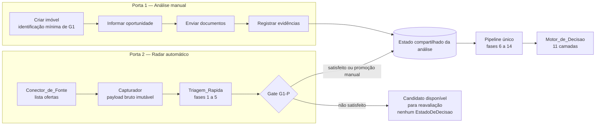
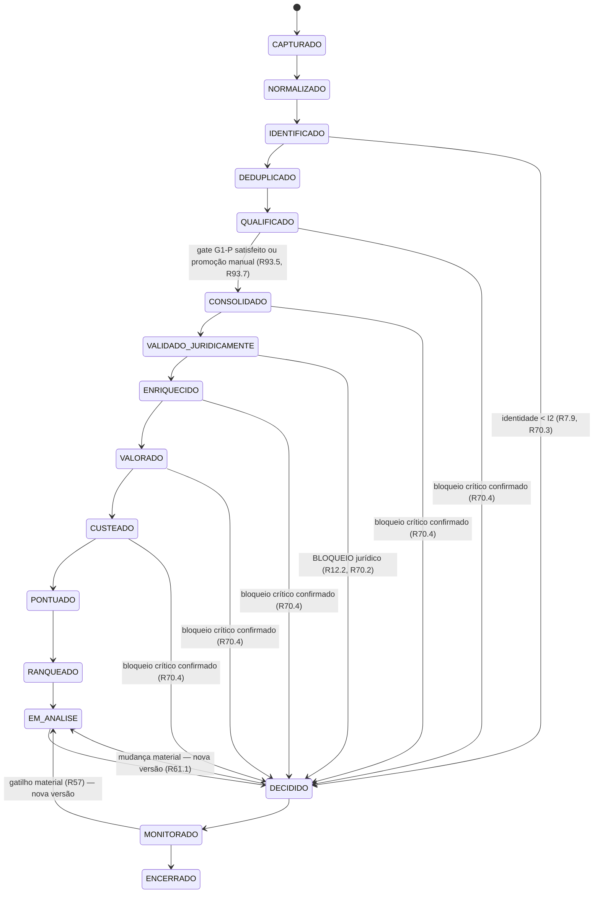
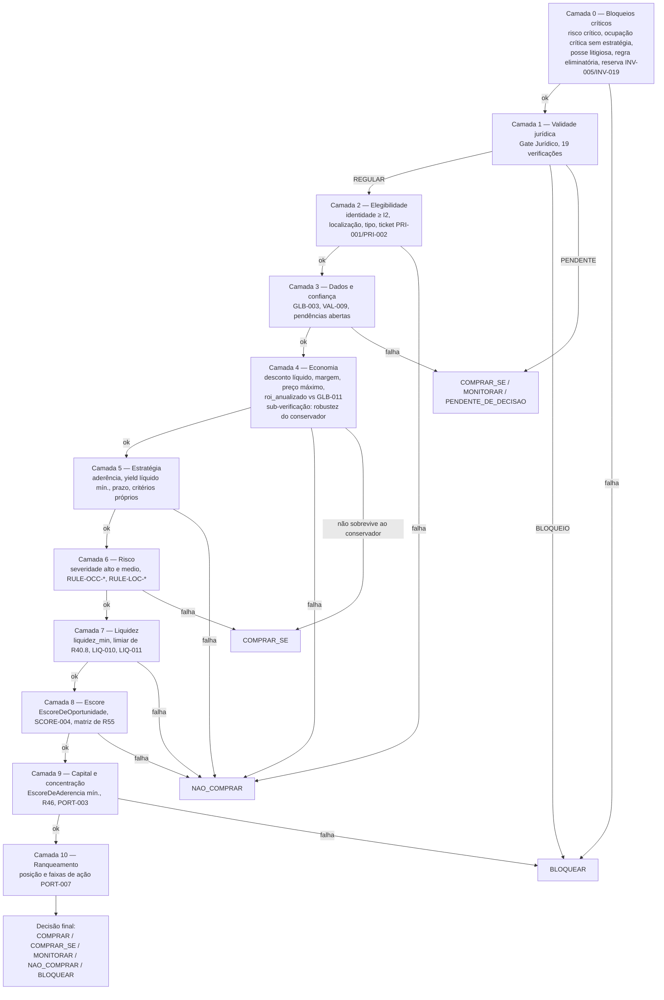

# Design Document

Radar Imobiliário — Projeto Técnico da Especificação Completa

## Overview

Este documento projeta a implementação dos **97 requisitos** de
`.kiro/specs/radar-imobiliario-especificacao-completa/requirements.md`. Ele não reenuncia
regras de negócio: para cada decisão de projeto, referencia o requisito que a origina e
explica **como** a regra passa a ser executável, determinística e auditável.

O `requirements.md` é o único artefato normativo de negócio do produto. Este design é o
único artefato normativo de **engenharia**: ele absorve o modelo físico de dados, que
antes vivia em documento separado, e **não referencia nenhum arquivo externo à spec**.
Onde cita código (`src/radar/**`, `db/schema.sql`, `scripts/**`), cita o artefato a alterar,
nunca uma fonte de verdade.

**Os dezesseis artefatos de `architecture/backend/` são derivados e não normativos** (`D86`).
Eles descrevem como esta spec é implementada; não criam requisito, valor, regra, parâmetro,
item de checklist nem caso de prova. Divergência entre qualquer um deles e a spec resolve-se
sempre a favor da spec. Este design permanece autocontido: nenhuma decisão aqui depende de
leitura de artefato derivado, e nenhum conteúdo normativo vive apenas neles.

O produto já existe em fatia vertical: captura da CAIXA, normalização, identidade, gate
jurídico parcial, motor de cálculo, motor de decisão, persistência e interface de programação.
O diagnóstico técnico do documento de requisitos (`D.1` a `D.11`) verificou seis defeitos
numéricos, oito defeitos do motor de decisão, vinte e duas lacunas de capacidade, quinze
divergências entre documentação e esquema, onze achados de integridade de banco e oito achados
de configuração. Este design tem, portanto, quatro objetivos simultâneos:

1. **Corrigir** os defeitos verificados — em especial `D.1.1` (preço máximo que não satisfaz
   a própria definição), `D.1.2` (TCO incompleto e, em versão anterior deste design, com
   dupla contagem dos custos de saída), `D.1.3` (interpretador que multiplica decimais por
   100), `D.1.5` (faixas com lacuna para valores não inteiros), `D.2.5` e `D.2.7` (ausência de
   informação jurídica convertida em liberação).
2. **Completar** as capacidades ausentes: valuation, liquidez, risco, cenários, escore,
   aderência do investidor, ranqueamento, análise profunda, portfólio, monitoramento, alertas,
   governança de parâmetros, exceções, disciplina de lance, backtest e esteira de conhecimento.
3. **Integrar o Domínio O** (`R84` a `R97`): as duas portas de entrada convergentes, o contrato
   de conector de fonte, o documento como entidade de primeira classe com versionamento, a
   reanálise com comparação de versões, a evidência de origem manual, o processo judicial e o
   débito como entidades, o checklist parametrizável e versionado, a triagem rápida com o gate
   de promoção `G1-P`, a interface do investidor em React e a visão financeira oficial.
4. **Tornar os princípios invioláveis executáveis** — `SAFE-001` a `SAFE-017` deixam de ser
   texto e passam a ser tipos fechados, invariantes verificadas por propriedade e restrições
   declarativas no banco.

### Convenção de idioma e nomenclatura aplicada ao projeto técnico (`D72`)

O produto é **integralmente em português, inclusive o que já existe**. Este design é escrito
com identificadores de implementação em português, e a renomeação **é trabalho de
implementação, não apenas convenção documental**: ela se aplica ao código existente em
`src/radar/**`, ao esquema em `db/schema.sql` e aos utilitários em `scripts/**`. Módulos,
pacotes, tipos, classes, funções, métodos, parâmetros, variáveis, tabelas, colunas, índices,
enums e valores de enum passam a português. A etapa 1 da *Ordem de implementação recomendada*
absorve esse trabalho, e o meta-teste `MT-11` impede a reintrodução de identificador em inglês.

**Exceções permitidas, e apenas estas:**

- nomes de tecnologia e de biblioteca externa: `FastAPI`, `LangGraph`, `LangChain`, `SQLAlchemy`,
  `pgvector`, `PostgreSQL`, `hypothesis`, `pytest`, `ruff`, `mypy`, `pydantic`, `React`,
  `Decimal`, `IntEnum`, `StrEnum`, `Protocol`, `UUID`;
- identificadores exigidos por API, contrato ou formato de terceiro;
- palavras reservadas da linguagem.

**Identificadores estáveis que permanecem inalterados**, porque são citados em todo o
requirements e renomeá-los invalidaria a rastreabilidade sem ganho: códigos de parâmetro
(`GLB-*`, `INV-*`, `LOC-*`, `TIP-*`, `PRI-*`, `CUS-*`, `VAL-*`, `CMP-*`, `REN-*`, `LIQ-*`,
`RISK-*`, `CONF-*`, `FRESH`, `SCORE-*`, `STR`, `PORT-*`, `EXC-*`, `ALT-*`, `MON-*`), códigos de
regra (`RULE-*`), itens de checklist (`MC-*`, `B-*`, `C-*`), códigos de verificação (`E01` a
`E09`, `PL-*`, `RL-*`, `HL-*`, `HS-*`), gates (`G0` a `G7`, `G1-P`), níveis de identidade (`I0`
a `I4`), princípios (`SAFE-*`, `P-A` a `P-E`), decisões (`D*`), requisitos (`R*`), propriedades
(`P*`) e testes de regressão (`REG-*`).

Os **nomes de sistema do glossário** (`Motor_de_Calculo`, `Gate_Juridico`, `Capturador`,
`Conector_de_Fonte`, `Gestor_de_Documentos`, `Gestor_de_Checklist`, `Triagem_Rapida`,
`Comparador_de_Versoes`, ...) já estão em português e permanecem como estão.

#### Tabela de correspondência de rótulos normativos `[CANÔNICO]`

Os vocabulários de estado escritos em inglês no requirements são **rótulos normativos de
domínio**: o significado é o declarado lá, e a implementação os nomeia em português. O
requirements determina que a correspondência de um para um viva **aqui**. Sem esta tabela a
rastreabilidade entre critério de aceitação e código se rompe.

| Rótulo no requirements | Identificador de implementação | Observação |
|------------------------|--------------------------------|------------|
| `PipelinePhase` | `FaseDoPipeline` | 16 valores |
| `CAPTURED` | `CAPTURADO` | fase 1 |
| `NORMALIZED` | `NORMALIZADO` | fase 2 |
| `IDENTIFIED` | `IDENTIFICADO` | fase 3 |
| `DEDUPLICATED` | `DEDUPLICADO` | fase 4 |
| `QUALIFIED` | `QUALIFICADO` | fase 5, gate `G1` |
| `CONSOLIDATED` | `CONSOLIDADO` | fase 6 |
| `LEGAL_VALIDATED` | `VALIDADO_JURIDICAMENTE` | fase 7 |
| `ENRICHED` | `ENRIQUECIDO` | fase 8 |
| `VALUATED` | `VALORADO` | fase 9 |
| `COSTED` | `CUSTEADO` | fase 10 |
| `SCORED` | `PONTUADO` | fase 11 |
| `RANKED` | `RANQUEADO` | fase 12 |
| `IN_ANALYSIS` | `EM_ANALISE` | fase 13 |
| `DECIDED` | `DECIDIDO` | fase 14 |
| `MONITORED` | `MONITORADO` | fase 15 |
| `CLOSED` | `ENCERRADO` | fase 16 |
| `DecisionState` | `EstadoDeDecisao` | 6 valores |
| `BUY` | `COMPRAR` | veredito A |
| `BUY_IF` | `COMPRAR_SE` | vereditos B e D |
| `MONITOR` | `MONITORAR` | veredito C |
| `DO_NOT_BUY` | `NAO_COMPRAR` | veredito E econômico |
| `BLOCK` | `BLOQUEAR` | veredito E jurídico |
| `PENDING` | `PENDENTE_DE_DECISAO` | estado antes de `DECIDIDO` |
| `CaptureState` | `EstadoDaCaptura` | 10 valores |
| `Captured` · `Normalized` · `Identified` · `Matched` · `Qualified` | `CAPTURADA` · `NORMALIZADA` · `IDENTIFICADA` · `VINCULADA` · `QUALIFICADA` | — |
| `Enriched` · `Expired` · `Superseded` · `Rejected` · `Error` | `ENRIQUECIDA` · `EXPIRADA` · `SUBSTITUIDA` · `REJEITADA` · `ERRO` | — |
| `PropertyState` | `EstadoDoImovel` | 8 valores |
| `Candidate` · `Active` · `Monitoring` · `Opportunity` | `CANDIDATO` · `ATIVO` · `EM_MONITORAMENTO` · `OPORTUNIDADE` | — |
| `Acquired` · `Sold` · `Inactive` · `Closed` | `ADQUIRIDO` · `VENDIDO` · `INATIVO` · `ENCERRADO` | — |
| estado de informação | `EstadoDaInformacao` | 6 valores |
| `OBSERVED` | `OBSERVADO` | `R56.5` |
| `CONFIRMED` | `CONFIRMADO` | `R56.5` |
| `CALCULATED` | `CALCULADO` | `R56.5` |
| `ESTIMATED` | `ESTIMADO` | `R56.5` |
| `INFERRED` | `INFERIDO` | `R56.5` |
| `UNKNOWN` | `DESCONHECIDO` | `R26.7`, SAFE-003 |
| `legal_status` | `situacao_juridica` | campo |
| `LegalStatus` | `SituacaoJuridica` | 3 valores |
| `OK` (jurídico) | `REGULAR` | `R12.6` |
| `PENDENTE` (jurídico) | `PENDENTE` | grafia coincide |
| `BLOCK` (jurídico) | `BLOQUEIO` | `R12.6` |
| `P0Result` | `ResultadoP0` | 5 valores |
| `REGULAR_COMPROVADO` · `RISCO_JURIDICO` · `INCONCLUSIVO` | `REGULAR_COMPROVADO` · `RISCO_JURIDICO` · `INCONCLUSIVO` | grafia coincide |
| `CheckOutcome` | `ResultadoDeVerificacao` | 5 valores |
| `IRREGULAR` | `IRREGULAR` | grafia coincide |
| `NOT_APPLICABLE` | `NAO_APLICAVEL` | distinto de `DESCONHECIDO` |
| `IN_TREATMENT` | `EM_TRATAMENTO` | `R13.13` |
| `Informed[T]` | `Informado[T]` | valor com estado de informação |
| `Unknown` (sentinela) | `Desconhecido` | sentinela explícito |
| `Opportunity Score` | `EscoreDeOportunidade` · `escore_de_oportunidade` | `R49` |
| `Investor Fit Score` | `EscoreDeAderencia` · `escore_de_aderencia` | `R51` |
| `score de prioridade` | `escore_de_prioridade` | `SCORE-008` |
| `Hard Rule` · `Soft Rule` · `Conditional Rule` · `Informational Rule` | `REGRA_DURA` · `REGRA_BRANDA` · `REGRA_CONDICIONAL` · `REGRA_INFORMATIVA` | `R54.1` |
| `Exception Rule (Override)` | `REGRA_DE_EXCECAO` | `R54.1` |
| `hard stop` | `parada_absoluta` | códigos `HS-*` preservados |
| `USUARIO` (origem de evidência) | `USUARIO` | grafia coincide (`R89.2`) |
| `MATRICULA` · `EDITAL` · `IPTU` · `CONDOMINIO` | idem | tipos de documento já em português |
| `PROCESSO_JUDICIAL` · `LAUDO` · `FOTOS` · `ORCAMENTO_REFORMA` · `OUTRO` | idem | `R86.4` |
| `candidato` · `nao_candidato` | `CANDIDATO` · `NAO_CANDIDATO` | `R93.3` |
| `em_aberto` · `parcelado` · `quitado` · `em_discussao` · `desconhecido` | idem em maiúsculas | `R91.4` |
| `PODE_DAR_LANCE` · `NAO_DAR_LANCE` · `LIBERADO_PARA_LANCE` | idem | já em português |
| `DESCOBRIR` → `SELECIONAR` → ... → `DECIDIR` | idem | ciclo de produto de `R95.3` |

Os títulos das propriedades de correção deste design e os nomes dos artefatos derivados
acompanham a convenção.

### Correções que este design implementa

A tabela é o contrato entre o diagnóstico do requirements e este projeto. Cada linha tem
componente responsável e propriedade que a detecta.

| Defeito | Correção de projeto | Componente | Propriedade |
|---------|---------------------|------------|-------------|
| `D.1.1` preço máximo não satisfaz a definição | Forma fechada de `R28.2` **com ITBI** no coeficiente proporcional; verificação inversa como pré-condição de aceite | Motor de Cálculo | `P7.1`, `P7.11` |
| `D.1.2` TCO incompleto | `ComposicaoDeCusto` de **13** componentes; custos de saída e imposto de renda **fora** do TCO por `R26.1.1`; custo de oportunidade fora por `R26.1.2` | Motor de Cálculo | `P6.1`, `P6.2` |
| `D.1.3` interpretação monetária corrompe decimal com ponto | Contrato novo de `interpretar_decimal` sem heurística de magnitude; ambiguidade resulta em `DESCONHECIDO` | Normalizador | `P2.10`, `P2.12` |
| `D.1.4` interpretação de percentual erra alíquota fracionária | Unidade obrigatória na entrada de `interpretar_percentual` | Normalizador | `P2.11` |
| `D.1.5` faixas com lacuna | `classificar_por_faixa` único, por limite inferior e `>=` em ordem decrescente | Motor de Escore | `P10.14`, `P10.15`, `P9.1`, `P11.15` |
| `D.1.6` desconto líquido igual à margem | Desconto líquido contra o valor **base**; margem de segurança contra o valor **conservador** | Motor de Cálculo | `P6.5` |
| `D.2.1` camada de escore nunca avaliada | Camadas 8, 9 e 10 com conteúdo | Motor de Decisão | `P11.3`, `P11.16` |
| `D.2.2` bloqueio crítico literalmente falso | Camada 0 alimentada pelo Motor de Risco; nenhuma regra no grafo | Orquestrador, Motor de Risco | `P8.6` |
| `D.2.3` dois limiares de liquidez | Camada 7 própria, limiar resolvido pelo Gestor de Parâmetros | Motor de Decisão | `P9.4` |
| `D.2.4` rótulo de camada divergente | Camada determinante é a de menor índice entre as eliminatórias, e o rótulo corresponde à verificação executada | Motor de Decisão | `P11.3`, `P11.16` |
| `D.2.5` defaults inseguros | `EntradaDeDecisao` **sem nenhum default**; a fronteira da interface de programação assume `PENDENTE` e elegibilidade falsa | Motor de Decisão, interface de programação | `P11.5` |
| `D.2.6` heurística de confiança no grafo | Confiança consolidada derivada de `CONF-001` a `CONF-005`, versionada | Motor de Escore | `P10.15` |
| `D.2.7` situação jurídica como texto livre | Enum `SituacaoJuridica` validado na fronteira, com falha explícita | Fronteira de tipos | `P10.16` |
| `D.2.8` semântica de evidência invertida | Confiança expressa qualidade da prova; `NAO_APLICAVEL` distinto de `DESCONHECIDO` | Gate Jurídico | `P4.5` |
| `D.5` gate incompleto | De 7 para **19** verificações declarativas; `RULE-OCC-*` e `RULE-LOC-*` movidas para a camada 6 | Gate Jurídico, Motor de Risco | `P4.6`, `P4.7` |
| `D.6.3` fases não atingidas | Etapas de deduplicação, qualificação e consolidação no grafo | Orquestrador | `P12.1` |
| `D.6.4` precedência com contagens divergentes | `CamadaDeDecisao` de 9 para **11** valores | Motor de Decisão | `P11.16` |
| `D.6.5` estratégia confundida com perfil de ativo | `Estrategia` com 6 valores; `PerfilDeAtivo` com 9 | Modelo de domínio | `P10.18` |
| `D.6.11` normalizador fixo em CAIXA | Despacho por tipo de fonte, com falha explícita | Normalizador | — (`REG-030`) |
| `D.9.1` a `D.9.11` integridade de banco | Seção **Modelo físico** deste design | Modelo de dados | `P13.2`, `P13.3`, `P17.2`, `P17.7` |
| `D.10.1` a `D.10.8` configuração e exposição | Seção **Error Handling** | Configuração, interface de programação | — (`REG-029`) |

### Princípios de projeto derivados dos princípios invioláveis

| Princípio de negócio | Consequência de projeto |
|----------------------|-------------------------|
| `SAFE-001`, `SAFE-002` — nada supera um `BLOQUEAR` | A decisão é uma função pura com curto-circuito por camada; nenhuma camada posterior recebe poder de escrita sobre o resultado de uma anterior. |
| `SAFE-003`, `SAFE-017` — ausência de evidência não é regularidade, e é distinta de evidência de ausência | Nenhum campo de domínio tem default permissivo. `ResultadoDeVerificacao` separa `DESCONHECIDO` de `IRREGULAR` e de `NAO_APLICAVEL`; o par evicção não verificada (`PENDENTE`) × evicção comprovadamente ausente (`BLOQUEIO`) é representável. |
| `SAFE-004` — `DESCONHECIDO` permanece `DESCONHECIDO` | Não existe caminho de promoção automática: `transitar_fato` exige identificador de evidência de suporte. |
| `SAFE-005` — custo desconhecido nunca é zero | Componentes de custo são `Informado[Decimal]`; `DESCONHECIDO` propaga contingência e marca o preço máximo como provisório. `CUS-005`, `CUS-006`, `CUS-014`, `CUS-015` e `REN-005` não têm default numérico. |
| `SAFE-006`, `SAFE-007` — o texto do ato registral prevalece | A consolidação registra ato, data e **texto integral**; a extração do texto é evidência com localização documental, distinta da detecção do evento, e vive no `Gestor_de_Documentos` sem substituir o arquivo original. |
| `SAFE-009` — nenhum componente automatizado cria evidência | Agentes produzem `PropostaDeEvidencia`; a promoção exige ato humano registrado ou regra determinística declarada. |
| `SAFE-010`, `SAFE-011` — contradições preservadas, histórico é hipótese | Evidência, documento e análise são append-only; `Hipotese` e `Evidencia` são tipos distintos sem conversão implícita. |
| `SAFE-012` — avaliação da fonte é informativa | Campo próprio, sem nenhum caminho de atribuição a `valor_de_mercado`. |
| `SAFE-013` — ocupação é risco, não nulidade | Ocupação sai do gate jurídico e vai para a camada 6, exceto os dois casos de `BLOQUEAR` da camada 0 (`R18.2.1`, `R18.2.2`). |
| `SAFE-014` — processo judicial não é `BLOQUEAR` automático | O impacto é classificado em quatro níveis e só `material_impeditivo` sem mitigação produz `BLOQUEAR`. |
| `SAFE-015` — antiviés temporal | O acesso a dados no backtest passa por um filtro de corte pela data da decisão. |
| `SAFE-016` — yield bruto não é yield líquido | O piso decisório `REN-009` incide sobre o líquido; `REN-002` é informativo. |

### Decisões estruturais e seus motivos

**Motores determinísticos como funções puras.** Todo cálculo e toda decisão são funções de
dados de entrada para dados de saída, sem entrada e saída de dados e sem dependência de modelo
de linguagem (`R27.17`, `R71.1`, `R71.2`). O motivo é direto: determinismo e reprodutibilidade
são requisitos de auditoria (`R61.4`), e função pura é a única forma de garanti-los por
construção — além de ser o que torna as propriedades de correção executáveis a 100+ iterações
sem custo.

**Duas portas de entrada, um único motor.** Análise manual e Radar automático são portas de
entrada convergentes (`R84.1`): ambas produzem o mesmo estado e atravessam o mesmo pipeline, o
mesmo catálogo de regras, os mesmos parâmetros resolvidos e o mesmo `Motor_de_Decisao`
(`R84.8`, `R93.8`). A porta é **proveniência**, nunca parâmetro de decisão (`R84.9`). O motivo
é o de `D80`: uma camada de descoberta com filtros e checklist próprios tende a virar um segundo
motor, e dois motores produzem duas verdades. `P17.5` é o teste baseado em modelo que impede a
divergência.

**Triagem rápida é prefixo, não pipeline paralelo.** A `Triagem_Rapida` executa as fases 1 a 5
e o gate de promoção `G1-P`; a análise profunda é a continuação das fases 6 a 14 sobre o mesmo
estado (`D84`, `R93.1`, `R93.5`, `R93.8`). A triagem decide **quem segue**, nunca **o que vale**:
não calcula valuation, custo econômico total, escore nem decisão, e não emite nenhum valor de
`EstadoDeDecisao` (`R93.2`, `R93.4`). Reprovar na promoção não é decisão de investimento — a
oportunidade permanece disponível para reavaliação (`R93.6`).

**Aquisição é infraestrutura; o domínio vê um contrato.** O `Conector_de_Fonte` expõe listar
ofertas, obter detalhe, obter documentos e declarar cobertura (`R85.1`). A estratégia de
aquisição — página pública, endpoint, arquivo, interface de terceiro ou varredura — é detalhe de
infraestrutura e **não é exposta** a entidades, regras, parâmetros ou motores (`R85.3`). Uma
nova fonte exige implementar o contrato e cadastrar a fonte, e nada mais (`R85.5`). `P17.20`
verifica que payload igual obtido por estratégias diferentes produz resultado idêntico.

**O arquivo original é permanente; a extração é derivada.** O `Gestor_de_Documentos` preserva o
arquivo original de forma imutável e nunca o substitui em razão da extração (`R86.2`, `R86.6`).
Texto, páginas, segmentos e representação vetorial são conteúdo derivado vinculado ao documento.
O download entrega o arquivo íntegro, com hash igual ao registrado, e divergência de hash
registra falha de integridade, abre pendência crítica e **impede** o uso do conteúdo extraído
como evidência (`R86.7`, `R86.8`). `P17.2` e `P17.3` cobrem imutabilidade e round-trip de
download.

**Duas dimensões de versão, independentes.** Versão de documento (`R87.1`) e versão de análise
(`R61.1`) são numerações separadas, e nenhuma deriva da outra (`R87.3`). Sem essa separação, uma
segunda via de matrícula criaria versão de análise sem mudança de tese, ou uma reanálise
renumeraria documentos. `P17.8` fixa a independência.

**Débito é entidade, não estimativa.** IPTU, condomínio, concessionárias e demais encargos são
registrados um a um, com valor, período, fonte, data da consulta, documento, situação e
responsabilidade atribuída pelo edital (`R91.1`, `R91.2`). Os componentes `CUS-005` e `CUS-006`
do TCO são **compostos** a partir desses registros (`R91.3`), e tipo exigido pelo checklist e
não investigado permanece `DESCONHECIDO`, nunca zero (`R91.5`). É o que torna a decomposição de
`R96.1` navegável até a evidência.

**Checklist é configuração versionada com piso inviolável.** Os 234 itens dos Anexos A, B e C.1
são a **versão 1 do checklist padrão** (`D83`, `R92.2`). Toda configuração deriva dela e está
sujeita a dois limites: não remove, desativa nem torna não aplicável item crítico da versão 1
(`R92.5`); e não torna o resultado na ausência de evidência mais favorável do que o devido na
versão 1 (`R92.6`). A cobertura permanece verificável para **qualquer** versão configurada
(`R92.7`, `P16.1`).

**Banco como fonte única de parâmetros.** As constantes Python e o seed de estratégias repetiam
os mesmos valores sem garantia de convergência (`D.4.12`, `D.7.1`). Passa a existir um
`Gestor_de_Parametros` que resolve pela hierarquia de escopo com vigência temporal (`R62.10`,
`R62.11`); as constantes permanecem apenas como valores de arranque que **geram** o seed, com
teste comparando as três representações.

**O escopo mais específico prevalece.** A hierarquia `Global → Investidor → Estratégia →
Localização → Tipo → Oportunidade → Exceção` resolve conflitos pelo escopo mais específico,
**exceto** quando o menos específico impõe bloqueio crítico ou restrição legal ou documental
(`R54.10`, `R54.10.1`). Versão anterior deste design dizia o contrário, seguindo uma formulação
de `R54.10` que foi corrigida no requirements.

**Tipos fechados na fronteira.** `situacao_juridica` era texto livre em quatro módulos e
qualquer valor inesperado seguia como se fosse `REGULAR` (`D.2.7`). Passa a ser enum
`SituacaoJuridica` validado na fronteira, com falha explícita. O mesmo tratamento se aplica a
resultado de verificação, estado de captura, estado de imóvel, nível de identidade, classe de
localização, categoria e severidade de risco, prioridade de pendência, qualidade de evidência,
tipo de regra, tipo e origem de documento, tipo e situação de débito, porta de entrada e
resultado de triagem.

**Valor com estado de informação.** Nenhum número circula sozinho no domínio econômico e
documental: circula como `Informado[T]` (valor, estado, fonte, data, confiança, qualidade da
evidência). É o que permite cumprir `R3.2`, `R26.7`, `R26.10`, `R10.2`, `R65.1.3`, `R66.11` e
`R94.5` sem depender de disciplina do chamador.

**Imutabilidade garantida, não documentada.** O snapshot da análise é um tipo congelado na
fronteira de persistência, e o banco recebe gatilhos que rejeitam `UPDATE` e `DELETE` em
`analises`, `evidencias`, `decisoes`, `eventos_de_analise`, `capturas`, `documentos`,
`versoes_de_documento`, `resultados_de_triagem` e `execucoes_de_checklist` (`D.9.8`).

**Orquestração é só orquestração.** O grafo sequencia etapas, propaga estado compartilhado e
registra fase e traço (`R70.1`, `R70.5`, `R70.6`, `R70.9`). Nenhuma regra vive nele — a
heurística de confiança não versionada (`D.2.6`) e o bloqueio crítico literalmente falso
(`D.2.2`) saem do grafo e vão para os motores.

**Enriquecimento não depende do escore.** A profundidade de investigação deriva do **potencial
preliminar** em cinco faixas qualitativas e da posição no ranqueamento (`R5.2`, `R5.7`). Derivar
do `EscoreDeOportunidade` criaria dependência circular, porque o escore depende do valuation,
que depende do enriquecimento.

**Checklists e regras são dados.** São 234 itens de checklist (136 + 27 + 71) e 55 regras
canônicas. Declará-los como dados enumeráveis em tempo de execução é o que torna as propriedades
de cobertura (`P16.1`, `P17.16`) escrevíveis.

**A planilha governa a apresentação; as fórmulas governam o valor** (`D81`, `R96.3`, `R96.4`). A
visão financeira oficial reproduz a **estrutura**, a **decomposição** e a **rastreabilidade** da
planilha de viabilidade de referência, e **não** reproduz a sua aritmética onde a aritmética foi
verificadamente corrigida. A forma fechada conservadora permanece como referência informativa
(`R96.5`, `R28.4.1`). Nenhum número dos Golden Cases muda.

### Escopo do design

Incluído: os 97 requisitos, os Anexos A a F (checklists, verificações complementares,
disciplina de lance, matriz canônica de 55 regras, 44 testes de regressão e Golden Cases), as
correções de `D.1` a `D.10` e o **modelo físico de dados completo**, que este documento
normatiza conforme a lista de integridade de `D.9`.

**Modalidade do MVP** (`D56`, `D82`): leilão **extrajudicial** de alienação fiduciária, com a
CAIXA como primeira fonte. Venda direta, leilão judicial, execução judicial, arrematação
judicial e execução automática de lance ficam fora do MVP. A arquitetura permanece extensível a
novas modalidades e novas fontes sem alteração estrutural do domínio (`R85.5`). Venda direta
subsiste apenas como **tipo de preço observado** no histórico de preços de `R10.7`.

Fora de escopo, conforme a seção *Fora de Escopo Declarado* do requirements: consulta automática
a cartório, tribunais, prefeituras e concessionárias. Os resultados dessas verificações são
**entradas** com contrato definido, produzidas por documento ou registro do analista — e é
exatamente o que `R89`, `R90` e `R91` especificam. A varredura de portais deixa de ser fora de
escopo e passa a ser uma **estratégia de aquisição** do `Conector_de_Fonte` (`R85.3`),
priorizada no passo 9 da ordem de construção.

### Defeito de contagem registrado

`R72.2` enuncia "exatamente um dos **doze** tipos" e enumera **quinze** nomes. A enumeração é
a verdade: `TipoDeSegmentoDeConhecimento` tem **15** valores neste design. O numeral "doze" de
`R72.2` é defeito de redação a corrigir no requirements, e fica registrado aqui para que a
divergência não seja reintroduzida como se fosse decisão de projeto.

---

## Architecture

### Visão de contêineres

```mermaid
graph TB
    subgraph Fontes["Fontes externas"]
        CAIXA[Portal da instituição vendedora]
        LEIL[Leiloeiro / plataforma]
        CART[Cartório / Tribunal / Prefeitura]
        PORT[Portais de mercado]
        MAN[Entrada do investidor ou analista]
    end

    subgraph Front["Interface do Investidor — React"]
        UI[Painel · Nova análise · Radar de candidatos<br/>Ficha · Documentos · Evidências<br/>Pendências · Reanálise · Comparação<br/>Checklists · Parâmetros]
    end

    subgraph App["Radar — aplicação Python 3.12"]
        API[Interface de programação FastAPI<br/>autenticada e autorizada]
        ORQ[Orquestrador<br/>LangGraph]

        subgraph Aq["Aquisição — infraestrutura, invisível ao domínio"]
            CONN[Conector_de_Fonte<br/>contrato único]
            CONNCX[Conector CAIXA]
        end

        subgraph Det["Motores determinísticos — funções puras, sem modelo de linguagem"]
            NORM[Normalizador]
            ID[Resolvedor de Identidade]
            DED[Deduplicador]
            QUA[Qualificador — gate G1]
            TRI[Triagem Rápida — gate G1-P]
            PERF[Consolidador de Perfil]
            LOC[Classificador de Localização]
            GATE[Gate Jurídico — 19 verificações]
            VAL[Motor de Valuation]
            CALC[Motor de Cálculo]
            RISK[Motor de Risco]
            LIQ[Motor de Liquidez]
            EST[Motor de Estratégia]
            PORTF[Gestor de Portfólio]
            ESC[Motor de Escore]
            RANK[Motor de Ranqueamento]
            DEC[Motor de Decisão — 11 camadas]
            EXPL[Motor de Explicabilidade]
            DEEP[Análise Profunda]
            BID[Disciplina de Lance]
            CMPV[Comparador de Versões]
        end

        subgraph Sup["Serviços de suporte"]
            PARAM[Gestor de Parâmetros]
            EVID[Camada de Evidência]
            DOCS[Gestor de Documentos<br/>original imutável · versões · extração]
            CHK[Gestor de Checklist<br/>escopo · versão · resultado por item]
            GOV[Gestor de Governança]
            MON[Monitor / Gestor de Alertas]
            DD[Gestor de Due Diligence]
            BT[Motor de Backtest]
        end

        subgraph IA["Camada de IA — interpretação, nunca decisão"]
            AG[Agentes LangChain]
            RAG[Base de Conhecimento RAG]
            MCP[Ferramentas MCP]
        end
    end

    subgraph DB["PostgreSQL 16 + pgvector — schema poc_ia"]
        TRANS[(Tabelas transacionais<br/>append-only nos snapshots)]
        ARQ[(Arquivos originais<br/>hash verificado)]
        VEC[(segmentos_de_documento<br/>embeddings)]
    end

    CAIXA --> CONNCX
    LEIL --> CONN
    PORT --> CONN
    CONNCX --> CONN
    CONN --> API
    CART --> MAN
    MAN --> UI
    UI --> API
    API --> ORQ
    ORQ --> Det
    ORQ --> Sup
    ORQ --> IA
    CONN --> DOCS
    AG -.->|só propõe PropostaDeEvidencia| EVID
    RAG --> VEC
    DOCS --> ARQ
    Det --> TRANS
    Sup --> TRANS
    PARAM --> TRANS
    API --> RANK
```



Quatro fronteiras são normativas neste diagrama.

**Os agentes de IA têm seta pontilhada** para a camada de evidência porque **propõem** extrações
que só se tornam evidência por ato humano registrado ou por regra determinística explicitamente
declarada — nenhum agente cria evidência nem promove `DESCONHECIDO` para `CONFIRMADO` (`R71.5`,
`R71.6`, `R83.2`, `R83.3`, `R20.4`).

**Os motores determinísticos não têm nenhuma seta para a camada de IA**, o que materializa
`R71.1` e `R71.2` em topologia e é verificável por teste estático de dependências (`MT-10`).

**Os conectores não têm seta para os motores.** A aquisição entrega payload, documentos e
metadados ao `Capturador` e ao `Gestor_de_Documentos`, e nada mais. Nenhuma entidade, regra,
parâmetro ou motor conhece a estratégia de aquisição (`R85.3`).

**O `Gestor_de_Documentos` é o único caminho para o arquivo original.** A extração derivada
alimenta o índice vetorial; o arquivo original vive em armazenamento com hash verificado e é
entregue íntegro no download (`R86.2`, `R86.7`).

### Duas portas de entrada convergentes (`R84`)



A convergência é estrutural, não convencional: existe **um** tipo de estado de análise e **uma**
função `decidir`. A porta de entrada entra no estado apenas como campo de proveniência
(`porta_de_entrada`, `autor`, `data_de_criacao` — `R84.10`), e nenhuma camada de decisão lê esse
campo. É isso que torna `P17.5` verificável como teste baseado em modelo: dois caminhos de
construção do mesmo estado, uma única saída esperada.

Duas regras de deduplicação valem nas duas portas: captura que corresponde a imóvel já conhecido
vincula-se ao existente e **não** cria imóvel novo (`R84.12`, `P17.1`); evidência insuficiente
registra candidata a vínculo mais pendência, e **não** cria imóvel definitivo (`R84.13`).

### Pipeline e curto-circuitos — 16 fases, com a triagem como prefixo



A ordem de `R70.1` tem **vinte etapas**; as **dezesseis** fases de `FaseDoPipeline` são os
marcos persistidos. O traço executado é registrado em `eventos_de_analise` e é o objeto das
propriedades de orquestração: ele é sempre subsequência da ordem canônica, e o curto-circuito é
verificado pela **ausência** das fases posteriores no traço, não por inspeção de código.

**A triagem rápida é o prefixo `CAPTURADO` → `QUALIFICADO` mais o gate `G1-P`** (`D84`,
`R93.1`). O traço da triagem é sempre um prefixo do traço da análise profunda sobre o mesmo
estado inicial (`P17.15`), e o gate de promoção é condição necessária para que as fases 6 a 14
apareçam no traço (`P17.14`). Não existe segundo pipeline, segundo catálogo de regras nem
segundo motor de decisão.

Três fases não existiam em execução (`D.6.3`): `DEDUPLICADO`, `QUALIFICADO` e `CONSOLIDADO`. O
grafo passa a ter as três etapas correspondentes, e `R70.1.1` proíbe executar a validade
jurídica antes de `QUALIFICADO` e `CONSOLIDADO`.

### Gate de promoção `G1-P` (`R93.5`)

O gate de promoção é conjuntivo e declarado como dado, para que a falha nomeie o critério:

| Critério | Origem |
|----------|--------|
| gate `G1` satisfeito | `R4.2` |
| nível de identidade ≥ `I2` | `R7` |
| modalidade dentro do escopo do MVP | `D56`, `D82` |
| localização e tipo dentro do escopo configurado | `LOC-*`, `TIP-*` |
| preço dentro de `PRI-001` e `PRI-002` | `PRI-001`, `PRI-002` |
| ticket dentro de `INV-002` | `INV-002` |
| potencial preliminar ≥ `medio` | `R5.2` |
| ausência de bloqueio crítico conhecido | `R53.1.2` |

Reprovar em qualquer um deles registra o critério não satisfeito e mantém a oportunidade
disponível para reavaliação, **sem** emitir nenhum `EstadoDeDecisao` (`R93.4`, `R93.6`,
`REG-043`). Promoção manual explícita do investidor executa a análise profunda e registra
autor, data e motivo (`R93.7`).

### Camadas de decisão — 11 camadas, numeradas 0 a 10



Três pontos são normativos.

**Onze camadas, não nove.** `R53.1` fixa a ordem: 0 bloqueios críticos; 1 validade jurídica;
2 elegibilidade; 3 dados e confiança; 4 economia; 5 estratégia; 6 risco; 7 liquidez; 8 escore;
9 capital e concentração; 10 ranqueamento. O enum `CamadaDeDecisao` tem **onze** valores
(`D.6.4`). A validade jurídica é a camada **1**, subordinada aos bloqueios críticos da camada 0,
e a robustez de cenário é **sub-verificação da camada 4** (`R53.1.6`).

**A decisão final é a saída, não uma camada.** `R53.1.1` é explícito: a decisão é o resultado da
avaliação das onze camadas. A "camada de ação final" de versão anterior deste design era a
decisão se passando por camada e inflava a contagem sem acrescentar verificação.

**A camada determinante é a de menor índice entre as eliminatórias** (`R53.3`). Quando três
camadas falham, a reportada é a primeira, e o rótulo corresponde à verificação efetivamente
executada (`D.2.4`), o que é o que sustenta a auditabilidade exigida por `MC-116`.

### Mapa de sistemas para módulos

Os nomes da coluna esquerda são os do glossário do requirements e são usados nos critérios de
aceitação. Esta tabela é o contrato de rastreabilidade entre requisito e código, e a coluna do
meio já está em português: a renomeação dos caminhos e módulos existentes é trabalho de
implementação da etapa 1.

| Sistema (glossário) | Módulo | Situação |
|---------------------|--------|----------|
| Conector_de_Fonte | `radar/conectores/contrato.py`, `radar/conectores/caixa.py` | novo (`R85`) |
| Capturador | `radar/captura/servico_de_captura.py` | novo (persistência ausente, `D.9.2`) |
| Normalizador | `radar/captura/normalizadores/{base,caixa}.py`, `radar/captura/interpretacao.py` | renomear e corrigir `D.1.3`, `D.1.4`, `D.6.11` |
| Resolvedor_de_Identidade | `radar/pipeline/identidade.py` | renomear e ampliar (chave conceitual, `R8`) |
| Deduplicador | `radar/pipeline/deduplicacao.py` | novo |
| Qualificador (gate `G1`) | `radar/pipeline/qualificacao.py` | novo |
| Triagem_Rapida (gate `G1-P`) | `radar/pipeline/triagem.py` | novo (`R93`) |
| Consolidador_de_Perfil | `radar/pipeline/perfil.py` | novo |
| Classificador_de_Localizacao | `radar/pipeline/localizacao.py` | novo |
| Gate_Juridico | `radar/pipeline/gate_juridico.py`, `radar/regras/juridicas/*.py` | renomear e ampliar de 7 para 19 verificações (`D.5`) |
| Camada_de_Evidencia | `radar/evidencia/repositorio.py`, `radar/evidencia/propostas.py`, `radar/evidencia/manual.py` | novo (`R20`, `R89`) |
| Gestor_de_Documentos | `radar/documentos/gestor.py`, `radar/documentos/extracao.py`, `radar/documentos/integridade.py` | novo (`R86`, `R87`) |
| Gestor_de_Checklist | `radar/diligencia/checklist.py`, `radar/diligencia/catalogo.py` | novo (`R92`) |
| Comparador_de_Versoes | `radar/versionamento/comparador.py` | novo (`R88`) |
| Motor_de_Valuation | `radar/motores/valuation.py`, `radar/motores/comparaveis.py` | novo |
| Motor_de_Calculo | `radar/motores/calculo.py` | renomear e corrigir `D.1.1`, `D.1.2`, `D.1.6`; ampliar |
| Motor_de_Risco | `radar/motores/risco.py` | novo |
| Motor_de_Liquidez | `radar/motores/liquidez.py` | novo |
| Motor_de_Estrategia | `radar/motores/estrategia.py` | novo |
| Gestor_de_Portfolio | `radar/motores/portfolio.py` | novo |
| Motor_de_Score | `radar/motores/escore.py`, `radar/motores/faixas.py` | novo |
| Motor_de_Ranking | `radar/motores/ranqueamento.py` | novo |
| Motor_de_Decisao | `radar/motores/decisao.py` | renomear; 11 camadas; corrigir `D.2.1` a `D.2.5` |
| Motor_de_Explicabilidade | `radar/motores/explicabilidade.py` | extrair de `servico_de_analise._explicar` |
| Análise Profunda (`R76`) | `radar/motores/analise_profunda.py` | novo |
| Disciplina de lance (`R82`, Anexo C) | `radar/motores/disciplina_de_lance.py` | novo |
| Débitos (`R91`) | `radar/debitos/registro.py` | novo |
| Processos judiciais (`R90`) | `radar/processos/registro.py` | novo |
| Gestor_de_Due_Diligence | `radar/diligencia/gestor.py` | novo |
| Monitor, Gestor_de_Alertas | `radar/monitoramento/{monitor,alertas}.py` | novo |
| Gestor_de_Governanca | `radar/governanca/{auditoria,versoes,excecoes,qualidade}.py` | novo |
| Gestor_de_Parametros | `radar/governanca/parametros.py` | novo |
| Base_de_Conhecimento | `radar/conhecimento/{ingestao,recuperacao}.py` | novo |
| Motor_de_Backtest | `radar/backtest/motor.py` | novo |
| Orquestrador | `radar/orquestracao/grafo.py` | renomear e ampliar; remover regra do grafo |
| Interface_do_Investidor | `radar/api/**`, `radar/apresentacao/**`, `frontend/src/**` (React) | ampliar (`R94`, `R97`) |

### Artefatos derivados e a hierarquia normativa única

Este documento tem **um único cabeçalho de nível 1** e nenhuma cláusula de precedência interna
entre seções (`D87`). Conflito aparente entre seções é defeito de redação a corrigir, não regra
de precedência a aplicar.

Os dezesseis artefatos de `architecture/backend/` — `README`, `architecture`, `components`,
`data-flow`, `api`, `persistence`, `ai`, `rag`, `langgraph`, `agents`, `mcp`,
`document-processing`, `source-connectors`, `radar`, `security` e `observability` — são
**derivados e não normativos** (`D86`). Podem ser reescritos, reorganizados ou descartados sem
perda normativa. Se algum deles enunciar regra que não esteja no requirements ou neste design, a
regra não existe. Seus títulos e conteúdos seguem a convenção de idioma de `D72`.

---

## Components and Interfaces

São **27 componentes**. Os vinte primeiros são os do projeto anterior, renomeados em português;
os sete últimos são exigidos pelo Domínio O (`R84` a `R97`).

Convenção das assinaturas: `Informado[T]` é o valor com estado de informação (definido em
*Data Models*); `Desconhecido` é o sentinela explícito; nenhum parâmetro de domínio tem default
permissivo. Todas as funções desta seção são puras, salvo as marcadas com `# E/S` (entrada e
saída de dados).

### 1. Capturador (`R1`, `R2`, `R85.6`)

```python
def impressao_digital(payload: Mapping[str, Any]) -> str:
    """SHA-256 sobre serialização canônica: chaves ordenadas, separadores fixos,
    unicode normalizado em NFC. Invariante à ordem das chaves (R2.2)."""

class ServicoDeCaptura:                                             # E/S
    def registrar(self, fonte_id: UUID, payload: Mapping[str, Any],
                  capturado_em: datetime, referencia_externa: str | None,
                  conector_id: str, conector_versao: str) -> RegistroDeCaptura:
        """Idempotente por (fonte_id, impressao_digital) (R2.3). Nunca sobrescreve (R2.4).
        Preserva preço e status exatamente como informados, além das versões
        normalizadas (R2.7), e as referências a imagens e documentos com data de
        observação (R2.6). Registra o identificador e a versão do conector que produziu
        a captura (R85.10) e preserva o payload bruto para toda captura obtida por
        conector (R85.6)."""

    def substituir(self, captura_id: UUID, motivo: str, ator: str) -> RegistroDeCaptura:
        """Correção posterior cria nova captura e move a anterior para SUBSTITUIDA
        (R2.5). A anterior permanece consultável."""

    def rejeitar(self, fonte_id: UUID, payload: Mapping[str, Any],
                 causa: str) -> RegistroDeCaptura:
        """Payload que não satisfaz o gate G0 (R4.1) é registrado com estado REJEITADA e
        a causa, e **nenhuma oportunidade é criada** (R85.8)."""

class RegistroDeFontes:                                             # E/S
    def cadastrar(self, fonte: DefinicaoDeFonte) -> UUID:
        """Fonte como entidade própria com tipo, nome, URL, abrangência, periodicidade,
        campos disponíveis, confiabilidade 0-100, situação e data da última captura
        (R1.1). Oito tipos aceitos (R1.3). Entrada manual do analista marca a
        informação como interpretação e registra o autor (R1.4)."""

    def confiabilidade(self, fonte_id: UUID,
                       categoria_de_dado: str) -> ClasseDeConfiabilidadeDeFonte:
        """Confiabilidade por categoria de dado nas classes A, B, C, D, E, U (R1.5)."""

    def desativar(self, fonte_id: UUID) -> None:
        """Preserva as capturas já registradas e interrompe novas capturas (R1.6)."""
```

A idempotência existe hoje no esquema (`UNIQUE (fonte_id, hash)`) e não existe em execução:
nenhum código insere em `capturas` e a impressão digital é calculada e descartada (`D.9.2`).
`registrar` usa `INSERT ... ON CONFLICT (fonte_id, hash) DO NOTHING RETURNING`, seguido de
leitura, de modo que a idempotência é do banco e não da aplicação.

### 2. Normalizador (`R3`, `R74.9`, `R74.10`)

O interpretador numérico é reescrito. O defeito `D.1.3` não é de expressão regular: é de
contrato. A função anterior decidia se o ponto era separador de milhar por heurística e sempre
removia pontos, transformando `"47.76"` em `4776.0`. O contrato novo:

```python
class FormatoNumerico(StrEnum):
    PT_BR = "pt_br"        # 1.234,56
    SIMPLES = "simples"    # 1234.56
    AUTO = "auto"          # decide por evidência estrutural, nunca por magnitude

def interpretar_decimal(bruto: str,
                        formato: FormatoNumerico = FormatoNumerico.AUTO,
                        ) -> Informado[Decimal]:
    """Regras de AUTO, aplicadas em ordem:
    1. Há vírgula → vírgula é decimal, pontos são milhar.
    2. Há um único ponto seguido de 1 ou 2 dígitos até o fim → ponto é decimal (R3.4.1).
    3. Há um único ponto seguido de exatamente 3 dígitos e o grupo à esquerda tem
       1 a 3 dígitos → ambíguo → DESCONHECIDO (R3.4.4). Nunca escolher por magnitude.
    4. Há múltiplos pontos → pontos são milhar.
    Retorna Informado[Decimal] com estado OBSERVADO, ou DESCONHECIDO sem valor.
    Nunca zero."""

class UnidadeDePercentual(StrEnum):
    FRACAO = "fracao"       # 0.025
    PORCENTO = "porcento"   # 2.5

def interpretar_percentual(bruto: str | Decimal,
                           unidade: UnidadeDePercentual) -> Informado[Decimal]:
    """A unidade é obrigatória no contrato (R3.4.2). Sem heurística de magnitude:
    interpretar_percentual(1, PORCENTO) == 0.01 e
    interpretar_percentual("2,5%", PORCENTO) == 0.025 (R3.4.3). O sufixo '%' no texto,
    quando presente, deve concordar com `unidade`; discordância é erro de entrada, não
    normalização silenciosa."""

def interpretar_data_hora_br(bruto: str) -> Informado[datetime]:
    """Formatos `15/09/2026` e `15/09/2026 10:00` (R3.4)."""
```

`Decimal` substitui `float` em todo o caminho monetário. O motivo é o arredondamento: com
`float`, `interpretar(formatar(v)) == v` falha para valores legítimos em BRL e a propriedade de
round-trip ficaria com tolerância arbitrária.

```python
class Normalizador(Protocol):
    tipo_de_fonte: str
    def normalizar(self, captura: RegistroDeCaptura) -> OfertaNormalizada: ...

NORMALIZADORES: dict[str, Normalizador]

def normalizar(captura: RegistroDeCaptura) -> OfertaNormalizada:
    """Despacha por captura.tipo_de_fonte. Fonte sem normalizador registrado é erro
    explícito (R1.1, REG-030); antes o nó de normalização chamava o normalizador da
    CAIXA incondicionalmente (D.6.11). Extrai identificação, localização,
    características físicas, dados do certame, condições comerciais e ocupação (R3.1);
    preserva o valor original de cada campo (R3.3); registra o tipo de área (R3.5);
    mapeia tipo e status para a taxonomia do Radar preservando o texto original
    (R3.6, R3.7)."""
```

A distinção ocupado/desocupado deixa de usar contenção de subcadeia: passa por tokenização e por
um léxico ordenado em que os termos de vacância têm precedência sobre os de ocupação, porque
`"desocupado"` contém `"ocupado"` (`R3.8`).

Dois campos novos exigidos pelo dicionário: `banheiros` na caracterização física (`R74.9`) e
`complemento` no endereço, distinto de logradouro, número e unidade (`R74.10`).

### 3. Gate de dados e Qualificador (`R4`, `R5`)

```python
class GateDeDados(IntEnum):
    G0 = 0; G1 = 1; G2 = 2; G3 = 3; G4 = 4; G5 = 5; G6 = 6; G7 = 7

@dataclass(frozen=True)
class AvaliacaoDeGates:
    primeiro_nao_satisfeito: GateDeDados | None
    ausentes: tuple[CampoAusente, ...]      # campo, impacto, dimensão afetada

def avaliar_gates_de_dados(estado: EstadoDaAnalise) -> AvaliacaoDeGates:
    """Avalia G0 a G7 em ordem (R4.1 a R4.8). Retorna o primeiro gate não satisfeito e
    exatamente qual informação falta (R4.9). Classifica o impacto de cada ausência em
    baixo, medio, alto ou critico e reduz a confiança da dimensão correspondente
    (R4.10)."""

class PotencialPreliminar(StrEnum):
    DESCARTAVEL = "descartavel"; BAIXO = "baixo"; MEDIO = "medio"
    ALTO = "alto"; EXCEPCIONAL = "excepcional"

def potencial_preliminar(oferta: OfertaNormalizada,
                         parametros: ParametrosDeEscopo) -> PotencialPreliminar:
    """Exatamente uma faixa qualitativa, derivada do desconto sobre o valor de
    referência da fonte, do enquadramento no escopo de localização e tipo, e do
    enquadramento no ticket — **sem depender de escore** (R5.2, R5.7). É também a chave
    de ordenação da lista de candidatos do Radar (R93.11)."""

def profundidade_de_enriquecimento(potencial: PotencialPreliminar,
                                   posicao_no_ranking: int | None) -> range:
    """Níveis 0 a 8 de R5.1. descartavel|baixo → 0..2 (R5.3); medio → 0..4 (R5.4);
    alto|excepcional → 0..6 (R5.5); Top 3 do ranqueamento → inclui o nível 7 (R5.6)."""
```

O gate `G1` materializa-se na fase `QUALIFICADO`, que não existia em execução. A dependência do
enriquecimento é o potencial preliminar, não o `EscoreDeOportunidade`: derivar do escore criava
ciclo, porque o escore depende do valuation, que depende do enriquecimento.

### 4. Resolvedor de Identidade e Deduplicador (`R7`, `R8`, `R9`, `R84.11` a `R84.13`)

```python
class NivelDeIdentidade(IntEnum):
    I0 = 0; I1 = 1; I2 = 2; I3 = 3; I4 = 4

class ForcaDeSinal(StrEnum):
    DECISIVA = "decisiva"; MUITO_FORTE = "muito_forte"; FORTE = "forte"
    MEDIA = "media"; FRACA = "fraca"; BAIXA = "baixa"

@dataclass(frozen=True)
class SinalDeIdentidade:
    especie: Literal["matricula_com_contexto", "matricula", "id_oficial_da_fonte",
                     "endereco_completo_com_unidade", "condominio_bloco_unidade_area",
                     "endereco_com_caracteristicas", "imagem_semelhante",
                     "similaridade_de_titulo"]
    valor: str
    forca: ForcaDeSinal
    confianca: int          # 0-100

FORCA_DO_SINAL: Mapping[str, ForcaDeSinal]        # ordem decrescente de R7.6
PROIBIDOS_PARA_IDENTIDADE = frozenset({"preco", "avaliacao_da_fonte", "desconto"})  # R7.7

def resolver_identidade(oferta: OfertaNormalizada) -> ResultadoDeIdentidade:
    """Total: retorna exatamente um NivelDeIdentidade (R7.1). Monotônica na força dos
    sinais (R7.2 a R7.6). Documentação registral com contexto de comarca ou cartório
    → I4 (R7.2); matrícula sem contexto, ou id oficial com endereço completo com
    unidade, ou endereço completo com unidade → no máximo I3 (R7.3); endereço completo
    com área compatível sem unidade → no máximo I2 (R7.4); endereço parcial ou apenas
    id da fonte → I1 (R7.5). `imagem_semelhante` é sinal complementar de força media,
    nunca isolado. Registra cada identificador com confiança (R7.8)."""

def chave_conceitual(oferta: OfertaNormalizada) -> ChaveConceitual:
    """Primeira combinação disponível na ordem de R8.2: matrícula; id oficial da fonte;
    município+logradouro+número+unidade; condomínio+bloco+unidade. Sem identificador
    forte, usa endereço+área+quartos+vagas e marca o resultado como provável (R8.3).
    Endereço conhecido com unidade desconhecida → no máximo I2 e pendência de
    identificação da unidade (R8.4)."""

class VeredictoDeIdentidade(StrEnum):
    MESMO = "mesmo"; DIFERENTE = "diferente"; INDETERMINADO = "indeterminado"

SINAIS_COMPLEMENTARES: Mapping[str, ForcaDeSinal]   # R9.5.1

def e_o_mesmo_imovel(a: OfertaNormalizada, b: OfertaNormalizada,
                     tolerancia_de_area: Decimal) -> ResultadoDeVinculo:
    """Matrícula é decisiva (R9.1). Simétrica e reflexiva. Nunca adivinha: evidência
    insuficiente retorna INDETERMINADO (R9.6). Unidades distintas do mesmo condomínio
    retornam DIFERENTE (R9.11). Preço, avaliação e desconto são sinais inválidos
    (R9.5). Elevar INDETERMINADO a provável exige pelo menos dois sinais complementares
    de peso `medio`; sinais `fraco` nunca elevam o veredicto (R9.5.2)."""

class VinculadorDeImoveis:                                          # E/S
    def vincular(self, captura_id: UUID, imovel_id: UUID,
                 veredicto: ResultadoDeVinculo) -> VinculoDeImovel:
        """Fusão definitiva apenas com evidência decisiva ou muito forte (R9.8).
        Correspondência provável grava vínculo reversível e solicita validação (R9.7).
        Registra sinais coincidentes, divergentes, fontes comparadas, confiança e se
        houve validação manual (R9.10). Idempotente por (captura_id, imovel_id).

        Veredicto MESMO vincula ao imóvel existente e **não cria imóvel novo**
        (R84.12, P17.1) — a quantidade de imóveis persistidos é invariante. Veredicto
        INDETERMINADO registra a captura como candidata a vínculo, abre pendência e
        **abstém-se** de criar imóvel definitivo (R84.13)."""

    def desvincular(self, vinculo_id: UUID, motivo: str, ator: str) -> None:
        """Preserva o histórico da associação anterior e o motivo (R9.9)."""

    def revincular_republicada(self, oferta: OfertaNormalizada) -> ResultadoDeVinculo:
        """Oferta encerrada e republicada tenta associar-se ao imóvel histórico antes
        de criar um novo (R9.12)."""
```

`VeredictoDeIdentidade` de três valores substitui o booleano. É a diferença entre "não é o mesmo
imóvel" e "não sei", e sem ela `R9.6` não é representável. O limiar de elegibilidade é `I2`
(`R53.1.4`) e existe em um único lugar: `ResultadoDeIdentidade.atende_limiar_de_elegibilidade`.

O modelo conceitual de `R84.11` é declarado como restrição: o Imóvel é permanente; a Oportunidade
vincula-se a exatamente um Imóvel; cada Captura vincula-se a exatamente uma Oportunidade; e
Documentos, Evidências e Análises vinculam-se ao Imóvel e à Oportunidade correspondentes.

### 5. Consolidador de Perfil, Divergências e Classificador de Localização (`R6`, `R10`, `R11`, `R74.1`, `R74.4` a `R74.6`)

```python
class GrupoDePerfil(StrEnum):            # R10.8 — nove grupos
    IDENTIFICACAO = "identificacao"; LOCALIZACAO = "localizacao"; FISICO = "fisico"
    CONDOMINIAL = "condominial"; OCUPACIONAL = "ocupacional"; QUALIDADE = "qualidade"
    OFERTA = "oferta"; DOCUMENTAL = "documental"; CONSOLIDACAO = "consolidacao"

def consolidar_perfil(imovel_id: UUID,
                      ofertas: Sequence[OfertaNormalizada],
                      confiabilidade_das_fontes: Mapping[UUID, Mapping[str, str]],
                      vigente: PerfilDeImovel | None,
                      ) -> tuple[PerfilDeImovel, VersaoDePerfil,
                                 list[Divergencia], list[ObservacaoDePreco]]:
    """Cada campo do perfil recebe exatamente um estado de informação (R10.2) e registra
    a fonte que o sustentou (R10.4); inferência marca INFERIDO e registra a premissa
    (R10.5). Versiona o perfil com numeração crescente, data, autor, campos alterados e
    motivo, sem sobrescrita (R10.6, R74.4). Emite observações do histórico de preços com
    valor, moeda, data, fonte, tipo de preço e variação (R10.7, R74.5). Organiza os nove
    grupos de R10.8, incluindo Condominial (R10.9), Ocupacional (R10.10) e Qualidade
    (R10.11). Divergências são preservadas com origem e data, nunca resolvidas
    silenciosamente (R6.1, R6.6)."""

def classificar_divergencia(a: ObservacaoDeCampo, b: ObservacaoDeCampo,
                            parametros: ParametrosDeDivergencia) -> Divergencia:
    """Divergência de valor de mercado acima de VAL-010 é material, gera pendência e
    reduz a confiança da dimensão (R6.2). Ocupação divergente entre fontes gera
    pendência crítica (R6.3). Status divergente adota o mais recente como vigente,
    preserva o anterior e emite evento de mudança (R6.5). Divergência entre fonte
    oficial e anúncio registra o critério de priorização aplicado (R6.7).
    Matrícula divergente mantém registros separados e é conflito de identidade,
    tratado pelo Deduplicador (R6.4)."""

class ClasseDeLocalizacao(StrEnum):
    A = "A"; B = "B"; C = "C"; D = "D"; E = "E"

def classificar_localizacao(perfil: PerfilDeImovel,
                            parametros: ParametrosDeLocalizacao) -> ResultadoDeLocalizacao:
    """Exatamente uma classe A a E (R11.1), derivada exclusivamente de LOC-001 a
    LOC-013 vigentes, sem nome de bairro embutido no produto (R11.2). Avalia segurança,
    serviços, comércio, transporte, acesso, infraestrutura, perfil de demanda, faixa de
    preço predominante e liquidez regional como dimensões independentes (R11.6). O
    perfil socioeconômico é dimensão informativa e é mantido separado de liquidez, risco
    e qualidade (R11.7, LOC-011). Um único indicador desfavorável reduz a dimensão
    correspondente e mantém a oportunidade elegível (R11.8)."""
```

**Localização é entidade própria** (`R74.1`), com endereço, região, classe, perfil de demanda,
liquidez regional e faixa de preço predominante. Sem ela a classificação é recalculada a cada
análise sem histórico.

`Divergencia` é entidade nova (`R74.6`): não havia onde registrar "fonte A diz X, fonte B diz Y,
dimensão afetada, materialidade, impacto na decisão" (`D.4.13`), e a divergência de data entre
portal e edital do Golden Case `F.1` é exatamente esse caso — a mesma entidade sustenta `R82.9`
na disciplina de lance.

### 6. Gate Jurídico — 19 verificações (`R12` a `R20`; Anexos A, B, D)

O gate anterior tinha sete verificações; `R12.9` exige **dezenove**: treze `RULE-JUR-001` a
`RULE-JUR-013`, quatro `RULE-ED-001` a `RULE-ED-004` e duas `RULE-ID-001` e `RULE-ID-002`. A
família `RULE-REG-001` a `RULE-REG-004`, citada em versões anteriores como se integrasse o gate,
**não existe em nenhuma fonte** e é removida; as verificações registrais estão em `RULE-ID-002`,
`RULE-JUR-012`, `RULE-JUR-013` e `RULE-ED-004`. `RULE-OCC-001`, `RULE-OCC-002`, `RULE-LOC-001` e
`RULE-LOC-002` **saem do gate** e passam à camada 6 de risco (`R12.10`).

**Crosswalk do gate.** `GATE-JUR-001` a `GATE-JUR-006` são os seis itens do enunciado de origem;
o gate é executado pelas regras canônicas.

| Item de origem | Objeto | Regras canônicas | Camada |
|----------------|--------|------------------|--------|
| `GATE-JUR-001` | Consolidação da propriedade | `RULE-JUR-002`, `RULE-JUR-013` | 1 |
| `GATE-JUR-002` | Constituição em mora e notificação | `RULE-JUR-003`, `RULE-JUR-004` | 1 |
| `GATE-JUR-003` | Intimações relativas aos leilões | `RULE-JUR-005` | 1 |
| `GATE-JUR-004` | Edital, cronologia e coerência | `RULE-ED-001`, `RULE-JUR-006` | 1 |
| `GATE-JUR-005` | Processos judiciais | `RULE-JUR-007` | 1 |
| `GATE-JUR-006` | Ocupação e locação | `RULE-OCC-001`, `RULE-OCC-002`, `RULE-LOC-001`, `RULE-LOC-002` | **6 — risco, não gate** |

As dezenove verificações são declaradas como dados, não como código imperativo:

```python
class ResultadoDeVerificacao(StrEnum):
    CONFIRMADO = "CONFIRMADO"           # verificado e regular
    IRREGULAR = "IRREGULAR"             # irregularidade material comprovada
    DESCONHECIDO = "DESCONHECIDO"       # sem evidência
    NAO_APLICAVEL = "NAO_APLICAVEL"     # distinto de DESCONHECIDO (D.2.8, REG-025)
    EM_TRATAMENTO = "EM_TRATAMENTO"     # averbação em tratamento (R13.13, REG-003)

class ResultadoP0(StrEnum):
    REGULAR_COMPROVADO = "REGULAR_COMPROVADO"
    PENDENTE = "PENDENTE"
    RISCO_JURIDICO = "RISCO_JURIDICO"
    BLOQUEIO = "BLOQUEIO"
    INCONCLUSIVO = "INCONCLUSIVO"

class SituacaoJuridica(StrEnum):
    REGULAR = "REGULAR"; PENDENTE = "PENDENTE"; BLOQUEIO = "BLOQUEIO"

P0_PARA_SITUACAO_JURIDICA: Mapping[ResultadoP0, SituacaoJuridica]   # total, R12.6

@dataclass(frozen=True)
class EspecificacaoDeVerificacaoJuridica:
    codigo_de_regra: str            # RULE-JUR-001..013, RULE-ED-001..004, RULE-ID-001..002
    itens_de_checklist: tuple[str, ...]      # MC-*, B-*
    obrigatoria: bool
    quando_desconhecido: ResultadoP0         # PENDENTE por padrão; nunca REGULAR_COMPROVADO
    quando_irregular: ResultadoP0            # BLOQUEIO ou RISCO_JURIDICO
    evidencia_exigida: tuple[str, ...]
    qualidade_minima_da_evidencia: QualidadeDaEvidencia   # forte|boa para regra crítica

VERIFICACOES_JURIDICAS: Mapping[str, EspecificacaoDeVerificacaoJuridica]
"""Exatamente 19 entradas (R12.9)."""

def avaliar_gate_juridico(
        verificacoes: Mapping[str, ResultadoDeItem],
        especificacoes: Mapping[str, EspecificacaoDeVerificacaoJuridica],
        na_data: date) -> ResultadoDoGateJuridico:
    """Agregação determinística e confluente: a ordem de avaliação não altera o
    resultado (R12.1, R12.5). Precedência: qualquer IRREGULAR → BLOQUEIO; senão qualquer
    obrigatória DESCONHECIDO → PENDENTE; senão RISCO_JURIDICO se houver sinal; senão
    REGULAR_COMPROVADO. Emite exatamente uma evidência por verificação avaliada,
    inclusive DESCONHECIDO (R20.7). Registra, para cada uma das 19, o resultado, a
    evidência, a localização documental, a regra de origem e a qualidade da evidência
    (R12.11, R65.1.3)."""
```

Três correções pontuais em relação à implementação anterior:

- A confiança da evidência deixa de ser `95.0 if CONFIRMADO else 0.0`. Uma irregularidade
  comprovada é a evidência mais decisiva que o gate produz e passa a ser registrada com estado
  `CONFIRMADO` e confiança alta (`D.2.8`). A confiança expressa a qualidade da prova, não a
  conveniência do resultado.
- `NAO_APLICAVEL` deixa de ser mapeado para `DESCONHECIDO`, o que permite distinguir cobertura
  completa de lacuna (`R20.4`, `REG-025`) e torna a propriedade de cobertura do Anexo A
  verificável.
- `bloqueia_compra` passa a ser consumido: a orquestração faz curto-circuito em `BLOQUEIO`
  (`R12.2`) e o motor de decisão impede `COMPRAR` em `PENDENTE` (`R12.8`). Antes `PENDENTE`
  atravessava o pipeline sem efeito em nenhum ponto (`D.5`).

**Verificações registrais e de titularidade (`R13`).**

```python
class EstadoDeAverbacaoDeLeilaoNegativo(StrEnum):      # R13.13 — quatro estados
    AVERBADO = "averbado"; EM_TRATAMENTO = "em_tratamento"
    NAO_SE_APLICA = "nao_se_aplica"; DESCONHECIDO = "desconhecido"

def verificar_registro(matricula: EvidenciaDeMatricula | Desconhecido,
                       oferta: OfertaNormalizada,
                       na_data: date) -> Sequence[ResultadoDeItem]:
    """RULE-ID-002 e RULE-JUR-012/013. Matrícula ausente → PENDENTE com pendência de
    certidão (R13.2). Certidão válida até mudança registral ou evidência nova, com
    revalidação obrigatória antes da compra (R13.3); revalidação não realizada impede
    COMPRAR e registra pendência crítica (R13.3.2). Conflito material de titularidade →
    BLOQUEIO (R13.4). Consolidação registra ato, data e texto integral (R13.6) e, quando
    o texto existe, extrai as declarações sobre intimação e purgação como evidência com
    localização exata (R13.8). Consolidação comprovada comprova o ato na data e mantém
    DESCONHECIDO os fatos posteriores (R13.9, SAFE-006). Gravame histórico baixado é
    distinguido de gravame atual (R13.10). Penhora, indisponibilidade ou arresto vigente
    que impeça a transferência → BLOQUEIO (R13.11). Averbação `em_tratamento` é pendência
    registral com custo e prazo no TCO, sem BLOQUEIO por esta situação (R13.12). Vaga com
    matrícula autônoma e abrangência indeterminada → PENDENTE (R13.14)."""
```

**Mora, intimações, edital e cronologia (`R14`, `R15`).** A cronologia
mora → consolidação → leilão (`R15.4`, `MC-032`) é verificada como ordenação de datas
conhecidas; data ausente produz `PENDENTE`, nunca coerência presumida. A exigibilidade de cada
intimação é avaliada conforme a modalidade e o caso concreto, sem presumir exigência nem dispensa
(`R14.10`, `SAFE-008`).

```python
class ResultadoDeEviccao(StrEnum):
    CLAUSULA_CONFIRMADA = "clausula_confirmada"
    CLAUSULA_AUSENTE_COMPROVADA = "clausula_ausente_comprovada"   # BLOQUEIO (R15.9)
    NAO_VERIFICADA = "nao_verificada"                             # PENDENTE (R15.9.1)

def verificar_eviccao(edital: EvidenciaDeEdital | Desconhecido) -> AvaliacaoDeEviccao:
    """Extrai a cláusula de responsabilidade por evicção e registra item e página
    (R15.8). Edital obtido e comprovadamente sem cláusula → BLOQUEIO e lance impedido
    (R15.9). Edital não obtido ou cláusula não verificada → PENDENTE, COMPRAR impedido e
    lance impedido (R15.9.1). Os dois casos são distinguíveis no registro e na
    explicação (R15.9.2). Limitações e ressalvas são registradas uma a uma e elevam
    risco e contingência (R15.10). Avalia E01 a E09 do Anexo C.2."""

def verificar_divergencia_portal_edital(portal: RetratoDaOferta,
                                        edital: EvidenciaDeEdital,
                                        ) -> Sequence[Divergencia]:
    """Divergência de data, horário, plataforma, leiloeiro ou valor mínimo → PENDENTE,
    com as duas informações e suas origens registradas (R15.7). É o caso do Golden Case
    F.1 e aciona parada absoluta de lance (RL-02, RL-10, REG-014)."""
```

**Processos judiciais (`R16`, `R90`) e sinais de investigação (`R17`).**

```python
class ImpactoDeProcesso(StrEnum):
    NENHUM = "nenhum"; POTENCIAL = "potencial"
    MATERIAL_MITIGAVEL = "material_mitigavel"
    MATERIAL_IMPEDITIVO = "material_impeditivo"

def classificar_processo(p: ProcessoJudicial) -> AvaliacaoDeProcesso:
    """Classifica o impacto sobre a validade do procedimento (R16.3).
    material_impeditivo sem mitigação comprovada → BLOQUEIO (R16.4); potencial e
    material_mitigavel → RISCO_JURIDICO com condição de mitigação (R16.5). A existência
    isolada de processo nunca produz BLOQUEIO (R16.6, R90.4, SAFE-014). Liminar que
    atinge o leilão → BLOQUEIO até resolução ou mitigação (R16.8, R90.7). Processo sem
    decisão e sem andamento → impacto DESCONHECIDO e pendência (R90.5)."""

def sinais_juridicos(ctx: ContextoJuridico) -> Sequence[ResultadoDeItem]:
    """RULE-JUR-009 a RULE-JUR-011. Quitação ≥ 0,80 registra sinal e risco alto, sem
    BLOQUEIO isolado (R17.1). Bem residencial em garantia de dívida de terceiro →
    PENDENTE ou BLOQUEIO conforme a evidência (R17.2). Segundo leilão abaixo de 0,50 da
    avaliação emite alerta, exige validação da modalidade e reduz a confiança jurídica,
    sem BLOQUEIO isolado (R17.3). Constrição sobre os direitos do devedor fiduciante →
    BLOQUEIO quando impeditiva (R17.4). Cada sinal é evidência com proveniência, estado e
    localização documental (R17.5)."""
```

**Ocupação e locação — camada 6, com dois casos de camada 0 (`R18`, `R19`).**

```python
class EstadoDeOcupacao(StrEnum):              # R18.1 — sete estados
    DESOCUPADO_CONFIRMADO = "desocupado_confirmado"
    LIVRE_NAO_CONFIRMADO = "livre_nao_confirmado"
    OCUPADO_PELO_DEVEDOR = "ocupado_pelo_devedor"
    OCUPADO_POR_TERCEIRO = "ocupado_por_terceiro"
    OCUPADO_POR_INQUILINO = "ocupado_por_inquilino"
    POSSE_LITIGIOSA = "posse_litigiosa"
    DESCONHECIDO = "desconhecido"

def avaliar_ocupacao(estado: EstadoDeOcupacao, impacto: Impacto,
                     tem_estrategia_de_desocupacao: bool,
                     evidencia_de_litigio: bool) -> AvaliacaoDeOcupacao:
    """Ocupado → risco de posse de severidade alto, e a ocupação nunca é tratada como
    nulidade do procedimento (R18.2, SAFE-013). Impacto crítico sem estratégia de
    desocupação → severidade critico e BLOQUEAR pela camada 0 (R18.2.1). posse_litigiosa
    com evidência de litígio → severidade critico e BLOQUEAR pela camada 0 (R18.2.2).
    livre_nao_confirmado reduz a confiança da dimensão e registra pendência de
    confirmação, sem tratar o imóvel como desocupado comprovado (R18.2.3).
    desconhecido registra pendência de prioridade **alta** — nunca critica —, contingência
    de desocupação, redução de confiança, e permite a continuidade da análise
    (R18.3, R18.3.1). Desocupado comprovado não registra risco de posse (R18.4).
    Risco de posse é categoria distinta do risco de nulidade em todo registro (R18.8)."""
```

### 7. Camada de Evidência e fronteira da IA (`R20`, `R71`, `R83`, `R89`)

```python
class QualidadeDaEvidencia(StrEnum):          # R65.1.1 — cinco níveis
    FORTE = "forte"        # documento oficial ou registral com localização exata
    BOA = "boa"            # documento oficial sem localização exata, ou terceiro verificável
    MODERADA = "moderada"  # fonte identificada sem documento
    FRACA = "fraca"        # estimativa, inferência ou fonte não verificável
    AUSENTE = "ausente"    # sem evidência

class OrigemDeEvidencia(StrEnum):
    FONTE_OFICIAL = "FONTE_OFICIAL"; DOCUMENTO = "DOCUMENTO"
    TERCEIRO = "TERCEIRO"; USUARIO = "USUARIO"; RADAR = "RADAR"

@dataclass(frozen=True)
class PropostaDeEvidencia:
    """Único artefato que um agente de linguagem produz (R83.2). Não é evidência."""
    fato: str
    documento_id: UUID
    versao_do_documento: int
    localizacao: str                 # item, página, número de averbação
    confianca_da_extracao: int       # 0-100
    produzida_por: str               # agente, modelo, versão de prompt

class RepositorioDeEvidencias(Protocol):                            # E/S
    def acrescentar(self, e: RegistroDeEvidencia) -> UUID:
        """Rejeita evidência sem fonte identificada (R20.3). Append-only: nunca
        atualiza nem remove (R20.5, R20.6). Grava regra, fonte, origem, documento,
        versão do documento, localização exata, fato, valor, estado, confiança,
        qualidade, autor, data de observação e data de extração (R20.1, R65.1.3,
        R86.10)."""

    def promover(self, proposta: PropostaDeEvidencia,
                 por: AtoHumano | RegraDeterministica) -> UUID:
        """Promoção de proposta a evidência somente por ato humano registrado OU por
        regra determinística explicitamente declarada (R83.3). Não existe terceiro
        caminho."""

    def transitar_fato(self, analise_id: UUID, chave: str,
                       para_estado: EstadoDaInformacao,
                       evidencia_de_suporte_id: UUID | None) -> RegistroDeFato:
        """DESCONHECIDO → CONFIRMADO exige evidencia_de_suporte_id de evidência recém
        registrada; caso contrário levanta ErroDePromocaoDeEvidencia (R20.4,
        SAFE-009)."""

    def fatos(self, analise_id: UUID) -> Sequence[RegistroDeFato]:
        """Fatos com evidências contraditórias vêm marcados como conflitantes, com
        todas as evidências preservadas (R20.5, SAFE-010)."""

PONTOS_HUMANOS_OBRIGATORIOS: frozenset[str] = frozenset({      # R83.5 — sete pontos
    "promover_evidencia_juridica_para_confirmado",
    "aceitar_risco_severidade_alto",
    "criar_excecao",
    "aprovar_mudanca_nivel_alto_ou_critico",
    "confirmar_divergencia_documental",
    "liberar_lance",
    "registrar_decisao_de_compra",
})

def validar_configuracao_de_supervisao(cfg: ConfiguracaoDeSupervisao) -> None:
    """Rejeita configuração que remova qualquer um dos sete pontos mínimos (R83.6).
    Pontos adicionais são permitidos (R70.7)."""

def registrar_intervencao_humana(ponto: str, ator: str, papel: str,
                                 alvo: UUID, justificativa: str) -> UUID:   # E/S
    """R83.7. Append-only na trilha de auditoria."""
```

É assim que `R71.5` a `R71.7` e `R83.1` a `R83.7` saem do texto: não há interface pela qual um
agente escreva `CONFIRMADO` sem prova, e `PONTOS_HUMANOS_OBRIGATORIOS` é um conjunto congelado
cuja remoção é rejeitada por validação, não por convenção.

### 8. Motor de Valuation e Comparáveis (`R21` a `R25`)

```python
class ClasseDeComparavel(StrEnum):
    A = "A"; B = "B"; C = "C"; D = "D"; E = "E"; U = "U"

class TipoDeArea(StrEnum):
    PRIVATIVA = "privativa"; COMUM = "comum"; TOTAL = "total"
    TERRENO = "terreno"; DESCONHECIDO = "DESCONHECIDO"

class MetodoDeValuation(StrEnum):
    COMPARATIVO = "comparativo"; PRECO_M2_AJUSTADO = "preco_m2_ajustado"
    MESMO_CONDOMINIO = "mesmo_condominio"; CAPITALIZACAO_DE_RENDA = "capitalizacao_de_renda"
    RESIDUAL_DE_POTENCIAL = "residual_de_potencial"; ANALOGIA = "analogia"
    HIBRIDO = "hibrido"

def selecionar_comparaveis(alvo: PerfilDeImovel, amostra: Sequence[Comparavel],
                           parametros: ParametrosDeValuation) -> SelecaoDeComparaveis:
    """Prioriza na ordem de R21.1: transações realizadas; ofertas muito semelhantes e
    recentes no mesmo condomínio; mesma microárea; mesmo bairro; regiões próximas.
    Restringe a VAL-003 e VAL-004, salvo exceção registrada (R21.4). Distingue preço
    anunciado de transacionado em todo registro e cálculo (R21.5); apenas anunciados
    reduzem a confiança (R21.6). Exclui erro evidente e segmento incompatível com
    motivo (R21.7). Identifica outliers por CMP-012 (±1,5 × IQR do preço/m²) e registra,
    para cada, a decisão de excluir ou ajustar com justificativa (R21.8); outlier
    repetido registra hipótese de submercado distinto como pendência (R21.9). Idade do
    anúncio acima de CMP-011 exclui; entre metade e CMP-011 aplica a penalidade CMP-013
    (R21.10.2)."""

def aplicar_ajustes(alvo: PerfilDeImovel, c: Comparavel,
                    parametros: ParametrosDeValuation) -> ComparavelAjustado:
    """Ajustes explícitos e registrados para área, quartos, vagas, padrão construtivo,
    estado de conservação, andar, posição, condomínio, localização e data (R21.10). O
    ajuste por estado de conservação é obrigatório (CMP-008, R21.10.1): estado
    desconhecido de qualquer lado registra pendência e reduz a confiança."""

def preco_por_m2(preco: Decimal, area: Informado[Decimal],
                 tipo: TipoDeArea) -> Informado[Decimal]:
    """Só compara áreas do mesmo tipo (R21.11). Tipo DESCONHECIDO em qualquer dos lados
    resulta em pendência e redução de confiança, nunca em comparação (R21.12)."""

def confianca_do_valuation(selecao: SelecaoDeComparaveis) -> Informado[int]:
    """Faixas de R22.1 a R22.4.1, contínuas e sem lacuna: classe A|B ≥ VAL-011 → 90-100;
    A..C ≥ VAL-011 → 75-89; A..C ≥ VAL-001 e < VAL-011, ou VAL-011 com qualidade
    predominante D → 60-74; aproveitáveis < VAL-001 e > 1 → amplia a faixa de valor e
    40-59; exatamente um aproveitável → 0-39. Monotônica não decrescente na quantidade e
    na qualidade, considerando também atualidade, semelhança e dispersão (R22.7)."""

def avaliar_valor(alvo: PerfilDeImovel, selecao: SelecaoDeComparaveis,
                  metodo: MetodoDeValuation,
                  parametros: ParametrosDeValuation) -> Valuation:
    """Emite conservador, base, otimista e venda_rapida, cada um com confiança e método
    (R23.1, R23.4, R24.8). base = mediana da amostra ajustada (R23.2);
    conservador = base × (1 − VAL-008) (R23.2.1);
    venda_rapida = conservador × (1 − VAL-007) (R23.3).
    O conservador é a referência dos testes de robustez e o base é a referência da
    decisão principal (R23.5); o otimista nunca é referência única (R23.6).
    Amostra sem comparável aproveitável → INCONCLUSIVO com pendência de mercado
    (R22.5). Método por tipo de ativo conforme R24.2 a R24.5; terreno não exige yield
    de aluguel (R24.6); classificação socioeconômica do público é informativa e não é
    proxy de risco nem de qualidade (R24.7)."""
```

A avaliação da fonte permanece em campo próprio e nunca alimenta `valor_de_mercado` (`R23.7`,
`SAFE-012`). Quando ela supera o valor otimista da amostra, gera evidência de divergência e
pendência (`R23.8`, `REG-009`, Golden Case `F.4`).

Gatilhos de revaluation (`R25`) ficam no Monitor: novo comparável de classe `A` a `C` dentro do
raio e da janela; frescor de valuation excedido; aluguel variando `MON-005` ou mais; informação
física relevante alterada. Mudança de estratégia ativa recalcula o **preço máximo** sem
necessariamente recalcular o valor de mercado (`R25.5`).

### 9. Motor de Cálculo — TCO e métricas econômicas (`R26`, `R27`, `R96`)

A `ComposicaoDeCusto` tem **treze** componentes, exatamente os de `R26.1`:

```python
@dataclass(frozen=True)
class ComposicaoDeCusto:
    """Treze componentes de R26.1. Cada um é Informado[Decimal]: DESCONHECIDO nunca é
    zero (R26.10, SAFE-005) e cada um permanece individualmente consultável (R26.11),
    com valor, estado de informação, fonte e evidência de origem (R96.1)."""
    preco: Informado[Decimal]                     # CUS-001
    comissao_do_leiloeiro: Informado[Decimal]     # CUS-002 — preço × pct (R26.2)
    itbi_e_tributos_de_aquisicao: Informado[Decimal]  # CUS-003 — preço × alíquota (R26.3)
    registro_e_documentacao: Informado[Decimal]   # CUS-004
    debitos_de_condominio: Informado[Decimal]     # CUS-005 — sem default; composto de R91
    debitos_tributarios: Informado[Decimal]       # CUS-006 — sem default; composto de R91
    regularizacao: Informado[Decimal]             # CUS-009
    reforma: Informado[Decimal]                   # CUS-007
    desocupacao: Informado[Decimal]               # CUS-008
    reserva_para_imprevistos: Informado[Decimal]  # CUS-011 — aquisição × pct (R26.5)
    custo_juridico_esperado: Informado[Decimal]   # CUS-014 × CUS-015 (R26.4)
    carregamento: Informado[Decimal]              # CUS-016 × prazo (R26.6)
    custo_financeiro: Informado[Decimal]          # CUS-010

    def total(self) -> Informado[Decimal]:
        """Soma exata dos treze (R26.1). O estado do total é o pior estado entre os
        componentes: um DESCONHECIDO de impacto alto contamina o total (R26.7, R26.8)."""
```

**O que a `ComposicaoDeCusto` não contém, e por quê.** Não contém custo de corretagem de venda
nem imposto de renda sobre ganho de capital. `R26.1.1` os atribui exclusivamente à perna de
venda, calculada por `R27.9` e `R27.10`. Versão anterior deste design os incluía no TCO, o que
produzia dois defeitos simultâneos: **dupla contagem**, porque `lucro_liquido = venda_liquida −
TCO` já subtrai a corretagem dentro de `venda_liquida`; e **circularidade do imposto**, porque
`base_de_ir = máx(0; V − corretagem − outros − TCO)` depende do TCO, e um TCO que contivesse o
imposto dependeria da própria base. Retirá-los resolve os dois de uma vez e é o que torna a
propriedade inversa do preço máximo (`P7.1`) algebricamente fechada.

Também não contém o **custo de oportunidade do capital**. Ele é um dos seis itens de `CUS-016`,
mas `R26.1.2` o exclui do TCO decisório: o retorno exigido já é cobrado pelo limiar `GLB-011` em
`R33.9`. Somá-lo dentro do custo *e* exigi-lo como limiar cobraria o mesmo retorno duas vezes. O
componente permanece calculado e permanece usado — só não no TCO:

```python
@dataclass(frozen=True)
class ModeloDeCarregamento:
    """R30.2. Seis parcelas mensais."""
    condominio: Informado[Decimal]
    tributos_e_taxas: Informado[Decimal]
    manutencao: Informado[Decimal]
    seguro: Informado[Decimal]
    custo_financeiro: Informado[Decimal]
    custo_de_oportunidade_do_capital: Informado[Decimal]   # GLB-007 (R30.3)

    def mensal_decisorio(self) -> Informado[Decimal]:
        """Cinco primeiras parcelas. Entra no TCO por R26.6 e R26.1.2."""

    def mensal_pleno(self) -> Informado[Decimal]:
        """Seis parcelas. Usado apenas em R30.2 e R30.3 — custo do tempo e
        eficiência de capital."""
```

As métricas de `R27` são funções puras sobre `Informado[Decimal]`:

```python
def desconto_liquido(tco: Decimal, mercado_base: Decimal) -> Decimal:
    """1 − TCO ÷ valor de mercado **provável** (R27.3). Base: o valor `base` da faixa
    (R23.5), nunca o preço de venda de referência. Foi esse o erro de F.1 em versão
    anterior: 23,98% calculado sobre 300.000 em lugar de 290.000."""

def margem_de_seguranca_pct(tco: Decimal, mercado_base: Decimal) -> Decimal:
    """(V − TCO) ÷ V (R27.5). Numericamente idêntico a desconto_liquido com as mesmas
    entradas — é isso que P6.5 fixa. A distinção de D.1.6 é de **referência**, não de
    fórmula: o desconto líquido decisório usa o valor base, e o teste de robustez usa o
    valor conservador. Usar a mesma referência nos dois lugares é que era o defeito."""

def aluguel_liquido(bruto: Informado[Decimal],
                    recorrentes: CustosRecorrentes) -> Informado[Decimal]:
    """R27.7, com piso em zero: máx(0; aluguel − condomínio não recuperável − IPTU não
    recuperável − manutenção − **seguro e taxas** − vacância − inadimplência − imposto).
    Seguro e taxas e inadimplência (REN-005) fazem parte da subtração; inadimplência
    DESCONHECIDA gera contingência e pendência e marca o resultado como provisório."""

def base_de_ir_do_aluguel(bruto: Informado[Decimal],
                          recorrentes: CustosRecorrentes) -> Informado[Decimal]:
    """R27.7.1: máx(0; aluguel − condomínio − IPTU − manutenção − seguro e taxas).
    A base **não** deduz vacância nem inadimplência. Em F.1: 1.265,00, enquanto o
    aluguel líquido é 1.170,00 — os R$ 95,00 de vacância separam os dois."""

def ir_sobre_aluguel(base: Informado[Decimal],
                     ren_012: Informado[Decimal]) -> Informado[Decimal]:
    """base × REN-012. REN-012 é [PENDENTE-DECISÃO]: o imposto sai como DESCONHECIDO,
    não como zero comprovado, e o yield líquido é rotulado provisório (R27.7.2)."""

def yield_liquido_mensal(aluguel: Informado[Decimal],
                         tco: Decimal) -> MetricaProvisoria[Decimal]:
    """R27.8. `MetricaProvisoria` carrega o motivo da provisoriedade — aqui, REN-012
    pendente e REN-005 desconhecida — porque o piso decisório REN-009 incide sobre esta
    métrica (SAFE-016) e decidir sobre número provisório exige que a provisoriedade
    viaje junto com o número."""

def break_even_de_saida(tco: Decimal, custo_de_venda_pct: Decimal) -> Decimal:
    """R27.14: preço de venda que zera o lucro líquido. Com ganho nulo a base do imposto
    é zero, logo TCO ÷ (1 − c_v). Em F.1: 236.125,246785 ÷ 0,94 = 251.197,07."""

def visao_financeira_oficial(estado: EstadoDaAnalise) -> VisaoFinanceiraOficial:
    """R96.2 — catorze grandezas: custo econômico total; valor de mercado provável;
    margem absoluta e percentual; desconto líquido; preço máximo; preço-alvo; break-even
    de saída; aluguel estimado; yield bruto; yield líquido; ROI líquido; roi_anualizado;
    prazo estimado até a saída; e liquidez. Reproduz a **estrutura**, a **decomposição**
    e a **rastreabilidade** da planilha de viabilidade de referência (R96.3) e aplica as
    fórmulas de R26, R27 e R28 onde a aritmética da planilha foi verificadamente
    corrigida, **abstendo-se** de reproduzir a aritmética corrigida (R96.4, D81).
    Apresenta a forma fechada conservadora como referência informativa, nunca como teto
    decisório (R96.5). Componente sem evidência de origem é classificado ESTIMADO ou
    DESCONHECIDO e abre pendência (R96.7). Cada componente carrega o identificador da
    evidência que o originou, para a navegação de R96.8."""
```

Duas guardas de entrada são pré-condições, não validações opcionais: valor de mercado menor ou
igual a zero rejeita todas as métricas dependentes com erro de dado de entrada (`R27.16`), e
prazo menor ou igual a zero rejeita `roi_anualizado` (`R30.3.2`). Nenhuma das duas retorna um
número de conveniência.

### 10. Preço máximo e teto decisório (`R28`)

Este é o defeito `D.1.1`: a implementação anterior calculava um teto que, usado como preço, não
reproduzia o ROI alvo. A correção é derivar a forma fechada da própria definição.

**Derivação.** Seja `P` o preço, `V` o preço de venda de referência, `c_v = CUS-012`,
`t = CUS-013`, `c_c = CUS-002`, `c_itbi = CUS-003`, `F` os custos fixos de aquisição e
preparação, e `r` o ROI alvo.

```
(1)  TCO           = P·(1 + c_c + c_itbi) + F
(2)  venda_liquida = V(1−c_v) − t·(V(1−c_v) − TCO)          [R27.9, R27.10, ganho > 0]
(3)  lucro         = venda_liquida − TCO
                   = V(1−c_v) − t·V(1−c_v) + t·TCO − TCO
                   = V(1−c_v)(1−t) − TCO(1−t)
(4)  ROI = lucro ÷ TCO = r
     ⟹ V(1−c_v)(1−t) − TCO(1−t) = r·TCO
     ⟹ V(1−c_v)(1−t) = TCO·(1 + r − t)
     ⟹ TCO = V(1−c_v)(1−t) ÷ (1 + r − t)
(5)  substituindo (1):
     P·(1 + c_c + c_itbi) = V(1−c_v)(1−t) ÷ (1 + r − t) − F
     ⟹ P = [V(1−c_v)(1−t) − F(1 + r − t)] ÷ [(1 + c_c + c_itbi)(1 + r − t)]
```

O passo (4) exige `1 + r − t > 0`, e o passo (2) exige ganho de capital positivo. As duas são
pré-condições declaradas, não suposições implícitas.

```python
@dataclass(frozen=True)
class EntradasDePrecoMaximo:
    valor_de_venda_referencia: Decimal   # V
    comissao_de_venda_pct: Decimal       # c_v = CUS-012
    ir_ganho_de_capital: Decimal         # t  = CUS-013
    custos_fixos: Decimal                # F
    comissao_do_leiloeiro_pct: Decimal   # c_c = CUS-002
    itbi_pct: Decimal                    # c_itbi = CUS-003
    roi_alvo: Decimal                    # r

def preco_maximo_por_roi_alvo(e: EntradasDePrecoMaximo) -> Decimal:
    """R28.2 com o ITBI no coeficiente proporcional (R28.2.1). Pré-condição
    1 + r − t > 0; violação levanta ErroDePreCondicao, nunca retorna valor.
    Para as entradas de F.1 — V=300.000, c_v=0,06, t=0,15, F=23.000, c_c=0,05,
    c_itbi=0,02, r=0,25 — o resultado é R$ 182.158,03:
        239.700 − 25.300 = 214.400 ; 1,07 × 1,10 = 1,177
        214.400 ÷ 1,177 = 182.158,0289
    A inversa de R28.3 fecha em 0,250000 com erro < 1e-6 (verificada em F.1.5).
    O valor de R$ 185.627,71 de versão anterior omitia o ITBI, embora o ITBI seja
    proporcional ao preço; incluí-lo reduz o teto em R$ 3.469,68."""

def preco_maximo_com_reserva_proporcional(e: EntradasDePrecoMaximo,
                                          reserva_pct: Decimal) -> Decimal:
    """R28.2.2. Quando CUS-011 incide proporcionalmente sobre o custo de aquisição,
    o coeficiente proporcional passa a k = (1 + CUS-011)(1 + c_c + c_itbi) e os custos
    fixos passam a F = (1 + CUS-011) × (fixos exceto reserva) + carregamento:
        P = [V(1−c_v)(1−t) − F(1 + r − t)] ÷ [k(1 + r − t)]
    As duas variantes coexistem porque a reserva pode ser contratada como valor fixo
    orçado ou como percentual da aquisição, e a álgebra do teto muda com a escolha."""

def preco_maximo_conservador_do_metodo(e: EntradasDePrecoMaximo) -> Decimal:
    """R28.4 — forma fechada conservadora do método de referência:
        (V(1−c_v) − t(V(1−c_v) − F) − F) ÷ (1 + c_c(1+t) + r)
    **Referência informativa** (R28.4.1, R96.5). Nunca teto garantido, nunca rótulo de
    "preço máximo por ROI alvo": a álgebra é diferente — trata a base do imposto sem o
    custo total de aquisição — e por isso não satisfaz a definição de R28.2. Em F.1:
    R$ 168.374,76."""

def teto_decisorio(exato: Decimal, ajustado_ao_risco: Decimal) -> Decimal:
    """R28.4.2: teto decisório = mínimo(exato de R28.2; ajustado ao risco de R28.9).
    É o único valor que a disciplina de lance consome como teto (R82.6)."""
```

**Por que o teto conservador não é limite superior.** Com `t = 0` a forma conservadora **excede**
a exata. Verificado com `V = 300.000`, `c_v = 0,06`, `F = 23.000`, `c_c = 0,05`, `r = 0,25`,
`t = 0` e `c_itbi = 0`:

```
conservador = (282.000 − 0 − 23.000) ÷ (1 + 0,05 + 0,25) = 259.000 ÷ 1,30   = 199.230,77
exato       = (282.000 − 23.000 × 1,25) ÷ (1,05 × 1,25)  = 253.250 ÷ 1,3125 = 192.952,38
diferença   = 6.278,39
```

Com o ITBI de 2% reintroduzido o exato cai para `253.250 ÷ 1,3375 = 189.345,79` e a diferença
sobe para `9.884,98`. A relação "conservador ≤ exato" é, portanto, **falsa**, e é por isso que
ela deixa de ser propriedade e passa a ser teste dirigido (`P7.12`, `REG-033`). O enunciado de
`P7.12` não declara `c_itbi`; os R$ 192.952,38 publicados correspondem a `c_itbi = 0`, e este
design registra a entrada completa para que o teste seja reproduzível.

Preço máximo pelas demais estratégias:

```python
def preco_maximo_por_yield_liquido(aluguel_liq: Informado[Decimal],
                                   yield_minimo: Decimal, custos_fixos: Decimal,
                                   pct_proporcional: Decimal) -> Decimal:
    """R28.5 — renda. Resolve o preço para o qual yield líquido mensal = REN-009 da
    estratégia: TCO_alvo = aluguel líquido ÷ yield_minimo, e daí P pela relação (1).
    Incide sobre o **líquido** (SAFE-016); aluguel líquido provisório produz teto
    provisório (R28.11)."""

def preco_maximo_por_valor_futuro(projecao: ProjecaoDeValorFuturo,
                                  horizonte_meses: int,
                                  carregamento: ModeloDeCarregamento,
                                  margem_exigida: Decimal, custos_fixos: Decimal,
                                  pct_proporcional: Decimal) -> Decimal:
    """R28.6 — valorização. Valor futuro projetado ajustado ao risco e ao horizonte,
    menos custos, carregamento e margem exigida."""

def preco_maximo_por_publico_alvo(capacidade: ModeloDeCapacidadeDePagamento,
                                  ...) -> Decimal:
    """R28.7 — MCMV. Valor compatível com a demanda e a capacidade de financiamento do
    público-alvo, menos custos e margem."""

def preco_maximo_por_potencial_de_uso(potencial: PotencialDeUsoDoTerreno,
                                      ...) -> Decimal:
    """R28.8 — terreno. Valor econômico do potencial de uso, menos custos de
    desenvolvimento, custos de aquisição e margem."""

def preco_maximo_ajustado_ao_risco(economico: Decimal, custo_esperado_de_risco: Decimal,
                                   contingencia_de_risco: Decimal,
                                   margem_adicional: Decimal) -> Decimal:
    """R28.9. Liquidez abaixo do mínimo da estratégia subtrai a margem adicional de
    LIQ-010 correspondente ao prazo (R28.10). Liquidez indefinida não produz teto
    definitivo: produz teto provisório dependente de pendência (R28.11)."""

def preco_alvo(teto: Decimal, folga_pct: Decimal) -> Decimal:
    """R28.12. Nunca excede o teto (P7.8). O preço máximo é apresentado como limite,
    nunca como preço recomendado (R28.16)."""
```

O mesmo imóvel tem tetos diferentes por estratégia (`R28.15`), e componente de custo
`DESCONHECIDO` de impacto alto ou crítico marca o teto como provisório com a pendência
determinante nomeada (`R26.12`).

### 11. Reforma, capital imobilizado e financiamento (`R29`, `R30`, `R31`)

```python
class NivelDeReforma(IntEnum):
    N0 = 0; N1 = 1; N2 = 2; N3 = 3; N4 = 4     # R29.1

@dataclass(frozen=True)
class EstimativaEmFaixa:
    minimo: Decimal; base: Decimal; maximo: Decimal   # R29.2

def custo_de_reforma(nivel: NivelDeReforma, orcamento: EstimativaEmFaixa | Desconhecido,
                     vistoriado: bool, ocupado: bool,
                     parametros: ParametrosDeCusto) -> Informado[EstimativaEmFaixa]:
    """Sem orçamento confirmado, faixa (R29.2). Contingência CUS-017 pelo nível
    (R29.3); sem vistoria soma CUS-018 (R29.4); ocupado soma CUS-019 (R29.5). As três
    são cumulativas. Separa reforma necessária de desejável e inclui apenas a
    necessária no cenário base (R29.7); em renda, o necessário é o mínimo para locação
    (R29.8). Regularização é componente distinto (R29.11, CUS-009)."""

def suspeita_estrutural(evidencia: EvidenciaEstrutural | Desconhecido) -> ResultadoDeDiligencia:
    """Suspeita estrutural sem confirmação → pendência crítica e COMPRAR impedido
    (R29.6). Condição estrutural desconhecida → pendência de prioridade alta **mais**
    contingência: contingência sem pendência é insuficiente (R38.5.1, RULE-RSK-008)."""

def roi_anualizado(roi: Decimal, meses: int) -> Decimal:
    """R30.3.1: (1 + roi)^(12 ÷ meses) − 1. É esta a grandeza comparável com GLB-011,
    e não o ROI do período — comparar um ROI de 3 meses com um limiar anual aprovaria
    qualquer coisa. meses ≤ 0 levanta erro de dado de entrada (R30.3.2), nunca
    devolve infinito nem zero. Em F.1: (1,1651392)^4 − 1 = 0,8429404 → 84,2940%."""

def metricas_de_capital(custos: ComposicaoDeCusto, meses: int,
                        lucro: Decimal) -> MetricasDeCapital:
    """R30.1, R30.4, R30.5: capital inicial, capital total, prazo de imobilização,
    capital exposto, margem_por_mes = margem ÷ meses, retorno_por_capital = lucro ÷
    capital total. Prazo acima de LIQ-009 classifica como não aderente e alerta
    (R30.6); aumento de prazo recalcula carregamento e margem exigida (R30.7).
    VPL e TIR são complementares e não substituem risco, liquidez e confiança
    como dimensões independentes (R30.8, R30.9)."""

def modelo_de_financiamento(condicoes: CondicoesDeFinanciamento,
                            perfil: PerfilDoInvestidor) -> ResultadoDeFinanciamento:
    """R31. Entrada, parcelas, juros, seguros, tarifas, prazo, amortização e saldo
    devedor; juros e custos financeiros entram no TCO pelo componente `custo_financeiro`
    (R31.2). Simula quitação antecipada (R31.3) e compara retorno sobre capital próprio
    entre à vista, financiado e híbrido (R31.4). Parcela acima de INV-004 classifica a
    operação como não aderente ao capital (R31.5). Forma de pagamento da fonte que
    exclui financiamento restringe os cenários modelados (R31.6)."""
```

### 12. Cenários, robustez e regras de decisão econômica (`R32`, `R33`)

```python
class TipoDeCenario(StrEnum):
    OTIMISTA = "otimista"; BASE = "base"
    CONSERVADOR = "conservador"; ESTRESSADO = "estressado"

class Robustez(StrEnum):                  # R32.6 — seis níveis
    MUITO_ALTA = "muito_alta"; ALTA = "alta"; MEDIA = "media"
    BAIXA = "baixa"; ESPECULATIVA = "especulativa"; INVIAVEL = "inviavel"

GRADE_DE_SENSIBILIDADE: Mapping[str, tuple[Decimal, ...]] = {   # R32.5
    "preco_de_saida": (-0.05, -0.10, -0.15),
    "reforma":        (+0.10, +0.25, +0.50),
    "prazo_meses":    (+3, +6, +12),
    "aluguel":        (-0.05, -0.10, -0.15),
    "vacancia_meses": (+3, +6),
    "custos":         (+0.10, +0.20),
}

def construir_cenarios(base: EntradasEconomicas,
                       parametros: ParametrosDeCenario,
                       ) -> Mapping[TipoDeCenario, ResultadoDeCenario]:
    """Quatro cenários (R32.1). Conservador: saída reduzida, custos elevados, prazo
    estendido (R32.2); estressado: as três agravadas (R32.3). Cada um com TCO, margem,
    ROI líquido e prazo próprios (R32.4). A construção é monotônica por design, o que
    é o que faz P8.1 valer: a margem do otimista ≥ base ≥ conservador ≥ estressado."""

def limites_de_break_even(base: EntradasEconomicas) -> LimitesDeBreakEven:
    """R32.11 — cinco limites: preço de venda mínimo que cobre todos os custos; preço de
    compra máximo que mantém a margem exigida; aumento máximo suportado de reforma;
    queda máxima suportada de aluguel; aumento máximo suportado de prazo."""

def avaliar_regras_economicas(m: MetricasEconomicas, limites: LimitesDaEstrategia,
                              cenarios: Mapping[TipoDeCenario, ResultadoDeCenario],
                              preco_atual: Decimal,
                              hurdle_aa: Decimal) -> Sequence[VereditoEconomico]:
    """R33. Cada veredito registra métrica avaliada, valor apurado, limite aplicado e
    parâmetro de origem do limite (R33.10) — é o que torna a explicação de camada 4
    reconstruível sem ler código.

    Duas regras mudam em relação a versão anterior:

    - Break-even (R33.7): a distância é |break_even − **preço atual**| ÷ preço atual, e
      o limiar de 0,05 é fração do preço atual (R33.7.1). Comparar o break-even com o
      valor de mercado conservador media coisas diferentes e produzia MONITORAR em casos
      sem proximidade alguma. Em F.1: |251.197,07 − 191.651,31| ÷ 191.651,31 = 0,3107,
      muito acima de 0,05, logo não aciona MONITORAR.
    - Retorno (R33.9): o comparado com GLB-011 é o `roi_anualizado` de R30.3.1, nunca o
      ROI do período.

    TCO acima do valor conservador → NAO_COMPRAR ou BLOQUEAR conforme a severidade do
    risco associado (R33.1). Desconto líquido abaixo do mínimo da estratégia →
    NAO_COMPRAR pela camada 4 (R33.3). Margem abaixo do mínimo → NAO_COMPRAR ou
    COMPRAR_SE conforme exista condição objetiva de melhoria (R33.4). Conservador robusto
    eleva o componente `qualidade_oportunidade` do escore (R33.8)."""
```

A robustez deixa de ser camada própria e passa a ser **sub-verificação da camada 4** (`R53.1.6`):
tese que não sobrevive ao conservador produz no máximo `COMPRAR_SE` (`R32.7`); tese inviável no
base produz `NAO_COMPRAR` (`R32.9`); conservador dependente de dado `DESCONHECIDO` produz
`MONITORAR` ou `COMPRAR_SE` com a pendência determinante nomeada (`R32.10`).

### 13. Motor de Risco (`R34`, `R35`)

```python
class CategoriaDeRisco(StrEnum):                # R34.1 — dez categorias
    JURIDICO = "juridico"; DOCUMENTAL = "documental"; OCUPACAO = "ocupacao"
    FINANCEIRO = "financeiro"; FISICO = "fisico"; MERCADO = "mercado"
    LIQUIDEZ = "liquidez"; OPERACIONAL = "operacional"
    ESTRATEGICO = "estrategico"; INFORMACIONAL = "informacional"

class Probabilidade(StrEnum):  BAIXA = "baixa"; MEDIA = "media"; ALTA = "alta"
class Impacto(StrEnum):        BAIXO = "baixo"; MEDIO = "medio"; ALTO = "alto"; CRITICO = "critico"
class Severidade(StrEnum):     BAIXO = "baixo"; MEDIO = "medio"; ALTO = "alto"; CRITICO = "critico"

MATRIZ_DE_SEVERIDADE: Mapping[tuple[Probabilidade, Impacto], Severidade] = {   # R34.4
    (BAIXA, BAIXO): BAIXO,  (BAIXA, MEDIO): BAIXO,  (BAIXA, ALTO): MEDIO,  (BAIXA, CRITICO): ALTO,
    (MEDIA, BAIXO): BAIXO,  (MEDIA, MEDIO): MEDIO,  (MEDIA, ALTO): ALTO,   (MEDIA, CRITICO): CRITICO,
    (ALTA,  BAIXO): MEDIO,  (ALTA,  MEDIO): ALTO,   (ALTA,  ALTO): CRITICO,(ALTA,  CRITICO): CRITICO,
}

class Mitigacao(StrEnum):                  # R34.10 — seis estratégias
    ELIMINAR = "eliminar"; EVITAR = "evitar"; REDUZIR = "reduzir"
    TRANSFERIR = "transferir"; ACEITAR = "aceitar"; CONDICIONAR = "condicionar"

@dataclass(frozen=True)
class RegistroDeRisco:
    """R34.2. Severidade e confiança são dimensões independentes (R34.8)."""
    categoria: CategoriaDeRisco
    probabilidade: Informado[Probabilidade]
    impacto: Informado[Impacto]
    exposicao_de_capital: Informado[Decimal]
    incerteza: Informado[int]
    mitigabilidade: Informado[str]
    prazo_potencial_meses: Informado[int]
    estado_da_informacao: EstadoDaInformacao
    severidade: Severidade
    mitigacao: Mitigacao | None
```

A matriz é declarada como dado, com **12 células** cobrindo o produto completo de três
probabilidades por quatro impactos. Declará-la assim é o que torna `P8.4` (totalidade) e `P8.5`
(monotonicidade) verificáveis por enumeração, sem depender de leitura de código.

```python
def bloqueio_critico(risco: RegistroDeRisco) -> BloqueioCritico | None:
    """R34.5: severidade `critico` produz BLOQUEAR **independentemente do estado da
    evidência**. Esta é a correção de D.2.2 e de uma leitura antiga que condicionava o
    bloqueio à confiança — o que invertia SAFE-003, porque a incerteza passava a
    liberar. R34.5.2 proíbe explicitamente essa condicional.

    Quando a severidade crítica decorre de evidência ESTIMADO ou INFERIDO, o registro
    é rotulado **bloqueio por risco crítico presumido** e carrega a condição objetiva de
    desbloqueio: confirmar ou afastar o risco com evidência (R34.5.1). É o único caminho
    de reversão, e é registrado, não implícito (REG-035, P8.8)."""

def nao_investigada(categoria: CategoriaDeRisco) -> RegistroDeRisco:
    """R34.9: categoria não investigada é risco de estado DESCONHECIDO, nunca `baixo`.
    Não existe construtor que produza severidade `baixo` sem probabilidade e impacto
    informados (P8.7)."""

def margem_exigida(severidade: Severidade, confianca: NivelDeConfianca,
                   mitigavel: bool, base: Decimal) -> Informado[Decimal]:
    """R35.6, crescente com risco e com incerteza: risco baixo com confiança alta exige
    a margem mínima da estratégia; médio exige margem acrescida; alto mitigável exige
    margem acrescida com condição objetiva; alto incerto exige margem substancialmente
    acrescida; crítico **não admite margem compensatória** — retorna Desconhecido e o
    resultado é BLOQUEAR, porque nenhum número de margem compra um crítico."""

def efeito_da_incerteza(desconhecido: DadoDesconhecido) -> RestricaoDeDecisao:
    """R35.3 a R35.5: impacto baixo → pendência baixa e decisão permitida; impacto alto
    → COMPRAR_SE ou MONITORAR; impacto crítico → COMPRAR impedido, PENDENTE_DE_DECISAO
    ou BLOQUEAR conforme a natureza do dado. Risco conhecido e quantificável entra no
    TCO como custo esperado (R35.1); conhecido e não quantificável eleva a margem
    exigida e condiciona a decisão (R35.2)."""
```

Mitigação `aceitar` exige exceção registrada com justificativa, evidência, limite e prazo
(`R34.11`), e a exceção nunca contorna bloqueio crítico (`R63.4`, `R63.4.1`).

### 14. Gestor de Due Diligence, pendências, visita e contexto humano (`R36` a `R39`)

```python
class FaseDeDiligencia(StrEnum):                     # R36.1 — oito fases
    DD0 = "DD-0"; DD1 = "DD-1"; DD2 = "DD-2"; DD3 = "DD-3"
    DD4 = "DD-4"; DD5 = "DD-5"; DD6 = "DD-6"; DD7 = "DD-7"

class ResultadoDeItemDeChecklist(StrEnum):           # R36.3 — seis resultados
    CONFIRMADO = "confirmado"
    PARCIALMENTE_CONFIRMADO = "parcialmente_confirmado"
    NAO_CONFIRMADO = "nao_confirmado"
    CONFLITANTE = "conflitante"
    NAO_APLICAVEL = "nao_aplicavel"
    DESCONHECIDO = "desconhecido"

class PrioridadeDePendencia(StrEnum):                # R37.2 — quatro prioridades
    CRITICA = "critica"; ALTA = "alta"; MEDIA = "media"; BAIXA = "baixa"

class GestorDePendencias:                                           # E/S
    def abrir(self, p: EspecificacaoDePendencia) -> UUID:
        """R37.1: item, motivo, impacto, responsável, prazo, condição objetiva de
        liberação e a evidência que a encerrará. Sem condição de encerramento não há
        pendência — há reclamação."""

    def resolver(self, pendencia_id: UUID, evidencia_id: UUID,
                 ator: str) -> RegistroDePendencia:
        """R37.7: grava evidência de encerramento, data e autor e **preserva** o
        registro como histórico. Dispara MON-011 (R37.9), que recalcula confiança
        consolidada, EscoreDeOportunidade, EscoreDeAderencia e ranqueamento. MON-011 é o
        gatilho mais frequente da diligência e estava ausente: sem ele, resolver
        pendência não devolvia a oportunidade ao ranqueamento (REG-034)."""

def efeito_das_pendencias_na_decisao(
        pendencias: Sequence[RegistroDePendencia]) -> RestricaoDeDecisao:
    """R37.3 a R37.6. `critica` aberta → nada além de PENDENTE_DE_DECISAO, MONITORAR ou
    BLOQUEAR; `alta` → COMPRAR impedido e COMPRAR_SE permitido; `media` → reduz a
    confiança consolidada; `baixa` → decisão permitida com a pendência na explicação.
    Prazo vencido emite ALT-016 (R37.8)."""

def registrar_visita(v: RelatorioDeVisita) -> Sequence[RegistroDeEvidencia]:      # E/S
    """R38.1, R38.2: data, responsável, fotos com data, observações e **áreas não
    acessadas**; treze itens de estado observado. Toda observação de visita é OBSERVADO,
    nunca CONFIRMADO (R38.3), e é registrado que observação visual não constitui laudo
    técnico (R38.4). Visita não realizada aplica CUS-018 e abre pendência de vistoria de
    prioridade alta (R38.5). Estratégia e risco que exijam visita impedem COMPRAR sem
    registro de visita (R38.6)."""

def contexto_humano(ctx: ContextoHumano, perfil: PerfilDoInvestidor) -> VereditoHumano:
    """R39. Índice de Conforto Pessoal 0-100 (R39.2); abaixo de INV-017 emite no máximo
    MONITORAR com o critério pessoal nomeado (R39.3). Aceitação de risco relevante que
    dependa de parecer jurídico sem o parecer registrado como evidência → BLOQUEAR e
    lance impedido (R39.4), **independentemente de INV-018** (R39.4.1, HS-09, D5): o
    parâmetro declara a exigência do investidor, não desliga a proteção. Regra
    eliminatória expressa do investidor → BLOQUEAR, nunca NAO_COMPRAR (R39.4.2,
    RULE-RSK-009): BLOQUEAR sai do ranqueamento e NAO_COMPRAR permanece nele, e uma regra
    eliminatória não deve continuar competindo por capital e atenção. O critério de
    contexto humano é apresentado como dimensão declarada pelo investidor, separada das
    técnicas (R39.5), e nenhuma característica pessoal é inferida sem fonte identificada
    (R39.6)."""
```

`DD-0` executa antes de tudo (`R36.2`) e bloqueio óbvio encerra as fases subsequentes,
encaminhando direto à decisão (`R36.7`). A profundidade deriva de escore, valor da operação,
risco, estratégia e custo de investigação (`R36.6`) — diferente da profundidade de
*enriquecimento* do componente 3, que deriva do potencial preliminar para não criar ciclo.

A execução do checklist propriamente dita vive no componente **25 — Gestor de Checklist**, que é
quem resolve escopo, fixa a versão aplicada e registra o resultado item a item (`R92`).

### 15. Motor de Liquidez (`R40` a `R43`)

A liquidez é o lugar onde o defeito `D.1.5` mais dói, porque o escore entra em faixas e as faixas
antigas tinham lacuna para valores não inteiros. A correção é um classificador único, usado por
**todas** as faixas do produto:

```python
T = TypeVar("T")

def classificar_por_faixa(valor: Decimal,
                          faixas: Sequence[tuple[Decimal, T]]) -> T:
    """Classificação por faixa contínua. `faixas` vem ordenado por limite inferior
    **decrescente** e a comparação é `>=`. A primeira faixa que satisfaz vence. Assim a
    cobertura é total sobre [0, 100] por construção: não existe valor sem faixa, e
    faixas adjacentes não se sobrepõem. Rejeita, na construção, sequência que não cubra
    o limite inferior do domínio.

    Substitui todo teste de faixa escrito como `if 80 <= v <= 89`, que deixava 89,5 sem
    classe. Usado por liquidez (R40.2), escore (SCORE-003), fator de confiança
    (CONF-007), nível nomeado de confiança (CONF-010), aderência (R44.4), impacto de
    prazo (R41.3) e margem adicional por prazo (LIQ-010). Um único ponto de correção
    para D.1.5 e um único ponto de verificação para P9.1, P10.14, P10.15 e P11.15."""

class CategoriaDeLiquidez(StrEnum):           # R40.2 — sete faixas
    MUITO_ALTA = "muito_alta"; ALTA = "alta"; BOA = "boa"; MEDIA = "media"
    BAIXA = "baixa"; MUITO_BAIXA = "muito_baixa"; ILIQUIDA = "iliquida"

FAIXAS_DE_LIQUIDEZ: tuple[tuple[Decimal, CategoriaDeLiquidez], ...] = (
    (90, MUITO_ALTA), (80, ALTA), (70, BOA), (60, MEDIA),
    (50, BAIXA), (40, MUITO_BAIXA), (0, ILIQUIDA),
)   # sete faixas, contínuas, sem lacuna sobre [0, 100]

PESOS_DE_LIQUIDEZ: Mapping[str, Decimal] = {        # R40.3 — soma 1,00
    "demanda": 0.25, "preco_competitivo": 0.20, "liquidez_historica": 0.20,
    "ticket_e_financiabilidade": 0.15, "concorrencia": 0.10,
    "condicao_do_imovel": 0.05, "situacao_documental_operacional": 0.05,
}

class PublicoAlvo(StrEnum):                # R40.9 — sete públicos
    MORADOR = "morador"; INVESTIDOR = "investidor"; PRIMEIRO_IMOVEL = "primeiro_imovel"
    MCMV = "mcmv"; ALTO_PADRAO = "alto_padrao"
    USUARIO_COMERCIAL = "usuario_comercial"; COMPRADOR_DE_TERRENO = "comprador_de_terreno"

def escores_de_liquidez(f: FatoresDeLiquidez,
                        ) -> tuple[Informado[Decimal], Informado[Decimal]]:
    """Venda e locação como escores **independentes** de 0 a 100 (R40.1), compostos pelos
    sete pesos de R40.3. Avalia o imóvel dentro do seu submercado de ticket e não
    generaliza a liquidez do bairro para todas as faixas de preço (R40.10). Registra
    quantidade e características da oferta concorrente considerada (R40.11). Dados
    insuficientes → liquidez `indefinida`, confiança reduzida e pendência (R40.6);
    nunca um número de conveniência."""

def decisao_por_liquidez(escore: Informado[Decimal], minimo_da_estrategia: Decimal,
                         tem_excecao_formal: bool) -> RestricaoDeDecisao:
    """R40.7: abaixo do `liquidez_min` da estratégia → NAO_COMPRAR ou COMPRAR_SE conforme
    exceção autorizada. R40.8: abaixo de **50** → MONITORAR ou NAO_COMPRAR, e qualquer
    decisão de compra exige **exceção formal**. Os dois limiares coexistem e são
    distintos: o da estratégia é preferência calibrável, o de 50 é piso do produto.
    Tratá-los como um só era o defeito D.2.3."""

def margem_adicional_por_prazo(meses: int) -> Decimal:
    """LIQ-010 por classificar_por_faixa: 0–3 m → +0 p.p.; 3–6 m → +2 p.p.; 6–12 m →
    +5 p.p.; acima de 12 m → +10 p.p. Monotônica não decrescente no prazo (P9.5)."""

def margem_exigida_com_liquidez(minimo_da_estrategia: Decimal, meses: int,
                                liquidez: Decimal,
                                liquidez_minima: Decimal) -> Decimal:
    """LIQ-010 e LIQ-011 são **cumulativos** (R45.10.1): o primeiro compensa prazo, o
    segundo compensa iliquidez. Liquidez abaixo do mínimo da estratégia exige margem
    percentual igual ou superior a LIQ-011 = 0,30 (R45.10), e sobre isso ainda incide a
    margem adicional por prazo. Antes da consolidação, LIQ-010 era usado como se
    cobrisse liquidez e a compensação de iliquidez não tinha número."""

def precos_de_saida(comparaveis: SelecaoDeComparaveis, publico: PublicoAlvo,
                    ) -> Mapping[TipoDeCenario | Literal["venda_rapida"],
                                 Informado[Decimal]]:
    """R41.1: otimista, base, conservador e venda_rapida. Derivado dos comparáveis e do
    público-alvo, **nunca igualado automaticamente ao valor de mercado estimado**
    (R41.2). Prazo de saída estimado com o impacto classificado por R41.3. Prazo acima
    de LIQ-002 → COMPRAR_SE ou NAO_COMPRAR (R41.5). Preço conservador que não cobre o
    capital total empregado → NAO_COMPRAR (R41.6). Venda rápida recalcula margem e ROI
    (R41.7). O desconto necessário para acelerar a saída é registrado e comparado com
    LIQ-004 (R41.8)."""

def fluxo_de_estrategia_hibrida(etapas: Sequence[EtapaHibrida]) -> ResultadoHibrido:
    """R42: comprar-reformar-alugar-vender, comprar-alugar-aguardar-valorização,
    comprar-regularizar-desenvolver-vender. Modela custos, receitas e prazos por etapa
    (R42.2); o retorno total soma a renda do período ao resultado da saída final
    (R42.3); a liquidez exigida é avaliada em cada etapa (R42.4)."""
```

O monitoramento de liquidez (`R43`) acompanha concorrentes, preços dos concorrentes, aluguel de
mercado, demanda, tempo de anúncio, condições de financiamento, ticket do segmento e
infraestrutura. Variação de `MON-010` ou mais dispara recálculo de escore, de margem exigida e de
**preço máximo** (`R43.2`) — o preço máximo é sensível à liquidez por `R28.10`.

### 16. Motor de Estratégia e Gestor de Portfólio (`R44` a `R48`, `R81`)

```python
class Estrategia(StrEnum):                    # R44.1 — seis estratégias
    REVENDA = "revenda"; RENDA = "renda"; VALORIZACAO = "valorizacao"
    MCMV = "mcmv"; TERRENO = "terreno"; CUSTOMIZADA = "customizada"

class PerfilDeAtivo(StrEnum):                 # R44.2 — nove perfis de ativo
    APARTAMENTO = "apartamento"; CASA_SOBRADO = "casa_sobrado"
    UM_DORMITORIO = "um_dormitorio"; COMERCIAL = "comercial"; GALPAO = "galpao"
    TERRENO = "terreno"; RURAL = "rural"; OUTROS = "outros"
    DESCONHECIDO = "desconhecido"
```

Estratégia e perfil de ativo são eixos **distintos** (`R44.2`, `D.6.5`): `terreno` aparece nos dois
porque é simultaneamente uma tese de investimento e uma classe física, e confundi-los fazia o
produto tratar `um_dormitorio` como se fosse uma estratégia. `desconhecido` não herda os critérios
de nenhum perfil: registra pendência de classificação e reduz a confiança (`R44.2.1`).

```python
@dataclass(frozen=True)
class LimitesDaEstrategia:
    """Tabela STR. `customizada` recebe todos os campos do investidor e é versionada como
    qualquer parâmetro (R44.1.1)."""
    desconto_liquido_min: Decimal
    margem_min: Decimal
    yield_liquido_mensal_min: Decimal | None
    liquidez_min: Decimal
    prazo_saida_max_dias: int | None
    ticket_max: Decimal

PARAMETROS_PROPRIOS_DA_ESTRATEGIA: Mapping[Estrategia, Mapping[str, object]]
"""Parâmetros próprios de cada estratégia (R45.12 a R45.16): renda com
`reforma_maxima_nivel` 2, `prazo_maximo_estabilizacao_dias` 180 e
`concentracao_maxima_por_regiao` 0,40; revenda com `custo_maximo_reforma` 0,10 × valor de
mercado provável e `capital_maximo_por_operacao` = INV-015; valorizacao com
`horizonte_minimo_meses` 36 e `tolerancia_capital_imobilizado` alta; mcmv com
`custo_maximo_reforma` 0,08 × valor de mercado provável e `potencial_revenda_minimo`
aderência ≥ 60; terreno com `capital_imobilizado_maximo` 0,20 do capital destinado a
imóveis. Antes existiam como critérios de avaliação sem parâmetro correspondente, o que os
tornava inverificáveis."""

def resolver_ticket_maximo(estrategia: Estrategia,
                           parametros: ParametrosDeEscopo) -> Decimal:
    """O `ticket_max` da estratégia **prevalece** sobre INV-002 quando declarado, por
    P-C e R44.9: estratégia é escopo mais específico que perfil do investidor. INV-002 =
    R$ 250.000 é o default do perfil, aplicável quando a estratégia não declara ticket —
    caso de `valorizacao`, `mcmv` e `terreno` na tabela STR."""

def avaliar_estrategias(oportunidade: EstadoDaAnalise,
                        ativas: Sequence[Estrategia],
                        parametros: ParametrosDeEscopo,
                        ) -> Sequence[AvaliacaoDeEstrategia]:
    """Avalia contra **todas** as estratégias ativas e emite um resultado por estratégia
    (R44.3). Aderência 0-100 classificada por classificar_por_faixa nas seis faixas de
    R44.4; abaixo de 50 → NAO_COMPRAR para aquela estratégia (R44.5). A mesma
    oportunidade pode resultar em decisões diferentes por estratégia (R44.6), e aderência
    a mais de uma é fator informativo de priorização (R44.7). Registra critérios
    atendidos, critérios não atendidos e parâmetros aplicados (R44.10) — sem isso a
    explicação de camada 5 não é reconstruível. Nenhum tipo de imóvel nem segmento
    socioeconômico é excluído automaticamente (R45.9); imóvel atípico eleva o requisito
    mínimo de comparável de classe C para B e registra a atipicidade como fator de
    liquidez (R45.11)."""
```

```python
@dataclass(frozen=True)
class VisaoDeCapital:
    """R46.1 — sete grandezas distintas, não sinônimos."""
    patrimonio_total: Decimal; capital_liquido: Decimal; reserva: Decimal
    capital_destinado_a_imoveis: Decimal; capital_disponivel: Decimal
    capital_comprometido: Decimal; capital_livre: Decimal

def reserva_aplicavel(inv_005: Decimal, inv_019: Decimal,
                      patrimonio_liquido: Decimal) -> Decimal:
    """R46.5.1: **máximo** entre INV-005 (absoluta) e INV-019 × patrimônio líquido
    (percentual). Máximo, não mínimo: é uma proteção, e a mais exigente das duas é a que
    protege. Capital livre resultante abaixo dela → BLOQUEAR operacional por reserva
    comprometida (R46.5, REG-016, ALT-011)."""

def limite_por_operacao(custos: ComposicaoDeCusto, perfil: PerfilDoInvestidor,
                        estrategia: Estrategia) -> VereditoDeLimite:
    """R46.2: o limite é avaliado contra o **custo econômico total**, não contra o preço
    de aquisição — avaliar contra o preço aprovaria operações que descapitalizam o
    investidor no fechamento. Aplica o mais restritivo entre INV-002 (ou o ticket da
    estratégia), INV-015 e INV-016 (R46.3). Excedido → BLOQUEAR operacional por capital,
    salvo exceção formal registrada (R46.4, REG-015)."""

def eficiencia_de_capital(m: MetricasEconomicas, c: VisaoDeCapital,
                          meses: int, indice_de_risco: Decimal) -> MetricasDeEficiencia:
    """R46.8 — cinco métricas:
        eficiencia_de_capital     = retorno líquido ÷ capital total
        eficiencia_temporal       = margem ÷ prazo em meses
        renda_por_capital         = renda líquida anual ÷ capital total
        margem_por_capital        = margem absoluta ÷ capital total
        renda_liquida_por_risco   = renda líquida anual ÷ índice de severidade de risco
    Apresentadas por operação e consolidadas para a carteira (R81.2). Capital livre
    reduzido faz o ranqueamento priorizar eficiência de capital sobre retorno absoluto
    (R46.7)."""

def concentracao(portfolio: Sequence[PosicaoDePortfolio],
                 candidata: EstadoDaAnalise) -> ResultadoDeConcentracao:
    """R47.1 com os limites de PORT-003: localização 0,40 · tipo 0,50 · estratégia
    PORT-001 mais PORT-002 · faixa de ticket 0,50 · fonte 0,70 · nível de risco 0,30.
    Mantém a alocação-alvo PORT-001 (revenda 0,40 · renda 0,40 · valorizacao 0,10 ·
    mcmv 0,05 · terreno 0,05 — soma 1,00), calcula o desvio da carteira e o compara com
    PORT-002 = 0,15 (R47.1.1, R81.1). Excedido → prioridade reduzida e penalidade ao
    componente `diversificacao` do EscoreDeAderencia (R47.2); melhora da diversificação
    eleva o mesmo componente (R47.3).

    Concentração e diversificação entram no resultado por **um único caminho**: o
    componente `diversificacao` do EscoreDeAderencia (R47.4.1). Não entram também no
    ajuste de portfólio do escore composto, que cobre apenas o bônus de equilíbrio
    PORT-005 e a penalização por capital imobilizado PORT-006 (R52.1.1). Contá-las duas
    vezes penalizaria a mesma característica em dois fatores multiplicativos, e é isso
    que P10.19 verifica: zerar `diversificacao` elimina **toda** a sensibilidade do escore
    de prioridade à concentração."""

def simular_alocacao(candidata: EstadoDaAnalise, portfolio: EstadoDoPortfolio,
                     cenario: TipoDeCenario) -> SimulacaoDeAlocacao:
    """R48.1: capital necessário, capital residual, percentual do portfólio, exposição
    estratégica resultante, exposição de risco resultante, impacto na renda e liquidez
    consolidada da carteira. Executa também no cenário conservador (R48.2), compara com
    as oportunidades que competem pelo mesmo capital (R48.3), emite recomendação de
    alocação justificada (R48.4) e confronta o retorno com as alternativas de custo de
    oportunidade configuradas (R48.5)."""

FAIXAS_DE_ACAO_POR_POSICAO: tuple[tuple[int, str], ...] = (        # PORT-007
    (1, "due_diligence_completa"),      # 1 a 3
    (4, "analise_aprofundada"),         # 4 a 10
    (11, "monitoramento_ativo"),        # 11 a 30
    (31, "monitoramento_passivo"),      # demais
)   # BLOQUEAR fica fora do ranqueamento operacional (R52.3, R81.3)
```

### 17. Motor de Escore e Ranqueamento (`R49` a `R52`)

```python
PESOS_DE_OPORTUNIDADE: Mapping[str, Decimal] = {      # SCORE-001 — soma 1,00
    "desconto_liquido": 0.25, "margem_seguranca": 0.20, "liquidez": 0.15,
    "localizacao": 0.15, "risco": 0.10, "yield_renda": 0.05,
    "valorizacao": 0.05, "qualidade_oportunidade": 0.05,
}

PESOS_POR_ESTRATEGIA: Mapping[Estrategia, Mapping[str, Decimal]]
"""SCORE-002 — cinco colunas nomeadas (`customizada` é configurável). Cada coluna soma
exatamente 1,00 e cada uma inclui `qualidade_oportunidade` com peso estritamente positivo
de 0,05:
    revenda      0,28 + 0,19 + 0,19 + 0,14 + 0,00 + 0,10 + 0,05 + 0,05 = 1,00
    renda        0,14 + 0,14 + 0,19 + 0,19 + 0,19 + 0,05 + 0,05 + 0,05 = 1,00
    valorizacao  0,14 + 0,14 + 0,14 + 0,29 + 0,05 + 0,14 + 0,05 + 0,05 = 1,00
    mcmv         0,19 + 0,14 + 0,19 + 0,14 + 0,14 + 0,05 + 0,10 + 0,05 = 1,00
    terreno      0,24 + 0,19 + 0,14 + 0,24 + 0,00 + 0,10 + 0,04 + 0,05 = 1,00
Antes da consolidação `qualidade_oportunidade` estava ausente dos overrides e, como as
colunas já fechavam 1,00 sem ele, seu peso efetivo por estratégia era **zero** — o
componente que R49.2 exige não existia em nenhuma estratégia. É o que P10.18 impede de
voltar."""

PESOS_DE_ADERENCIA: Mapping[str, Decimal] = {     # SCORE-006 — sete componentes
    "aderencia_estrategia": 0.27, "aderencia_risco": 0.20,
    "liquidez_vs_necessidade": 0.13, "aderencia_capital": 0.13,
    "diversificacao": 0.13, "esforco_operacional": 0.07, "horizonte": 0.07,
}   # 0,27 + 0,20 + 0,13 + 0,13 + 0,13 + 0,07 + 0,07 = 1,00

PESOS_DO_ESCORE_ECONOMICO: Mapping[str, int] = {  # SCORE-005 — informativo
    "desconto": 25, "margem": 25, "roi": 15, "liquidez": 10,
    "prazo": 10, "risco_economico": 10, "complexidade": 5,
}   # soma 100
```

O `EscoreDeAderencia` tem **sete** componentes e **nenhum** de qualidade econômica (`R51.1.1`).
Qualidade econômica é o `EscoreDeOportunidade`; incluí-la no de aderência fundiria os dois
escores, que respondem a perguntas diferentes — "a oportunidade é boa?" e "a oportunidade é boa
*para mim*?" — e a separação é obrigatória por `R51.2`.

O escore econômico de `SCORE-005` é indicador auxiliar de **sete** componentes com pesos próprios
em base 100, sem efeito decisório: não alimenta o `EscoreDeOportunidade` nem o substitui. Ele
existe para comunicar a qualidade econômica isolada, e seus pesos são deliberadamente diferentes
dos pesos mestres.

```python
def escore_de_oportunidade(fatores: Mapping[str, Decimal],
                           pesos: Mapping[str, Decimal]) -> Informado[Decimal]:
    """R49.1: calculado apenas após a aprovação das camadas 0 a 7. Rejeita conjunto de
    pesos cuja soma difira de 1,00 (R49.5, P10.1) — a rejeição é na carga da
    configuração, não no cálculo. Registra a contribuição individual de cada fator, e a
    soma das contribuições é igual ao escore (R49.7, P10.4). Registra a versão dos pesos
    usada (R49.8) e qual conjunto foi aplicado, mestre ou de estratégia (R49.4).
    Dados mínimos de CONF-006 ausentes → **abstém-se** de emitir escore e registra escore
    indefinido (R49.9); não emite zero. A Triagem_Rapida nunca chama esta função
    (R93.2)."""

def confianca_consolidada(dimensoes: Mapping[str, Informado[Decimal]],
                          ) -> ResultadoDeConfianca:
    """R50.1 a partir de CONF-001 a CONF-005, determinística, versionada e reproduzível
    (R50.4). Esta é a correção de D.2.6: antes a confiança era uma heurística escrita no
    grafo de orquestração, sem versão e sem rastro. Dimensão obrigatória DESCONHECIDA ou
    conflitante → `inconclusiva`, e a decisão é PENDENTE ou BLOQUEAR conforme a
    criticidade da dimensão (R50.5, R55.9). `inconclusiva` não é faixa numérica: é estado.
    O nível nomeado sai de CONF-010 pelos seis rótulos, sem rótulo fora deles (R50.5.1).
    A confiança é dimensão independente do escore e do risco (R50.2) e nunca é usada para
    contornar camada de bloqueio (R50.7)."""

FAIXAS_DO_FATOR_DE_CONFIANCA: tuple[tuple[Decimal, Decimal], ...] = (     # CONF-007
    (90, 1.00), (75, 0.95), (60, 0.88), (40, 0.75), (0, 0.60),
)   # cinco faixas, contínuas, monotônicas não decrescentes (P10.15)

def escore_de_prioridade(oportunidade: Decimal, fator_de_confianca: Decimal,
                         fator_de_aderencia: Decimal, ajuste_de_capital: Decimal,
                         ajuste_de_portfolio: Decimal) -> Decimal:
    """SCORE-008 — produto de exatamente **cinco** fatores (R52.1). Cada fator
    multiplicativo é normalizado em [0, 1] para evitar distorção de escala (R52.2), o que
    também é o que faz a monotonicidade de P10.7 valer. O ajuste de portfólio compõe-se
    apenas do bônus PORT-005 e da penalidade PORT-006 (R52.1.1)."""

ORDEM_DE_DESEMPATE: tuple[str, ...] = (         # R52.4 — oito critérios, nesta ordem
    "aderencia_estrategia", "confianca", "margem_seguranca", "liquidez",
    "risco_menor", "capital_menor", "diversificacao", "urgencia",
)

class ClasseDeUrgencia(StrEnum):                # R52.6
    P0 = "P0"; P1 = "P1"; P2 = "P2"; P3 = "P3"; P4 = "P4"; BLOQUEAR = "BLOQUEAR"

class ClasseDeAtratividade(StrEnum):            # R52.6.1 — SCORE-009
    A1 = "A1"; A2 = "A2"; A3 = "A3"; A4 = "A4"; A5 = "A5"
```

As duas escalas não compartilham nenhum rótulo, e é isso que `P10.20` verifica. Antes da
consolidação a atratividade usava `P1`–`P5` e a urgência `P0`–`P4`: `P1` a `P4` pertenciam às
duas, e uma oportunidade `P1` era ambígua entre "excelente e pronta para análise" e "segunda faixa
de atratividade". Renomear a atratividade para `A1`–`A5` elimina a colisão por construção. `P0`
tem três disparadores: janela curta de certame, evento crítico e **oportunidade excepcional**
(`R52.6`).

```python
def ranquear(oportunidades: Sequence[OportunidadePontuada],
             desempate: tuple[str, ...]) -> Sequence[PosicaoNoRanking]:
    """R52.3: exclui do ranqueamento operacional toda oportunidade com decisão BLOQUEAR.
    Ordem total, antissimétrica, transitiva e confluente: permutar a entrada não altera a
    saída (P10.8 a P10.13). Desempate determinístico pela ordem de R52.4, ou pela ordem
    própria da estratégia quando PORT-008 a declara, registrando qual foi aplicada
    (R52.4.1). Suporta ordenação absoluta, relativa, por estratégia, por portfólio e por
    janela temporal (R52.5). Identifica as oportunidades que competem pelo mesmo capital
    (R52.8) e destaca o conjunto não dominado em retorno, risco, liquidez e capital
    (R52.9). Registra versão dos pesos e das regras com data e hora (R52.11) e preserva o
    histórico de posições (R52.12, entidade `posicoes_no_ranking`)."""

def explicar_posicao(p: PosicaoNoRanking) -> ExplicacaoDePosicao:
    """R52.10 — seis respostas: razão da posição; razão de não estar em primeiro; o que a
    faria subir; o que a faria cair; risco principal; pendência principal."""
```

### 18. Motor de Decisão, catálogo de regras, explicabilidade e Análise Profunda (`R53` a `R56`, `R76`, `R77`)

```python
class CamadaDeDecisao(IntEnum):               # R53.1 — onze camadas, 0 a 10
    BLOQUEIOS_CRITICOS = 0
    VALIDADE_JURIDICA = 1
    ELEGIBILIDADE = 2
    DADOS_E_CONFIANCA = 3
    ECONOMIA = 4
    ESTRATEGIA = 5
    RISCO = 6
    LIQUIDEZ = 7
    ESCORE = 8
    CAPITAL_E_CONCENTRACAO = 9
    RANQUEAMENTO = 10

class EstadoDeDecisao(StrEnum):
    COMPRAR = "COMPRAR"; COMPRAR_SE = "COMPRAR_SE"; MONITORAR = "MONITORAR"
    NAO_COMPRAR = "NAO_COMPRAR"; BLOQUEAR = "BLOQUEAR"
    PENDENTE_DE_DECISAO = "PENDENTE_DE_DECISAO"
```

A decisão final é a **saída** da avaliação das onze camadas, não uma décima segunda camada
(`R53.1.1`). A "camada de ação final" de versão anterior deste design era a decisão se passando
por camada: inflava a contagem sem acrescentar verificação e produzia o rótulo divergente de
`D.2.4`.

Cada camada é uma função pura com conteúdo fixado pelo requisito, declarada como dado para que a
cobertura seja enumerável:

| Camada | Conteúdo | Requisito | Saída em falha |
|--------|----------|-----------|----------------|
| 0 | risco `critico`; ocupação de impacto crítico sem estratégia de desocupação; posse litigiosa com evidência de litígio; regra eliminatória expressa do investidor; comprometimento da reserva mínima aplicável | `R53.1.2` | `BLOQUEAR` |
| 1 | resultado do Gate Jurídico e as 19 verificações de `R12.9` | `R53.1.3` | `BLOQUEAR` ou `PENDENTE` |
| 2 | identidade mínima `I2`; localização; tipo de imóvel; ticket contra `PRI-001` e `PRI-002` | `R53.1.4` | `NAO_COMPRAR` |
| 3 | confiança consolidada contra `GLB-003`; confiança do valuation contra `VAL-009`; pendências abertas | `R53.1.5` | `PENDENTE_DE_DECISAO` / `MONITORAR` / `COMPRAR_SE` |
| 4 | desconto líquido; margem; preço máximo; `roi_anualizado` contra `GLB-011`; **sub-verificação** de robustez do conservador | `R53.1.6` | `NAO_COMPRAR` ou `COMPRAR_SE` |
| 5 | aderência; `yield_liquido_mensal_min`; `prazo_saida_max`; critérios próprios da estratégia | `R53.1.7` | `NAO_COMPRAR` |
| 6 | riscos `alto` e `medio`; `RULE-OCC-001`, `RULE-OCC-002`, `RULE-LOC-001`, `RULE-LOC-002` | `R53.1.8` | `COMPRAR_SE` / `MONITORAR` / `BLOQUEAR` |
| 7 | `liquidez_min` da estratégia; limiar de `R40.8`; compensações `LIQ-010` e `LIQ-011` | `R53.1.9` | `NAO_COMPRAR` ou `COMPRAR_SE` |
| 8 | `EscoreDeOportunidade`; `SCORE-004`; matriz de `R55` | `R53.1.10` | `NAO_COMPRAR` |
| 9 | `EscoreDeAderencia` mínimo; limites de capital de `R46`; limites de `PORT-003` | `R53.1.11` | `BLOQUEAR` operacional |
| 10 | posição no ranqueamento; faixas de ação `PORT-007` | `R53.1.12` | faixa de ação reduzida |

```python
@dataclass(frozen=True)
class EntradaDeDecisao:
    """Nenhum campo tem default (R53.6, D.2.5). Omitir o resultado do gate jurídico é
    erro de tipo, não permissão implícita. A fronteira da interface de programação assume
    `PENDENTE` e elegibilidade falsa quando o cliente não informa, nunca `REGULAR`
    (REG-023)."""
    bloqueios_criticos: tuple[BloqueioCritico, ...]
    situacao_juridica: SituacaoJuridica
    identidade: NivelDeIdentidade
    elegibilidade: ResultadoDeElegibilidade
    confianca: Informado[Decimal]
    confianca_do_valuation: Informado[Decimal]
    pendencias: tuple[RegistroDePendencia, ...]
    economia: MetricasEconomicas
    robustez: Robustez
    avaliacao_de_estrategia: AvaliacaoDeEstrategia
    riscos: tuple[RegistroDeRisco, ...]
    liquidez: Informado[Decimal]
    escore: Informado[Decimal]
    escore_de_aderencia: Informado[Decimal]
    capital: VereditoDeLimite
    posicao: PosicaoNoRanking | None
    excecoes: tuple[RegistroDeExcecao, ...]
    porta_de_entrada: PortaDeEntrada          # proveniência; nenhuma camada a lê (R84.9)

def decidir(e: EntradaDeDecisao, parametros: ParametrosDeEscopo) -> Decisao:
    """Avalia as camadas em ordem e **para** na primeira eliminatória (R53.2). Nenhuma
    camada posterior anula o resultado de uma anterior (R53.4) — garantido por
    construção, porque as camadas posteriores não recebem o resultado como entrada
    mutável. Quando várias camadas eliminariam, a determinante reportada é a de **menor
    índice** (R53.3), e o rótulo corresponde à verificação efetivamente executada
    (D.2.4). Emite exatamente um dos cinco estados finais (R53.5, P11.1).

    O campo `porta_de_entrada` existe apenas como proveniência: nenhuma camada o lê, e
    entradas equivalentes produzem decisão, camada determinante e explicação idênticas
    nas duas portas (R84.9, P17.5, REG-039).

    A matriz de R55 é o **limite superior** da decisão na camada 8: as camadas 0 a 9
    podem sempre produzir resultado mais restritivo, nunca menos."""
```

**Matriz de `R55` — 15 células mais a linha de bloqueio.** Declarada como dado com faixas
contínuas por `classificar_por_faixa` nos dois eixos, o que é o que torna `P11.15` verificável
sobre `[0, 100]²`:

```python
MATRIZ_DE_ACAO: Mapping[tuple[FaixaDeEscore, FaixaDeConfianca], AcaoDaMatriz] = {
    (E90_100, ALTA): COMPRAR,              (E90_100, MEDIA): COMPRAR_SE,           (E90_100, BAIXA): MONITORAR,
    (E80_89,  ALTA): COMPRAR_OU_COMPRAR_SE,(E80_89,  MEDIA): COMPRAR_SE,           (E80_89,  BAIXA): MONITORAR,
    (E70_79,  ALTA): COMPRAR_OU_COMPRAR_SE,(E70_79,  MEDIA): MONITORAR_OU_COMPRAR_SE,(E70_79, BAIXA): MONITORAR,
    (E60_69,  ALTA): MONITORAR_OU_COMPRAR_SE,(E60_69,MEDIA): MONITORAR,            (E60_69,  BAIXA): NAO_COMPRAR,
    (E_LT60,  ALTA): NAO_COMPRAR,          (E_LT60,  MEDIA): NAO_COMPRAR,          (E_LT60,  BAIXA): NAO_COMPRAR,
}   # 5 faixas de escore × 3 faixas de confiança = 15 células (R55.16)
# BLOQUEAR em qualquer camada → BLOQUEAR, independentemente de escore e confiança (R55.8)
# Confiança `inconclusiva` → PENDENTE ou BLOQUEAR conforme a criticidade da dimensão (R55.9)
```

As faixas de confiança são as de `CONF-007`: alta ≥ 75, média 60–74, baixa < 60. A célula `60–69`
com confiança baixa é `NAO_COMPRAR`, não `MONITORAR`: com escore apenas interessante e evidência
fraca não existe tese a manter viva, apenas investigação a fazer.

**Catálogo de regras e resolução de conflitos.**

```python
class TipoDeRegra(StrEnum):                    # R54.1 — seis tipos
    REGRA_DURA = "regra_dura"; REGRA_BRANDA = "regra_branda"
    REGRA_CONDICIONAL = "regra_condicional"; REGRA_INFORMATIVA = "regra_informativa"
    REGRA_DE_ESTRATEGIA = "regra_de_estrategia"; REGRA_DE_EXCECAO = "regra_de_excecao"

CATALOGO_DE_REGRAS: Mapping[str, EspecificacaoDeRegra]
"""As 55 regras do Anexo D declaradas como dados: RULE-ID-001..002, RULE-JUR-001..013,
RULE-OCC-001..002, RULE-LOC-001..003, RULE-ED-001..004, RULE-MKT-001..004,
RULE-FIN-001..006, RULE-LIQ-001..003, RULE-STR-001..002, RULE-SCR-001..002,
RULE-DEC-001..002, RULE-GOV-001, RULE-MON-001 e RULE-RSK-001..010. Cada especificação traz
domínio, condição ou gatilho, evidência mínima, resultado, prioridade e se afeta escore. A
enumeração é o que torna a propriedade de cobertura de catálogo escrevível."""

PRECEDENCIA_DE_CONFLITO: tuple[str, ...] = (    # R54.6 — seis níveis
    "bloqueio_juridico_ou_risco_critico",
    "restricao_legal_ou_documental",
    "regra_de_exclusao",
    "regra_condicional",
    "preferencia_de_estrategia",
    "preferencia_de_tipo_de_imovel",
)   # e, abaixo de todas, escore e ranqueamento

def resolver_conflito_de_escopo(mais_especifico: ValorDeParametro,
                                menos_especifico: ValorDeParametro) -> ValorDeParametro:
    """R54.10 e R54.10.1: o escopo **mais específico prevalece**, exceto quando o menos
    específico impõe bloqueio crítico ou restrição legal ou documental. Vale para todo par
    da hierarquia Global → Investidor → Estratégia → Localização → Tipo → Oportunidade →
    Exceção.

    Esta é uma **correção em relação a versão anterior deste design**, que dizia o
    oposto — que o global prevaleceria — seguindo uma formulação de R54.10 posteriormente
    corrigida no requirements. A regra invertida tornava inútil a própria hierarquia de
    escopos: se o global sempre ganha, parametrizar por estratégia não tem efeito. É
    P11.19 que fixa o comportamento correto."""
```

`R54.7` a `R54.9` e `R54.11` completam a resolução: regra `REGRA_DURA` prevalece sobre escore;
dado `CONFIRMADO` prevalece sobre `ESTIMADO`; entre versões de regra vale a vigente na data da
análise com o histórico preservado; entre preço atual e histórico, o atual decide e o histórico
fica no histórico.

**Explicabilidade.**

```python
def explicar(d: Decisao, estado: EstadoDaAnalise) -> Explicacao:
    """R56.1 — onze elementos obrigatórios: tese em uma frase; principais evidências;
    principais riscos; pendências; condições para compra; preço máximo; resultados dos
    cenários conservador, base e estressado; próxima ação; data da análise; versões de
    regras e de parâmetros. R56.2 — doze perguntas respondidas para cada oportunidade
    recomendada. Informa a camada determinante e a regra que a determinou (R56.3), a
    contribuição de cada fator ao escore e as penalidades (R56.4), e identifica cada valor
    como observado, confirmado, calculado, estimado, inferido ou desconhecido (R56.5).
    Identifica cada evidência de origem `USUARIO` utilizada (R89.8) e apresenta a
    composição de CUS-005 e CUS-006 a partir dos débitos registrados (R91.10). Apresenta
    cada exceção autorizada que influenciou o resultado (R56.6), em linguagem de negócio
    (R56.7), e explica rejeições e bloqueios com o **mesmo** nível de detalhe das
    recomendações (R56.9) — antes a rejeição saía com uma linha e a recomendação com doze.
    Explicação que não se vincule a evidências e regras registradas classifica a análise
    como incompleta e impede o registro de decisão de compra (R56.8, P11.14)."""
```

**Análise Profunda (`R76`).** É a estrutura que separa uma tese testada de uma tese pontuada:

```python
PERGUNTAS_DA_ANALISE_PROFUNDA: tuple[str, ...] = (   # R76.5 — oito perguntas obrigatórias
    "por_que_isso_e_uma_oportunidade",
    "o_valor_estimado_e_defensavel",
    "a_margem_continua_boa_apos_os_custos",
    "e_possivel_sair_quando_necessario",
    "o_que_pode_destruir_a_tese",
    "o_que_ainda_nao_se_sabe",
    "a_tese_sobrevive_ao_cenario_estressado",
    "conclusao_comprar_condicionar_monitorar_ou_rejeitar",
)

@dataclass(frozen=True)
class AnaliseProfunda:
    tese: str                                          # R76.1 — uma frase
    argumentos_a_favor: tuple[ArgumentoSustentado, ...]  # R76.2 — evidência ou métrica
    argumentos_contra: tuple[ArgumentoSustentado, ...]   # R76.3 — evidência, risco ou pendência
    contrapontos: Mapping[int, Contraponto | SemContraponto]   # R76.4
    respostas: Mapping[str, RespostaRegistrada]         # R76.5
    versao: int                                        # R76.8 — sem sobrescrita

def gate_da_analise_profunda(a: AnaliseProfunda) -> RestricaoDeDecisao:
    """R76.6: qualquer das oito perguntas sem resposta registrada impede COMPRAR e
    classifica a análise profunda como incompleta. `SemContraponto` é um valor explícito:
    R76.4 exige contraponto para cada argumento contra **ou** o registro de que não
    existe — omitir é diferente de declarar ausência, e a estrutura não permite confundir
    os dois."""
```

Os argumentos a favor, os argumentos contra e os contrapontos entram na explicação da decisão
(`R76.7`), e cada versão da análise profunda é preservada (`R76.8`).

**Cenários derivados (`R77`).**

```python
def derivar_cenario(origem: ResultadoDeCenario, mudancas: Mapping[str, Decimal],
                    ator: str, motivo: str) -> CenarioDerivado:                  # E/S
    """R77.2: cria cenário derivado identificado, **preserva o de origem** e registra
    quais premissas mudaram, com autor, data e motivo (R77.6). Recalcula TCO, desconto
    líquido, margem, ROI líquido, `roi_anualizado`, yield líquido, prazo e robustez
    (R77.3), e responde à pergunta de robustez para cada cenário (R77.4).

    Todo cenário derivado é marcado como **hipótese** e não pode ser usado como base de
    decisão sem registro explícito de adoção (R77.5). É a mesma fronteira de SAFE-011
    aplicada a premissas: o tipo `CenarioDerivado` é distinto de `ResultadoDeCenario` e
    não há conversão implícita entre eles."""
```

### 19. Disciplina de lance (`R82`, Anexo C)

O lance é o único ponto do produto em que uma decisão errada é irreversível no mesmo dia. A
disciplina é, por isso, declarada como catálogo de verificações booleanas com liberação
conjuntiva, e não como parecer:

```python
PARADAS_ABSOLUTAS: Mapping[str, EspecificacaoDeParadaAbsoluta]
"""Nove paradas absolutas HS-01 a HS-09 (R82.1, Anexo C.3). HS-09 — aceitação de risco que
dependa de parecer jurídico sem o parecer registrado como evidência — **não** é
condicionado a INV-018 (D5): antes bastava configurar INV-018 = nao para desligar a
proteção."""

VERIFICACOES_PRE_LANCE: Mapping[str, EspecificacaoDeVerificacao]  # PL-01..PL-12 (R82.3)
VERIFICACOES_DE_EVICCAO: Mapping[str, EspecificacaoDeVerificacao] # E01..E09 (R82.4, C.2)
REVALIDACAO_FINAL: Mapping[str, EspecificacaoDeVerificacao]       # RL-01..RL-12 (R82.5)
HISTORICO_DO_LEILOEIRO: Mapping[str, EspecificacaoDeVerificacao]  # HL-01..HL-06 (R82.8)
```

A revalidação final é **distinta** do checklist pré-lance: ocorre no dia do certame e tem quatro
itens sem equivalente em `C.4` — `RL-08` condições de pagamento confirmadas, `RL-09` evicção
documentalmente confirmada, `RL-10` nenhuma divergência pendente e `RL-12` reserva de contingência
disponível. Tratar as duas listas como uma só perderia exatamente os quatro itens que só o dia do
lance revela.

```python
@dataclass(frozen=True)
class DisciplinaDeLance:
    """Anexo C.6. Os três tetos são valores distintos e o absoluto é definido **antes**
    da sessão."""
    lance_maximo_autorizado: Decimal
    lance_maximo_absoluto: Decimal
    lance_atual: Decimal

def custo_total_de_aquisicao(lance: Decimal, comissao_pct: Decimal,
                             outros: Decimal) -> Decimal:
    """R82.7: a comissão do leiloeiro é valor **fora do lance** e é **somada** ao custo
    total de aquisição. Nunca subtraída do lance para "caber" no teto. Com comissão
    positiva o custo total é estritamente maior que o lance, e é isso que P14.7
    verifica."""

def liberacao_de_lance(pre: Mapping[str, bool], final: Mapping[str, bool],
                       paradas: Mapping[str, bool], d: DisciplinaDeLance,
                       divergencias_abertas: Sequence[Divergencia]) -> VereditoDeLance:
    """R82.6 — liberação conjuntiva. Emite LIBERADO_PARA_LANCE se e somente se:
      1. os doze PL-01 a PL-12 estão satisfeitos;
      2. os doze RL-01 a RL-12 estão satisfeitos;
      3. nenhuma das nove paradas absolutas está acionada (R82.2);
      4. lance máximo autorizado e lance máximo absoluto estão definidos;
      5. lance atual ≤ lance máximo absoluto.
    Qualquer outra combinação emite NAO_DAR_LANCE. `divergencias_abertas` não vazio emite
    NAO_DAR_LANCE independentemente do restante do checklist (R82.10, P14.6): divergência
    documental permanece aberta até confirmação em fonte oficial (R82.9), e é o caso do
    Golden Case F.1, cuja divergência de data entre portal e edital impediria o lance
    mesmo se a economia aprovasse.

    Evicção não confirmada impede o lance nos **dois** casos distinguíveis: ausência
    comprovada da cláusula no edital obtido, que é BLOQUEIO, e cláusula não verificada,
    que é PENDENTE (R15.9, R15.9.1, P14.4, P11.18, REG-032)."""
```

A liberação de lance é um dos sete pontos obrigatórios de intervenção humana (`R83.5`): o
veredicto é calculado de forma determinística, e a liberação é um ato registrado.

### 20. Orquestração, Monitor, Governança, Backtest, Parâmetros e Conhecimento (`R57` a `R72`, `R78` a `R80`, `R83`)

**Orquestrador.** O grafo ganha as etapas ausentes e perde as duas regras que não deveriam estar
nele:

```python
ETAPAS: tuple[str, ...] = (                  # R70.1 — vinte etapas
    "normalizacao", "identidade", "deduplicacao", "qualificacao",
    "consolidacao_de_perfil", "validade_juridica", "enriquecimento",
    "mercado_e_valuation", "economia", "risco", "liquidez", "estrategia",
    "regras", "escore", "aderencia_do_investidor", "ranqueamento", "decisao",
    "explicacao", "persistencia", "memoria",
)

def construir_grafo(versao: str) -> GrafoCompilado:
    """Vinte etapas na ordem de R70.1, com `deduplicacao`, `qualificacao` e
    `consolidacao_de_perfil` como etapas reais — antes ausentes, o que tornava as fases
    DEDUPLICADO, QUALIFICADO e CONSOLIDADO inalcançáveis (D.6.3). R70.1.1 proíbe executar
    a validade jurídica antes de QUALIFICADO e CONSOLIDADO.

    As cinco primeiras fases mais o gate G1-P são o subgrafo da Triagem_Rapida, e a
    análise profunda é a continuação sobre o mesmo estado (R93.8): o traço da triagem é
    sempre prefixo do traço completo (P17.15).

    **Nenhuma regra de negócio vive no grafo.** As duas que viviam saem: a heurística de
    confiança não versionada vai para o Motor de Escore (D.2.6) e o bloqueio crítico
    literalmente falso passa a ser alimentado pelo Motor de Risco (D.2.2). O grafo
    sequencia etapas, propaga o estado compartilhado como único meio de comunicação entre
    elas (R70.6), atualiza a fase (R70.5), exige as intervenções humanas mínimas (R70.7),
    produz a explicação consolidada, persiste o snapshot (R70.8) e registra a versão do
    grafo em cada execução (R70.9).

    Curto-circuitos: BLOQUEIO jurídico desvia para a decisão sem executar mercado,
    economia, liquidez, estratégia e escore (R70.2); identidade abaixo de I2 desvia
    (R70.3); bloqueio crítico confirmado em qualquer etapa desvia (R70.4). O
    curto-circuito é verificado pela **ausência** das fases posteriores no traço (P12.2,
    P12.3), não por inspeção de código."""
```

**Monitor e alertas.**

```python
class EstadoDeMonitoramento(StrEnum):             # R57.10.1 — dez estados
    ATIVO = "ativo"; AGUARDANDO_PRECO = "aguardando_preco"
    AGUARDANDO_EVIDENCIA = "aguardando_evidencia"
    AGUARDANDO_LIQUIDEZ = "aguardando_liquidez"
    AGUARDANDO_CONDICAO_DE_COMPRA = "aguardando_condicao_de_compra"
    AGUARDANDO_DECISAO_DO_INVESTIDOR = "aguardando_decisao_do_investidor"
    SUSPENSO_PELO_INVESTIDOR = "suspenso_pelo_investidor"
    REABERTO = "reaberto"; ABANDONADO = "abandonado"; ENCERRADO = "encerrado"

class Materialidade(StrEnum):
    CRITICO = "critico"; ALTO = "alto"; MEDIO = "medio"
    BAIXO = "baixo"; INFORMATIVO = "informativo"

LIMIARES_DE_MATERIALIDADE: Mapping[str, EspecificacaoDeGatilho]
"""MON-001 a MON-017 declarados como dados. Inclui os seis sinais de mercado obrigatórios
MON-012 a MON-016 (R57.3.1) e MON-017, nova oportunidade excepcional que dispara a
recomparação da carteira (R57.3.2). MON-011 — pendência resolvida — recalcula confiança,
EscoreDeOportunidade, EscoreDeAderencia e ranqueamento (R37.9). Nova versão de documento
que altera informação material entra por aqui (R87.6), e mudança material de valor de
débito também (R91.8)."""

CATALOGO_DE_ALERTAS: Mapping[str, EspecificacaoDeAlerta]      # ALT-001 a ALT-020 (R59.3)

def ao_detectar_mudanca(mudanca: MudancaDetectada,
                        parametros: ParametrosDeEscopo) -> PlanoDeReprocessamento:
    """R57.2 classifica a materialidade em cinco níveis e R57.4 a R57.7 definem a ação:
    `critico` reavalia imediatamente e emite BLOQUEAR quando o gatilho é risco impeditivo;
    `alto` reavalia por completo; `medio` reavalia parcialmente as dimensões afetadas;
    `baixo` e `informativo` apenas registram no histórico. Reprocessa **somente** as
    camadas afetadas e propaga o efeito ao escore e ao ranqueamento (R57.9), registrando
    quais dimensões foram reprocessadas e por quê (R57.8). O limiar é comparado com `>=`:
    a mudança de magnitude exatamente igual ao limiar **dispara** (P13.1)."""

def emitir_alerta(a: RascunhoDeAlerta,
                  recentes: Sequence[RegistroDeAlerta]) -> RegistroDeAlerta | None:
    """R59.1: evento, impacto quantificado, consequência na tese e próxima ação. Agrupa
    alertas relacionados da mesma oportunidade (R59.4), não repete alerta para o mesmo
    fato sem mudança material entre eles (R59.5) e respeita
    `frequencia_maxima_por_oportunidade` = 3 por dia (R59.6). Eleva a prioridade somente
    quando a situação subjacente piora (R59.10). O investidor pode silenciar uma
    oportunidade sem encerrar o monitoramento (R59.8)."""
```

A reentrada (`R58`) é disparada por queda de preço ao patamar de interesse, risco impeditivo
resolvido com evidência, liquidez acima do mínimo, valuation materialmente maior, nova estratégia
que passa a aceitar o imóvel e dado antes desconhecido confirmado. O abandono exige motivo de uma
lista fechada de oito e preserva o histórico com possibilidade de reabertura (`R58.7`, `R58.8`).

**Gestor de Parâmetros.**

```python
ORDEM_DE_ESCOPO: tuple[str, ...] = (
    "global", "investidor", "estrategia", "localizacao", "tipo",
    "oportunidade", "excecao",
)

def resolver_parametro(chave: str, ctx: ContextoDeResolucao,
                       na_data: date) -> ParametroResolvido:                    # E/S
    """R62.10: percorre ORDEM_DE_ESCOPO do mais específico para o menos específico e
    devolve o **primeiro** valor com versão vigente em `na_data`, registrando qual escopo
    forneceu o valor aplicado. A exceção é o bloqueio crítico ou a restrição legal ou
    documental imposta por escopo menos específico, que prevalece (R54.10.1, P13.8,
    P11.19). Rejeita parâmetro sem versão vigente (R62.11) — não cai em constante de
    código.

    Parâmetro marcado `[PENDENTE-DECISÃO]` **não é aplicado** e o requisito dependente é
    reportado como NÃO AVALIADO, nunca como satisfeito (R74.11, P16.3). São eles: LOC-009,
    LOC-010, PRI-008, LIQ-005 e REN-012. Reportar NÃO AVALIADO é diferente de reportar
    aprovado, e é a diferença que impede uma lacuna de decisão de virar liberação."""
```

**Governança, auditoria e exceções.** Snapshot append-only com versão crescente por oportunidade
(`R61.1`, `R61.2`), gravando evidências, fatos, pendências, riscos, custos, valuations, cenários,
comparáveis, escores, ranqueamento e decisão da versão (`R61.3`), mais as versões de regras,
parâmetros, pesos, grafo, modelo de linguagem e prompts (`R61.4`), o identificador e a versão de
cada documento considerado (`R87.4`) e o identificador e a versão do checklist aplicado (`R88.3`,
`R92.4`). Versões anteriores são contexto, nunca evidência atual (`R61.5`). A trilha de auditoria
registra os **22** tipos de evento de `R64.1` com data, ator, papel, objeto, valor anterior, valor
novo e motivo (`R64.2`), sem exclusão nem alteração (`R64.3`), e mantém os **sete** indicadores de
governança de `R64.5`. As exceções seguem `EXC-001` a `EXC-009` e **nunca** contornam bloqueio
jurídico ou risco crítico, sem exceção por autorização (`R63.4`, `R63.4.1`, `P11.13`) — um
endurecimento deliberado em relação à documentação de origem.

**Backtest e indicadores de aprendizado.**

```python
def executar_backtest(decisoes: Sequence[DecisaoHistorica],
                      corte: Callable[[date], VisaoDeDados]) -> RelatorioDeBacktest:
    """R60.4, R60.5 e SAFE-015: o acesso a dados passa por um filtro de corte pela data da
    decisão avaliada; dado posterior é rejeitado e a rejeição é registrada (REG-018,
    P13.6). Reproduz o estado com as versões de regras e parâmetros vigentes na data.

    Mede precisão, recall, taxa de falso positivo, taxa de falso negativo e os erros de
    valuation, prazo, aluguel e custo (R60.3). O **falso negativo** exige a coorte de
    oportunidades **rejeitadas** e **ignoradas**, com o resultado observado de cada uma
    (R60.3.1, R80.2): sem essa coorte não existe população sobre a qual medi-lo. Coorte
    vazia reporta NÃO AVALIADO, nunca zero (R80.3) — reportar zero afirmaria que o Radar
    nunca deixou passar nada, que é a conclusão mais confortável e menos sustentada.

    Falso positivo = proporção de recomendadas cujo resultado observado não confirmou a
    tese; falso negativo = proporção de rejeitadas ou ignoradas cujo resultado observado
    teria confirmado (R60.3.2). Os dois são publicados em conjunto (R80.1) e qualquer
    proposta de calibração apresenta o efeito simultâneo sobre ambos, com a troca aceita
    registrada (R80.4).

    Controle de sobreajuste: separa amostra de calibração de amostra de verificação e
    registra o desempenho em ambas antes de propor calibração (R60.3.3). Desempenho na
    calibração superior ao da verificação além do limiar configurado **rejeita** a
    proposta e registra o indício de sobreajuste (R60.3.4). Nenhuma regra crítica é
    alterada automaticamente (R60.7)."""
```

**Base de Conhecimento.** A esteira de `R72.1` é obrigatória: impressão digital, catalogação da
fonte, extração, limpeza, classificação, segmentação semântica, metadados, representação vetorial
e persistência. `TipoDeSegmentoDeConhecimento` tem **15** valores, conforme a seção *Defeito de
contagem registrado*: `REGRA`, `DEFINICAO`, `FORMULA`, `CHECKLIST`, `EVIDENCIA`, `CASO`,
`ANALISE`, `MANUAL`, `PARAMETRO`, `EXCECAO`, `DECISAO`, `GOVERNANCA`, `GUIA_DE_EVIDENCIA`,
`ESTRATEGIA` e `SEGURANCA`.

```python
@dataclass(frozen=True)
class SegmentoDeConhecimento:
    """R72.3 — vinte metadados obrigatórios. `texto_fonte` e `parafrase` são campos
    **distintos e rotulados**: a indexação de segmento com os dois fundidos no mesmo campo
    é rejeitada (R72.3.1), e a recuperação informa qual parte é texto-fonte e qual é
    paráfrase (R72.3.2, P16.6). Sem essa separação o agente cita a paráfrase como se fosse
    o ato registral, o que SAFE-007 proíbe."""
    texto_fonte: str
    parafrase: str | None
    tipo_de_segmento: TipoDeSegmentoDeConhecimento
    documento_id: UUID
    versao_do_documento: int
    ...

def indexar(segmento: SegmentoDeConhecimento) -> UUID:                          # E/S
    """Rejeita item crítico sem identificador (R72.4), regra jurídica crítica sem fonte e
    proveniência (R72.5) e parâmetro histórico sem a marcação de que não é universal
    (R72.6). Idempotente por impressão digital: reingerir o mesmo documento não duplica
    segmentos (P15.3). O segmento é conteúdo **derivado** do documento e nunca substitui o
    arquivo original (R86.2, R86.6)."""
```

As três camadas de memória de `R72.7` — conhecimento normativo, histórico estruturado e contexto
do imóvel — são separadas, e **todo** item recuperado da memória histórica é marcado como hipótese
(`R72.9`, `P15.4`).

**Configurações do investidor (`R78`).** Doze grupos: capital; ticket; estratégias; localização;
tipos de imóvel; desconto; margem; yield; liquidez; risco; reforma; alertas. Cada configuração
exibe o identificador do parâmetro do catálogo e o escopo em que o valor se aplica (`R78.6`), a
alteração cria nova versão com valor anterior, valor novo, autor e data e dispara reprocessamento
por `MON-006` e `MON-007` (`R78.5`), e configuração que contorne bloqueio jurídico ou risco
crítico é rejeitada (`R78.7`).

### 21. Conector de Fonte (`R85`)

O conector é o único ponto do produto que sabe **como** a oferta é obtida. Nada abaixo dele sabe.

```python
@dataclass(frozen=True)
class CoberturaDaFonte:
    """R85.1 — declaração de cobertura: modalidades, estados, cidades, tipos de imóvel,
    campos entregues e campos não entregues. É o que permite ao Radar saber o que a fonte
    não cobre sem tentar e falhar."""
    modalidades: frozenset[str]
    unidades_federativas: frozenset[str]
    cidades: frozenset[str] | None            # None = todas as cidades das UFs
    tipos_de_imovel: frozenset[str]
    campos_entregues: frozenset[str]
    campos_nao_entregues: frozenset[str]

@dataclass(frozen=True)
class OfertaBruta:
    """R85.2 — o que o conector entrega ao Capturador."""
    payload: Mapping[str, Any]
    referencia_de_origem: str
    obtido_em: datetime
    hash_do_conteudo: str
    documentos: tuple[ArquivoDeOferta, ...]
    imagens: tuple[ArquivoDeOferta, ...]
    versao_da_captura: int
    conector_id: str
    conector_versao: str

class ConectorDeFonte(Protocol):                                    # E/S
    """Contrato **único** de aquisição (R85.1). Quatro operações, e nada mais.

    A estratégia de aquisição — página pública, endpoint, arquivo, interface de
    programação de terceiro ou varredura — é detalhe de implementação deste protocolo e
    **não é exposta** a entidades, regras, parâmetros ou motores do domínio (R85.3).
    Incorporar uma fonte nova exige implementar este protocolo e cadastrar a fonte
    conforme R1.1, e **nada mais**: nenhuma alteração de entidade, regra, parâmetro,
    motor ou esquema de dados (R85.5)."""
    conector_id: str
    conector_versao: str

    def listar_ofertas(self, filtro: FiltroDeBusca) -> Iterator[ReferenciaDeOferta]: ...
    def obter_detalhe(self, ref: ReferenciaDeOferta) -> OfertaBruta: ...
    def obter_documentos(self, ref: ReferenciaDeOferta) -> Sequence[ArquivoDeOferta]: ...
    def declarar_cobertura(self) -> CoberturaDaFonte: ...

class ConectorCaixa(ConectorDeFonte):                               # E/S
    """R85.4 — **primeira** implementação do contrato. Entrega edital, matrícula, anexos e
    imagens ao Gestor_de_Documentos com o tipo declarado conforme R86.4 (R85.7)."""

def executar_aquisicao(conector: ConectorDeFonte, filtro: FiltroDeBusca,
                       captura: ServicoDeCaptura,
                       documentos: GestorDeDocumentos) -> ResultadoDeAquisicao:  # E/S
    """Orquestra o ciclo listar → detalhar → capturar → registrar documentos.

    Payload que não satisfaz o gate G0 (R4.1) é registrado com estado REJEITADA e a causa,
    e **nenhuma oportunidade é criada** (R85.8).

    Falha de obtenção registra fonte, data, hora e causa, preserva a última captura válida
    e **abstém-se** de registrar ausência de oferta como evidência de inexistência da
    oferta (R85.9, SAFE-003). Essa distinção é a mesma de P-E aplicada à aquisição: não
    conseguir listar não é o mesmo que a oferta ter saído do ar."""
```

`P17.20` é o teste que fixa o desacoplamento: para o mesmo payload obtido por estratégias de
aquisição distintas, a oferta normalizada e o resultado da análise são idênticos.

### 22. Gestor de Documentos, versões e extração (`R86`, `R87`)

```python
class TipoDeDocumento(StrEnum):               # R86.4 — exatamente nove tipos
    MATRICULA = "MATRICULA"; EDITAL = "EDITAL"; IPTU = "IPTU"
    CONDOMINIO = "CONDOMINIO"; PROCESSO_JUDICIAL = "PROCESSO_JUDICIAL"
    LAUDO = "LAUDO"; FOTOS = "FOTOS"; ORCAMENTO_REFORMA = "ORCAMENTO_REFORMA"
    OUTRO = "OUTRO"

class OrigemDeDocumento(StrEnum):             # R86.5 — exatamente três origens
    CAPTURA_AUTOMATICA = "CAPTURA_AUTOMATICA"
    ENVIO_DO_USUARIO = "ENVIO_DO_USUARIO"
    PRODUCAO_INTERNA = "PRODUCAO_INTERNA"

@dataclass(frozen=True)
class MetadadosDeDocumento:
    """R86.3 — todos obrigatórios."""
    tipo: TipoDeDocumento
    nome_original: str
    extensao: str
    tipo_mime: str
    tamanho_em_bytes: int
    hash_do_arquivo: str
    origem: OrigemDeDocumento
    registrado_em: datetime
    usuario_responsavel: str
    imovel_id: UUID
    oportunidade_id: UUID | None
    analise_id: UUID | None
    versao: int
    paginas: Informado[int]

class GestorDeDocumentos:                                           # E/S
    def registrar(self, conteudo: bytes,
                  metadados: MetadadosDeDocumento) -> RegistroDeDocumento:
        """R86.1, R86.3: Documento é entidade própria, vinculável a imóvel, oportunidade
        e análise. Preserva o arquivo original de forma **permanente e imutável** e
        **abstém-se** de substituí-lo, sobrescrevê-lo ou removê-lo em razão da extração
        (R86.2).

        Idempotente por (vínculo, hash): arquivo com hash igual a documento já registrado
        no mesmo vínculo é o **mesmo** documento e mantém um único registro (R86.9,
        P17.4)."""

    def registrar_nova_versao(self, documento_id: UUID, conteudo: bytes,
                              autor: str, origem: OrigemDeDocumento,
                              motivo: str) -> VersaoDeDocumento:
        """R87.1: versões estritamente crescentes e sem lacuna, iniciando em 1. R87.2:
        preserva todas as anteriores íntegras e consultáveis. R87.8: registra autor, data,
        origem e motivo de cada versão.

        R87.3: o versionamento de documento é dimensão **distinta** do versionamento de
        análise de R61.1, e nenhuma numeração deriva da outra (P17.8).

        Versão nova que contradiz evidência vigente preserva as duas evidências e marca o
        fato como conflitante (R87.5, R20.5, REG-044). Versão nova que altera informação
        material conforme os limiares de MON dispara a reavaliação correspondente
        (R87.6)."""

    def obter_versao(self, documento_id: UUID, versao: int) -> VersaoDeDocumento:
        """R87.7: entrega a versão solicitada com os metadados vigentes na data em que
        foi registrada — não com os metadados de hoje."""

    def baixar(self, documento_id: UUID, versao: int | None = None) -> bytes:
        """R86.7: entrega o arquivo original **íntegro**, com hash igual ao registrado.
        Round-trip byte a byte (P17.3), inclusive para binários e arquivos de zero byte.

        R86.8: hash recalculado diferente do registrado registra falha de integridade,
        abre pendência de prioridade **crítica** e **impede** apresentar o conteúdo
        extraído como evidência. Integridade quebrada não degrada silenciosamente para
        "provavelmente é este arquivo"."""

    def extrair(self, documento_id: UUID, versao: int) -> ExtracaoDeDocumento:
        """R86.6: registra o resultado como conteúdo **derivado** vinculado ao documento e
        mantém o hash do arquivo original **inalterado** (P17.2). Produz texto, contagem
        de páginas, segmentos e representação vetorial quando aplicável. A extração pode
        ser reexecutada quantas vezes for necessário; o arquivo original não muda."""
```

Duas consequências normativas ligam este componente ao resto do produto:

- **Toda evidência derivada de documento** exige a referência ao documento, à versão do documento
  e à localização documental exata (`R86.10`, `R20.3`, `R83.2`). O tipo `RegistroDeEvidencia` não
  admite documento sem versão.
- **Documento exigido por item de checklist e ausente** registra pendência com o item
  correspondente, e a ausência do documento **nunca** é tratada como conformidade (`R86.11`).

### 23. Comparador de Versões (`R88`)

```python
class CategoriaDeDiferenca(StrEnum):          # R88.5 — exatamente cinco categorias
    NOVA_EVIDENCIA = "nova_evidencia"
    VALOR_ALTERADO = "valor_alterado"
    RISCO_ALTERADO = "risco_alterado"
    PENDENCIA_RESOLVIDA = "pendencia_resolvida"
    DECISAO_ALTERADA = "decisao_alterada"

@dataclass(frozen=True)
class Diferenca:
    categoria: CategoriaDeDiferenca
    chave: str
    valor_anterior: object | None
    valor_novo: object | None
    motivo: MotivoDaAlteracao | None      # obrigatório em DECISAO_ALTERADA (R88.6)

@dataclass(frozen=True)
class MotivoDaAlteracao:
    """R88.6 — identifica o que provocou a mudança de decisão."""
    evidencias: tuple[UUID, ...]
    valores: tuple[str, ...]
    pendencias: tuple[UUID, ...]
    versoes_de_regra: tuple[str, ...]
    versoes_de_parametro: tuple[str, ...]

def comparar_versoes(a: SnapshotDeAnalise, b: SnapshotDeAnalise) -> Sequence[Diferenca]:
    """R88.4: compara duas versões **quaisquer** da mesma oportunidade, incluindo o par
    V1 × VN. R88.5: cada diferença pertence a exatamente uma das cinco categorias
    (P17.12).

    R88.7: se as duas versões possuem as mesmas evidências, os mesmos parâmetros, as
    mesmas versões de regra e os mesmos resultados, retorna conjunto **vazio** — é um
    se e somente se (P17.9).

    R88.6: toda diferença de categoria DECISAO_ALTERADA carrega `motivo` preenchido com
    ao menos uma evidência, valor, pendência ou versão de regra responsável (P17.11,
    REG-041).

    R88.9: função **pura** sobre dois snapshots; nenhuma versão comparada é alterada.
    Simétrica a menos da orientação dos campos `valor_anterior` e `valor_novo`: o
    conjunto de chaves e categorias é o mesmo nas duas direções (P17.10)."""

def reexecutar_analise(oportunidade_id: UUID) -> ResultadoDeReexecucao:          # E/S
    """R88.2: evidência material nova cria **nova versão** de análise e preserva as
    anteriores inalteradas. R88.10: reexecução que encontra as **mesmas** entradas da
    versão vigente **abstém-se** de criar nova versão e registra a reexecução na trilha
    de auditoria (P17.21, P13.10).

    A comparação de entradas é a mesma função de `comparar_versoes` aplicada ao par
    (estado vigente, estado recalculado): conjunto vazio de diferenças significa nada a
    versionar. Não existem duas noções de "mudou"."""
```

O histórico de versões navegável apresentado ao investidor traz data, autor, motivo, decisão e
camada determinante de cada versão (`R88.8`), e é servido pelo componente 27.

### 24. Triagem Rápida e gate de promoção (`R93`)

```python
class ResultadoDeTriagem(StrEnum):            # R93.3
    CANDIDATO = "CANDIDATO"; NAO_CANDIDATO = "NAO_CANDIDATO"

@dataclass(frozen=True)
class CriterioDeTriagem:
    nome: str
    satisfeito: bool
    valor_observado: object
    limite_aplicado: object
    parametro_de_origem: str

@dataclass(frozen=True)
class AvaliacaoDeTriagem:
    resultado: ResultadoDeTriagem
    criterio_determinante: str | None
    criterios: tuple[CriterioDeTriagem, ...]
    potencial: PotencialPreliminar
    versao_dos_filtros: str
    avaliado_em: datetime

def triar(oferta: OfertaNormalizada, identidade: ResultadoDeIdentidade,
          parametros: ParametrosDeEscopo) -> AvaliacaoDeTriagem:
    """R93.1: executa sobre as fases 1 a 5 do pipeline, avaliando localização, preço,
    rodada do leilão, desconto sobre o valor de referência da fonte, tipo de imóvel, área,
    quartos, ticket e disponibilidade de dados.

    R93.2: **abstém-se** de calcular valuation, custo econômico total,
    EscoreDeOportunidade, EscoreDeAderencia e decisão. R93.4: **abstém-se** de emitir
    qualquer valor de EstadoDeDecisao. As duas abstenções são garantidas pelo tipo de
    retorno: `AvaliacaoDeTriagem` não tem campo onde caberia uma decisão (P17.13).

    R93.3: classifica em CANDIDATO ou NAO_CANDIDATO e registra o critério que determinou o
    resultado. R93.9: dados mínimos do gate G1 ausentes → NAO_CANDIDATO por dados
    insuficientes, pendência de captura e oportunidade mantida em monitoramento.
    R93.10: registra data, versão dos filtros aplicados e o resultado de cada critério."""

CRITERIOS_DE_PROMOCAO: tuple[str, ...] = (    # R93.5 — cumulativos, gate G1-P
    "gate_g1_satisfeito",
    "identidade_minima_i2",
    "modalidade_no_escopo_do_mvp",
    "localizacao_no_escopo_configurado",
    "tipo_no_escopo_configurado",
    "preco_entre_pri_001_e_pri_002",
    "ticket_dentro_de_inv_002",
    "potencial_preliminar_minimo_medio",
    "sem_bloqueio_critico_conhecido",
)

@dataclass(frozen=True)
class AvaliacaoDoGateDePromocao:
    satisfeito: bool
    criterios: Mapping[str, bool]
    primeiro_nao_satisfeito: str | None

def avaliar_gate_de_promocao(estado: EstadoDaAnalise,
                             parametros: ParametrosDeEscopo) -> AvaliacaoDoGateDePromocao:
    """R93.5 — conjunção dos nove critérios de CRITERIOS_DE_PROMOCAO.

    R93.6: não satisfeito → a análise profunda **não** é executada, o critério não
    satisfeito é registrado e a oportunidade permanece disponível para reavaliação. Não é
    decisão de investimento e não emite EstadoDeDecisao (REG-043)."""

def promover_manualmente(oportunidade_id: UUID, ator: str,
                         motivo: str) -> PromocaoRegistrada:                    # E/S
    """R93.7: promoção explícita do investidor executa a análise profunda e registra
    autor, data e motivo. É o único caminho de promoção sem G1-P satisfeito, e é um ato
    registrado (P17.14)."""

def listar_candidatos(parametros: ParametrosDeEscopo) -> Sequence[CandidatoDoRadar]:  # E/S
    """R93.11: lista ordenada por potencial preliminar conforme R5.2, e **abstém-se** de
    apresentar escore de oportunidade antes da análise profunda. `CandidatoDoRadar` não
    tem campo de escore — a abstenção é do tipo, não da consulta."""
```

A relação entre triagem e análise profunda é de **prefixo**, não de alternativa (`D84`): as duas
executam o mesmo subgrafo para as fases 1 a 5, e é por isso que `P17.15` pode afirmar que o traço
da triagem é sempre prefixo do traço completo sobre o mesmo estado inicial.

### 25. Gestor de Checklist (`R92`)

```python
@dataclass(frozen=True)
class ItemDeChecklist:
    """R92.1 — por item: a regra, o filtro de aplicabilidade, o peso, a severidade, a
    ordem, a condição e a ação."""
    item_id: str                    # MC-*, B-*, C-*
    codigo_de_regra: str            # RULE-*
    filtro_de_aplicabilidade: FiltroDeAplicabilidade
    peso: Decimal
    severidade: Severidade
    ordem: int
    condicao_de_aprovacao: str
    condicao_de_reprovacao: str
    resultado_na_ausencia: ResultadoDeItemDeChecklist
    prioridade_na_ausencia: PrioridadeDePendencia
    critico: bool
    fase: FaseDeDiligencia

@dataclass(frozen=True)
class VersaoDeChecklist:
    checklist_id: UUID
    versao: int
    itens: Mapping[str, ItemDeChecklist]
    escopo: EscopoDeChecklist
    autor: str
    criada_em: datetime
    motivo: str

CHECKLIST_PADRAO_VERSAO_1: VersaoDeChecklist
"""R92.2, D83 — os **234 itens** MC-001 a MC-136 (Anexo A), B-01 a B-27 (Anexo B) e C-01 a
C-71 (Anexo C.1) são a **versão 1 do checklist padrão**. 136 + 27 + 71 = 234. Toda
configuração é derivada dela. É a enumeração que torna P16.1, P17.16 e MT-03 escrevíveis."""

def resolver_checklist(escopo: EscopoDeChecklist, na_data: date) -> VersaoDeChecklist:
    """R92.3: resolve o checklist aplicável pelo escopo instituição vendedora, estado,
    cidade, tipo de imóvel, estratégia e oportunidade, com a precedência de escopo de
    R54.10 — a mesma de `resolver_conflito_de_escopo`, não uma segunda hierarquia.

    R92.9: **abstém-se** de aplicar item de verificação que não esteja declarado em uma
    versão registrada de checklist. R92.10: análise cuja versão registrada não é mais a
    vigente é reproduzida com a versão **registrada** (R62.8, P17.17)."""

def validar_configuracao_de_checklist(candidata: VersaoDeChecklist,
                                      versao_1: VersaoDeChecklist) -> None:
    """Dois limites **invioláveis**, e a validação é na carga da configuração:

    R92.5 — rejeita configuração que remova, desative ou torne não aplicável qualquer
    item **crítico** da versão 1.

    R92.6 — rejeita configuração que torne o resultado na ausência de evidência **mais
    favorável** do que o resultado devido na versão 1 (D49, P-E). A comparação usa a
    ordem de restritividade dos seis resultados de R36.3 mais a prioridade de pendência:
    afrouxar é erro de configuração, não flexibilidade.

    R92.11 — rejeita configuração que altere a precedência canônica de decisão de R53 ou
    qualquer princípio inviolável. Parametrização acrescenta verificação e ajusta
    aplicabilidade por escopo; nunca subtrai proteção (P17.16, REG-040).

    Levanta ErroDeConfiguracaoDeChecklist com o item e o motivo."""

def executar_checklist(versao: VersaoDeChecklist, escopo: EscopoDeChecklist,
                       evidencia: VisaoDeEvidencia) -> ExecucaoDeChecklist:      # E/S
    """R92.4: registra o identificador do checklist, a versão aplicada, o escopo resolvido
    e o resultado de cada item com evidência e localização documental.

    R92.7: cobertura verificável — exatamente **um** resultado registrado para cada item
    aplicável, ou o valor `nao_aplicavel` com justificativa. Vale para **qualquer** versão
    configurada, não só para a versão 1 (P16.1).

    R36.4: item crítico sem evidência é `desconhecido`, nunca aprovado. R36.3.1: o
    vocabulário é fechado nos seis resultados. R36.3.2: `REPROVADO` fica reservado a
    evidência de irregularidade; falta de informação é `desconhecido` mais pendência de
    prioridade proporcional ao impacto (P-E, P11.17).

    R86.11: documento exigido por item e ausente abre pendência com o item correspondente,
    e a ausência **nunca** é conformidade."""

def versionar_checklist(atual: VersaoDeChecklist, alteracoes: AlteracoesDeChecklist,
                        autor: str, motivo: str) -> VersaoDeChecklist:           # E/S
    """R92.8: alteração cria nova versão, registra autor, data, motivo e diferença em
    relação à anterior, e preserva as versões anteriores (R62.1)."""
```

### 26. Entradas manuais: evidência, processo judicial e débito (`R89`, `R90`, `R91`)

Esta é a fronteira pela qual o conhecimento do analista entra no sistema **sem** se disfarçar de
fonte oficial.

```python
def registrar_evidencia_manual(
        e: EntradaManualDeEvidencia,
        documento: RegistroDeDocumento | None) -> RegistroDeEvidencia:           # E/S
    """R89.1: registra como evidência explícita com tipo, conteúdo, origem, data, autor,
    confiança, validade, referência e observação. R89.2: origem `USUARIO` em campo próprio.

    R89.3: **abstém-se** de atribuir à evidência de origem `USUARIO` a confiabilidade de
    fonte oficial. Sem documento de suporte, a classe atribuída é no máximo `C indicado`
    na escala de R1.5 — nunca `A` nem `B` (P17.6).

    R89.4: com documento, a confiança deriva da **classe do documento**, e o documento, a
    versão e a localização documental são registrados.

    R89.6: validade conforme a tabela FRESH, com marcação de expirada ao término do prazo.
    R89.7: alteração registra autor, data, valor anterior, valor novo e motivo (R64.2).
    R89.9: a evidência manual é **preservada** mesmo quando contrariada por evidência
    posterior (R20.5, SAFE-010)."""

def restricao_do_gate_por_evidencia_manual(
        verificacao: EspecificacaoDeVerificacaoJuridica,
        evidencias: Sequence[RegistroDeEvidencia]) -> ResultadoDeVerificacao:
    """R89.5: verificação **obrigatória** do Gate_Juridico que depende exclusivamente de
    evidência de origem `USUARIO` **sem documento de suporte** permanece DESCONHECIDO e
    registra pendência. Não existe caminho pelo qual declaração sem documento libere o
    gate (P17.6, REG-038)."""
```

```python
class SituacaoDeProcesso(StrEnum):
    EM_ANDAMENTO = "em_andamento"; SUSPENSO = "suspenso"
    ARQUIVADO = "arquivado"; EXTINTO = "extinto"; DESCONHECIDA = "desconhecida"

@dataclass(frozen=True)
class ProcessoJudicial:
    """R90.1 — entidade própria do dicionário."""
    numero: str
    orgao_julgador: str
    partes: tuple[str, ...]
    tipo: str
    situacao: SituacaoDeProcesso
    decisoes: tuple[DecisaoJudicial, ...]
    andamentos: tuple[AndamentoProcessual, ...]
    consultado_em: date
    documento_id: UUID | None
    observacao: str
    imovel_id: UUID
    oportunidade_id: UUID

def importar_processo(entrada: EntradaDeProcesso) -> ProcessoJudicial:            # E/S
    """R90.2: aceita arquivo PDF, captura de tela ou apenas o registro do número, e vincula
    o processo ao imóvel e à oportunidade. R90.3: integração automática com base de
    processos **não** é exigida para concluir a análise.

    R90.5: processo sem decisão e sem andamento → impacto DESCONHECIDO e pendência; nunca
    impacto `nenhum` por falta de informação. R90.6: registra a data da consulta e marca a
    informação como expirada conforme FRESH. R90.8: cada andamento com data, descrição e
    documento de suporte quando houver."""
```

```python
class TipoDeDebito(StrEnum):                  # R91.2 — quatro tipos
    IPTU_E_TAXAS_MUNICIPAIS = "iptu_e_taxas_municipais"
    CONDOMINIO = "condominio"
    CONCESSIONARIAS = "concessionarias"
    DEMAIS_ENCARGOS = "demais_encargos"

class SituacaoDeDebito(StrEnum):              # R91.4 — cinco situações
    EM_ABERTO = "em_aberto"; PARCELADO = "parcelado"; QUITADO = "quitado"
    EM_DISCUSSAO = "em_discussao"; DESCONHECIDO = "desconhecido"

class ResponsabilidadePeloDebito(StrEnum):
    ADQUIRENTE = "adquirente"; VENDEDOR = "vendedor"; NAO_DECLARADA = "nao_declarada"

@dataclass(frozen=True)
class Debito:
    """R91.1 — entidade própria do dicionário."""
    tipo: TipoDeDebito
    valor: Informado[Decimal]
    periodo_de_referencia: str
    fonte_id: UUID
    consultado_em: date
    documento_id: UUID | None
    situacao: SituacaoDeDebito
    responsabilidade: ResponsabilidadePeloDebito
    clausula_do_edital: str | None
    pagina_do_edital: int | None

def compor_componentes_de_debito(
        debitos: Sequence[Debito],
        tipos_exigidos_pelo_checklist: frozenset[TipoDeDebito],
        ) -> tuple[Informado[Decimal], Informado[Decimal]]:
    """Produz os componentes `debitos_de_condominio` (CUS-005) e `debitos_tributarios`
    (CUS-006) da ComposicaoDeCusto a partir dos débitos registrados (R91.3).

    R91.6: débito atribuído pelo edital ao **adquirente** é computado integralmente.
    R91.7: débito atribuído ao **vendedor** é excluído, e a cláusula do edital e a página
    que sustentam a exclusão são registradas — exclusão sem cláusula registrada não é
    admitida.

    R91.5: tipo exigido pelo checklist aplicável e **não investigado** mantém o componente
    correspondente como DESCONHECIDO (R26.7) e **abstém-se** de tratá-lo como zero
    (SAFE-005, P17.19). É por isso que a função recebe o conjunto de tipos exigidos: sem
    ele não há como distinguir "não existe débito" de "não foi investigado".

    Acrescentar um débito de responsabilidade do adquirente nunca reduz o custo econômico
    total (P17.18, REG-042)."""
```

### 27. Camada de apresentação e contrato de programação (`R66` a `R69`, `R79`, `R94`, `R95`, `R96`, `R97`)

**Tecnologia oficial: React** (`R94.1`, `D70`), em `frontend/src/**`, organizado por páginas,
serviços, hooks, tipos, rotas e layouts, consumindo exclusivamente o contrato de programação.
Todo texto de interface, rótulo, mensagem e relatório em **português** (`R94.2`). Texto de origem
externa em outro idioma é **preservado como evidência** e apresentado com rótulo e interpretação em
português (`R94.11`) — a interface traduz o rótulo, nunca o documento.

Capacidades mínimas (`R94.3`), cada uma servida por um recurso do contrato:

| Capacidade | Conteúdo | Requisito |
|------------|----------|-----------|
| Painel de visão geral | oportunidades novas, melhores por estratégia, mudanças relevantes, alertas críticos, análises pendentes, teses em monitoramento, indicadores consolidados | `R79.1`, `R94.3` |
| Nova análise | criar imóvel, informar oportunidade, enviar documentos, registrar evidências e executar a análise em **um único fluxo** | `R94.6`, `R84.2` a `R84.5` |
| Pesquisa de imóveis | busca por identificador, endereço, matrícula e características | `R66`, `R94.3` |
| Radar de candidatos | lista ordenada por potencial preliminar, **sem escore de oportunidade** | `R93.11`, `R94.3` |
| Ficha detalhada da análise | as vinte grandezas de `R94.4`, cada uma com o estado de informação correspondente | `R94.4`, `R94.5`, `R66.11` |
| Documentos | listagem por tipo, versões e **download** de todo documento registrado | `R94.7`, `R86.7` |
| Evidências | proveniência, estado, qualidade, origem e localização documental; evidência `USUARIO` identificada | `R94.3`, `R89.8` |
| Pendências | prioridade, responsável, prazo e condição objetiva de encerramento | `R37`, `R94.3` |
| Reanálise | executa nova análise e informa se houve nova versão | `R88.2`, `R88.10` |
| Comparação de versões | histórico navegável com data, autor, motivo, decisão e camada determinante | `R88.8`, `R94.8` |
| Checklists | escopo resolvido, versão aplicada e resultado por item | `R94.9`, `R92.4` |
| Parâmetros | identificador do catálogo, escopo aplicado, versão e valor vigente | `R94.10`, `R78.6` |

A **visão financeira oficial** (`R96`) é apresentada com a estrutura e a decomposição da planilha
de viabilidade de referência: os treze componentes do custo econômico total, cada um com valor,
estado de informação, fonte e evidência de origem (`R96.1`), e as catorze grandezas de `R96.2`.
Cada componente é navegável até a evidência que o originou (`R96.8`). A forma fechada conservadora
aparece rotulada como **referência informativa**, nunca como teto decisório (`R96.5`).

**Contrato de programação (`R79`, `R97`).** Recursos, campos e valores de domínio nomeados em
português (`R97.3`). Toda operação exige autenticação e autorização (`R79.8`, `R97.4`) e é
registrada na trilha de auditoria (`R79.10`, `R97.6`).

| Família de recursos | Operações | Requisito |
|---------------------|-----------|-----------|
| `/imoveis` | criar, consultar, pesquisar | `R97.1`, `R84.2` |
| `/oportunidades` | criar, consultar, vincular a imóvel existente | `R97.1`, `R84.3` |
| `/oportunidades/{id}/documentos` | enviar, listar, nova versão, baixar | `R97.1`, `R97.2`, `R86`, `R87` |
| `/oportunidades/{id}/evidencias` | registrar evidência manual, listar | `R97.1`, `R89` |
| `/oportunidades/{id}/debitos` | registrar, listar, atualizar situação | `R97.1`, `R91` |
| `/oportunidades/{id}/processos` | importar, listar, acrescentar andamento | `R97.1`, `R90` |
| `/oportunidades/{id}/analises` | executar análise, reanalisar, listar versões, consultar versão | `R97.2`, `R88` |
| `/oportunidades/{id}/analises/comparacao` | comparar duas versões | `R97.2`, `R88.4` |
| `/radar/candidatos` | listar candidatos ordenados por potencial | `R97.1`, `R93.11` |
| `/radar/triagem` | executar a triagem do Radar | `R97.1`, `R93` |
| `/checklists` | listar, consultar versão, consultar execução | `R97.1`, `R92` |
| `/configuracoes` | doze grupos de `R78`, com identificador de parâmetro, escopo e versão | `R97.1`, `R78.6` |
| `/visao-geral` | painel consolidado | `R79.1` |
| `/oportunidades/{id}/acoes/{salvar,monitorar,alerta}` | registra ator, papel, data e motivo | `R79.2` |
| `/oportunidades/{id}/linha-do-tempo` | os doze eventos de `R67.12` em ordem cronológica, com a versão de análise | `R79.3` |
| `/oportunidades/comparar` | duas a cinco oportunidades com os indicadores de `R68.1`; fora da faixa rejeita com a causa | `R79.4`, `R79.5` |
| `/monitoramento` | motivo, condição de entrada, estado do objeto, escore atual, última atualização, próximo gatilho, alertas relacionados | `R79.6` |
| `/oportunidades/{id}/decisao-do-investidor` | as **oito** decisões: interessado, não interessado, monitorar, analisar, descartar, favorito, já analisado, adquirido | `R79.7` |

Duas proibições são normativas no contrato:

- **Referência inexistente é rejeitada** informando o recurso e a causa (`R97.5`), nunca criada
  implicitamente.
- **Nenhuma operação exposta altera captura registrada, evidência registrada ou versão de análise
  já persistida** (`R97.7`). A ausência dessas rotas é a garantia; o gatilho do banco é a segunda
  barreira.

As **oito** visões pré-definidas do radar de `R66.4.1` — top oportunidades, por estratégia, por
região, novidades, queda de preço, escore crescente, em monitoramento e bloqueadas com motivo —
são parametrizações da mesma consulta. A visão de bloqueadas apresenta a camada determinante e o
motivo impeditivo, mantendo as oportunidades **fora** do ranqueamento operacional (`R66.4.2`).
Filtro de visualização é separado de regra eliminatória, e filtro nunca elimina oportunidade
(`R68.6`).

**Ciclo de prova do MVP (`R95`).** O produto suporta os **dezoito** passos verificáveis de
`R95.1`, cada um com o requisito que o sustenta (`R95.2`):

| # | Passo | Requisito |
|---|-------|-----------|
| 1 | criar imóvel | `R84.2` |
| 2 | cadastrar oportunidade da CAIXA | `R84.3`, `R84.10` |
| 3 | enviar edital | `R86.1`, `R86.4` |
| 4 | enviar matrícula | `R86.1`, `R86.4` |
| 5 | informar IPTU | `R91.1`, `R91.2` |
| 6 | informar condomínio | `R91.1`, `R91.2` |
| 7 | adicionar processos judiciais | `R90.1`, `R90.2` |
| 8 | executar análise | `R84.5`, `R70.1` |
| 9 | visualizar decisão | `R53.5`, `R56.1` |
| 10 | visualizar custo econômico total | `R96.1` |
| 11 | visualizar valuation | `R23.1`, `R96.2` |
| 12 | visualizar riscos | `R34.2` |
| 13 | visualizar pendências | `R37.1` |
| 14 | baixar documentos | `R86.7`, `R94.7` |
| 15 | adicionar nova evidência | `R89.1` |
| 16 | reanalisar | `R88.2` |
| 17 | comparar `V1` × `V2` | `R88.4`, `R88.5` |
| 18 | revisitar o imóvel posteriormente | `R95.7`, `R61.2` |

O ciclo de produto `DESCOBRIR` → `SELECIONAR` → `DOCUMENTAR` → `ANALISAR` → `COMPLEMENTAR` →
`REANALISAR` → `COMPARAR` → `DECIDIR` fecha nas **duas** portas de entrada (`R95.3`); iniciado
pelo Radar automático, usa o candidato promovido como ponto de partida e executa os passos 3 a 18
sem alteração de motor, de regra ou de parâmetro (`R95.4`). Cada execução satisfaz
rastreabilidade, versionamento, explicabilidade, auditoria, reprodutibilidade, preservação de
desconhecidos e histórico completo (`R95.5`). Passo não executável reporta o MVP como **incompleto**
e identifica o passo e o requisito não satisfeitos (`R95.6`, `P17.22`) — nunca como parcialmente
pronto.

---

## Data Models

Esta seção é a **fonte do modelo físico** do produto. Ela absorve o modelo de dados que antes
vivia em documento separado e passa a normatizar, por si, o esquema PostgreSQL, os modelos ORM e
as migrações. A lista de integridade ao fim da seção vem de `D.9` do requirements, ampliada pelas
entidades novas do Domínio O, e é exigência, não recomendação.

Todas as tabelas, colunas, índices, restrições e enums são nomeados em **português** (`D72`). A
renomeação do esquema existente em `db/schema.sql`, dos modelos ORM em `src/radar/db/` e dos
utilitários em `scripts/**` é trabalho de implementação da etapa 1, executado por migração
versionada — não por reescrita manual do esquema.

### Princípios de modelagem (invioláveis)

| # | Princípio | Consequência física |
|---|-----------|---------------------|
| 1 | **Imóvel ≠ Oportunidade.** O imóvel é permanente; a oportunidade é a tese econômica sobre ele num contexto de oferta e pode reaparecer em vários certames. | `imoveis` e `oportunidades` são tabelas distintas; o mesmo imóvel acumula ofertas ao longo do tempo (`R84.11`). |
| 2 | **Nada é destrutivo.** Captura original preservada; correção gera nova versão. | `capturas` imutável; `substituir` cria registro novo (`R2.5`). |
| 3 | **Análise é snapshot imutável.** Nova análise cria nova versão; as anteriores não são sobrescritas. | `analises` append-only com gatilho de rejeição de `UPDATE` e `DELETE` (`R61.1`, `R61.2`). |
| 4 | **Toda evidência tem proveniência.** Fonte, origem, documento, versão do documento, localização, estado, qualidade e data. | `evidencias` rejeita registro sem fonte (`R20.3`) e sem versão de documento quando derivada de documento (`R86.10`). |
| 5 | **Fato ≠ interpretação.** O estado de informação é sempre explícito. | `Informado[T]` no domínio, `estado_da_informacao` em todas as colunas de fato. |
| 6 | **Proposta ≠ evidência.** O que um agente produz não é evidência. | `propostas_de_evidencia` é tabela separada de `evidencias` (`R83.2`, `R83.3`). |
| 7 | **Contradição coexiste.** Evidências conflitantes são preservadas, nunca sobrescritas. | Sem `UPDATE` em `evidencias`; o fato é marcado conflitante (`SAFE-010`, `R87.5`). |
| 8 | **Histórico é hipótese.** Versão anterior é contexto, nunca evidência atual. | Consulta histórica retorna tipo distinto (`R61.5`, `R72.9`, `SAFE-011`). |
| 9 | **Regras e parâmetros são versionados.** Cada análise referencia a versão vigente na data. | `analises.versao_de_regra`, `analises.versao_de_parametros` e `analises.versao_de_checklist`; vigência temporal em `parametros` (`R62.8`, `R92.4`). |
| 10 | **Escala numérica é preservada.** Escore não é inteiro por acidente de persistência. | Escores em `NUMERIC(5,2)`; nenhuma conversão truncante na fronteira (`D.9.7`). |
| 11 | **Conhecimento é separado do transacional.** Embeddings em pgvector; verdade estruturada em tabelas relacionais. | Nenhuma tabela transacional depende de vetor para funcionar. |
| 12 | **Arquivo original é permanente; extração é derivada.** | `documentos` e `versoes_de_documento` imutáveis; `extracoes_de_documento` regravável sem tocar no original (`R86.2`, `R86.6`). |
| 13 | **Duas dimensões de versão, independentes.** Versão de documento e versão de análise não derivam uma da outra. | `versoes_de_documento.versao` e `analises.versao` são sequências separadas (`R87.3`, `P17.8`). |
| 14 | **Triagem não decide.** | `resultados_de_triagem` **não possui** coluna de decisão, de escore, de valuation nem de custo (`R93.2`, `R93.4`, `P17.13`). |
| 15 | **A porta de entrada é proveniência.** | `oportunidades.porta_de_entrada` existe para auditoria e não é lida por nenhuma camada de decisão (`R84.9`, `R84.10`). |
| 16 | **Débito é registro, não estimativa.** | `debitos` alimenta `CUS-005` e `CUS-006`; tipo exigido e não investigado permanece `DESCONHECIDO` (`R91.3`, `R91.5`). |

### Mapa de entidades

```
FONTE ─┬─ CONECTOR ─< CAPTURA >─< OFERTA NORMALIZADA
       │                 │
       │                 └─> VÍNCULO DE IMÓVEL >─ IMÓVEL ─┬─< IDENTIFICADOR
       │                                                   ├─> LOCALIZAÇÃO
       │                                                   ├─< PERFIL >─< VERSÃO DE PERFIL
       │                                                   ├─< OBSERVAÇÃO DE PREÇO
       │                                                   ├─< DIVERGÊNCIA
       │                                                   ├─< DÉBITO
       │                                                   ├─< PROCESSO JUDICIAL >─< ANDAMENTO
       │                                                   └─< OPORTUNIDADE
       │                                                            │
       └─ DOCUMENTO ─┬─< VERSÃO DE DOCUMENTO                        │
              ↑      ├─< EXTRAÇÃO ─< SEGMENTO (pgvector)            │
       PROPOSTA ─┘   └─ vinculado a IMÓVEL / OPORTUNIDADE / ANÁLISE │
                                                                    │
PORTA DE ENTRADA ──> OPORTUNIDADE ─┬─< CANDIDATO DO RADAR >─< RESULTADO DE TRIAGEM
                                   ├─< ANÁLISE (v1..vN)
                                   ├─< ALERTA
                                   ├─ OBJETO DE MONITORAMENTO (1:1)
                                   ├─ RESULTADO REAL (1:1)
                                   └─< DIFERENÇA DE COMPARAÇÃO (par de versões)

ANÁLISE ─┬─< EVIDÊNCIA            ├─< RISCO                  ├─ ANÁLISE PROFUNDA (1:1)
         ├─< PROPOSTA DE EVIDÊNCIA├─< PENDÊNCIA              ├─< VERIFICAÇÃO DE LANCE
         ├─< FATO                 ├─ DILIGÊNCIA (1:1)        ├─ DECISÃO (1:1)
         ├─ CUSTO (1:1)           ├─ EXECUÇÃO DE CHECKLIST (1:1) >─< RESULTADO DE ITEM
         ├─< VALUATION            ├─< DIMENSÃO DE CONFIANÇA  └─< EVENTO DE ANÁLISE
         ├─< COMPARÁVEL           ├─< AVALIAÇÃO DE ESTRATÉGIA
         └─< CENÁRIO              ├─< ESCORE
                                  ├─< APLICAÇÃO DE REGRA
                                  └─< POSIÇÃO NO RANKING

CHECKLIST ─< VERSÃO DE CHECKLIST ─< ITEM DE CHECKLIST
REGRA ─< VERSÃO DE REGRA        PARÂMETRO (hierárquico + vigência)      EXCEÇÃO
ESTRATÉGIA (seed de STR)        INVESTIDOR ─< POSIÇÃO DE PORTFÓLIO      INTERVENÇÃO HUMANA
TRILHA DE AUDITORIA (append-only, transversal)
```

### Diagrama entidade-relacionamento

```mermaid
erDiagram
    FONTES ||--o{ CONECTORES : implementada_por
    FONTES ||--o{ CAPTURAS : produz
    FONTES ||--o{ DOCUMENTOS : fornece
    CONECTORES ||--o{ CAPTURAS : origina
    CAPTURAS ||--|| OFERTAS_NORMALIZADAS : gera
    CAPTURAS ||--o{ VINCULOS_DE_IMOVEL : vincula
    IMOVEIS ||--o{ VINCULOS_DE_IMOVEL : recebe
    IMOVEIS ||--o{ IDENTIFICADORES_DE_IMOVEL : possui
    IMOVEIS }o--|| LOCALIZACOES : situa_se_em
    IMOVEIS ||--o| PERFIS_DE_IMOVEL : consolida
    PERFIS_DE_IMOVEL ||--o{ VERSOES_DE_PERFIL : versiona
    IMOVEIS ||--o{ OBSERVACOES_DE_PRECO : historia
    IMOVEIS ||--o{ DIVERGENCIAS : acumula
    IMOVEIS ||--o{ DEBITOS : deve
    IMOVEIS ||--o{ PROCESSOS_JUDICIAIS : responde
    PROCESSOS_JUDICIAIS ||--o{ ANDAMENTOS_PROCESSUAIS : registra
    IMOVEIS ||--o{ OPORTUNIDADES : origina
    PORTAS_DE_ENTRADA ||--o{ OPORTUNIDADES : classifica
    OPORTUNIDADES ||--o| CANDIDATOS_DO_RADAR : qualifica
    CANDIDATOS_DO_RADAR ||--o{ RESULTADOS_DE_TRIAGEM : avalia
    OPORTUNIDADES ||--o{ ANALISES : versiona
    OPORTUNIDADES ||--o{ DIFERENCAS_DE_COMPARACAO : compara
    OPORTUNIDADES ||--o{ ALERTAS : dispara
    OPORTUNIDADES ||--o| OBJETOS_DE_MONITORAMENTO : monitora
    OPORTUNIDADES ||--o| RESULTADOS_REAIS : realiza
    DOCUMENTOS ||--o{ VERSOES_DE_DOCUMENTO : versiona
    VERSOES_DE_DOCUMENTO ||--o{ EXTRACOES_DE_DOCUMENTO : deriva
    EXTRACOES_DE_DOCUMENTO ||--o{ SEGMENTOS_DE_DOCUMENTO : segmenta
    DOCUMENTOS ||--o{ PROPOSTAS_DE_EVIDENCIA : origina
    DOCUMENTOS ||--o{ DEBITOS : comprova
    DOCUMENTOS ||--o{ PROCESSOS_JUDICIAIS : comprova
    ANALISES ||--o{ EVIDENCIAS : sustenta
    ANALISES ||--o{ FATOS : consolida
    ANALISES ||--|| CUSTOS : detalha
    ANALISES ||--o{ VALUATIONS : estima
    ANALISES ||--o{ COMPARAVEIS : usa
    ANALISES ||--o{ CENARIOS : testa
    ANALISES ||--o{ RISCOS : classifica
    ANALISES ||--o{ PENDENCIAS : registra
    ANALISES ||--|| DILIGENCIAS : conduz
    ANALISES ||--|| EXECUCOES_DE_CHECKLIST : executa
    EXECUCOES_DE_CHECKLIST ||--o{ RESULTADOS_DE_ITEM_DE_CHECKLIST : avalia
    VERSOES_DE_CHECKLIST ||--o{ EXECUCOES_DE_CHECKLIST : rege
    CHECKLISTS ||--o{ VERSOES_DE_CHECKLIST : versiona
    VERSOES_DE_CHECKLIST ||--o{ ITENS_DE_CHECKLIST : declara
    ANALISES ||--o{ DIMENSOES_DE_CONFIANCA : mede
    ANALISES ||--o{ AVALIACOES_DE_ESTRATEGIA : compara
    ANALISES ||--o{ ESCORES : pontua
    ANALISES ||--o{ APLICACOES_DE_REGRA : aplica
    ANALISES ||--o{ POSICOES_NO_RANKING : posiciona
    ANALISES ||--o| ANALISES_PROFUNDAS : aprofunda
    ANALISES ||--o{ VERIFICACOES_DE_LANCE : disciplina
    ANALISES ||--|| DECISOES : conclui
    ANALISES ||--o{ EVENTOS_DE_ANALISE : registra
    EVIDENCIAS }o--o| VERSOES_DE_DOCUMENTO : localiza_em
    REGRAS ||--o{ VERSOES_DE_REGRA : versiona
    VERSOES_DE_REGRA ||--o{ APLICACOES_DE_REGRA : instancia
    REGRAS ||--o{ EXCECOES : excepciona
    INVESTIDORES ||--o{ POSICOES_DE_PORTFOLIO : detem
    INVESTIDORES ||--o{ PARAMETROS : configura
    ESTRATEGIAS ||--o{ AVALIACOES_DE_ESTRATEGIA : parametriza
```



### Dicionário de entidades

São **61 entidades**. As marcadas **nova** vêm do Domínio O ou do dicionário de `R74`.

**Aquisição, fonte, captura e documentos — 11 entidades**

| Entidade | Conteúdo | Chaves e notas |
|----------|----------|----------------|
| `fontes` | Origem da informação. Oito tipos de `R1.3`, abrangência, periodicidade, campos disponíveis, confiabilidade 0–100, situação, data da última captura. | Confiabilidade por categoria de dado nas classes A, B, C, D, E, U (`R1.5`). |
| `conectores` | **Nova** (`R85`): `conector_id`, versão, fonte vinculada, estratégia de aquisição (rótulo interno de infraestrutura), cobertura declarada — modalidades, UFs, cidades, tipos, campos entregues e não entregues —, situação, data da última execução, última falha com causa. | `UNIQUE (conector_id, versao)`. A coluna de estratégia de aquisição é **opaca ao domínio**: nenhuma regra, parâmetro ou motor a consulta (`R85.3`). |
| `capturas` | Snapshot bruto imutável: payload cru, impressão digital, data de captura, referência externa, estado da captura, `conector_id`, `conector_versao`, versão da captura, causa de rejeição. | `UNIQUE (fonte_id, hash)`; imutável por gatilho (`R2.1` a `R2.4`, `R85.6`, `R85.10`). |
| `ofertas_normalizadas` | Visão estruturada da captura: identificação, localização com `complemento`, físico com `banheiros`, certame, condições comerciais, ocupação, e o **valor original de cada campo**. | 1:1 com `capturas`; campo ausente é `DESCONHECIDO` explícito (`R3.1` a `R3.3`, `R74.9`, `R74.10`). |
| `documentos` | **Ampliada** (`R86`): entidade própria vinculável a imóvel, oportunidade e análise. Tipo entre os nove de `R86.4`, nome original, extensão, tipo MIME, tamanho, hash do arquivo, origem entre as três de `R86.5`, data e hora, usuário responsável, versão vigente. | `UNIQUE (imovel_id, oportunidade_id, hash_do_arquivo)` — idempotência por vínculo e hash (`R86.9`, `P17.4`). Imutável por gatilho (`R86.2`). |
| `versoes_de_documento` | **Nova** (`R87`): documento, número de versão, hash do arquivo daquela versão, URI do arquivo original, tamanho, páginas, autor, data, origem, motivo da nova versão. | `UNIQUE (documento_id, versao)`; `CHECK (versao >= 1)`; contiguidade verificada por gatilho (`R87.1`, `P17.7`). Append-only. |
| `extracoes_de_documento` | **Nova** (`R86.6`): versão de documento, método de extração, versão do extrator, texto extraído, quantidade de páginas, data, situação. Conteúdo **derivado**. | `UNIQUE (versao_de_documento_id, versao_do_extrator)`. Regravável **sem** alterar o hash do original (`P17.2`). |
| `segmentos_de_documento` | Segmento de conhecimento com `texto_fonte` e `parafrase` **separados**, os vinte metadados de `R72.3`, tipo entre os 15 de `R72.2` e o embedding. | `UNIQUE (extracao_id, indice_do_segmento)`; índice vetorial (`R72.1` a `R72.6`). |
| `propostas_de_evidencia` | Proposta de agente: fato afirmado, documento, **versão do documento**, localização exata, confiança da extração, produtor. **Não é evidência.** | Promoção só por ato humano ou regra determinística declarada (`R83.2`, `R83.3`). |
| `debitos` | **Nova** (`R91`): imóvel, oportunidade, tipo entre os quatro de `R91.2`, valor com estado de informação, período de referência, fonte, data da consulta, documento vinculado, situação entre as cinco de `R91.4`, responsabilidade atribuída pelo edital, cláusula e página do edital. | Índice em `(imovel_id, tipo)`. Responsabilidade `vendedor` exige cláusula e página não nulas (`R91.7`). |
| `processos_judiciais` | **Nova** (`R90`): imóvel, oportunidade, número, órgão julgador, partes, tipo, situação, data da consulta, documento vinculado, observação, impacto classificado. | `UNIQUE (imovel_id, numero)`. Impacto `DESCONHECIDO` quando não há decisão nem andamento (`R90.5`). |

**Imóvel, identidade, perfil e processo — 10 entidades**

| Entidade | Conteúdo | Chaves e notas |
|----------|----------|----------------|
| `andamentos_processuais` | **Nova** (`R90.8`): processo, data, descrição, documento de suporte quando houver, espécie de ato. | Índice em `(processo_id, data)`; append-only. |
| `imoveis` | Imóvel físico único, com estado de imóvel (`EstadoDoImovel`). | Identidade por múltiplos identificadores, nunca por chave única de negócio. Permanente (`R84.11`). |
| `identificadores_de_imovel` | Matrícula, id oficial da fonte, endereço, CNIB: tipo, valor, confiança e **origem** (`fonte_id` ou `documento_id`). | Índice único **parcial** em `(tipo, valor)` para `tipo = 'matricula'` (`D.9.1`). |
| `vinculos_de_imovel` | Vínculo captura ↔ imóvel com veredicto, sinais coincidentes, sinais divergentes, fontes comparadas, confiança e se houve validação manual. | Idempotente por `(captura_id, imovel_id)`; desfazer preserva histórico (`R9.7` a `R9.10`). Veredicto `MESMO` **não** cria imóvel (`R84.12`). |
| `localizacoes` | **Nova** (`R74.1`): endereço, região, classe A–E, perfil de demanda, liquidez regional, faixa de preço predominante. | Sem ela a classificação é recalculada a cada análise, sem histórico. |
| `perfis_de_imovel` | Perfil vigente do imóvel nos **nove** grupos de `R10.8`, com estado de informação e fonte por campo. | 1:1 com `imoveis` (`R10.2`, `R10.4`, `R10.5`). |
| `versoes_de_perfil` | **Nova** (`R74.4`): numeração crescente, data, campos alterados, autor ou processo, motivo. | Sem sobrescrita (`R10.6`). |
| `observacoes_de_preco` | **Nova** (`R74.5`): valor, moeda, data de observação, fonte, tipo de preço, variação em relação à observação anterior. | Alimenta `ALT-002` e `MON-001` (`R10.7`). Venda direta subsiste aqui apenas como tipo de preço observado (`D82`). |
| `divergencias` | **Nova** (`R74.6`): data, fonte A, informação A, fonte B, informação B, dimensão afetada, materialidade, impacto na decisão, situação. | Sustenta `R6`, `R15.7` e a parada absoluta de `R82.9`; permanece aberta até confirmação oficial. |
| `portas_de_entrada` | **Nova** (`R84.1`): catálogo de exatamente **duas** linhas — `ANALISE_MANUAL` e `RADAR_AUTOMATICO` — com rótulo, descrição e situação. | `CHECK` que impede uma terceira porta. Referenciada por `oportunidades` (`R84.10`). |

**Oportunidade, triagem, análise e comparação — 27 entidades**

| Entidade | Conteúdo | Chaves e notas |
|----------|----------|----------------|
| `oportunidades` | Oferta de um imóvel num certame: referência externa, data do certame, lance mínimo, praça, modalidade, fase do pipeline, **porta de entrada**, autor e data da criação. | `UNIQUE (fonte_id, referencia_externa)` quando não nulo (`D.9.4`). `porta_de_entrada` é proveniência e não é lida por nenhuma camada (`R84.9`, `R84.10`). |
| `candidatos_do_radar` | **Nova** (`R93`): oportunidade, potencial preliminar, resultado da triagem vigente, data da última triagem, situação de promoção, promoção manual com autor, data e motivo. | 1:1 com `oportunidades` quando a porta é `RADAR_AUTOMATICO`. **Sem** coluna de escore de oportunidade (`R93.11`). |
| `resultados_de_triagem` | **Nova** (`R93.10`): candidato, data, versão dos filtros, resultado `CANDIDATO`/`NAO_CANDIDATO`, critério determinante, resultado de cada critério avaliado, resultado do gate `G1-P` e primeiro critério de promoção não satisfeito. | Append-only. **Não possui** coluna de decisão, de escore, de valuation nem de custo — a abstenção de `R93.2` e `R93.4` é estrutural (`P17.13`). |
| `analises` | Snapshot versionado e imutável, com os campos de `R61.7` e as versões de `R61.4`, mais `versao_de_checklist` e a lista de documentos considerados com suas versões. | `UNIQUE (oportunidade_id, versao)`; `CHECK (versao > 0)`; gatilho contra `UPDATE` e `DELETE` (`R87.4`, `R88.3`, `R92.4`). |
| `analises_documentos` | **Nova** (`R87.4`): par análise ↔ versão de documento considerada. | `UNIQUE (analise_id, documento_id, versao_do_documento)`. Tabela de ligação que torna `R87.4` consultável sem varrer evidências. |
| `diferencas_de_comparacao` | **Nova** (`R88`): oportunidade, versão A, versão B, categoria entre as cinco de `R88.5`, chave, valor anterior, valor novo e, quando a categoria é `decisao_alterada`, o motivo com evidências, valores, pendências e versões de regra e de parâmetro responsáveis. | `UNIQUE (oportunidade_id, versao_a, versao_b, chave)`; `CHECK` que exige motivo não nulo em `decisao_alterada` (`R88.6`, `P17.11`). |
| `evidencias` | Regra, fonte, **origem** entre as cinco de `OrigemDeEvidencia`, documento, **versão do documento**, localização exata, fato, valor, estado, confiança, **qualidade** (`R65.1.1`), autor, data de observação, data de extração, validade e marca de expiração. | Append-only; rejeita ausência de fonte (`R20.1` a `R20.7`) e ausência de versão de documento quando derivada de documento (`R86.10`). Origem `USUARIO` nunca recebe classe `A` nem `B` sem documento (`R89.3`). |
| `fatos` | Fato consolidado por chave, com estado de informação e marca de conflito. | Transição para `CONFIRMADO` exige evidência de suporte (`R20.4`). |
| `custos` | Os **treze** componentes de `R26.1`, cada um com valor, estado, fonte e evidência de origem, mais o total. | 1:1 com `analises`. **Sem** colunas de corretagem de venda e de imposto sobre ganho (`R26.1.1`) e sem custo de oportunidade do capital (`R26.1.2`). Cada componente aponta para a evidência que o originou (`R96.1`, `R96.8`). |
| `valuations` | Conservador, base, otimista e venda rápida, cada um com confiança e método. | `UNIQUE (analise_id, tipo)` (`R23.1`, `R23.4`). |
| `comparaveis` | Comparável com classe A–E ou U, tipo de área, distância, data, preço anunciado ou transacionado, ajustes aplicados e decisão sobre outlier. | `R21`, `R67.4`. |
| `cenarios` | Quatro cenários com TCO, margem, ROI, prazo, sobrevivência e robustez; cenários **derivados** marcados como hipótese com autor, data e motivo. | `R32`, `R77.2`, `R77.5`. |
| `riscos` | Categoria, probabilidade, impacto, exposição de capital, incerteza, mitigabilidade, prazo potencial, estado de informação, severidade, mitigação, condição objetiva de desbloqueio. | `R34.1` a `R34.11`, `R34.5.1`. |
| `pendencias` | Item, motivo, impacto, responsável, prazo, condição objetiva de liberação, evidência de encerramento, prioridade. | `R37.1`, `R37.2`; resolução preserva o registro. |
| `diligencias` | **Nova** (`R74.2`): escopo, fase, situação, pendências vinculadas, evidências vinculadas, resultado consolidado. | 1:1 com `analises` (`R36`). |
| `checklists` | **Nova** (`R92.1`): identificador, nome, descrição, situação, checklist de origem quando derivado. | Catálogo de checklists configuráveis. |
| `versoes_de_checklist` | **Nova** (`R92.1`, `R92.8`): checklist, número de versão, escopo declarado, autor, data, motivo, diferença em relação à versão anterior, situação de governança. | `UNIQUE (checklist_id, versao)`; `CHECK (versao >= 1)`. Versão 1 do padrão contém os **234** itens (`R92.2`, `D83`). |
| `itens_de_checklist` | **Nova** (`R92.1`): versão de checklist, `item_id` (`MC-*`, `B-*`, `C-*`), código de regra, filtro de aplicabilidade, peso, severidade, ordem, condição de aprovação, condição de reprovação, resultado na ausência, prioridade na ausência, criticidade, fase. | `UNIQUE (versao_de_checklist_id, item_id)`. Item crítico da versão 1 não pode ser removido nem desativado em versão derivada (`R92.5`). |
| `execucoes_de_checklist` | **Nova** (`R92.4`): análise, checklist, versão aplicada, escopo resolvido, data, ator, cobertura apurada. | `UNIQUE (analise_id)` — exatamente **uma** execução por análise. Append-only. |
| `resultados_de_item_de_checklist` | Resultado de cada item aplicável entre os seis de `R36.3`, com evidência, localização documental e justificativa quando `nao_aplicavel`. | `UNIQUE (execucao_id, item_id)`; sustenta `P16.1` e `P17.16`. |
| `dimensoes_de_confianca` | `CONF-001` a `CONF-005` como linhas, com valor, estado e nível nomeado; e a consolidada com o método e a versão. | Confiança é dimensão independente (`R50.1`, `R50.2`). |
| `avaliacoes_de_estrategia` | Por estratégia avaliada: aderência, critérios atendidos, critérios não atendidos, parâmetros aplicados, limites vigentes, veredicto. | `UNIQUE (analise_id, estrategia)` (`R44.3`, `R44.10`). |
| `escores` | **Nova** (`R74.3`), com composição: escore bruto, componentes, pesos aplicados, bônus, penalizações, confiança, escore final, estratégia avaliada, versão dos pesos. | `UNIQUE (analise_id, especie, estrategia)` para `especie` em oportunidade, aderência do investidor, prioridade e econômico. |
| `aplicacoes_de_regra` | Regra aplicada, versão da regra, resultado, evidências que a sustentaram, efeito no escore, camada em que atuou. | Liga `analises` a `versoes_de_regra` explicitamente, em lugar de um vetor de texto. |
| `posicoes_no_ranking` | Posição, escore de prioridade, urgência `P0`–`P4`, atratividade `A1`–`A5`, faixa de ação `PORT-007`, critério de desempate aplicado, versão dos pesos, data e hora. | Histórico preservado (`R52.11`, `R52.12`). |
| `analises_profundas` | Tese, argumentos a favor, argumentos contra, contrapontos, as **oito** respostas obrigatórias, versão. | 1:1 com `analises`, versionado sem sobrescrita (`R76`). |
| `verificacoes_de_lance` | Resultado de cada `HS-01..09`, `PL-01..12`, `E01..09`, `RL-01..12` e `HL-01..06`, com data, responsável, evidência e item ou página do edital. | `UNIQUE (analise_id, verificacao_id)` (`R82`). |
| `decisoes` | Estado final, camada determinante, motivos, condições objetivas, gatilhos de reentrada, condição de desbloqueio, data. | 1:1 com `analises`; append-only (`R53`). |
| `eventos_de_analise` | Linha do tempo dos doze eventos de `R67.12` e do traço de execução do grafo, incluindo o traço da triagem. | Índice em `(analise_id, criado_em)`. Objeto das propriedades de orquestração e de `P17.15`. |

**Portfólio, resultado, governança e monitoramento — 13 entidades**

| Entidade | Conteúdo | Chaves e notas |
|----------|----------|----------------|
| `investidores` | Perfil com os parâmetros `INV-001` a `INV-021`, incluindo reserva percentual, esforço operacional aceitável e meta de renda. | `R46.6.1`, `R78`. |
| `posicoes_de_portfolio` | **Nova** (`R74.7`): ativo, valor investido, valor atual estimado, renda líquida, estratégia, liquidez, risco, localização, situação. | Base da concentração de `PORT-003` e do desvio de `PORT-001` (`R47.5`). |
| `resultados_reais` | **Nova** (`R74.8`): os nove campos de `R60.1` — preço pago, custos reais, custo e prazo reais de reforma, aluguel realizado, vacância real, preço de venda efetivo, prazo real de saída, retorno realizado. | População do backtest e das coortes de `R60.3.1`. |
| `regras` | Catálogo das **55** regras do Anexo D com definição, domínio, tipo e situação. | `UNIQUE (codigo_de_regra)`. |
| `versoes_de_regra` | Versão, definição vigente, vigência, aprovador e situação de governança. | `UNIQUE (codigo_de_regra, versao)`. |
| `parametros` | Parâmetro hierárquico com escopo, referência de escopo, chave, valor, versão e vigência. | `UNIQUE (escopo, referencia_de_escopo, chave, versao)`; resolução por `R62.10`. Parâmetro `[PENDENTE-DECISÃO]` marcado e **não aplicável** (`R74.11`). |
| `estrategias` | Seed dos limites da tabela `STR`, **gerado** a partir dela. | Chave `estrategia`; seed idempotente. |
| `excecoes` | **Nova**: regra excepcionada, valor normal, valor excepcional, risco aceito, justificativa, evidência, alçada, prazo, impacto no escore. | `EXC-001` a `EXC-009`; rejeita exceção sobre bloqueio crítico (`R63.4.1`). |
| `objetos_de_monitoramento` | Motivo, tese atual, gatilho de reentrada, gatilho de abandono, preço-alvo, escore mínimo, liquidez mínima, pendências relevantes, próxima revisão e o estado entre os **dez** de `R57.10.1`, com histórico de transições. | `R57.10`, `R57.10.2`. |
| `alertas` | Evento, impacto quantificado, consequência na tese, próxima ação, prioridade, agrupamento, silenciamento. | Catálogo `ALT-001` a `ALT-020`. |
| `eventos_de_auditoria` | Trilha append-only dos **22** tipos de evento de `R64.1` com data, ator, papel, objeto, valor anterior, valor novo e motivo; e o registro de execução de `R64.4`, incluindo reexecução sem versionamento (`R88.10`) e operações do contrato de programação (`R97.6`). | Sem `UPDATE` nem `DELETE` (`R64.3`). |
| `intervencoes_humanas` | Ator, papel, data, objeto afetado e justificativa de cada um dos **sete** pontos mínimos de `R83.5`, inclusive promoção manual de candidato (`R93.7`). | `R83.7`. |
| `falhas_de_integridade` | **Nova** (`R86.8`): documento, versão, hash registrado, hash recalculado, data da detecção, pendência crítica aberta, situação. | Enquanto aberta, impede apresentar o conteúdo extraído como evidência. |

### Cardinalidades

- `fontes` 1—N `conectores` · 1—N `capturas` · 1—N `documentos`
- `conectores` 1—N `capturas`
- `capturas` 1—1 `ofertas_normalizadas` · `capturas` N—N `imoveis` via `vinculos_de_imovel`
- `imoveis` 1—N `identificadores_de_imovel` · N—1 `localizacoes` · 1—1 `perfis_de_imovel` · 1—N `observacoes_de_preco` · 1—N `divergencias` · 1—N `debitos` · 1—N `processos_judiciais` · 1—N `oportunidades`
- `perfis_de_imovel` 1—N `versoes_de_perfil`
- `processos_judiciais` 1—N `andamentos_processuais`
- `documentos` 1—N `versoes_de_documento` · 1—N `propostas_de_evidencia`
- `versoes_de_documento` 1—N `extracoes_de_documento` · 1—N `evidencias`
- `extracoes_de_documento` 1—N `segmentos_de_documento`
- `portas_de_entrada` 1—N `oportunidades`
- `oportunidades` 1—1 `candidatos_do_radar` (quando a porta é `RADAR_AUTOMATICO`) · 1—N `analises` · 1—N `diferencas_de_comparacao` · 1—N `alertas` · 1—1 `objetos_de_monitoramento` · 1—1 `resultados_reais`
- `candidatos_do_radar` 1—N `resultados_de_triagem`
- `analises` 1—1 `custos`, `decisoes`, `diligencias`, `analises_profundas`, `execucoes_de_checklist`
- `analises` 1—N `evidencias`, `fatos`, `valuations`, `comparaveis`, `cenarios`, `riscos`, `pendencias`, `dimensoes_de_confianca`, `avaliacoes_de_estrategia`, `escores`, `aplicacoes_de_regra`, `posicoes_no_ranking`, `verificacoes_de_lance`, `eventos_de_analise`
- `analises` N—N `versoes_de_documento` via `analises_documentos`
- `analises` N—N `versoes_de_regra` via `aplicacoes_de_regra` (relação explícita, não vetor de texto)
- `execucoes_de_checklist` 1—N `resultados_de_item_de_checklist`
- `checklists` 1—N `versoes_de_checklist` 1—N `itens_de_checklist`
- `versoes_de_checklist` 1—N `execucoes_de_checklist`
- `regras` 1—N `versoes_de_regra` · `regras` 1—N `excecoes`
- `investidores` 1—N `posicoes_de_portfolio` · 1—N `parametros` de escopo investidor
- `documentos` 1—N `debitos` · 1—N `processos_judiciais` · 1—N `falhas_de_integridade`

### Enumerações

Os enums do banco espelham exatamente os enums de domínio, todos nomeados em português, e as
contagens abaixo são parte do contrato: alterar qualquer uma delas é mudança de nível `alto` ou
`critico` por `R62.4`, verificada por `MT-09`. São **60 enums**.

| Enum (implementação) | Rótulo no requirements | Valores | Requisito |
|----------------------|------------------------|---------|-----------|
| `FaseDoPipeline` | `PipelinePhase` | **16** | fases da jornada macro |
| `EstadoDeDecisao` | `DecisionState` | **6** — `COMPRAR`, `COMPRAR_SE`, `MONITORAR`, `NAO_COMPRAR`, `BLOQUEAR`, `PENDENTE_DE_DECISAO` | `R53.5` |
| `CamadaDeDecisao` | — | **11** — 0 a 10 | `R53.1` |
| `Estrategia` | — | **6** — inclui `customizada` | `R44.1` |
| `PerfilDeAtivo` | — | **9** — inclui `desconhecido` | `R44.2` |
| `EstadoDeOcupacao` | — | **7** | `R18.1` |
| `CategoriaDeLiquidez` | — | **7** | `R40.2` |
| `NivelDeConfianca` | — | **6** — `muito_alta`, `alta`, `media`, `baixa`, `muito_baixa`, `inconclusiva` | `CONF-010` |
| `EstadoDaInformacao` | `OBSERVED`/`CONFIRMED`/... | **6** — `OBSERVADO`, `CONFIRMADO`, `CALCULADO`, `ESTIMADO`, `INFERIDO`, `DESCONHECIDO` | `R26.7`, `R56.5` |
| `QualidadeDaEvidencia` | — | **5** — `forte`, `boa`, `moderada`, `fraca`, `ausente` | `R65.1.1` |
| `OrigemDeEvidencia` | `USUARIO` | **5** — `FONTE_OFICIAL`, `DOCUMENTO`, `TERCEIRO`, `USUARIO`, `RADAR` | `R89.2` |
| `TipoDeSegmentoDeConhecimento` | — | **15** — `R72.2` enuncia "doze" e enumera quinze nomes; a enumeração prevalece | `R72.2` |
| `ClasseDeUrgencia` | — | **6** — `P0` a `P4` mais `BLOQUEAR` | `R52.6` |
| `ClasseDeAtratividade` | — | **5** — `A1` a `A5` | `R52.6.1`, `SCORE-009` |
| `SituacaoJuridica` | `LegalStatus` | **3** — `REGULAR`, `PENDENTE`, `BLOQUEIO` | `R12.6`, `D.2.7` |
| `ResultadoP0` | `P0Result` | **5** | `R12.6` |
| `ResultadoDeVerificacao` | `CheckOutcome` | **5** — inclui `NAO_APLICAVEL` distinto de `DESCONHECIDO` | `R20.4`, `REG-025` |
| `NivelDeIdentidade` | — | **5** — `I0` a `I4` | `R7.1` |
| `ForcaDeSinal` | — | **6** | `R7.6` |
| `VeredictoDeIdentidade` | `MatchVerdict` | **3** — `mesmo`, `diferente`, `indeterminado` | `R9.6` |
| `ClasseDeLocalizacao` | — | **5** — A a E | `R11.1` |
| `ClasseDeComparavel` | — | **6** — A a E mais U | `CMP-014` |
| `TipoDeArea` | — | **5** | `R3.5`, `R21.11` |
| `MetodoDeValuation` | — | **7** | `R24.2` a `R24.5` |
| `CategoriaDeRisco` | — | **10** | `R34.1` |
| `Probabilidade` / `Impacto` / `Severidade` | — | **3** / **4** / **4** | `R34.3`, `R34.4` |
| `Mitigacao` | — | **6** | `R34.10` |
| `FaseDeDiligencia` | — | **8** — `DD-0` a `DD-7` | `R36.1` |
| `ResultadoDeItemDeChecklist` | `ChecklistOutcome` | **6** | `R36.3` |
| `PrioridadeDePendencia` | — | **4** | `R37.2` |
| `TipoDeCenario` | — | **4** | `R32.1` |
| `Robustez` | — | **6** | `R32.6` |
| `NivelDeReforma` | — | **5** — 0 a 4 | `R29.1` |
| `EstadoDeMonitoramento` | — | **10** | `R57.10.1` |
| `Materialidade` | — | **5** | `R57.2` |
| `TipoDeRegra` | — | **6** | `R54.1` |
| `GrupoDePerfil` | — | **9** | `R10.8` |
| `GateDeDados` | — | **8** — `G0` a `G7` | `R4.1` a `R4.8` |
| `PotencialPreliminar` | — | **5** | `R5.2` |
| `PublicoAlvo` | — | **7** | `R40.9` |
| `EstadoDaCaptura` | `CaptureState` | **10** | estados da captura |
| `EstadoDoImovel` | `PropertyState` | **8** | estados do imóvel |
| `ClasseDeConfiabilidadeDeFonte` | — | **6** — A, B, C, D, E, U | `R1.5` |
| `SituacaoDeGovernanca` | — | **6** — `rascunho`, `em_revisao`, `aprovado`, `ativo`, `retirado`, `historico` | `R62.2` |
| `FormatoNumerico` | — | **3** — `pt_br`, `simples`, `auto` | `R3.4.1`, `R3.4.4` |
| `UnidadeDePercentual` | — | **2** — `fracao`, `porcento` | `R3.4.2`, `R3.4.3` |
| `EstadoDeAverbacaoDeLeilaoNegativo` | `IN_TREATMENT` | **4** | `R13.13` |
| `ResultadoDeEviccao` | — | **3** | `R15.9`, `R15.9.1` |
| `ImpactoDeProcesso` | — | **4** | `R16.3` |
| `TipoDeDocumento` | `MATRICULA`/`EDITAL`/... | **9** | `R86.4` |
| `OrigemDeDocumento` | — | **3** — `CAPTURA_AUTOMATICA`, `ENVIO_DO_USUARIO`, `PRODUCAO_INTERNA` | `R86.5` |
| `TipoDeDebito` | — | **4** | `R91.2` |
| `SituacaoDeDebito` | — | **5** — `em_aberto`, `parcelado`, `quitado`, `em_discussao`, `desconhecido` | `R91.4` |
| `ResponsabilidadePeloDebito` | — | **3** — `adquirente`, `vendedor`, `nao_declarada` | `R91.6`, `R91.7` |
| `SituacaoDeProcesso` | — | **5** | `R90.1` |
| `PortaDeEntrada` | — | **2** — `ANALISE_MANUAL`, `RADAR_AUTOMATICO` | `R84.1` |
| `ResultadoDeTriagem` | `candidato`/`nao_candidato` | **2** | `R93.3` |
| `CategoriaDeDiferenca` | — | **5** | `R88.5` |

`PortaDeEntrada` com exatamente **dois** valores é a forma estrutural de `R84.1`: uma terceira
porta não é configurável, é mudança de esquema com revisão de nível `critico`.

### Integridade — lista normativa

Cada item abaixo é exigência de `D.9` ou do Domínio O. O esquema físico declara todos; nenhum é
opcional. São **dezesseis** itens.

1. **Índice único parcial de matrícula.** `CREATE UNIQUE INDEX ... ON identificadores_de_imovel (tipo, valor) WHERE tipo = 'matricula'`. O `UNIQUE (imovel_id, tipo, valor)` anterior permitia a mesma matrícula em dois imóveis distintos, o que contradiz `R9.1`: matrícula é evidência decisiva de identidade. O identificador ganha também coluna de origem (`fonte_id` ou `documento_id`).
2. **Unicidade de documento por vínculo e hash.** `UNIQUE (imovel_id, oportunidade_id, hash_do_arquivo)` em `documentos`, substituindo o `UNIQUE (hash)` global do esquema anterior. Duas exigências se encontram aqui: o mesmo edital coletado por duas fontes distintas deve registrar as duas proveniências em lugar de falhar na segunda (`D.9.3`); e o mesmo arquivo reenviado no **mesmo** vínculo é o mesmo documento e mantém um único registro (`R86.9`, `P17.4`).
3. **`UNIQUE (fonte_id, referencia_externa)` em `oportunidades`** quando `referencia_externa` não é nula. Sem ela, nada impede duplicar a mesma oferta do mesmo edital, o que distorce ranqueamento e estatísticas (`D.9.4`).
4. **Índice por `analise_id` em todas as tabelas filhas de `analises`** — inclusive `riscos`, `pendencias`, `fatos`, `comparaveis`, `valuations`, `cenarios`, `dimensoes_de_confianca`, `avaliacoes_de_estrategia`, `escores`, `aplicacoes_de_regra`, `posicoes_no_ranking`, `verificacoes_de_lance` e `analises_documentos`. Antes só `evidencias` e `eventos_de_analise` tinham, e montar a ficha da oportunidade fazia varredura completa (`D.9.5`).
5. **`CHECK` de escala 0–100** em toda coluna de escala, incluindo `escore_de_liquidez`, que era a única sem; e **`CHECK (versao > 0)`** em `analises.versao` (`D.9.6`).
6. **Escores em `NUMERIC(5,2)`, sem truncamento.** A conversão truncante na fronteira de persistência gravava 74,6 como 74 e cruzava o limiar `GLB-003` de 75: o snapshot deixava de reproduzir a decisão tomada em memória, o que viola `R61.2` diretamente. Onde houver arredondamento, ele é declarado como parâmetro versionado, não implícito na conversão de tipo (`D.9.7`).
7. **Gatilhos que rejeitam `UPDATE` e `DELETE`** em `analises`, `evidencias`, `capturas`, `decisoes` e `eventos_de_analise`. A imutabilidade deixa de ser documental. O contrato de análise passa a ser congelado na fronteira de persistência — antes a configuração do modelo declarava mutabilidade com comentário afirmando o contrário (`D.9.8`).
8. **`ON DELETE CASCADE` restrito a procedimento explícito de limpeza de dados de teste.** O encadeamento `imoveis → oportunidades → analises` permitia apagar todo o histórico com um único `DELETE`. O cascade permanece disponível apenas por rotina nomeada, com confirmação, fora do caminho de aplicação (`D.9.8`).
9. **Migrações versionadas**, com seed **idempotente** (`ON CONFLICT DO UPDATE`) e `--drop` exigindo confirmação. Antes o único caminho era aplicar o esquema inteiro, a segunda execução falhava com violação de unicidade no seed de estratégias e a remoção do schema rodava sem perguntar (`D.9.11`, `REG-028`). A renomeação para português de `db/schema.sql` e de `scripts/**` é executada por migração, não por reescrita manual.
10. **Contrato congelado na fronteira de persistência.** O tipo que atravessa a fronteira é imutável, e o ORM cobre **todas** as tabelas: antes mapeava 10 de 24, e a trilha de evidência era modelada e nunca gravada — a análise era persistida com zero evidências. Restrições declaradas fora da declaração de tabela não geram DDL e são removidas ou movidas (`D.9.9`, `D.9.10`).
11. **Índice vetorial recriado após a carga inicial.** O índice IVFFlat construído sobre tabela vazia produz recuperação degradada; ele é criado ou reconstruído depois da ingestão, com `lists` dimensionado pelo volume real.
12. **Versão de documento estritamente crescente e sem lacuna.** `UNIQUE (documento_id, versao)`, `CHECK (versao >= 1)` e gatilho de contiguidade que rejeita inserção cuja versão não seja `máximo(versao) + 1` para aquele documento. Sem o gatilho, `UNIQUE` admite a sequência 1, 2, 5, que `R87.1` proíbe (`P17.7`).
13. **Imutabilidade do arquivo original.** Gatilhos que rejeitam `UPDATE` e `DELETE` em `documentos` e `versoes_de_documento`, e restrição que impede alterar `hash_do_arquivo` e a URI do arquivo depois da inserção. A extração grava em `extracoes_de_documento` e **nunca** toca o original (`R86.2`, `R86.6`, `P17.2`). O download recalcula o hash e compara; divergência insere em `falhas_de_integridade`, abre pendência crítica e impede o uso do conteúdo extraído como evidência (`R86.8`).
14. **Unicidade de execução de checklist por análise.** `UNIQUE (analise_id)` em `execucoes_de_checklist` e `UNIQUE (execucao_id, item_id)` em `resultados_de_item_de_checklist`. Exatamente uma execução por análise e exatamente um resultado por item aplicável, ou `nao_aplicavel` com justificativa não nula — é a restrição que torna `P16.1` e `P17.16` verificáveis no banco, não só em memória (`R92.4`, `R92.7`).
15. **Append-only nas novas tabelas de snapshot.** Gatilhos que rejeitam `UPDATE` e `DELETE` em `versoes_de_documento`, `resultados_de_triagem`, `execucoes_de_checklist`, `resultados_de_item_de_checklist`, `andamentos_processuais`, `diferencas_de_comparacao`, `analises_documentos` e `intervencoes_humanas`. Cada uma dessas tabelas é registro do que foi observado em um instante; reescrevê-las apagaria a diferença entre "mudou" e "sempre foi assim", que é exatamente o que `R88` precisa medir.
16. **Duas dimensões de versão independentes, garantidas no banco.** Nenhuma restrição, gatilho, sequência ou coluna calculada relaciona `versoes_de_documento.versao` a `analises.versao`. A independência é verificada por `P17.8` e a ausência de acoplamento é revisada como parte do item 12 — derivar uma da outra é o defeito que a restrição existe para impedir (`R87.3`).

### Ponto único de verdade dos limites por estratégia

A tabela `STR` do requirements é o **único ponto de verdade** dos limites por estratégia. O valor
existia em três lugares — constantes Python, seed SQL da tabela de estratégias e a tabela do
documento — sem nada garantindo convergência, e `margem_min`, `liquidez_min`, `ticket_max` e
`desconto_liquido_min` mudaram no requirements. A consequência de projeto:

- o **seed é gerado** a partir da tabela `STR`, não escrito à mão;
- as constantes Python permanecem apenas como valores de arranque que alimentam o gerador;
- um teste compara as **três** representações — documento, constantes e banco — e falha à primeira
  divergência (`R62.10`, `MT-07`).

O mesmo tratamento se aplica aos pesos de `SCORE-001`, `SCORE-002`, `SCORE-005` e `SCORE-006`, aos
limiares de `MON-001` a `MON-017`, aos parâmetros de `PORT-001` a `PORT-008` e aos **234 itens** da
versão 1 do checklist padrão: o seed de `itens_de_checklist` é gerado a partir dos Anexos A, B e
C.1, e `MT-03` compara catálogo, seed e banco.

---

## Correctness Properties

*Uma propriedade é uma característica ou comportamento que deve ser verdadeiro em todas as
execuções válidas de um sistema — essencialmente, uma afirmação formal sobre o que o sistema
deve fazer. As propriedades são a ponte entre a especificação legível por humanos e as
garantias de correção verificáveis por máquina.*

Esta seção é a **imagem exata** das famílias `P1` a `P17` do requirements. A rastreabilidade é
bidirecional e total: nenhuma propriedade do requirements fica sem correspondente aqui, e nenhuma
propriedade aqui existe sem origem lá. O identificador de origem vem **entre parênteses no título**
de cada propriedade, para que a verificação de rastreabilidade seja mecânica (meta-teste `MT-01`).

Os títulos e os enunciados usam os identificadores de implementação em português, conforme a
tabela de correspondência de rótulos normativos do Overview.

**Total: 171 propriedades executáveis**, numeradas de 1 a 171, distribuídas em dezessete famílias.
O requirements arrola **172** entradas; a diferença é `P7.12`, que não é propriedade: é um
contraexemplo verificado, registrado ao fim da família 7 como teste dirigido.

```
P1   5 · P2  13 · P3  11 · P4   8 · P5   5 · P6  12 · P7  11 · P8   8 · P9   5
P10 20 · P11 19 · P12  5 · P13 10 · P14  7 · P15  4 · P16  6 · P17 22
5+13+11+8+5+12+11+8+5+20+19+5+10+7+4+6+22 = 171
```

**Família 1 — Preservação e identidade da captura**

### Property 1: Impressão digital invariante à ordem das chaves (`P1.1`)

*Para qualquer* payload, a impressão digital da captura é invariante à ordem das chaves. Gerador: payloads aninhados com permutação de chaves.
**Validates: Requirements 2.2**

### Property 2: Impressão digital determinística (`P1.2`)

*Para qualquer* payload, duas execuções da impressão digital produzem o mesmo valor. Gerador: payloads arbitrários.
**Validates: Requirements 2.2**

### Property 3: Impressão digital distingue conteúdos distintos (`P1.3`)

*Para qualquer* par de payloads com conteúdo diferente, as impressões digitais diferem. Gerador: pares de payloads distintos.
**Validates: Requirements 2.2**

### Property 4: Idempotência do registro de captura (`P1.4`)

*Para qualquer* captura e qualquer `n`, registrá-la `n` vezes resulta em exatamente um registro persistido. Gerador: captura e `n` em 1 a 10.
**Validates: Requirements 2.3**

### Property 5: Captura é append-only (`P1.5`)

*Para qualquer* sequência de operações, nenhuma captura previamente registrada é alterada ou removida. Gerador: sequências de capturas e correções.
**Validates: Requirements 2.4, 2.5**

**Família 2 — Normalização sem invenção de dados**

### Property 6: Campo ausente resulta em DESCONHECIDO (`P2.1`)

*Para qualquer* campo ausente no payload, o valor normalizado é `DESCONHECIDO`, nunca zero, string vazia ou default. Gerador: payloads com subconjuntos aleatórios de campos.
**Validates: Requirements 3.2**

### Property 7: Round-trip monetário (`P2.2`)

*Para qualquer* valor monetário em BRL com duas casas, `interpretar_decimal(formatar(v)) == v`. Gerador: decimais de 0 a 10^9.
**Validates: Requirements 3.4**

### Property 8: Round-trip de área (`P2.3`)

*Para qualquer* área com duas casas, `interpretar_decimal(formatar(a)) == a`. Gerador: decimais de 0,01 a 10^5.
**Validates: Requirements 3.4**

### Property 9: Round-trip de percentual (`P2.4`)

*Para qualquer* percentual, `interpretar_percentual(formatar(p)) == p`. Gerador: frações de 0 a 1.
**Validates: Requirements 3.4**

### Property 10: Round-trip de data e data com hora (`P2.5`)

*Para qualquer* data e data com hora no formato brasileiro, o round-trip preserva o valor. Gerador: datas de 1900 a 2100.
**Validates: Requirements 3.4**

### Property 11: Idempotência da normalização (`P2.6`)

*Para qualquer* captura, normalizar duas vezes produz o mesmo resultado. Gerador: capturas arbitrárias.
**Validates: Requirements 3.1, 3.11**

### Property 12: Lista de ausências é exata (`P2.7`)

*Para qualquer* captura, a lista de campos ausentes é exatamente o conjunto de campos relevantes com valor `DESCONHECIDO`. Gerador: capturas com lacunas aleatórias.
**Validates: Requirements 3.9**

### Property 13: Avaliação da fonte nunca vira valor de mercado (`P2.8`)

*Para qualquer* captura com avaliação da fonte presente, esse valor nunca é atribuído ao campo de valor de mercado. Gerador: capturas com avaliação presente.
**Validates: Requirements 3.10**

### Property 14: Tipo de área nunca é inferido (`P2.9`)

*Para qualquer* captura em que a fonte não declare o tipo de área, o tipo nunca é inferido. Gerador: capturas com rótulos de área ambíguos.
**Validates: Requirements 3.5**

### Property 15: Invariância de magnitude na interpretação numérica (`P2.10`)

*Para qualquer* número apresentado nas três notações aceitas — `"1.234,56"`, `"1234,56"` e `"1234.56"` — o valor interpretado é o mesmo. Gerador: números de 0,01 a 10^9 renderizados nas três notações.
**Validates: Requirements 3.4.1**

### Property 16: Percentual normalizado com unidade respeitada (`P2.11`)

*Para qualquer* percentual, o resultado está em `[0, 1]` ou é `DESCONHECIDO`, e a unidade declarada na entrada é respeitada, inclusive para alíquota fracionária e para um por cento. Gerador: percentuais de 0 a 100 com uma e duas casas, em fração e em porcentagem.
**Validates: Requirements 3.4.2, 3.4.3**

### Property 17: Entrada não interpretável resulta em DESCONHECIDO (`P2.12`)

*Para qualquer* entrada não interpretável, o resultado é `DESCONHECIDO`, nunca zero. Gerador: strings arbitrárias, incluindo vazia, só símbolos e texto livre.
**Validates: Requirements 3.2, 3.4.4**

### Property 18: Precedência de vacância sobre ocupação (`P2.13`)

*Para qualquer* texto que contenha termo de desocupação, o resultado é desocupado, mesmo quando o termo contém "ocupado" como subcadeia. Gerador: textos com termos de ocupação e vacância combinados.
**Validates: Requirements 3.8**

**Família 3 — Identidade e deduplicação**

### Property 19: Resolução de identidade é total (`P3.1`)

*Para qualquer* oferta normalizada, a resolução de identidade retorna exatamente um nível de `I0` a `I4`. Gerador: ofertas normalizadas arbitrárias.
**Validates: Requirements 7.1**

### Property 20: Monotonicidade na força dos sinais (`P3.2`)

*Para qualquer* par de ofertas em relação de subconjunto de evidências, acrescentar identificador mais forte nunca reduz o nível de identidade. Gerador: pares em relação de subconjunto.
**Validates: Requirements 7.2, 7.3, 7.4, 7.5, 7.6**

### Property 21: Identidade é invariante ao preço (`P3.3`)

*Para qualquer* oferta, alterar apenas preço, avaliação ou desconto não altera o nível de identidade. Gerador: ofertas com preço variado.
**Validates: Requirements 7.7**

### Property 22: Deduplicação é invariante ao preço (`P3.4`)

*Para qualquer* par de ofertas, alterar apenas preço não altera o veredicto de identidade entre elas. Gerador: pares com preço variado.
**Validates: Requirements 9.5**

### Property 23: Matrícula é decisiva (`P3.5`)

*Para qualquer* par, matrículas iguais implicam veredicto `mesmo` e matrículas distintas implicam `diferente`, independentemente dos demais campos. Gerador: pares com matrícula controlada.
**Validates: Requirements 9.1**

### Property 24: Simetria do veredicto (`P3.6`)

*Para qualquer* par, o veredicto de identidade é simétrico. Gerador: pares arbitrários.
**Validates: Requirements 9.1, 9.2, 9.3, 9.4, 9.5, 9.6**

### Property 25: Reflexividade do veredicto (`P3.7`)

*Para qualquer* oferta, o veredicto consigo mesma nunca é `diferente`. Gerador: ofertas arbitrárias.
**Validates: Requirements 9.1, 9.2, 9.3, 9.4, 9.5, 9.6**

### Property 26: Idempotência do vínculo (`P3.8`)

*Para qualquer* captura, imóvel e `n`, vinculá-los `n` vezes produz um único vínculo. Gerador: captura, imóvel e `n` em 1 a 10.
**Validates: Requirements 9.7**

### Property 27: Unidades distintas nunca são fundidas (`P3.9`)

*Para qualquer* par de unidades distintas do mesmo condomínio, os imóveis nunca são fundidos. Gerador: pares no mesmo condomínio com unidades diferentes.
**Validates: Requirements 9.11**

### Property 28: Evidência insuficiente resulta em veredicto indeterminado (`P3.10`)

*Para qualquer* par com evidência insuficiente, o veredicto é `indeterminado`, nunca `mesmo` nem `diferente`. Gerador: pares com evidência fraca.
**Validates: Requirements 9.6**

### Property 29: Desvincular preserva histórico (`P3.11`)

*Para qualquer* sequência de vínculo e correção, o registro histórico do vínculo anterior é preservado. Gerador: sequências de vínculo e correção.
**Validates: Requirements 9.9**

**Família 4 — Gate jurídico determinístico**

### Property 30: Determinismo do gate jurídico (`P4.1`)

*Para qualquer* conjunto de resultados de verificação, a mesma entrada produz sempre a mesma `SituacaoJuridica`. Gerador: conjuntos de resultados de verificação.
**Validates: Requirements 12.5, 12.6**

### Property 31: Confluência do gate jurídico (`P4.2`)

*Para qualquer* permutação do conjunto de verificações, a `SituacaoJuridica` é a mesma. Gerador: permutações do mesmo conjunto.
**Validates: Requirements 12.1, 12.5**

### Property 32: Irregularidade implica BLOQUEIO (`P4.3`)

*Para qualquer* conjunto com ao menos uma verificação `IRREGULAR`, o resultado é `BLOQUEIO`, independentemente das demais. Gerador: conjuntos com pelo menos um `IRREGULAR`.
**Validates: Requirements 12.6, 13.4**

### Property 33: Ausência de evidência nunca produz REGULAR (`P4.4`)

*Para qualquer* conjunto com ao menos uma verificação obrigatória `DESCONHECIDO` e nenhuma `IRREGULAR`, o resultado é `PENDENTE`, nunca `REGULAR`. Gerador: conjuntos com pelo menos um `DESCONHECIDO`.
**Validates: Requirements 12.6, 20.7**

### Property 34: Uma evidência por verificação avaliada (`P4.5`)

*Para qualquer* conjunto, toda verificação avaliada gera exatamente uma evidência registrada, inclusive as `DESCONHECIDO`. Gerador: conjuntos arbitrários.
**Validates: Requirements 20.1, 20.7**

### Property 35: Cobertura total do Anexo A (`P4.6`)

*Para qualquer* análise, todos os itens aplicáveis do Anexo A têm resultado avaliado e registrado. Gerador: análises com combinações de dados disponíveis.
**Validates: Requirements 36.5**

### Property 36: Ocupação nunca altera a situação jurídica (`P4.7`)

*Para qualquer* conjunto de verificações, variar o estado de ocupação nunca altera a `SituacaoJuridica`. Gerador: conjuntos com ocupação variada.
**Validates: Requirements 18.2, 18.8**

### Property 37: Processo sem impacto material nunca bloqueia (`P4.8`)

*Para qualquer* processo judicial de impacto `nenhum`, o resultado nunca é `BLOQUEIO`. Gerador: processos com impacto `nenhum`.
**Validates: Requirements 16.6**

**Família 5 — Camada de evidência**

### Property 38: Evidência sem fonte é rejeitada (`P5.1`)

*Para qualquer* evidência sem fonte identificada, o registro é rejeitado. Gerador: evidências com campos opcionais nulos.
**Validates: Requirements 20.3**

### Property 39: DESCONHECIDO não vira CONFIRMADO sem suporte (`P5.2`)

*Para qualquer* sequência de operações sobre um fato, nenhuma transição leva de `DESCONHECIDO` a `CONFIRMADO` sem nova evidência de suporte. Gerador: sequências de operações sobre um fato.
**Validates: Requirements 20.4**

### Property 40: Monotonicidade do repositório de evidências (`P5.3`)

*Para qualquer* sequência de escritas, a quantidade de evidências registradas nunca diminui. Gerador: sequências arbitrárias de escrita.
**Validates: Requirements 20.5, 20.6**

### Property 41: Contradições são preservadas (`P5.4`)

*Para qualquer* par de evidências contraditórias, ambas são preservadas e o fato é marcado como conflitante. Gerador: pares de evidências contraditórias.
**Validates: Requirements 20.5**

### Property 42: Todo valor tem exatamente um estado de informação (`P5.5`)

*Para qualquer* conjunto de fatos consolidados, todo valor apresentado possui exatamente um estado de informação. Gerador: conjuntos de fatos consolidados.
**Validates: Requirements 10.2**

**Família 6 — Cálculos econômicos**

### Property 43: Conservação de valor no custo econômico total (`P6.1`)

*Para qualquer* conjunto de componentes não negativos, o custo econômico total é exatamente a soma dos treze componentes. Gerador: componentes de custo não negativos.
**Validates: Requirements 26.1, 26.11**

### Property 44: Monotonicidade do custo econômico total (`P6.2`)

*Para qualquer* componente e incremento positivo, aumentar o componente nunca reduz o total. Gerador: componentes e incremento positivo.
**Validates: Requirements 26.1**

### Property 45: Monotonicidade do desconto líquido (`P6.3`)

*Para quaisquer* custos e valor de mercado positivo, aumentar um componente nunca aumenta o desconto líquido. Gerador: custos, incremento e valor de mercado positivo.
**Validates: Requirements 27.3**

### Property 46: Monotonicidade da margem (`P6.4`)

*Para quaisquer* custos e valor de mercado positivo, aumentar um componente nunca aumenta a margem absoluta nem a percentual. Gerador: custos, incremento e valor de mercado positivo.
**Validates: Requirements 27.4, 27.5**

### Property 47: Identidade metamórfica desconto-margem (`P6.5`)

*Para qualquer* custo econômico total e valor de mercado positivos, `desconto_liquido` é igual a `margem_de_seguranca_pct` quando ambos usam as mesmas entradas. Gerador: custo total e valor de mercado positivos.
**Validates: Requirements 27.3, 27.5**

### Property 48: Consistência entre yields mensal e anual (`P6.6`)

*Para quaisquer* aluguéis e custo total positivos, o yield anual é igual ao mensal multiplicado por 12, no bruto e no líquido. Gerador: aluguéis e custo total positivos.
**Validates: Requirements 27.6, 27.8**

### Property 49: Yield líquido nunca excede o bruto (`P6.7`)

*Para quaisquer* custos recorrentes não negativos, o yield líquido nunca excede o yield bruto. Gerador: aluguel, custos recorrentes e custo total positivos.
**Validates: Requirements 27.7, 27.8**

### Property 50: Monotonicidade do yield (`P6.8`)

*Para quaisquer* incrementos positivos, aumentar o custo total nunca aumenta o yield e aumentar o aluguel nunca o reduz. Gerador: aluguel, custo total e incrementos positivos.
**Validates: Requirements 27.6, 27.8**

### Property 51: Base do imposto nunca é negativa (`P6.9`)

*Para quaisquer* preço de venda, custos e custo total, a base do imposto nunca é negativa. Gerador: preços, custos e custo total arbitrários.
**Validates: Requirements 27.10**

### Property 52: Valor de mercado não positivo sinaliza erro (`P6.10`)

*Para qualquer* valor de mercado menor ou igual a zero, todas as métricas dependentes sinalizam erro. Gerador: valores de mercado não positivos.
**Validates: Requirements 27.16**

### Property 53: Determinismo das métricas econômicas (`P6.11`)

*Para quaisquer* entradas, duas execuções produzem exatamente os mesmos resultados em todas as métricas. Gerador: entradas arbitrárias.
**Validates: Requirements 27.17**

### Property 54: Break-even zera o lucro líquido (`P6.12`)

*Para quaisquer* custo total e custos de saída positivos, usar o break-even como preço de venda produz lucro líquido igual a zero dentro da tolerância de arredondamento. Gerador: custo total e custos de saída positivos.
**Validates: Requirements 27.14**

**Família 7 — Preço máximo**

### Property 55: Propriedade inversa do preço máximo (`P7.1`)

*Para quaisquer* entradas válidas, usar o preço máximo como preço de aquisição produz ROI líquido igual ao ROI alvo dentro de 10^-6. Gerador: valor de venda, custos fixos, percentuais e ROI alvo válidos com `1 + r − t > 0`.
**Validates: Requirements 28.2, 28.3**

### Property 56: Monotonicidade decrescente no ROI alvo (`P7.2`)

*Para qualquer* aumento do ROI alvo, o preço máximo nunca aumenta. Gerador: ROI alvo crescente.
**Validates: Requirements 28.2**

### Property 57: Monotonicidade decrescente nos custos fixos (`P7.3`)

*Para qualquer* aumento dos custos fixos, o preço máximo nunca aumenta. Gerador: custos fixos crescentes.
**Validates: Requirements 28.2**

### Property 58: Monotonicidade crescente no valor de saída (`P7.4`)

*Para qualquer* aumento do valor de saída, o preço máximo nunca diminui. Gerador: valor de venda crescente.
**Validates: Requirements 28.2**

### Property 59: Preço máximo nunca é negativo (`P7.5`)

*Para quaisquer* entradas válidas, o preço máximo nunca é negativo. Gerador: entradas arbitrárias válidas.
**Validates: Requirements 28.2**

### Property 60: Ajustado ao risco nunca excede o econômico (`P7.6`)

*Para quaisquer* custos de risco e margens adicionais não negativos, o preço máximo ajustado ao risco nunca excede o econômico. Gerador: custos de risco e margens não negativos.
**Validates: Requirements 28.9**

### Property 61: Oferta acima do teto implica NAO_COMPRAR (`P7.7`)

*Para quaisquer* preço de oferta e preço máximo, oferta acima do teto ajustado resulta em `NAO_COMPRAR` para a estratégia. Gerador: preços e tetos arbitrários.
**Validates: Requirements 28.13, 33.2**

### Property 62: Preço-alvo nunca excede o preço máximo (`P7.8`)

*Para qualquer* folga não negativa, o preço-alvo nunca excede o preço máximo. Gerador: folgas não negativas.
**Validates: Requirements 28.12**

### Property 63: Liquidez indefinida impede teto definitivo (`P7.9`)

*Para qualquer* estado de liquidez indefinida, nenhum preço máximo definitivo é emitido. Gerador: estados de liquidez variados.
**Validates: Requirements 28.11**

### Property 64: Teto decisório é o mínimo dos dois (`P7.10`)

*Para quaisquer* entradas válidas, o teto decisório é igual ao mínimo entre o preço máximo exato e o ajustado ao risco. Gerador: entradas válidas com ROI alvo positivo e custos de risco não negativos.
**Validates: Requirements 28.4.2**

### Property 65: Monotonicidade decrescente no ITBI (`P7.11`)

*Para qualquer* aumento da alíquota de ITBI, o preço máximo nunca aumenta. Gerador: alíquotas de ITBI crescentes.
**Validates: Requirements 28.2, 28.2.1**

**Contraexemplo registrado — `P7.12`, e não uma propriedade.** A propriedade antiga "o teto
conservador nunca excede o preço máximo exato" foi **removida por ser falsa**. Com
`V = 300.000`, `c_v = 0,06`, `F = 23.000`, `c_c = 0,05`, `r = 0,25`, `t = 0` e `c_itbi = 0`:

```
conservador = 259.000 ÷ 1,30   = 199.230,77
exato       = 253.250 ÷ 1,3125 = 192.952,38
```

O conservador excede o exato em R$ 6.278,39. O contraexemplo vira **teste dirigido** com entradas
fixas (`REG-033`), e o teto conservador permanece rotulado como referência informativa (`R28.4.1`,
`R96.5`). Nenhuma propriedade universal afirma relação de ordem entre os dois.

**Família 8 — Cenários e risco**

### Property 66: Ordenação de cenários (`P8.1`)

*Para qualquer* conjunto coerente de premissas, a margem no cenário otimista é maior ou igual à do base, que é maior ou igual à do conservador, que é maior ou igual à do estressado. Gerador: premissas coerentes por cenário.
**Validates: Requirements 32.1, 32.2, 32.3, 32.4**

### Property 67: Sobreviver ao estressado implica sobreviver a todos (`P8.2`)

*Para quaisquer* premissas, se a tese sobrevive ao cenário estressado então sobrevive a todos os cenários. Gerador: premissas arbitrárias.
**Validates: Requirements 32.6**

### Property 68: Classificação de robustez é total e consistente (`P8.3`)

*Para quaisquer* resultados de cenário, a classificação de robustez é total e consistente com eles. Gerador: resultados de cenários arbitrários.
**Validates: Requirements 32.6**

### Property 69: Severidade é total sobre probabilidade e impacto (`P8.4`)

*Para qualquer* par de probabilidade e impacto, a severidade é total sobre as doze combinações. Gerador: pares probabilidade × impacto.
**Validates: Requirements 34.3, 34.4**

### Property 70: Monotonicidade da severidade (`P8.5`)

*Para qualquer* incremento de probabilidade ou de impacto, a severidade nunca diminui. Gerador: pares com incremento.
**Validates: Requirements 34.4**

### Property 71: Risco crítico sempre bloqueia (`P8.6`)

*Para qualquer* risco de severidade `critico`, a decisão é `BLOQUEAR`, **para qualquer estado de informação** e independentemente das demais dimensões. Gerador: riscos críticos com estado de informação variado e métricas arbitrárias.
**Validates: Requirements 34.5, 34.5.2, 12.3**

### Property 72: Categoria não investigada resulta em DESCONHECIDO (`P8.7`)

*Para qualquer* categoria não investigada, o risco é `DESCONHECIDO`, nunca `baixo`. Gerador: conjuntos com categorias omitidas.
**Validates: Requirements 34.9**

### Property 73: Bloqueio presumido traz condição de desbloqueio (`P8.8`)

*Para qualquer* `BLOQUEAR` por risco crítico com evidência `ESTIMADO` ou `INFERIDO`, existe condição objetiva de desbloqueio registrada. Gerador: riscos críticos presumidos.
**Validates: Requirements 34.5.1**

**Família 9 — Liquidez**

### Property 74: Sete faixas de liquidez contínuas e sem lacuna (`P9.1`)

*Para qualquer* real em `[0, 100]`, a categoria de liquidez é função total e monotônica não decrescente do escore, com exatamente sete faixas contínuas e sem lacuna. Gerador: reais em `[0, 100]`, incluindo 39,5 · 49,5 · 59,5 · 69,5 · 79,5 · 89,5.
**Validates: Requirements 40.2**

### Property 75: Escore de liquidez permanece na escala (`P9.2`)

*Para qualquer* combinação de componentes em `[0, 100]`, o escore de liquidez permanece em `[0, 100]`. Gerador: componentes de 0 a 100.
**Validates: Requirements 40.1, 40.3**

### Property 76: Monotonicidade do escore de liquidez (`P9.3`)

*Para qualquer* componente com peso positivo, melhorá-lo nunca reduz o escore de liquidez. Gerador: componentes e incremento.
**Validates: Requirements 40.3**

### Property 77: Liquidez abaixo do mínimo nunca resulta em COMPRAR (`P9.4`)

*Para qualquer* escore abaixo do mínimo da estratégia, a decisão nunca é `COMPRAR` sem exceção registrada. Gerador: escores e estratégias arbitrários.
**Validates: Requirements 40.7**

### Property 78: Margem adicional monotônica no prazo (`P9.5`)

*Para qualquer* aumento do prazo estimado, a margem adicional exigida nunca diminui. Gerador: prazos crescentes.
**Validates: Requirements 41.4, 30.7**

**Família 10 — Escore, aderência do investidor e ranqueamento**

### Property 79: Todo conjunto de pesos soma 1,00 (`P10.1`)

*Para qualquer* conjunto de pesos vigente, a soma é exatamente 1,00 dentro de 10^-9. Gerador: conjuntos de pesos da configuração.
**Validates: Requirements 49.5**

### Property 80: EscoreDeOportunidade permanece na escala (`P10.2`)

*Para qualquer* combinação de fatores em `[0, 100]`, o `EscoreDeOportunidade` permanece em `[0, 100]`. Gerador: fatores de 0 a 100.
**Validates: Requirements 49.1, 49.2**

### Property 81: Monotonicidade do EscoreDeOportunidade (`P10.3`)

*Para qualquer* fator com peso positivo, melhorá-lo nunca reduz o `EscoreDeOportunidade`. Gerador: fatores e incremento.
**Validates: Requirements 49.2**

### Property 82: Contribuições somam o escore (`P10.4`)

*Para quaisquer* fatores, a soma das contribuições registradas por fator é igual ao `EscoreDeOportunidade`. Gerador: fatores arbitrários.
**Validates: Requirements 49.7**

### Property 83: EscoreDeAderencia permanece na escala (`P10.5`)

*Para qualquer* combinação de componentes em `[0, 100]`, o `EscoreDeAderencia` permanece em `[0, 100]`. Gerador: componentes de 0 a 100.
**Validates: Requirements 51.1**

### Property 84: EscoreDeAderencia nunca converte BLOQUEAR em COMPRAR (`P10.6`)

*Para qualquer* valor de `EscoreDeAderencia`, existindo `BLOQUEAR` a decisão nunca é `COMPRAR`. Gerador: decisões com `BLOQUEAR` e aderência variada.
**Validates: Requirements 51.4, 12.3**

### Property 85: Monotonicidade do escore de prioridade (`P10.7`)

*Para qualquer* fator multiplicativo em `[0, 1]`, o escore de prioridade é monotônico não decrescente nele. Gerador: fatores em 0 a 1.
**Validates: Requirements 52.1, 52.2**

### Property 86: Ranqueamento é ordem total (`P10.8`)

*Para qualquer* conjunto de oportunidades, a relação de precedência do ranqueamento é antissimétrica, transitiva e total. Gerador: conjuntos de oportunidades.
**Validates: Requirements 52.4**

### Property 87: Confluência do ranqueamento (`P10.9`)

*Para qualquer* permutação da entrada, a ordem de saída do ranqueamento é a mesma. Gerador: permutações do mesmo conjunto.
**Validates: Requirements 52.4**

### Property 88: Consistência do ranqueamento com o escore (`P10.10`)

*Para qualquer* par, se o escore de prioridade de A excede o de B então A precede B, salvo critério de desempate registrado. Gerador: pares de oportunidades.
**Validates: Requirements 52.4**

### Property 89: Determinismo do desempate (`P10.11`)

*Para qualquer* conjunto com empates, a ordem produzida é sempre a mesma. Gerador: conjuntos com empates.
**Validates: Requirements 52.4**

### Property 90: Bloqueados não aparecem no ranqueamento (`P10.12`)

*Para qualquer* conjunto, nenhuma oportunidade com decisão `BLOQUEAR` aparece no ranqueamento operacional. Gerador: conjuntos com bloqueados.
**Validates: Requirements 52.3**

### Property 91: Idempotência do ranqueamento (`P10.13`)

*Para qualquer* estado, recalcular o ranqueamento sobre o mesmo estado produz a mesma ordem. Gerador: estados arbitrários.
**Validates: Requirements 52.4**

### Property 92: Cobertura total das faixas de escore (`P10.14`)

*Para qualquer* real em `[0, 100]`, a classificação de escore retorna exatamente uma faixa, sem lacuna e sem sobreposição entre adjacentes. Gerador: reais em `[0, 100]`, incluindo limites e fronteiras fracionárias.
**Validates: Requirements 49.6**

### Property 93: Cobertura total do fator de confiança (`P10.15`)

*Para qualquer* real em `[0, 100]`, o fator de confiança é o da faixa correta e é monotônico não decrescente na confiança. Gerador: reais em `[0, 100]`, incluindo fronteiras fracionárias.
**Validates: Requirements 50.3, 50.4**

### Property 94: Enum de situação jurídica é total e fechado (`P10.16`)

*Para qualquer* string fora do conjunto `REGULAR`, `PENDENTE`, `BLOQUEIO`, a fronteira rejeita, e nenhum valor desconhecido é interpretado como liberado. Gerador: strings arbitrárias, incluindo variações de caixa dos válidos.
**Validates: Requirements 12.5, 12.6**

### Property 95: Sete pesos de aderência, sem qualidade econômica (`P10.17`)

*Para* o conjunto vigente, os sete pesos do `EscoreDeAderencia` somam exatamente 1,00 dentro de 10^-9 e nenhum componente de qualidade econômica participa dele. Gerador: conjunto de pesos vigente.
**Validates: Requirements 51.1, 51.1.1**

### Property 96: Colunas por estratégia somam 1,00 com qualidade positiva (`P10.18`)

*Para cada uma* das cinco colunas de pesos por estratégia, a soma é exatamente 1,00 dentro de 10^-9 **e** `qualidade_oportunidade` tem peso estritamente positivo. Gerador: conjuntos de pesos por estratégia.
**Validates: Requirements 49.5, 49.2**

### Property 97: Concentração entra por um único caminho (`P10.19`)

*Para qualquer* carteira, o escore de prioridade é o produto de exatamente cinco fatores, e zerar o componente `diversificacao` do `EscoreDeAderencia` elimina toda a sensibilidade do escore de prioridade à concentração. Gerador: carteiras com concentração variada.
**Validates: Requirements 52.1, 52.1.1, 47.4.1**

### Property 98: Escalas de urgência e atratividade são disjuntas (`P10.20`)

*Para qualquer* valor das duas escalas, nenhum rótulo pertence simultaneamente à urgência e à atratividade combinada. Gerador: valores das duas escalas.
**Validates: Requirements 52.6, 52.6.1**

**Família 11 — Motor de decisão**

### Property 99: Totalidade da decisão (`P11.1`)

*Para qualquer* entrada, exatamente um dos cinco estados de decisão é emitido. Gerador: entradas de decisão arbitrárias.
**Validates: Requirements 53.5**

### Property 100: BLOQUEAR não é compensável (`P11.2`)

*Para qualquer* combinação de escore, desconto, margem, yield, liquidez, aderência e eficiência de capital, existindo `BLOQUEAR` a decisão é `BLOQUEAR`. Gerador: entradas com `SituacaoJuridica` `BLOQUEIO` ou risco crítico confirmado.
**Validates: Requirements 12.3, 53.4**

### Property 101: Camada determinante é a de menor índice (`P11.3`)

*Para qualquer* entrada com múltiplas falhas, a camada determinante reportada é a de menor índice entre as eliminatórias. Gerador: entradas com falhas simultâneas.
**Validates: Requirements 53.1, 53.2, 53.3**

### Property 102: Camada posterior não anula camada anterior (`P11.4`)

*Para qualquer* entrada, nenhuma camada posterior altera o resultado de uma camada anterior eliminatória. Gerador: entradas com falhas em camadas distintas.
**Validates: Requirements 53.4**

### Property 103: PENDENTE nunca resulta em COMPRAR (`P11.5`)

*Para qualquer* entrada com `SituacaoJuridica` `PENDENTE`, a decisão nunca é `COMPRAR`. Gerador: entradas com `PENDENTE` e métricas favoráveis.
**Validates: Requirements 12.8**

### Property 104: Confiança insuficiente nunca resulta em COMPRAR (`P11.6`)

*Para qualquer* confiança abaixo de `GLB-003`, a decisão nunca é `COMPRAR`. Gerador: confianças de 0 a 100.
**Validates: Requirements 50.6**

### Property 105: Pendência crítica restringe a decisão (`P11.7`)

*Para qualquer* conjunto com pendência de prioridade `critica` aberta, a decisão nunca é `COMPRAR` nem `NAO_COMPRAR`. Gerador: conjuntos de pendências.
**Validates: Requirements 37.3**

### Property 106: COMPRAR_SE sempre traz condição objetiva (`P11.8`)

*Para qualquer* entrada que produza `COMPRAR_SE`, existe ao menos uma condição objetiva registrada. Gerador: entradas que produzem `COMPRAR_SE`.
**Validates: Requirements 53.7**

### Property 107: MONITORAR sempre traz gatilho de reentrada (`P11.9`)

*Para qualquer* entrada que produza `MONITORAR`, existe ao menos um gatilho de reentrada registrado. Gerador: entradas que produzem `MONITORAR`.
**Validates: Requirements 53.8**

### Property 108: Monotonicidade da decisão na confiança (`P11.10`)

*Para qualquer* aumento de confiança mantido o restante, a decisão nunca piora na ordem `BLOQUEAR` < `NAO_COMPRAR` < `MONITORAR` < `COMPRAR_SE` < `COMPRAR`. Gerador: confianças crescentes.
**Validates: Requirements 55.1, 55.2, 55.3, 55.4, 55.5, 55.6, 55.7, 55.8, 55.9**

### Property 109: Monotonicidade da decisão no desconto líquido (`P11.11`)

*Para qualquer* aumento do desconto líquido mantido o restante, a decisão nunca piora. Gerador: descontos crescentes.
**Validates: Requirements 33.3**

### Property 110: Determinismo da decisão e da camada (`P11.12`)

*Para qualquer* entrada, a mesma entrada produz sempre a mesma decisão e a mesma camada determinante. Gerador: entradas arbitrárias.
**Validates: Requirements 53.1**

### Property 111: Exceção não contorna bloqueio (`P11.13`)

*Para qualquer* exceção registrada, existindo `BLOQUEIO` jurídico ou risco crítico confirmado a decisão permanece `BLOQUEAR`. Gerador: exceções e entradas com bloqueio.
**Validates: Requirements 63.4, 63.4.1**

### Property 112: Rastreabilidade da decisão (`P11.14`)

*Para qualquer* decisão persistida, existe referência a ao menos uma evidência e a ao menos uma versão de regra. Gerador: decisões geradas arbitrariamente.
**Validates: Requirements 56.8, 61.4**

### Property 113: Totalidade da matriz de escore × confiança (`P11.15`)

*Para qualquer* par de escore e confiança em `[0, 100]²`, a matriz retorna exatamente uma ação, sem lacuna e sem sobreposição entre as 15 células. Gerador: pares reais em `[0, 100]²`, incluindo 59,5 · 69,5 · 79,5 · 89,5 e 59,5 · 74,5.
**Validates: Requirements 55.1, 55.10, 55.11, 55.12, 55.13, 55.14, 55.15, 55.16**

### Property 114: Onze camadas e a decisão não é camada (`P11.16`)

*Para qualquer* entrada, a camada determinante pertence ao intervalo `[0, 10]` e a decisão final nunca é reportada como camada. Gerador: entradas com falhas em camadas distintas.
**Validates: Requirements 53.1, 53.1.1**

### Property 115: Ausência de evidência nunca produz resultado favorável (`P11.17`)

*Para qualquer* verificação com estado `DESCONHECIDO`, o resultado é `PENDENTE` ou mais restritivo, nunca reprovação por irregularidade nem liberação. Gerador: conjuntos de verificações com `DESCONHECIDO`.
**Validates: Requirements 36.3.1, 36.3.2**

### Property 116: Evidência de ausência produz o efeito da regra (`P11.18`)

*Para qualquer* estado de evicção, cláusula comprovadamente inexistente no edital obtido resulta em `BLOQUEIO` e cláusula não verificada resulta em `PENDENTE`, e os dois casos são distinguíveis no registro. Gerador: estados de evicção variados.
**Validates: Requirements 15.9, 15.9.1, 15.9.2**

### Property 117: Precedência de escopo (`P11.19`)

*Para qualquer* par de escopos, o mais específico prevalece, exceto quando o menos específico impõe bloqueio crítico ou restrição legal ou documental. Gerador: hierarquias de parâmetros com conflitos gerados.
**Validates: Requirements 54.10, 54.10.1**

**Família 12 — Orquestração**

### Property 118: Traço é subsequência da ordem canônica (`P12.1`)

*Para qualquer* estado inicial, o traço de fases executadas é subsequência da ordem canônica de fases. Gerador: estados iniciais arbitrários.
**Validates: Requirements 70.1, 70.5**

### Property 119: Curto-circuito jurídico (`P12.2`)

*Para qualquer* estado com `BLOQUEIO` no gate, as fases de enriquecimento, valuation, custo, liquidez, estratégia e escore não aparecem no traço. Gerador: estados com `BLOQUEIO`.
**Validates: Requirements 70.2, 12.2**

### Property 120: Curto-circuito de identidade (`P12.3`)

*Para qualquer* estado com identidade inferior a `I2`, as fases posteriores à identificação até a decisão não aparecem no traço. Gerador: estados com identidade fraca.
**Validates: Requirements 70.3, 7.9**

### Property 121: Determinismo do pipeline (`P12.4`)

*Para qualquer* estado inicial, o mesmo estado produz o mesmo traço e o mesmo resultado. Gerador: estados arbitrários.
**Validates: Requirements 70.1**

### Property 122: Equivalência com a execução sequencial de referência (`P12.5`)

*Para qualquer* estado, a execução orquestrada e a execução sequencial de referência produzem o mesmo resultado. Gerador: estados arbitrários, em teste baseado em modelo.
**Validates: Requirements 70.1, 70.6**

**Família 13 — Monitoramento e governança**

### Property 123: Limiar de materialidade dispara no valor exato (`P13.1`)

*Para qualquer* magnitude de mudança, valor inferior ao limiar não dispara reavaliação e valor igual ou superior dispara. Gerador: magnitudes em torno do limiar, incluindo o valor exato.
**Validates: Requirements 57.2, 57.3**

### Property 124: Versionamento monotônico e sem lacunas (`P13.2`)

*Para qualquer* sequência de análises, as versões por oportunidade são estritamente crescentes e sem lacunas. Gerador: sequências de análises.
**Validates: Requirements 61.1**

### Property 125: Imutabilidade das análises anteriores (`P13.3`)

*Para qualquer* sequência de análises, após persistir uma nova todas as anteriores permanecem byte a byte inalteradas. Gerador: sequências de análises.
**Validates: Requirements 61.2**

### Property 126: Reprodutibilidade da decisão histórica (`P13.4`)

*Para qualquer* análise histórica, reexecutá-la com as mesmas versões de regras, parâmetros e dados produz a mesma decisão. Gerador: análises históricas arbitrárias.
**Validates: Requirements 61.4, 62.8**

### Property 127: Vigência temporal das versões (`P13.5`)

*Para qualquer* data `D`, a análise usa exclusivamente versões de regra e de parâmetro vigentes em `D`. Gerador: datas e conjuntos de versões.
**Validates: Requirements 62.8**

### Property 128: Antiviés temporal no backtest (`P13.6`)

*Para qualquer* conjunto de dados, nenhum dado com data posterior à data da decisão entra no conjunto usado pelo backtest. Gerador: conjuntos de dados com datas variadas.
**Validates: Requirements 60.4, 60.5**

### Property 129: Trilha de auditoria é append-only (`P13.7`)

*Para qualquer* sequência de operações, a quantidade de eventos de auditoria é monotônica não decrescente e nenhum evento registrado é alterado. Gerador: sequências de operações.
**Validates: Requirements 64.1, 64.3**

### Property 130: Resolução de parâmetro pelo escopo mais específico (`P13.8`)

*Para qualquer* hierarquia de parâmetros, o escopo mais específico com versão vigente é o aplicado, e o escopo aplicado é sempre registrado. Gerador: hierarquias de parâmetros arbitrárias.
**Validates: Requirements 62.10**

### Property 131: Expiração de exceção restaura a regra (`P13.9`)

*Para qualquer* exceção, após a data de validade a regra padrão é restaurada e a reavaliação é disparada. Gerador: exceções com prazos variados.
**Validates: Requirements 63.5**

### Property 132: Idempotência da reavaliação (`P13.10`)

*Para qualquer* estado, reavaliar duas vezes sem mudança de entrada produz o mesmo resultado e não cria nova versão. Gerador: estados arbitrários.
**Validates: Requirements 57.6, 61.1**

**Família 14 — Disciplina de lance**

### Property 133: Liberação pré-lance é bicondicional (`P14.1`)

*Para qualquer* combinação, `PODE_DAR_LANCE` é emitido se e somente se os doze itens pré-lance são `SIM`, nenhuma parada absoluta está acionada, os tetos estão definidos e o lance atual não excede o teto absoluto. Gerador: combinações booleanas dos 12 itens e das 9 paradas absolutas.
**Validates: Requirements 82.3, 82.6**

### Property 134: Parada absoluta acionada impede o lance (`P14.2`)

*Para qualquer* combinação com ao menos uma parada absoluta acionada, o resultado é `NAO_DAR_LANCE`, independentemente do checklist. Gerador: combinações com ao menos uma parada absoluta.
**Validates: Requirements 82.1, 82.2**

### Property 135: Lance acima do teto absoluto impede o lance (`P14.3`)

*Para qualquer* par de lance e teto, lance atual acima do teto absoluto resulta em `NAO_DAR_LANCE`. Gerador: pares de lance e teto.
**Validates: Requirements 82.6**

### Property 136: Evicção não confirmada impede o lance (`P14.4`)

*Para qualquer* estado de evicção não confirmada, a liberação de lance é impedida, tanto na ausência comprovada quanto na não verificação. Gerador: estados de evicção variados.
**Validates: Requirements 82.4, 15.9, 15.9.1**

### Property 137: Liberação final exige as duas listas (`P14.5`)

*Para qualquer* combinação, `LIBERADO_PARA_LANCE` é emitido se e somente se os doze itens `PL-01` a `PL-12` e os doze itens `RL-01` a `RL-12` são `SIM`, nenhuma parada absoluta está acionada e o lance atual não excede o teto absoluto. Gerador: combinações booleanas dos 24 itens e das 9 paradas absolutas.
**Validates: Requirements 82.5, 82.6**

### Property 138: Divergência pendente impede o lance (`P14.6`)

*Para qualquer* checklist, divergência documental pendente resulta em `NAO_DAR_LANCE`. Gerador: divergências e checklists arbitrários.
**Validates: Requirements 82.9, 82.10**

### Property 139: Comissão nunca é subtraída do lance (`P14.7`)

*Para qualquer* lance e comissão positiva, o custo total de aquisição é estritamente maior que o lance. Gerador: lances e percentuais de comissão positivos.
**Validates: Requirements 82.7**

**Família 15 — Ingestão de conhecimento**

### Property 140: Metadados obrigatórios em todo segmento (`P15.1`)

*Para qualquer* documento, todo segmento indexado possui identificador, tipo e metadados obrigatórios preenchidos. Gerador: documentos arbitrários.
**Validates: Requirements 72.3, 72.4**

### Property 141: Regra jurídica exige fonte e proveniência (`P15.2`)

*Para qualquer* segmento de regra jurídica, a indexação é rejeitada sem fonte e proveniência. Gerador: segmentos de regra arbitrários.
**Validates: Requirements 72.5**

### Property 142: Idempotência da reingestão (`P15.3`)

*Para qualquer* documento e qualquer número de repetições, reingeri-lo não duplica segmentos. Gerador: documentos e repetições.
**Validates: Requirements 72.1**

### Property 143: Memória histórica é sempre hipótese (`P15.4`)

*Para qualquer* consulta, todo item recuperado da memória histórica é marcado como hipótese, nunca como evidência atual. Gerador: consultas arbitrárias.
**Validates: Requirements 72.9**

**Família 16 — Escopo, dicionário e priorização**

### Property 144: Cobertura total do catálogo de checklists em qualquer versão (`P16.1`)

*Para qualquer* análise e *para qualquer versão de checklist configurada*, todo item `MC-001` a `MC-136`, `B-01` a `B-27` e `C-01` a `C-71` possui exatamente um resultado registrado, ou é explicitamente `nao_aplicavel` com justificativa. Gerador: análises com combinações de dados disponíveis e versões de checklist derivadas da versão 1.
**Validates: Requirements 36.5, 92.7**

### Property 145: Cobertura de prioridade dos requisitos (`P16.2`)

*Para* o conjunto de requisitos, todo requisito de 1 a **97** possui exatamente uma classificação entre `P0`, `P1`, `P2` e fora do MVP. Gerador: conjunto de requisitos.
**Validates: Requirements 75.5**

### Property 146: Parâmetro pendente de decisão nunca é aplicado (`P16.3`)

*Para qualquer* parâmetro `[PENDENTE-DECISÃO]`, ele nunca é aplicado e o requisito dependente é reportado como NÃO AVALIADO, nunca como satisfeito. Gerador: parâmetros pendentes e análises arbitrárias.
**Validates: Requirements 74.11**

### Property 147: Regra depende só do dicionário declarado (`P16.4`)

*Para qualquer* conjunto de regras e dicionário parcial, toda regra aplicada depende apenas de entidades e campos declarados, e regra que dependa de estrutura ausente é rejeitada. Gerador: conjuntos de regras e dicionários parciais.
**Validates: Requirements 74.11**

### Property 148: Pontos mínimos de supervisão não são removíveis (`P16.5`)

*Para qualquer* configuração, os sete pontos mínimos de intervenção humana permanecem exigidos. Gerador: configurações arbitrárias.
**Validates: Requirements 83.5, 83.6**

### Property 149: Texto-fonte e paráfrase permanecem distinguíveis (`P16.6`)

*Para qualquer* documento, `texto_fonte` e `parafrase` permanecem distinguíveis em todo segmento recuperado. Gerador: documentos arbitrários.
**Validates: Requirements 72.3.1, 72.3.2**

**Família 17 — Portas de entrada, documentos, versionamento e triagem**

### Property 150: Nova captura não cria imóvel novo (`P17.1`)

*Para qualquer* sequência de capturas da mesma oferta, quando a deduplicação conclui identidade verdadeira a quantidade de imóveis persistidos é invariante, e o vínculo passa a apontar para o imóvel existente. Gerador: sequências de capturas da mesma oferta com preço, status e rodada variados.
**Validates: Requirements 84.12, 9.1**

### Property 151: Imutabilidade do arquivo original (`P17.2`)

*Para qualquer* sequência de extrações, novas versões e reanálises, o conteúdo e o hash de cada arquivo original permanecem inalterados. Gerador: sequências de operações sobre documentos arbitrários.
**Validates: Requirements 86.2, 86.6**

### Property 152: Round-trip de download (`P17.3`)

*Para qualquer* documento, o arquivo entregue no download é byte a byte igual ao arquivo original registrado, e o hash recalculado é igual ao registrado. Gerador: documentos arbitrários, incluindo binários e arquivos de zero byte.
**Validates: Requirements 86.7, 86.8**

### Property 153: Idempotência do registro de documento (`P17.4`)

*Para qualquer* documento e qualquer `n`, registrar `n` vezes o mesmo arquivo no mesmo vínculo produz exatamente um documento persistido. Gerador: documento e `n` em 1 a 10.
**Validates: Requirements 86.9**

### Property 154: Invariância de porta de entrada (`P17.5`)

*Para qualquer* par de execuções equivalentes em evidências, parâmetros e versões de regra, a decisão, a camada determinante e a explicação são idênticas nas duas portas de entrada. Gerador: pares de execuções equivalentes pela porta manual e pela porta do Radar, em teste baseado em modelo.
**Validates: Requirements 84.9, 93.8**

### Property 155: Evidência USUARIO não herda confiança de fonte oficial (`P17.6`)

*Para qualquer* evidência de origem `USUARIO` sem documento de suporte, a classe atribuída nunca é `A` nem `B`, e nenhuma verificação obrigatória do gate jurídico passa a `REGULAR` por essa evidência. Gerador: evidências manuais com e sem documento de suporte.
**Validates: Requirements 89.3, 89.5**

### Property 156: Versionamento de documento é crescente e sem lacuna (`P17.7`)

*Para qualquer* documento, as versões são estritamente crescentes e sem lacuna, e toda versão anterior permanece inalterada após o registro de uma nova. Gerador: sequências de versões por documento.
**Validates: Requirements 87.1, 87.2**

### Property 157: Independência das dimensões de versão (`P17.8`)

*Para qualquer* sequência intercalada de operações, alterar a versão de um documento nunca altera a numeração de versões de análise, e o inverso também vale. Gerador: sequências intercaladas de novas versões de documento e de análise.
**Validates: Requirements 87.3, 61.1**

### Property 158: Comparação vazia se e somente se idênticas (`P17.9`)

*Para qualquer* par de versões de análise, o conjunto de diferenças é vazio exatamente quando evidências, parâmetros, versões de regra e resultados coincidem. Gerador: pares de versões geradas com e sem alteração.
**Validates: Requirements 88.7**

### Property 159: Simetria e neutralidade da comparação (`P17.10`)

*Para qualquer* par arbitrário de versões, comparar `A` com `B` e `B` com `A` produz o mesmo conjunto de diferenças, e nenhuma das versões comparadas é alterada. Gerador: pares arbitrários de versões.
**Validates: Requirements 88.4, 88.9**

### Property 160: Decisão alterada sempre tem motivo (`P17.11`)

*Para qualquer* diferença classificada como `decisao_alterada`, existe motivo registrado com ao menos uma evidência, valor, pendência ou versão de regra responsável. Gerador: pares de versões com decisão distinta.
**Validates: Requirements 88.6**

### Property 161: Totalidade da classificação de diferenças (`P17.12`)

*Para qualquer* par de versões com alterações combinadas, cada diferença encontrada pertence a exatamente uma das cinco categorias. Gerador: pares de versões com alterações combinadas.
**Validates: Requirements 88.5**

### Property 162: A triagem rápida nunca decide (`P17.13`)

*Para qualquer* candidato, nenhum valor de `EstadoDeDecisao`, `EscoreDeOportunidade`, `EscoreDeAderencia`, valuation ou custo econômico total é produzido pela triagem. Gerador: ofertas normalizadas arbitrárias.
**Validates: Requirements 93.2, 93.4**

### Property 163: Gate de promoção é necessário (`P17.14`)

*Para qualquer* estado de candidato, a análise profunda aparece no traço de execução somente quando `G1-P` está satisfeito ou quando existe promoção manual registrada. Gerador: estados de candidato com critérios de promoção variados.
**Validates: Requirements 93.5, 93.6, 93.7**

### Property 164: A triagem é prefixo do mesmo pipeline (`P17.15`)

*Para qualquer* estado inicial, o traço da triagem é sempre um prefixo do traço da análise profunda sobre o mesmo estado inicial. Gerador: estados iniciais arbitrários.
**Validates: Requirements 93.1, 93.8, 70.1**

### Property 165: Parametrização não enfraquece o checklist (`P17.16`)

*Para qualquer* configuração aceita, todo item crítico da versão 1 permanece avaliado e o resultado na ausência de evidência nunca é mais favorável que o da versão 1. Gerador: configurações de checklist geradas por escopo.
**Validates: Requirements 92.5, 92.6**

### Property 166: Registro do checklist aplicado (`P17.17`)

*Para qualquer* execução, o identificador, a versão e o escopo resolvido do checklist são persistidos, e reproduzir a análise com a versão registrada produz o mesmo resultado. Gerador: execuções com versões de checklist variadas.
**Validates: Requirements 92.4, 92.10**

### Property 167: Conservação do débito no custo (`P17.18`)

*Para qualquer* conjunto de débitos não negativos e atribuições de responsabilidade, o custo econômico total inclui a soma dos débitos com responsabilidade do adquirente, e acrescentar um débito nunca reduz o custo econômico total. Gerador: conjuntos de débitos não negativos e atribuições de responsabilidade.
**Validates: Requirements 91.3, 91.6, 26.1**

### Property 168: Débito não investigado nunca vale zero (`P17.19`)

*Para qualquer* tipo de débito exigido pelo checklist e não investigado, o componente correspondente permanece `DESCONHECIDO`. Gerador: conjuntos de débitos com tipos omitidos.
**Validates: Requirements 91.5, 26.10**

### Property 169: Desacoplamento do conector (`P17.20`)

*Para qualquer* estratégia de aquisição declarada, a oferta normalizada e o resultado da análise são idênticos quando o payload é o mesmo. Gerador: payloads iguais obtidos por estratégias de aquisição distintas.
**Validates: Requirements 85.3, 85.5**

### Property 170: Reexecução sem mudança não versiona (`P17.21`)

*Para qualquer* estado, reexecutar a análise com as mesmas entradas não cria nova versão e registra a reexecução na trilha de auditoria. Gerador: estados arbitrários com e sem alteração de entrada.
**Validates: Requirements 88.10, 61.1, 64.1**

### Property 171: Cobertura dos dezoito passos do ciclo de prova (`P17.22`)

*Para qualquer* execução do ciclo de prova do MVP, cada um dos dezoito passos possui requisito associado e resultado verificável, e nenhum passo é reportado como satisfeito sem execução registrada. Gerador: execuções completas e parciais do ciclo.
**Validates: Requirements 95.1, 95.2, 95.6**

### Rastreabilidade

A correspondência entre esta seção e o requirements é verificada por meta-teste, não por leitura.
`MT-01` extrai os identificadores `P1.1` a `P17.22` do requirements e os identificadores entre
parênteses nos títulos das propriedades deste design e exige igualdade dos dois conjuntos, com uma
única exceção declarada: `P7.12`, que é contraexemplo e não propriedade. Qualquer propriedade
acrescentada de um lado sem o outro falha o meta-teste.

---

## Error Handling

O tratamento de erro do Radar obedece à mesma regra que governa o domínio: **nenhuma falha
produz resultado favorável**. Um erro de entrada não vira zero, uma exceção não vira `REGULAR`,
uma indisponibilidade não vira "verificado" e uma ausência de oferta não vira evidência de que a
oferta não existe.

Todos os identificadores de exceção são nomeados em português (`D72`). A semântica de cada classe
é a mesma da versão anterior deste design; o que mudou é o nome e a inclusão das falhas que o
Domínio O (`R84` a `R97`) passou a exigir.

### Taxonomia de erros de domínio

```python
class ErroDoRadar(Exception):
    """Raiz. Carrega código estável, mensagem de negócio e contexto estruturado.
    O contexto nunca inclui segredo nem payload íntegro de terceiros."""
    codigo: str
    contexto: Mapping[str, object]

# --- Família 1 — entrada e contrato -----------------------------------------
class ErroDeValidacaoDeDominio(ErroDoRadar):
    """Valor fora de domínio. Nomeia o campo e a causa (R79.9)."""
class ErroDeFronteiraDeEnum(ErroDeValidacaoDeDominio):
    """Valor fora do enum na fronteira. `situacao_juridica` = "ok" minúsculo ou string
    vazia falha aqui, nunca é tratado como liberado (D.2.7, REG-022, P10.16)."""
class ErroDePreCondicao(ErroDeValidacaoDeDominio):
    """Pré-condição algébrica violada: valor de mercado ≤ 0 (R27.16), prazo ≤ 0
    (R30.3.2), `1 + r − t ≤ 0` (R28.2), comparação fora de duas a cinco
    oportunidades (R79.5)."""
class ErroDeEntradaAmbigua(ErroDeValidacaoDeDominio):
    """Entrada numericamente ambígua. Resulta em DESCONHECIDO no domínio, e em erro de
    entrada apenas quando o chamador exigiu valor (R3.4.4)."""
class ErroDeReferenciaInexistente(ErroDeValidacaoDeDominio):
    """Requisição que referencia imóvel, oportunidade, documento, análise ou checklist
    inexistente. Informa o **recurso** e a **causa**, e nunca cria o recurso de forma
    implícita para atender à requisição (R97.5)."""

# --- Família 2 — evidência e governança -------------------------------------
class ErroDeEvidenciaSemFonte(ErroDoRadar):
    """Evidência sem fonte identificada (R20.3)."""
class ErroDePromocaoDeEvidencia(ErroDoRadar):
    """Tentativa de levar fato de DESCONHECIDO a CONFIRMADO sem evidência de suporte
    (R20.4, SAFE-009)."""
class ErroDeViolacaoDeImutabilidade(ErroDoRadar):
    """Tentativa de alterar snapshot, evidência, captura, documento, versão de documento,
    decisão ou trilha (R20.5, R61.2, R64.3, R86.2, R87.1). Espelha o gatilho do banco na
    camada de aplicação: a garantia é dupla, não delegada."""
class ErroDeOperacaoNaoPermitida(ErroDoRadar):
    """Tentativa de alterar captura registrada, evidência registrada ou versão de análise
    já persistida por operação exposta. A ausência da rota é a primeira barreira; esta
    exceção é a segunda, para o caso de chamada interna indevida (R97.7)."""
class ErroDeParametroSemVigencia(ErroDoRadar):
    """Parâmetro sem versão vigente na data (R62.11)."""
class ErroDeParametroPendenteDeDecisao(ErroDoRadar):
    """Uso de parâmetro [PENDENTE-DECISÃO]. O requisito dependente é reportado como
    NÃO AVALIADO; o cálculo não prossegue com valor inventado (R74.11, P16.3)."""
class ErroDeExcecaoSobreBloqueio(ErroDoRadar):
    """Exceção que tentaria contornar bloqueio jurídico ou risco crítico
    (R63.4, R63.4.1)."""
class ErroDeEntidadeAusenteNoDicionario(ErroDoRadar):
    """Regra que depende de entidade ou campo ausente do dicionário. A regra é
    rejeitada e o requisito é reportado como NÃO AVALIADO (R74.11)."""
class ErroDeConfiguracaoDeChecklist(ErroDoRadar):
    """Configuração de checklist que remove, desativa ou torna não aplicável item
    **crítico** da versão 1 (R92.5), ou que torna o resultado na ausência de evidência
    mais favorável do que o devido na versão 1 (R92.6), ou que altera a precedência
    canônica de decisão de R53 (R92.11). Nomeia o `item_id` e o motivo. A validação é
    na **carga** da configuração, não na execução: configuração inválida nunca chega a
    reger uma análise (P17.16, REG-040)."""
class ErroDeIntegridadeDeDocumento(ErroDoRadar):
    """Hash recalculado do arquivo original difere do hash registrado. Registra falha de
    integridade em `falhas_de_integridade`, abre pendência de prioridade **crítica** e
    **impede** apresentar o conteúdo extraído como evidência enquanto a falha estiver
    aberta (R86.8). O arquivo não é substituído, corrigido nem removido: a divergência é
    fato registrado, e a extração derivada perde o status de prova, não o registro."""

# --- Família 3 — capacidade e infraestrutura -------------------------------
class ErroDeNormalizadorNaoEncontrado(ErroDoRadar):
    """Fonte sem normalizador registrado. Falha explícita, nunca despacho para o
    normalizador da CAIXA (D.6.11, REG-030)."""
class ErroDeConfiguracaoDeSupervisao(ErroDoRadar):
    """Configuração que removeria ponto mínimo de intervenção humana (R83.6)."""
class ErroDeFonteIndisponivel(ErroDoRadar):
    """Fonte externa indisponível. Produz DESCONHECIDO com pendência, nunca ausência de
    risco (SAFE-003)."""
class ErroDeObtencaoDoConector(ErroDeFonteIndisponivel):
    """Falha do Conector_de_Fonte na obtenção. Registra fonte, data, hora e causa em
    `conectores.ultima_falha`, **preserva a última captura válida** e nunca registra
    ausência de oferta como evidência de inexistência da oferta (R85.9). A oferta não
    listada permanece DESCONHECIDA; nenhuma oportunidade é encerrada por silêncio da
    fonte."""
```

A distinção entre as três famílias é operacional: a primeira é culpa do chamador e responde
`422`, salvo referência inexistente, que responde `404`; a segunda é violação de invariante e
responde `409` ou `422` conforme seja conflito de estado ou entrada inválida, sempre com registro
na trilha de auditoria; a terceira é indisponibilidade e responde `503`, **sem** degradar o
resultado do domínio.

### Falha que é estado registrado, não exceção

Duas situações do Domínio O são deliberadamente **resultado**, não exceção propagada, porque o
registro é o próprio valor de negócio.

**Payload que não satisfaz o gate `G0`** (`R85.8`). O `Capturador` registra a captura com estado
`REJEITADA` e a **causa** em `capturas.causa_de_rejeicao`, e **não** cria oportunidade. A captura
rejeitada permanece no banco: é o que permite auditar a cobertura real do conector e distinguir
"a fonte não entregou preço" de "não havia oferta".

```python
@dataclass(frozen=True)
class RejeicaoDeCaptura:
    """Resultado de captura reprovada no gate G0 de R4.1 — fonte, data e hora,
    identificação mínima, preço e situação. Não é exceção: é registro."""
    captura_id: UUID
    estado: EstadoDaCaptura            # REJEITADA
    causa_de_rejeicao: str             # campo ausente ou inválido, nomeado
    campos_ausentes: tuple[str, ...]

def registrar_captura(payload: PayloadBruto,
                      conector_id: str, conector_versao: str
                      ) -> RegistroDeCaptura | RejeicaoDeCaptura:  # I/O
    """R85.6, R85.8, R85.10. Preserva o payload bruto de forma imutável antes de
    qualquer avaliação, inclusive no caminho de rejeição, e registra o identificador e a
    versão do conector. Reprovar em G0 **não** cria oportunidade e **não** apaga a
    captura."""
```

**Documento com falha de integridade**. O download em si levanta `ErroDeIntegridadeDeDocumento`,
mas o efeito de negócio é persistente: a linha em `falhas_de_integridade` e a pendência crítica
sobrevivem à requisição, e toda evidência que dependia daquela extração passa a ser apresentada
com a falha em evidência, jamais suprimida do histórico (`R86.8`, `SAFE-010`).

### Tradução na fronteira da interface de programação

```python
MAPA_DE_ESTADO_HTTP: Mapping[type[ErroDoRadar], int] = {
    ErroDeValidacaoDeDominio: 422, ErroDeFronteiraDeEnum: 422,
    ErroDePreCondicao: 422, ErroDeEntradaAmbigua: 422,
    ErroDeReferenciaInexistente: 404,
    ErroDeEvidenciaSemFonte: 422, ErroDePromocaoDeEvidencia: 409,
    ErroDeViolacaoDeImutabilidade: 409, ErroDeOperacaoNaoPermitida: 405,
    ErroDeParametroSemVigencia: 409, ErroDeParametroPendenteDeDecisao: 409,
    ErroDeExcecaoSobreBloqueio: 409, ErroDeEntidadeAusenteNoDicionario: 409,
    ErroDeConfiguracaoDeChecklist: 422, ErroDeIntegridadeDeDocumento: 409,
    ErroDeNormalizadorNaoEncontrado: 422, ErroDeConfiguracaoDeSupervisao: 422,
    ErroDeFonteIndisponivel: 503, ErroDeObtencaoDoConector: 503,
}

async def tratar_erro_do_radar(requisicao: Request, erro: ErroDoRadar) -> JSONResponse:  # I/O
    """R79.9: informa **campo e causa**, nunca erro genérico de execução. O corpo traz
    `codigo`, `mensagem`, `campo` e `orientacao`; **não** traz rastreamento de pilha,
    consulta SQL, caminho de arquivo nem valor de configuração. O rastreamento vai para o
    log estruturado, correlacionado por identificador de requisição.

    Para ErroDeReferenciaInexistente o corpo nomeia o **recurso** e a **causa** (R97.5);
    para ErroDeConfiguracaoDeChecklist nomeia o `item_id` recusado (R92.5, R92.6); para
    ErroDeIntegridadeDeDocumento nomeia o documento, a versão e a pendência crítica
    aberta (R86.8).

    Corrige D.10.7: hoje `valor_de_mercado = 0` atravessa o esquema de entrada, atinge o
    cálculo de desconto, levanta erro de valor e, sem manipulador registrado, responde
    500. Passa a responder 422 com a causa (REG-029). `valor_de_mercado` recebe `gt=0` no
    próprio esquema, de modo que a maioria dos casos nem chega ao domínio.

    Toda resposta de erro em operação exposta é registrada na trilha de auditoria
    (R79.10, R97.6): o que foi recusado, a quem, quando e por quê."""
```

Requisição sem credencial responde `401` e requisição autenticada sem autorização responde `403`,
antes de qualquer execução de cálculo ou persistência (`R79.8`, `R97.4`). O endpoint de análise
executa cálculo **e** escrita: expô-lo sem autenticação é o achado `D.10.6`, e a correção é
autenticação na entrada, não filtro de rede.

`EntradaDeAnalise` expõe **todos** os treze componentes do custo econômico total, incluindo
`tributos`, `custo_juridico_potencial`, `probabilidade_juridica` e `carregamento`, que na versão
atual estão omitidos e entram como zero — exatamente a conversão de desconhecido em zero proibida
por `SAFE-005` e `R26.7` (`D.10.8`). Ausência é representada como `DESCONHECIDO` no corpo da
requisição, nunca por omissão com default numérico. Componente sem evidência de origem é
classificado como `ESTIMADO` ou `DESCONHECIDO` e abre pendência (`R96.7`).

### Configuração segura

| Achado | Correção de projeto |
|--------|---------------------|
| `D.10.1` chave de interface de programação como texto, visível em representação e em log de exceção | `SecretStr` com redação automática; o manipulador de erro nunca serializa a configuração |
| `D.10.2` credencial default embutida e porta do banco publicada no host com senha em claro | Nenhum default de credencial: ausência levanta erro na carga; a porta do banco **não** é publicada por default no `docker-compose.yml` |
| `D.10.3` `sslmode=require` cifra sem validar certificado nem nome do servidor | `sslmode=verify-full` com autoridade certificadora explícita, obrigatório fora de `localhost` |
| `D.10.4` dois utilitários reimplementam leitor de `.env` que **ignora** variáveis de ambiente reais | `pydantic-settings` como via **única** de configuração; o leitor reimplementado em `scripts/**` é removido, o que destrava integração contínua e gerenciador de segredos |
| `D.10.5` criação de engine em tempo de importação, sem tamanho de pool, tempo limite nem repetição | Fábrica preguiçosa de engine e de sessão, com tamanho de pool, tempo limite e política de repetição declarados; importar `radar/db/**` deixa de exigir configuração válida em teste unitário |
| `D.10.6` operações expostas sem autenticação, CORS nem limite de taxa | Autenticação e autorização em toda operação exposta; CORS restritivo e limite de taxa antes de qualquer exposição além de `localhost` |
| `D.10.7` entrada válida pelo esquema derruba a requisição com 500 | Validação no esquema de entrada mais manipulador global que retorna 422 com a causa |
| `D.10.8` componentes do custo econômico total omitidos do contrato entram como zero | Contrato completo, com ausência marcada como desconhecida |

A regra transversal: **a configuração falha fechada**. Ausência de segredo, de autoridade
certificadora ou de URL de banco impede o arranque com mensagem clara, em lugar de arrancar em
modo permissivo. O mesmo vale para a configuração de negócio: checklist inválido não carrega
(`R92.5`, `R92.6`), supervisão reduzida não carrega (`R83.6`), e parâmetro sem vigência não
resolve (`R62.11`).

---

## Testing Strategy

A estratégia é dupla e as duas metades são necessárias. Os testes de propriedade verificam as
**171** propriedades universais sobre espaços de entrada grandes; os testes por exemplo verificam
casos concretos, fronteiras nomeadas, condições de erro e os oráculos numéricos dos Golden Cases.
Nenhuma das duas substitui a outra: a propriedade encontra a **classe** de defeito, o exemplo prova
o **número** publicado.

### Teste de propriedade

Biblioteca: **`hypothesis`**, com versão **fixada** em `pyproject.toml` (pino exato) ao lado de
`pytest`, `pytest-cov`, `ruff` e `mypy` já configurados. Não se implementa geração de casos à mão:
a redução de contraexemplo do `hypothesis` é metade do valor da técnica.

Regras de execução:

- **mínimo de 100 iterações por propriedade** (`max_examples=100` no perfil padrão);
- cada teste de propriedade referencia a propriedade do design em comentário, no formato
  **`Feature: radar-imobiliario-especificacao-completa, Property {n}: {texto}`**;
- **uma** propriedade do design corresponde a **um** teste de propriedade — a numeração de **1 a
  171** é a chave;
- `deadline` desativado apenas onde a operação é legitimamente lenta, com justificativa no próprio
  teste.

Perfis de execução:

| Perfil | `max_examples` | Uso |
|--------|----------------|-----|
| `dev` | 100 | laço local, execução rápida |
| `ci` | 500 | integração contínua em cada mudança |
| `noturno` | 5.000 | busca profunda, com banco de exemplos persistido |
| `regressao` | banco de exemplos | reexecuta todo contraexemplo já encontrado, sempre |

**Geradores compartilhados** em `testes/geradores/`, um módulo por domínio, todos nomeados em
português (`D72`):

| Grupo | Geradores |
|-------|-----------|
| Escalas e escalares | `dinheiro()`, `area()`, `percentual()`, `data_hora_br()`, `informado()` |
| Captura e identidade | `payload_bruto()`, `oferta_normalizada()`, `sinais_de_identidade()`, `vinculo_de_imovel()` |
| Jurídico e evidência | `resultados_de_verificacao()`, `registro_de_evidencia()`, `proposta_de_evidencia()`, `conjunto_de_pendencias()` |
| Mercado e economia | `comparavel()`, `entradas_de_valuation()`, `composicao_de_custo()`, `entradas_economicas()`, `entradas_de_preco_maximo()`, `premissas_de_cenario()` |
| Risco, liquidez e escore | `registro_de_risco()`, `fatores_de_liquidez()`, `fatores_de_escore()`, `conjunto_de_pesos()`, `estado_de_portfolio()` |
| Decisão e lance | `entrada_de_decisao()`, `checklist_de_lance()` |
| Governança | `hierarquia_de_parametros()`, `registro_de_excecao()`, `segmento_de_conhecimento()` |
| Domínio O | `documento()`, `versao_de_documento()`, `par_de_versoes_de_analise()`, `configuracao_de_checklist()`, `conjunto_de_debitos()`, `processo_judicial()`, `payload_de_conector()`, `porta_de_entrada()`, `candidato_do_radar()` |

Compartilhá-los é o que impede que duas propriedades sobre a mesma entidade divirjam na noção de
entrada válida. Os geradores do Domínio O são o que torna `P17.1` a `P17.22` executáveis: sem
`par_de_versoes_de_analise()` e `configuracao_de_checklist()`, as propriedades de comparação e de
parametrização viram inspeção manual.

### Valores de fronteira obrigatórios

Cada gerador de escala injeta explicitamente os valores abaixo, além da amostragem aleatória. São
eles que pegam o defeito `D.1.5` e os defeitos de interpretação numérica `D.1.3` e `D.1.4`:

| Valor | Onde | Por quê |
|-------|------|---------|
| `89,5` | faixas de escore e de confiança | fronteira 89/90; classifica como `Excelente` e fator 0,95 (`REG-021`) |
| `79,5` | escore, liquidez, matriz de `R55` | fronteira 79/80 |
| `74,5` | fator e faixa de confiança | fronteira 74/75, a que decide `GLB-003` |
| `69,5` | escore, liquidez, matriz de `R55` | fronteira 69/70 |
| `59,5` | escore, liquidez, confiança, matriz de `R55` | fronteira 59/60 |
| `49,5` | liquidez e faixa de escore | fronteira 49/50, e o limiar de exceção formal de `R40.8` |
| `39,5` | liquidez e fator de confiança | fronteira 39/40 |
| `"47.76"` | interpretação numérica | ponto decimal com duas casas; nunca 4.776 (`REG-019`) |
| `"191651.31"` | interpretação numérica | idem, com grupo de milhar à esquerda |
| `"2,5%"` e `"2.5%"` | interpretação de percentual | alíquota fracionária; resulta em 0,025 (`REG-020`) |
| `1` com unidade `PORCENTO` | interpretação de percentual | um por cento; resulta em 0,01, não em 1,00 |
| valor **exato** de cada limiar de `MON-001` a `MON-017` | materialidade | comparação com `>=`: no limiar exato, **dispara** (`P13.1`) |
| valor **exato** de cada limiar de `STR`, `SCORE-004`, `GLB-003`, `GLB-004`, `GLB-006`, `GLB-011`, `LIQ-011`, `VAL-009` e do mínimo de aderência do investidor | decisão | a decisão no limiar exato é a satisfação, não a reprovação |
| versão `1` de documento e versão `1` de análise | versionamento | contiguidade a partir de 1, sem lacuna (`P17.7`, `P13.2`) |
| par de versões **idênticas** de análise | comparação | comparação vazia se e somente se idênticas (`P17.9`) |
| documento com hash **divergente** do registrado | integridade | falha de integridade com pendência crítica (`R86.8`) |

### Testes por exemplo, integração e instantâneo

- **Exemplos dirigidos** para os ramos de regra com muitas condições: seleção de comparáveis
  (`R21`), métodos de valuation por tipo de ativo (`R24`), critérios por estratégia (`R45`),
  registro de visita (`R38`) e as visões da interface (`R66` a `R69`, `R94`).
- **Contraexemplo de `P7.12`** como teste dirigido de entradas fixas, com os dois números
  publicados e a diferença verificada. É contraexemplo, não propriedade, e é a única exceção
  declarada de `MT-01`.
- **Integração de banco marcada** com `@pytest.mark.db`, desabilitada por default e executada
  contra PostgreSQL com pgvector. Cobre a lista de integridade: índice único parcial de matrícula
  (`REG-026`), idempotência de captura (`REG-027`), idempotência de esquema e seed (`REG-028`),
  rejeição de `UPDATE` e `DELETE` nas tabelas append-only, `CHECK` de escala e de versão,
  preservação de escala em `NUMERIC(5,2)`, unicidade de `documentos` por vínculo e hash (`R86.9`),
  contiguidade de `versoes_de_documento` (`R87.1`) e execução única de checklist por análise
  (`R92.4`).
- **Integração de fonte externa** com um a três exemplos representativos, e dublê nos testes de
  propriedade. Cobre o `Conector_de_Fonte`: cobertura declarada, obtenção de documentos e falha de
  obtenção que preserva a última captura válida (`R85.9`). Consulta a cartório, tribunal,
  prefeitura e concessionária é fora de escopo como automação e entra como **entrada** com contrato
  definido (`R89`, `R90`, `R91`).
- **Instantâneo** para a explicabilidade e para os relatórios: o que se verifica é a presença de
  cada elemento obrigatório de `R56.1` e `R56.2`, não a redação. A visão financeira oficial de
  `R96.2` é verificada por instantâneo de **estrutura** — as catorze grandezas e os treze
  componentes decompostos —, e por oráculo numérico nos Golden Cases.

### Ciclo de prova do MVP como teste de integração ponta a ponta

O ciclo de `R95` é um **único** teste de integração que percorre os **dezoito** passos na ordem, do
passo 1 (criar imóvel) ao passo 18 (revisitar o imóvel posteriormente), sobre um banco real e
documentos reais. Ele é o critério verificável de MVP pronto, e não um roteiro de demonstração.

O teste exige, além da execução de cada passo: o requisito que sustenta o passo declarado no
próprio caso (`R95.2`); o fechamento do ciclo `DESCOBRIR` → `SELECIONAR` → `DOCUMENTAR` →
`ANALISAR` → `COMPLEMENTAR` → `REANALISAR` → `COMPARAR` → `DECIDIR` nas **duas** portas de entrada
(`R95.3`); a execução dos passos 3 a 18 a partir de candidato promovido, sem alteração de motor, de
regra ou de parâmetro (`R95.4`); a verificação dos sete atributos de `R95.5` — rastreabilidade,
versionamento, explicabilidade, auditoria, reprodutibilidade, preservação de desconhecidos e
histórico completo; e a preservação, ao fim, de todas as versões de análise, documentos, versões de
documento e evidências produzidas (`R95.7`).

Passo não executável faz o teste falhar **identificando o passo e o requisito** não satisfeitos
(`R95.6`). Não existe resultado parcial: o MVP é reportado como incompleto. A propriedade `P17.22`
é o complemento universal deste exemplo — para qualquer execução, nenhum passo é reportado como
satisfeito sem execução registrada.

### Golden Cases como oráculo

Os quatro Golden Cases dos Anexos E e F são testes de valor esperado, com tolerância declarada.
`F.1` é o oráculo econômico e fixa os números abaixo, que **não mudam**:

| Grandeza | Valor esperado | Requisito |
|----------|----------------|-----------|
| Reserva conforme `CUS-011` | R$ 11.153,345085 | `R26.5` |
| Carregamento de 3 meses a R$ 635,00 | R$ 1.905,00 | `R26.6` |
| **Custo econômico total** | **R$ 236.125,246785** | `R26.1`, `R26.1.1`, `R26.1.2` |
| Desconto líquido sobre R$ 290.000 | 0,1857750 → 18,5775% | `R27.3` |
| Margem absoluta | R$ 53.874,753215 | `R27.4` |
| Base de imposto de renda na venda | R$ 45.874,753215 | `R27.10` |
| Venda líquida | R$ 275.118,78701775 | `R27.9` |
| Lucro líquido | R$ 38.993,54023275 | `R27.11` |
| ROI líquido | 0,1651392 → 16,5139% | `R27.12` |
| ROI anualizado | 0,8429404 → 84,2940% | `R30.3.1` |
| Break-even de saída | R$ 251.197,07105 | `R27.14` |
| Distância do break-even ao preço atual | 0,3107 → não aciona `MONITORAR` | `R33.7` |
| Aluguel líquido | R$ 1.170,00 | `R27.7` |
| Base de imposto de renda sobre aluguel | R$ 1.265,00 | `R27.7.1` |
| Yield bruto mensal | 0,0080466 → 0,8047% | `R27.6` |
| Yield líquido mensal | 0,0049550 → 0,4955% | `R27.8` |
| **Preço máximo por ROI alvo** | **R$ 182.158,03** | `R28.2`, `R28.2.1` |
| Verificação inversa do ROI | 0,250000 com erro < 10⁻⁶ | `R28.3` |
| Teto conservador informativo | R$ 168.374,76 | `R28.4`, `R28.4.1` |
| Veredito revenda | `NAO_COMPRAR`, camada 4 | `R53.3` |
| Veredito renda | `NAO_COMPRAR`, camada 5 | `R53.3` |

`F.2` cobre averbação `EM_TRATAMENTO` como pendência registral sem `BLOQUEIO` (`REG-003`); `F.3`
cobre cadeia registral recente como evidência forte que não comprova regularidade das notificações
(`REG-002`), com o segundo leilão a 60% da avaliação, que **não** aciona `RULE-JUR-011`; `F.4`
cobre leitura do texto do ato registral, gravame histórico baixado e valuation independente da
avaliação da fonte (`REG-002`, `REG-009`).

Os mesmos números são também o oráculo da visão financeira oficial (`R96.6`): a decomposição em
treze componentes apresentada ao investidor tem de somar exatamente o custo econômico total
publicado, e cada componente tem de ser navegável até a evidência que o originou (`R96.1`,
`R96.8`, `P17.18`).

Cada Golden Case declara também a **lista de fatos que invalidariam o resultado** (`R65.6`,
`R73.1`): sem ela o caso vira número mágico.

### Testes de regressão

Os **44** testes de `REG-001` a `REG-044` do Anexo E são obrigatórios e nomeados pelo
identificador, **um teste por linha**.

`REG-001` a `REG-035` cobrem o que as propriedades não cobrem por serem cenários específicos:
interpretação de `"47.76"` e `"2.5%"`, enum fora de domínio, chamada sem gate jurídico informado,
`IRREGULAR` com confiança compatível, `NAO_APLICAVEL` distinto de `DESCONHECIDO`, matrícula
duplicada, reprocessamento de captura, idempotência do esquema, `422` em lugar de `500`,
normalizador por fonte, os dois casos de `BLOQUEAR` da camada 0, os dois casos de evicção, o
contraexemplo do teto conservador, recálculo por pendência resolvida e bloqueio por risco crítico
presumido.

`REG-036` a `REG-044` são os cenários do Domínio O, e cada um fecha uma porta que a arquitetura
anterior deixava aberta:

| Teste | Cenário | Verificação |
|-------|---------|-------------|
| `REG-036` | nova captura da mesma oferta, com preço alterado, para imóvel já conhecido | captura vinculada ao imóvel existente; **nenhum** imóvel novo criado; histórico de preços atualizado (`R84.12`, `R9`) |
| `REG-037` | extração de texto sobre documento já registrado | arquivo original preservado, hash inalterado, download byte a byte idêntico; extração registrada como conteúdo derivado (`R86.2`, `R86.6`, `R86.7`) |
| `REG-038` | evidência de matrícula informada manualmente, sem documento anexado | evidência com origem `USUARIO` e classe no máximo `C indicado`; verificação jurídica permanece `DESCONHECIDO` com pendência (`R89.3`, `R89.5`) |
| `REG-039` | mesma oportunidade pelas duas portas, mesmas evidências e mesmos parâmetros | mesma decisão, mesma camada determinante e mesma explicação; a porta aparece apenas como proveniência (`R84.9`, `R93.8`) |
| `REG-040` | configuração que tenta remover item crítico da versão 1, e configuração que torna a ausência de evidência favorável | rejeitada nos dois casos com `ErroDeConfiguracaoDeChecklist`; cobertura dos **234** itens mantida (`R92.5`, `R92.6`, `R92.7`) |
| `REG-041` | nova evidência material altera a decisão entre `V1` e `V2` | categoria `decisao_alterada` identificada, com motivo, evidências, valores e versões de regra responsáveis (`R88.5`, `R88.6`) |
| `REG-042` | débito de condomínio informado manualmente, com responsabilidade do adquirente declarada no edital | débito integra `CUS-005` e aparece no custo econômico total decomposto, com documento e data da consulta (`R91.3`, `R96.1`) |
| `REG-043` | candidato reprovado no gate de promoção `G1-P` | análise profunda não executada; critério não satisfeito registrado; oportunidade disponível para reavaliação; **nenhum** `EstadoDeDecisao` emitido pela triagem (`R93.4`, `R93.6`) |
| `REG-044` | nova versão de documento contradizendo evidência vigente | ambas as evidências preservadas, fato marcado como conflitante e versões de documento numeradas sem lacuna (`R87.1`, `R87.5`) |

### Meta-testes

| ID | Verifica | Falha quando |
|----|----------|--------------|
| `MT-01` | Rastreabilidade de propriedades: o conjunto de identificadores `P1.1` a `P17.22` do requirements é igual ao conjunto dos identificadores de origem das **171** propriedades deste design, com a única exceção declarada de `P7.12` | propriedade acrescentada ou removida de um lado só |
| `MT-02` | Cada uma das **171** propriedades tem exatamente um teste com a etiqueta `Property {n}` | propriedade sem teste, ou dois testes para a mesma |
| `MT-03` | Cobertura de catálogo de checklist em **qualquer** versão configurada: para toda `VersaoDeChecklist` ativa, todo item aplicável ao escopo resolvido tem resultado registrado; e a versão 1 do checklist padrão declara `MC-001` a `MC-136`, `B-01` a `B-27` e `C-01` a `C-71` — 136 + 27 + 71 = **234** (`R92.7`, `D83`) | item ausente do catálogo, ou versão configurada com item aplicável sem resultado |
| `MT-04` | Cobertura de regras: `RULE-*` do Anexo D estão todos em `CATALOGO_DE_REGRAS` — **55** regras | regra ausente ou sobrando |
| `MT-05` | Cobertura de disciplina de lance: `HS-01..09`, `PL-01..12`, `E01..09`, `RL-01..12`, `HL-01..06` declarados | item ausente |
| `MT-06` | Cobertura de prioridade: os **97** requisitos têm exatamente uma prioridade, com as contagens **85 `P0`**, **11 `P1`** e **1 `P2`** (`D89`), e o resumo declarado no Índice de Requisitos coincide com a tabulação linha a linha | requisito sem prioridade, contagem divergente, ou resumo em desacordo com a tabulação |
| `MT-07` | Ponto único de verdade: tabela `STR` do requirements, constantes Python e seed do banco coincidem | qualquer divergência entre as três representações |
| `MT-08` | Soma de pesos: `SCORE-001`, as cinco colunas de `SCORE-002`, os sete de `SCORE-006` e os sete de `R40.3` somam 1,00; `SCORE-005` soma 100 | qualquer conjunto fora da soma |
| `MT-09` | Contagem de enums: cada um dos **60** enums declarados em *Data Models* tem exatamente a quantidade de valores ali fixada, incluindo os enums do Domínio O — `PortaDeEntrada` com 2, `OrigemDeEvidencia` com 5, `QualidadeDaEvidencia` com 5 e `TipoDeSegmentoDeConhecimento` com 15 | valor acrescentado ou removido sem revisão |
| `MT-10` | **Isolamento da IA**: nenhum módulo em `radar/motores/**` nem em `radar/pipeline/**` importa, direta ou transitivamente, qualquer cliente de modelo de linguagem — `langchain*`, `langgraph`, `openai` ou equivalente | import introduzido |
| `MT-11` | **Convenção de idioma** (`D72`): percorre os identificadores de implementação — módulos, pacotes, classes, funções, parâmetros, tabelas, colunas, índices, enums e valores de enum — em `src/radar/**`, `db/schema.sql` e `scripts/**`, e exige que estejam em português | identificador em inglês fora da lista de exceções permitidas |

`MT-01` é descrito na subseção *Rastreabilidade* da seção *Correctness Properties* e este quadro
apenas o tabula: a mesma regra, a mesma exceção declarada, nenhum acréscimo.

`MT-10` é o teste que transforma `R71.1` e `R71.2` de intenção em topologia verificada. Ele percorre
a árvore de imports a partir de cada módulo dos dois pacotes e falha com o caminho completo do
import proibido, o que torna a violação óbvia na revisão em lugar de descoberta meses depois.

`MT-11` é o que transforma a convenção de idioma de intenção documental em verificação. Sem ele,
`D72` vale para o código novo e apodrece no código existente. A implementação percorre a árvore
sintática dos módulos Python e o esquema SQL, compara cada identificador contra um dicionário de
exceções e **falha apontando o identificador e o arquivo**, com a linha. As exceções permitidas são
exatamente as três classes declaradas na *Convenção de idioma* deste design — nome de tecnologia e
de biblioteca externa, identificador exigido por contrato ou formato de terceiro, e palavra
reservada — mais a lista de códigos estáveis (`RULE-*`, `MC-*`, `B-*`, `C-*`, `REG-*`, `MT-*`,
`CUS-*`, `GLB-*`, `INV-*`, `LOC-*`, `TIP-*`, `PRI-*`, `VAL-*`, `CMP-*`, `REN-*`, `LIQ-*`, `RISK-*`,
`CONF-*`, `FRESH`, `SCORE-*`, `STR`, `PORT-*`, `EXC-*`, `ALT-*`, `MON-*`, `HS-*`, `PL-*`, `RL-*`,
`HL-*`, `E01` a `E09`, gates `G0` a `G7` e `G1-P`, níveis `I0` a `I4`, `SAFE-*`, `P-A` a `P-E`,
`D*`, `R*`, `P*`), que **não** são renomeados. A lista de exceções é dado versionado, e acrescentar
entrada a ela é mudança revisável — não escape silencioso.

Duas observações sobre as contagens deste quadro, para que não sejam lidas como decisão de projeto.
`MT-03` verifica a cobertura em **qualquer** versão configurada de checklist, e não apenas na versão
1: é `R92.7` que exige isso, e é o que impede que a parametrização de `R92` abra um buraco na
cobertura que `P16.1` deveria fechar. `MT-06` compara o **resumo** declarado no Índice de
Requisitos com a **tabulação** linha a linha justamente porque resumo e tabela podem divergir;
divergência apurada é correção do requirements, nunca ajuste do design para acomodá-la.

### Qualidade estática

`ruff` e `mypy --strict` verdes são condição de integração, com a configuração já presente em
`pyproject.toml` (comprimento de linha 100, versão alvo `py312`, modo estrito). Três consequências
práticas de projeto: `Informado[T]` e os enums fechados só entregam sua garantia sob verificação
estrita; `Decimal` no caminho monetário só permanece consistente se nenhum `float` atravessar a
fronteira — o que é erro de tipo, não convenção; e a renomeação de `D72` só é sustentável com
`MT-11` na mesma barreira de integração que `ruff` e `mypy`, porque convenção sem verificação
regride na primeira pressa.

---

## Ordem de implementação recomendada

Duas ordens distintas governam esta seção, e confundi-las é o erro que ela existe para evitar.

A primeira é a **ordem de construção do produto**, fixada em `D88`: onze passos, começando pelo
domínio determinístico e terminando em auditoria e Golden Cases. **A construção não começa pelo
coletor.** O primeiro marco funcional é a análise manual real de um imóvel da CAIXA — do envio dos
documentos até a decisão apresentada na interface, com complementação de evidência e reanálise —, e
o Radar automático vem depois. O motivo é o de `P-C`: a varredura de portais é a parte mais frágil
e a que menos prova valor, e começar por ela produz um coletor sem ninguém para quem entregar.

A segunda é a **regra de priorização** já vigente, derivada de `R75` e do Índice de Requisitos:
**todo requisito `P1` e `P2` vem depois de todos os `P0`.**

As duas se combinam de forma simples: os onze passos de `D88` realizam os **85 requisitos `P0`** e
definem a sequência entre eles; as duas etapas finais aplicam a regra de priorização aos **11 `P1`**
e ao **único `P2`**. Dentro de cada passo, a ordem segue a dependência técnica.

**Ordem de construção e prioridade de requisito são dimensões distintas.** Um requisito `P0`
construído no passo 10 continua `P0`: os checklists parametrizáveis por escopo (`R92`) e o Radar
automático (`R93`) são `P0` e são construídos tarde, porque dependem do motor único e do catálogo
estabilizado, não porque sejam menos exigidos. Prioridade responde "o MVP existe sem isto?";
ordem de construção responde "o que precisa estar pronto antes?". Nenhuma das duas se deduz da
outra.

### Etapas

| # | Marco de construção (`D88`) | Conteúdo de engenharia | Requisitos realizados |
|---|-----------------------------|------------------------|-----------------------|
| 1 | Domínio determinístico | Fundação de tipos e infraestrutura de teste; correções numéricas verificadas; captura, identidade, perfil e localização; gate jurídico de 19 verificações; mercado, comparáveis, valuation e revaluation; economia, preço máximo e cenários; risco, liquidez, estratégia, portfólio, escore e ranqueamento; decisão de onze camadas e explicabilidade; due diligence, análise profunda e disciplina de lance; orquestração e catálogos como dados. Detalhamento na tabela seguinte | `R1` a `R4`, `R6` a `R30`, `R32` a `R41`, `R44` a `R47`, `R49` a `R56`, `R70`, `R71`, `R73` a `R78`, `R82`, `R83`, `R96` (fórmulas) |
| 2 | Persistência | Modelo físico das 61 entidades; os onze itens de integridade de `D.9`; ORM de todas as tabelas; migrações versionadas com seed **gerado** a partir de `STR`; gatilhos que rejeitam `UPDATE` e `DELETE` nas tabelas append-only; `Gestor_de_Parametros` com hierarquia de escopo e vigência temporal | `R2`, `R61`, `R62`, `R64`, `R74` · `D.9.1` a `D.9.11` |
| 3 | Documentos e evidências | `Gestor_de_Documentos` com arquivo original imutável, versões de documento, extração derivada e verificação de integridade com pendência crítica; `Camada_de_Evidencia` append-only com proveniência obrigatória; evidência de origem manual; processo judicial e andamentos; débito como entidade que compõe `CUS-005` e `CUS-006` | `R20`, `R86`, `R87`, `R89`, `R90`, `R91` |
| 4 | Análise manual ponta a ponta | Porta 1 de `R84`; criação de imóvel com identificação mínima de `G0`; cadastro da oportunidade da CAIXA; envio de edital e matrícula; registro de IPTU, condomínio e processos; execução da análise sobre evidência real; decisão, custo econômico total decomposto, valuation, riscos e pendências | `R84`, `R95` (passos 1 a 13), `R96` |
| 5 | Reanálise e versionamento | Nova versão de análise sem sobrescrita; `Comparador_de_Versoes` com as cinco categorias de `R88.5` e motivo obrigatório em `decisao_alterada`; reexecução sem mudança de entrada que não versiona e é registrada na trilha; independência entre versão de documento e versão de análise | `R61`, `R87`, `R88`, `R95` (passos 14 a 18) |
| 6 | Interface de programação | As famílias de recursos de `R97.1` e as operações de `R97.2`; autenticação e autorização em toda operação exposta; taxonomia de erro traduzida na fronteira; configuração que falha fechada; contrato completo dos treze componentes do custo; referência inexistente rejeitada com recurso e causa; nenhuma rota que altere captura, evidência ou versão persistida | `R79`, `R97` · `D.10.1` a `D.10.8` |
| 7 | Interface do investidor | Interface React integralmente em português; painel, nova análise, ficha da oportunidade, documentos, evidências, pendências, comparação e parâmetros; visão financeira oficial navegável de cada componente até a evidência de origem | `R66`, `R67`, `R68`, `R94`, `R96.8` |
| 8 | Conector CAIXA | Contrato único de `Conector_de_Fonte` — listar, obter detalhe, obter documentos, declarar cobertura; CAIXA como primeira implementação; captura imutável com identificador e versão do conector; payload reprovado em `G0` registrado como captura rejeitada, sem criar oportunidade; falha de obtenção que preserva a última captura válida; entrega dos arquivos ao `Gestor_de_Documentos` com tipo declarado | `R1`, `R2`, `R85` |
| 9 | Radar automático | Porta 2 de `R84`; `Triagem_Rapida` como **prefixo** das fases 1 a 5 do mesmo pipeline; gate de promoção `G1-P`; candidatos ordenados por potencial preliminar; promoção manual com autor, data e motivo; abstenção estrutural de decisão, escore, valuation e custo na triagem | `R84`, `R93`, `R95.4` |
| 10 | Checklists parametrizáveis por escopo | Catálogo de checklists versionado; escopo por instituição, localização, tipo e estratégia; os dois limites invioláveis de `R92.5` e `R92.6` validados na carga; execução única por análise com cobertura apurada e versão registrada; pendência por documento exigido e ausente | `R36`, `R37`, `R92` |
| 11 | Auditoria e Golden Cases | Trilha append-only dos 22 tipos de evento; monitoramento contínuo e materialidade; reentrada e abandono de tese; exceções auditáveis; pontos mínimos de supervisão humana; invariantes de `R73`; controle de escopo de `R75`; os quatro Golden Cases dos Anexos E e F com os números publicados; os 44 testes `REG-001` a `REG-044`; `MT-01` a `MT-11`; o ciclo de prova de `R95` completo, nas duas portas | `R57`, `R58`, `R63`, `R64`, `R73`, `R75`, `R83`, `R95`, Anexos E e F |
| 12 | Requisitos `P1` | Enriquecimento progressivo; financiamento; estratégias de saída e operações híbridas; monitoramento de liquidez; simulação de alocação antes da decisão; alertas acionáveis; resultado real, backtest com coortes e controle de sobreajuste; controle de qualidade das regras; relatórios de negócio; qualidade de evidência e indicadores de aprendizado; alocação, eficiência de capital e faixas de ação | `R5`, `R31`, `R42`, `R43`, `R48`, `R59`, `R60`, `R65`, `R69`, `R80`, `R81` |
| 13 | Requisito `P2` | Esteira de conhecimento e RAG: os quinze tipos de segmento, `texto_fonte` e `parafrase` separados, as três camadas de memória, índice vetorial reconstruído após a carga | `R72` |

### Ordenação interna da etapa 1

A etapa 1 é a maior e é a única cuja ordem interna precisa ser explícita, porque quase toda
propriedade depende dela.

| # | Bloco | Conteúdo | Requisitos |
|---|-------|----------|------------|
| 1.1 | Fundação de tipos e teste | `Informado[T]`, `Desconhecido`, enums fechados com as contagens de *Data Models*, `classificar_por_faixa`, geradores compartilhados, perfis do `hypothesis`, esqueleto de `MT-01` a `MT-11` | transversal |
| 1.2 | Correções numéricas verificadas | `interpretar_decimal`, `interpretar_percentual`, `Decimal` em todo o caminho monetário, faixas sem lacuna, `roi_anualizado` | `R3`, `R27`, `R30.3` · `D.1.3` a `D.1.5` |
| 1.3 | Captura, identidade e perfil | Normalizador com despacho por tipo de fonte, identidade `I0` a `I4`, deduplicação com veredicto de três valores, qualificação `G1`, perfil consolidado, classificação de localização, divergências entre fontes | `R1` a `R4`, `R6` a `R11`, `R74` |
| 1.4 | Gate jurídico | As 19 verificações declarativas, `ResultadoDeVerificacao` com `NAO_APLICAVEL`, ocupação e locação como risco econômico, evidência com proveniência obrigatória, `SituacaoJuridica` fechada | `R12` a `R20` · `D.5`, `D.2.7`, `D.2.8` |
| 1.5 | Mercado, comparáveis e valuation | Seleção e qualificação de comparáveis com classes A–E e U, outliers por `CMP-012`, quantidade mínima e confiança do valuation, as quatro faixas de valor, métodos por tipo de ativo e gatilhos de revaluation | `R21`, `R22`, `R23`, `R24`, `R25` |
| 1.6 | Economia, preço máximo e cenários | Custo econômico total de 13 componentes composto a partir dos débitos registrados, métricas de `R27`, forma fechada com ITBI mais verificação inversa, teto decisório, reforma e contingências, capital e tempo, quatro cenários e regras econômicas | `R26` a `R30`, `R32`, `R33`, `R91` (composição), `R96` (fórmulas) · `D.1.1`, `D.1.2`, `D.1.6` |
| 1.7 | Risco, liquidez, estratégia e escore | Matriz de severidade e bloqueio por crítico presumido, risco versus incerteza, sete faixas de liquidez, preço e prazo de saída, seis estratégias e nove perfis de ativo, capital, reserva e concentração, `EscoreDeOportunidade`, confiança consolidada, `EscoreDeAderencia` de sete componentes, ranqueamento | `R34`, `R35`, `R40`, `R41`, `R44` a `R47`, `R49` a `R52` |
| 1.8 | Decisão e explicabilidade | As onze camadas com conteúdo, tipos de regra e precedência de escopo, matriz de ação de `R55`, explicabilidade simétrica entre aprovação e rejeição | `R53` a `R56` · `D.2.1` a `D.2.5` |
| 1.9 | Diligência, análise profunda e lance | Os 234 itens da versão 1 do checklist padrão como dados, pendências com `MON-011`, visita física, contexto humano, as oito respostas obrigatórias, cenários derivados marcados como hipótese, paradas absolutas e as duas listas de revalidação | `R36` a `R39`, `R76`, `R77`, `R82` |
| 1.10 | Orquestração e fronteiras | Grafo com as etapas de deduplicação, qualificação e consolidação, curto-circuitos, traço persistido, remoção de **toda** regra do grafo, guarda-corpos da IA, pontos mínimos de supervisão, configurações do investidor, controle de escopo | `R70`, `R71`, `R73`, `R75`, `R78`, `R83` · `D.2.2`, `D.2.6`, `D.6.3` |

### Observações técnicas sobre a ordem

**Por que a fundação de tipos vem primeiro.** `Informado[T]` e `classificar_por_faixa` são
pré-requisito de quase toda propriedade — construí-los depois exigiria reescrever tudo o que veio
antes. O mesmo vale para os enums fechados: introduzir `SituacaoJuridica` depois do gate jurídico
significaria refazer o gate.

**Por que as correções numéricas vêm imediatamente depois.** Os defeitos de `D.1.3` a `D.1.5`
contaminam todo número publicado a jusante. Corrigi-los mais tarde invalidaria os testes já
escritos e os oráculos já aceitos, e obrigaria a republicar Golden Cases.

**Por que a persistência vem depois dos motores e não antes.** O modelo físico precisa das
entidades que os motores exigem. Inverter a ordem produziria o esquema morto de `D.9.9`, com tabelas
mapeadas e nunca gravadas. É por isso que a etapa 2 de `D88` — persistência — vem depois da etapa 1
— domínio determinístico —, e não há contradição entre `D88` e esta observação: o domínio
determinístico **é** o conjunto dos motores.

### Três consequências que a tabela não mostra

**O primeiro marco funcional de `D88` fecha ao fim da etapa 7, não da etapa 4.** A análise manual
ponta a ponta "até a decisão apresentada na interface" exige interface de programação (etapa 6) e
interface do investidor (etapa 7). As etapas 4 a 7 são, portanto, o caminho crítico desse marco, e
as etapas 8 e 9 — conector e Radar — são deliberadamente posteriores a ele.

**A etapa 11 é barreira, não evento.** Golden Cases, testes de regressão e meta-testes entram na
barreira de integração ao longo de todo o caminho, e a etapa 11 é onde o conjunto fica **completo**.
As etapas 12 e 13 os reexecutam integralmente; nenhum requisito `P1` ou `P2` entra sem que os 44
testes de regressão e os onze meta-testes estejam verdes.

**A renomeação de `D72` é trabalho de implementação, distribuído e verificado.** Ela alcança o
código existente em `src/radar/**`, o esquema em `db/schema.sql` e os utilitários em `scripts/**`,
e não se resolve por convenção documental. Na etapa 1 ela entra como renomeação dos módulos de
domínio e motores; na etapa 2, como **migração versionada** de tabelas, colunas, índices, restrições
e enums, nunca por reescrita manual do esquema; na etapa 6, como nomes de recurso, campo e valor de
domínio no contrato de programação (`R97.3`); na etapa 7, como interface integralmente em português
(`R94`). `MT-11` é o que impede a reintrodução de identificador em inglês fora das exceções
permitidas, e entra na barreira de integração junto com `ruff` e `mypy --strict`.

### Nota sobre as contagens de prioridade

Esta seção usa as contagens declaradas no Índice de Requisitos: **85 `P0`**, **11 `P1`** e **1
`P2`**, total de **97**. A tabela de etapas nomeia individualmente os requisitos `P1` e `P2` que
difere para as etapas 12 e 13. Essas contagens já refletem a correção registrada em `D89`: o
resumo anterior do Índice de Requisitos divergia da tabulação linha a linha, a divergência foi
apurada e **corrigida no requirements**, tendo a tabulação como fonte, e este design passou a
reproduzir o resumo corrigido. `MT-06` é o meta-teste que mantém resumo e tabulação em acordo;
qualquer divergência futura apurada por ele é correção do requirements, não ajuste desta ordem — e
não altera a sequência de construção, porque a sequência é governada por `D88` e por dependência
técnica, não pela contagem.
